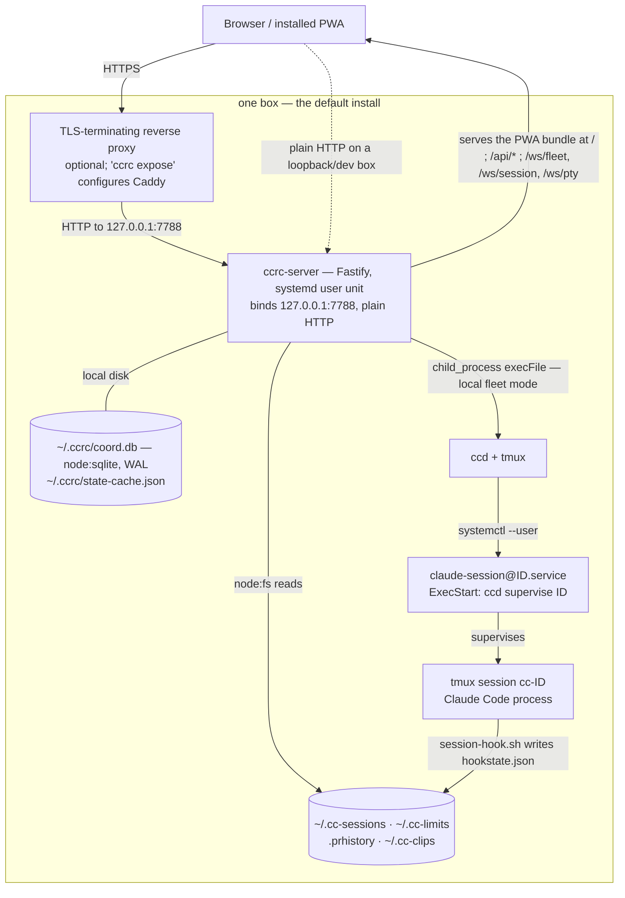
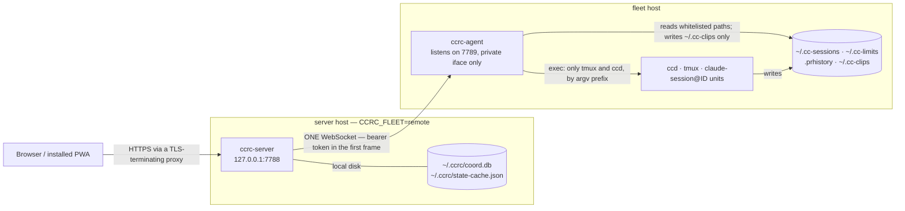

<div align="center">

# ccrc

**Self-hosted remote control for a fleet of Claude Code sessions.**
Run it on your own box. Drive twenty agents from your phone.

[](#license)
[](#requirements)
[](#quickstart)
[](#privacy)
[](#quickstart)

</div>

> Claude Code runs in a terminal, on a box, in a tmux pane. That is fine for one session.
> It stops being fine at twenty — when you are away from the desk, when a session is
> blocked on a question you could answer in four seconds, and when the account it runs on
> hits its limit and the work has to move somewhere else.
>
> **ccrc is the console for that.** One installable web app, served by your own machine,
> that sees every session, answers their questions, and moves a running conversation
> between accounts without losing it.

## Why

The official claude.ai app cannot follow a session across an account swap. ccrc can — and
that is the feature the whole design is bent around.

When a session's account runs out, ccrc relocates the **conversation itself**. The
transcript is found **by uuid**, globally unique, across every project directory under the
source account, rather than by one guessed path. A swap that finds nothing to carry
**refuses** rather than completing and quietly losing your history. The PWA also finds
history that an older, buggier swap stranded on another account — and the chat that had to
look elsewhere says so, under a banner naming where it came from.

Everything else in ccrc exists to serve one loop:

```
spec  →  plan  →  waves of subagents  →  per-PR review lenses  →  whole-branch pass
```

## What you get

| | |
|---|---|
| **Follow a session across accounts** | The swap carries the conversation, located by uuid, and refuses rather than losing it. |
| **Multi-wave programs** | Open a run, dispatch a wave, and the server tracks it — not a human holding state in their head. |
| **Claims are re-measured, never believed** | A worker reporting "wave done" is checked against the workspace branch tip and `.prhistory`, from the git refs on disk. |
| **Mail between sessions** | Delivered only into an idle turn boundary, so a nudge never lands mid-thought. The body lives in a durable store; what arrives is one line. |
| **Hook-first session state** | Each session reports its own state through a Claude Code hook; scraping the tmux pane is the ranked fallback, not the source. |
| **Answer from the lock screen** | A session asks a question; you get a push notification and answer it without opening a terminal. |
| **Workspace holds** | A program declares a claim on a worktree. No timeout, no expiry — the reason string *is* the display, and four separate destructive paths refuse while it stands. |
| **Two-phase workspace destruction** | Nothing irreversible happens on one tap, and every precondition is re-proved at the moment it matters. |
| **Branch names the model already wrote** | The branch takes the name from the work, instead of asking you to invent one. |
| **Accounts are runtime data** | A roster in `~/.ccrc/accounts.json` — usage and placement projected *before* you tap, not discovered after. |
| **An optional session gate** | Passkeys or a passphrase, off by default, and it fails shut on every ambiguity rather than open. |
| **One whitelisted socket** | Split across two boxes, the server never SSHes the fleet host. It drives it through a closed set of exec verbs, and nothing else. |

## Quickstart

One box, no TLS, no exposure — the default install:

```bash
git clone https://github.com/Synapsium-Labs/ccrc-pwa.git && cd ccrc
bash install.sh
```

That builds the PWA and the server, then hands off to `ccrc install`, which seeds
`~/.ccrc`, installs the systemd user units, and registers the session hook in every
account home it finds. The server comes up on `127.0.0.1:7788`.

Then:

```bash
ccrc doctor      # 26 checks: binaries, units, roster, hook registration, auth posture
ccrc status      # what is running, where
```

Open `http://127.0.0.1:7788/` and add it to your home screen.

> **Reaching it from your phone.** ccrc binds loopback and speaks plain HTTP on purpose —
> a PWA needs a *secure context* to install, so something in front has to terminate TLS.
> Bring your own reverse proxy, or let ccrc configure one:
>
> ```bash
> ccrc expose duckdns   # a dynamic-DNS name + Caddy + an automatic certificate
> ccrc expose byo       # you own the name and the proxy; ccrc just records the origin
> ccrc expose ip        # no name at all: the box's bare IPv4 + a locally-trusted certificate
> ccrc expose status    # what is configured right now
> ```
>
> Exposing the box to the internet without arming the session gate is the one mistake
> worth being loud about. See [The session gate](#the-session-gate-ccrc_auth-off-by-default).

<details>
<summary><b>Installing from a release artifact instead of a checkout</b></summary>

Release mode needs only `curl` — no clone, no toolchain, no build on the box. It fetches
`SHA256SUMS` first, then the tarball, and runs `sha256sum -c` **before extracting a single
file**:

```bash
curl -fsSLO https://raw.githubusercontent.com/Synapsium-Labs/ccrc-pwa/main/install.sh
bash install.sh --release
```

Anything after `--release` passes through to `ccrc install`, which is how `--role` rides:

```bash
bash install.sh --release --role fleet
```

**Status:** no release has been cut yet — there are no tags — so `--release` currently ends
at curl's own 404. Build one locally with
`bash deploy/build-release.sh --untagged --out release-out`.

Note that `curl … | bash` (piping the script into a shell) does **not** work: read from
stdin, `BASH_SOURCE` is unset and the script dies under `set -u` before its argument loop.
Download it, or use `bash <(curl -fsSL …)`.

</details>

## Requirements

- **Node ≥ 22.13.0** — not negotiable, and not a style choice: the coordination database
  is `node:sqlite`, which is flagged below that. All three packages declare the same floor
  and a test pins it.
- **git**, **tmux**, **bash**, **curl**, **rsync**.
- **`gh`** (the GitHub CLI, authenticated with `repo` scope) — PR state, review and merge
  go through it.
- **`jq`**, **`python3`**, **`flock`** — ccrc reads the box's small JSON files with the
  first, the session hook and registry locking are the second and third.
- **Claude Code**, installed and authenticated for at least one account.
- **Linux or macOS.** The session layer is tmux plus the box's service manager — systemd
  on Linux, launchd on macOS.

**On Linux**, additionally:

- **systemd user units**, with `loginctl enable-linger` set — without lingering your
  sessions die with your last login.

**On macOS**, additionally:

```bash
brew install bash tmux flock
```

- **bash ≥ 4.4.** Not optional and not a preference: `ccd` uses associative arrays,
  `[[ -v arr[k] ]]`, `mapfile`, `BASHPID` — and empty-array `"${a[@]}"` expansions under
  `set -u`, which bash treated as fatal until 4.4 — and macOS ships **3.2.57** as `/bin/bash`
  for licensing reasons. Make sure Homebrew's `bin` comes before `/bin` on your `PATH`.
  `install.sh` refuses by version before it builds anything.
- **tmux** and **flock**, neither of which macOS ships. Homebrew's `flock` formula is the
  portable implementation and takes the flags ccd passes.
- **Only if you BUILD a release** (`deploy/build-release.sh`, a maintainer's job — not
  something a box needs to install or update): `brew install gnu-tar`. The artifact is made
  reproducible with `--sort/--mtime/--owner/--group`, BSD tar has none of them, and the
  script refuses rather than emitting a tarball whose digest depends on who built it.

Two things a macOS box does **not** get, both stated by `ccrc doctor` rather than left to
be discovered:

- **No linger.** A LaunchAgent runs in your login session: the server and every session
  stop at logout and start again at login. The only thing on macOS that survives a logout
  is a root-owned LaunchDaemon, which would run your fleet as a different user with a
  different keychain — a posture `ccrc install` will not choose for you. For an always-on
  box, stay logged in and turn off sleep.
- **No memory ceiling.** The per-session and fleet-wide caps are cgroup limits
  (`MemoryHigh`/`MemoryMax` on the session unit and on `app-claude\x2dsession.slice`), and
  launchd has no equivalent of any kind. `ccd-cap-scopes` is not installed there either —
  it caps cgroup scopes, and there are none.

`ccrc doctor` checks all of this and tells you which one is missing, rather than failing
somewhere further in.

## How it works

The default install is **one box**. The server is a single Fastify process that serves the
PWA, reads the fleet's flat files directly, and shells out to `ccd` and `tmux`.



Sessions are not children of the server. Each one is its own systemd user unit running
`ccd supervise`, which owns a tmux session — so the server can restart, or be replaced
mid-deploy, without touching a running turn.

<details>
<summary><b>The optional two-box split</b></summary>

Set `CCRC_FLEET=remote` and the same seams are backed by a WebSocket to an agent on the
fleet host instead of local `execFile`. The server never SSHes that box.



The agent's exec surface is a closed two-name set — `tmux` and `ccd` — matched on the bare
command name and an argv **prefix**. There is no shell, and no way to add a third name from
the server side.

</details>

### The pieces

| Path | What it is |
|---|---|
| `server/` | Fastify (TS ESM), one systemd user unit. Owns `~/.ccrc/coord.db` — runs, work items, mail and coordinator state — via `node:sqlite` with WAL and migrations that refuse to start rather than open empty. |
| `pwa/` | React + Vite installable PWA. Builds into `server/dist-pwa`, which the server serves at `/`. |
| `agent/` | A small whitelisted exec/file/tail/pty surface over a bearer-token WebSocket. Needed only for the two-box split; local mode never touches it. |
| `ccd/` | The bash session layer that lives on the fleet host: `ccd` itself, the Claude Code hook that reports each session's state, and its idempotent installer. |
| `shared/` | The wire vocabulary — server↔agent and server↔PWA types — imported by both sides. |
| `deploy/` | systemd units, env templates, and a convenience wrapper for pushing a working tree to an already-installed box. |

ccd's flat files stay the fleet's own authority. The database holds only what coordination
adds *on top* of them, and never replaces them — a lost `coord.db` reconstructs.

## Privacy

ccrc has no telemetry, no analytics, and no phone-home. It talks to your box, the Claude
Code processes on it, and — only if you turn them on — the dynamic-DNS provider you chose
for a name and a certificate. Your transcripts never leave the machine you installed it on.

---

The rest of this README is the reference, ordered for an outside reader: install and
expose first, operating the fleet in the middle, and — below a second fold — the
internals, written for someone changing the code: how each mechanism actually works,
what the guarantees are, and where they stop.

## Install (single box)

From a **release artifact** — no build step on the box; the clone is only a
way of having `install.sh`:

```bash
git clone https://github.com/Synapsium-Labs/ccrc-pwa.git ccrc && cd ccrc && bash install.sh --release
```

or from the **checkout** — builds the server and the PWA here, then installs
the same way:

```bash
git clone https://github.com/Synapsium-Labs/ccrc-pwa.git ccrc && cd ccrc
bash install.sh
```

The owner in that URL is `CCRC_RELEASE_OWNER`'s value — defined once in
`install.sh` and matched by `ccd/ccrc`, so `ccrc update` later downloads from
the same place; `CCRC_RELEASE_BASE_URL` is the documented override that points
both lanes at a mirror instead. **Status:** no release has been cut yet — there
are no tags — so `--release` today ends at curl's own 404; build an artifact
locally with `bash deploy/build-release.sh --untagged --out release-out`, or
take the checkout lane.

**What the box needs first.** `install.sh` itself refuses only on `node`;
`rsync` and `diff` are `ccrc install`'s own refusals (below); the rest is
measured, by name, by the `ccrc doctor` run the install ends with:

- **node ≥ 22.13.0** — the `engines.node` floor all three packages agree on
  (`node:sqlite` needs it unflagged, so an older node fails to boot, not
  degrades)
- **rsync** and **diff** — `ccrc install` places the tree with one and
  compares config dirs with the other
- a **systemd user session**, with lingering enabled — the one privileged
  step the installer prints rather than runs
- **tmux**, **git**, **jq**, **python3**, **flock** — the fleet substrate
- **gh**, authenticated, if PR state/review/merge should work
- **curl**, for `--release` mode

`install.sh` refuses first — `node` missing, or below the floor
`server/package.json`'s `engines.node` declares (naming both versions) —
otherwise it builds the server and the PWA (checkout mode; `--release`
skips the build and hands off to the staged tree — "Releases" below) and
hands off to `ccrc install`
(`ccd/ccrc install`), which seeds the roster and `ccrc.env`, places the tree at
`~/ccrc`, installs the systemd user units, converges the wrappers your roster
declares (the seeded default roster declares one `upstream` account, so a
fresh install writes none), and ends by running `ccrc doctor` — the install's
own exit code is doctor's. **Green means the box
is ready**; the PWA answers at `http://127.0.0.1:7788/`. Re-running either
script converges rather than damaging an existing install. `rsync` and `diff`
are hard by-name dependencies of `ccrc install` — `rsync` places the tree, and
`diff` is what both skill installers compare a config dir against — with **no
doctor check for either yet**; absent, each refuses naming the package rather
than failing opaquely mid-copy, and a refused skill install is fatal to the
whole verb. `cmp` is the third of the class and the mildest: its two call sites
— `_inst_atomic` and `_inst_keep_aside` — leave the comparison unguarded on
purpose, so a box without it rewrites identical bytes rather than refusing, the
safe direction. (`_inst_tree_copy` compares with `diff -r -q`, not `cmp`, and
degrades the same way; the refusal on a missing `diff` comes from the two skill
installers it then runs.)

This is the **single-box** shape only: local fleet mode, localhost, no TLS, no
agent (`ccrc-agent.service` is deliberately not installed — local mode never
touches it). The two-box shape — a fleet box installed with `--role fleet`,
the server box flipped to `CCRC_FLEET=remote` — is "Releases" below plus
"Remote fleet mode"; runbook step 12 is its worked, boxed proof.

The steps above are proven hermetically (fixture `$HOME`s, every suite in "Develop" below); the
real-VM proof — an actual fresh box, a stopwatch, RC verifiably off — is the operator's stage gate
and remains pending. `docs/superpowers/specs/2026-08-19-stage2-vm-gate-runbook.md` is its runbook.

## Exposure: a public name and a real certificate (`ccrc expose`)

A box goes public the same way its session gate arms ("The session gate"
below): dark by default, one operator verb, and nothing privileged ever run
by ccrc. Three arms, one decision — how much of the outside world you want
involved:

| mode | you bring | name | certificate | passkeys | third parties |
|---|---|---|---|---|---|
| `ccrc expose duckdns` | a free DuckDNS account | `<sub>.duckdns.org`, zero-cost — a ccrc timer keeps it pointed here | public ACME (automatic) | yes | DuckDNS + the ACME CA |
| `ccrc expose byo` | your own domain | yours — DNS stays yours by contract | public ACME (automatic) | yes | your DNS host + the ACME CA |
| `ccrc expose ip` | nothing | none — the box's bare global IPv4, measured by the verb itself | caddy's internal CA (`tls internal`) — each device trusts the printed root once | no — passkeys need a domain, so the gate runs on passphrase login only | **none at all** |

`duckdns` prompts for a subdomain and token (tty-only, echo off, never argv);
`byo` prompts for your own origin and passkey rp id; `ip` prompts for nothing
but the caddy bind — the address is measured (`hostname -I`, first global
IPv4), and a NAT'd box is refused rather than certified for an address it
does not carry (a changed box IP is a re-run of the verb). Whichever arm, the
verb writes two ccrc-owned files and prints the rest:

- **`~/.ccrc/exposure.env`** (0600 — the DuckDNS token lives here, and is
  never printed: `ccrc expose status` and doctor report it as SET/NOT SET
  only). It carries `CCRC_ORIGIN` and `CCRC_RP_ID` (plus the DuckDNS trio on
  that arm) and is read by `ccrc.service` as a **second `EnvironmentFile`
  after `ccrc.env`** — systemd's later-file-wins, so exposure keys override a
  hand-set placeholder without touching the seed-once `ccrc.env`. To keep the
  two files from ever disagreeing, the verb refuses to run while `ccrc.env`
  still sets either key itself, naming both files and which would win.
- **`~/.ccrc/Caddyfile`**, regenerated whole on every run: the host and
  `reverse_proxy 127.0.0.1:<CCRC_PORT>`, nothing else. Stock Caddy's automatic
  HTTPS does the certificate through the standard ACME challenges
  (HTTP-01/TLS-ALPN-01) — which is why **a router forwarding ports 80 and 443
  to the box is a prerequisite** the verb states loudly and nothing on the box
  can verify for you. On the `ip` arm the block is
  `https://<ip> { tls internal; reverse_proxy 127.0.0.1:<port> }` instead: no
  ACME and no ports forwarded for issuance — caddy mints the certificate from
  its own root, and the verb prints the **trust ceremony** (`sudo caddy trust`
  on the box; installing
  `/var/lib/caddy/.local/share/caddy/pki/authorities/local/root.crt` on each
  phone, iOS and Android steps included). Doctor's `cert` check holds a
  standing WARN on this arm — the chain is not publicly trusted, by design —
  and names that same ceremony as the remedy.

Everything root-side is a printed three-step ceremony — install caddy from the
distro, copy the Caddyfile to `/etc/caddy/Caddyfile` (a copy, never a symlink:
caddy runs as its own user and cannot read inside your home — D-165),
`sudo systemctl enable --now caddy` — that ccrc never executes: the same
degraded-step doctrine as the installer's linger step, at verb scale. On the
DuckDNS arm the verb also installs a user timer (`ccrc-ddns.timer`) that
re-points the record at this box every five minutes, reading the token from
`exposure.env` at run time so the world-readable unit file never carries the
0600 secret. Four doctor checks — `exposure`, `caddy`, `cert`, `name` —
measure each piece, and all four SKIP on a box that never ran the verb:
not-configured is a valid end state, not a fault.

Users with their own proxy skip the Caddy step; the documented contract is
"terminate TLS, forward to `localhost:$CCRC_PORT`" (set in ccrc.env at
install; default 7788). ccrc itself never speaks TLS and
listens on loopback only.

After exposing: restart the server so it reads the new origin, and **re-enrol
every passkey** — passkeys are origin-bound, and a key enrolled at the old
name fails loudly, with the login screen naming the old rp id. (On the `ip`
arm there is nothing to re-enrol: passkeys need a domain — on a bare IP the
gate runs on passphrase login only, and enrolment simply never appears.) Then
add the exposed origin to a phone's home screen — Android Chrome / iOS
Safari — for the standalone, installable app. The full
choreography — prerequisites, the sudo ceremony, the expected doctor
transcript, the phone proof — is step 11 of
[`docs/superpowers/specs/2026-08-19-stage2-vm-gate-runbook.md`](docs/superpowers/specs/2026-08-19-stage2-vm-gate-runbook.md).

## Releases — install from an artifact, update, uninstall

Design: `docs/superpowers/specs/2026-08-21-stage4-release-design.md`. Runbook step 12 (same file
as above) is the two-box worked proof of everything in this section.

**The pipeline.** Pushing a tag `v*` runs `.github/workflows/release.yml`, which is deliberately
thin: it runs `deploy/build-release.sh` (the testable core — runnable locally, refuses a dirty
tree and refuses an untagged HEAD without `--untagged`) and uploads what the script built to the
tag's GitHub Release: `ccrc-<tag>.tar.gz` plus `SHA256SUMS`. The tarball is the matched set —
prebuilt `server/dist`, `server/dist-pwa`, `agent/dist`, the three `package.json`+lock pairs,
`shared/`, `ccd/`, the deploy units and helpers, `install.sh` — with a `MANIFEST` of per-file
sha256 digests and a shipped `build.json` that always carries the tag as `version`, so a
release-installed box reports its identity (`ccrc version` prints a `version vX.Y.Z` line;
`/health` emits a sibling `version` field; `buildAgreement` still compares sha+dirty only — the
sha is the truth, the tag is the label).

**Install from a release.** `bash install.sh --release [vX.Y.Z]` (default: latest) downloads the
tarball and `SHA256SUMS`, verifies `sha256sum -c` **before extracting a single file**, extracts to
a staging dir and hands off to the STAGED `ccrc install` — no build step on the box. Everything
after `--release [tag]` passes through to that verb; `--role` rides here. Checkout mode
(`bash install.sh` from a clone, as in "Install" above) is unchanged.

**Roles.** `ccrc install --role server|fleet|both` (default `both` = the single-box shape above;
the role is recorded as `CCRC_ROLE` in `ccrc.env`'s first write). `--role fleet` is the fleet
box's installer path: it prompts — tty-only, the token is never echoed — for the server's WS URL
and the agent bearer token, writes `~/.ccrc/agent.env` (0600, seed-once), and installs and enables
`ccrc-agent.service` instead of `ccrc.service`. Wiring the server box to it (`CCRC_FLEET=remote`,
`CCRC_AGENT_URL`, `CCRC_AGENT_TOKEN`) is "Remote fleet mode" below.

**Update.** `ccrc update [--to vX.Y.Z]` — per box, explicit, never automatic, fleet-box-first
across a two-box fleet (the server-box run WARNs loudly when `/api/fleet/health` says the fleet
host is behind; it never refuses). Its spine, each step refusing loudly rather than degrading:
fetch + verify (transport checksum, then the per-file `MANIFEST`); back up to
`~/ccrc-backups/<ts>/` (coord.db via `VACUUM INTO`, dists, ccd, units — complete before any
install write); re-run the install spine from the verified staged tree (role-aware, atomic,
seed-once files untouched); the supervisor sweep — `try-restart` each `claude-session@*` unit onto
the new ccd, **only** behind its mandatory `KillMode=process` preflight (a failed preflight
refuses the sweep, loudly, never the update; panes and tmux are never touched); then the from→to
report off the re-measured `build.json`. Rolling back is `--to <the older tag>`: it reinstalls
that artifact set and **prints** the coord.db restore commands from the newest pre-update backup
rather than auto-restoring (migrations are forward-only; an older server reads a newer coord.db).
`ccrc doctor`'s `build` check compares the *running* server's `/health` sha against the stamp, and
its `fleet` check's skew remedies name `ccrc update`, fleet box first.

**The maintenance verbs.** `ccrc backup` runs update's backup step standalone (same set, same
directory shape, pruned to the newest `CCRC_BACKUP_KEEP` timestamped dirs, default 10 — hand-made
siblings are never touched). `ccrc logs [-f] [-n N]` is `journalctl --user` against this box's own
unit (`ccrc.service`, or `ccrc-agent.service` when the recorded role is `fleet`). `ccrc uninstall`
takes the box off ccrc and leaves reinstall safe: it refuses while live sessions exist (unless
`--force`), removes the units, ccrc's managed settings.json hook entries (per-file backup;
unmanaged entries survive byte-identically), marker-verified wrappers only, ccrc's own artifacts
inside `~/.cc-sessions` file-by-file, `~/ccrc` and the installed executables — and preserves
`~/.ccrc` whole, the registry rows and operator switches, worktrees and `~/ccrc-backups`, printing
(never running) the keep-aside restore commands. `--purge` additionally removes `~/.ccrc` and the
backups — never worktrees, never tmux state.

## The session gate: `CCRC_AUTH` (off by default)

The PWA and its API can be put behind a **passphrase**, with optional
**passkeys** on top. It is **off in the shipped default**, and that is the whole
deploy story: with the flag off the gate's one `onRequest` hook is a
passthrough, nothing reads a passphrase file, and the box behaves exactly as it
did before the gate existed — so the mechanism ships to a live fleet before
anyone decides to turn it on. A box that never arms it is a box anyone who can
reach it can drive, which is the pre-existing posture, stated rather than
implied.

**A passphrase on its own changes nothing, and so does the flag on its own.**
Arming is one operator act with two halves, and the order is: set the
passphrase, then arm the flag.

```bash
ccrc passwd                       # prompts twice, echo off, 12-char floor,
                                  # writes ~/.ccrc/auth.scrypt at 0600
$EDITOR ~/.ccrc/ccrc.env          # CCRC_AUTH=on  +  CCRC_RP_ID  +  CCRC_ORIGIN
systemctl --user restart ccrc.service
```

> **`CCRC_RP_ID` and `CCRC_ORIGIN` must be set in the same edit that arms
> `CCRC_AUTH`.** Their defaults are `localhost` and `http://localhost:<port>`;
> armed with those on a box actually reached under a real name, **every
> non-exempt write and every `/ws/*` upgrade is refused** — a console that
> loads, reads and cannot act — **and nothing warns at boot.** The pair is
> internally coherent, so the boot check that catches a *disagreeing* pair
> passes it, and a self-check that could catch it is not implementable behind a
> TLS-terminating proxy at all: the server never sees the hostname it was
> reached under, the proxy is the only party that knows it, and a check that
> tried to guess would have to fail shut on correctly-configured boxes too.
> The only signals are one journal line per refusal and a `foreign-origin`
> failure on every write.

`CCRC_RP_ID` is the **registrable domain** the box is reached at — `example.com`
for `ccrc.example.com` — never a bare public suffix, and never derived by
stripping labels off the hostname. The trap is the normal case for a self-hosted
box, not an exotic one: the dynamic-DNS and tunnel providers people reach a home
server through are themselves on the Public Suffix List, so under a name like
`<you>.duckdns.org` the registrable domain is the **whole** name — strip one more
label and you have a suffix shared with every other tenant of that provider,
which browsers refuse outright. Nothing here carries a PSL to know which is
which, so the operator states the value rather than the server deriving it;
`PUBLIC_SUFFIX_TRAPS` (`server/src/auth/webauthn.ts`) rejects the short list of
traps it can actually hit, and that list is not a PSL and must not become one. A credential records the rpId it was enrolled under, so
changing it makes existing passkeys fail **loudly** ("re-enrol"), which is the
intended way for a rename to behave. Full key-by-key documentation, including
the path overrides and the `Secure`-cookie opt-out, is in
[`deploy/ccrc.env.example`](deploy/ccrc.env.example); the step-by-step arming
procedure and the operator runbooks (lost device, corrupt secret, disarming) are
step 10 of
[`docs/superpowers/specs/2026-08-19-stage2-vm-gate-runbook.md`](docs/superpowers/specs/2026-08-19-stage2-vm-gate-runbook.md).

<!-- ORDER-PINNED PASSAGE. `server/test/box-token-census.test.ts` reads the number
     words in the paragraph below and asserts them IN SEQUENCE, so this paragraph
     states the TOTAL first and the breakdown second. Rewriting it the other way
     round is a correct sentence and a red suite: move the expectation in that file
     in the same change. It also asserts that every exempt-but-authenticated GET is
     named here, derived from `gate.ts`'s own EXEMPT reasons (D-1233/D-1234). -->

What is gated, and what is not: **everything except** `/health` (deploy's own
liveness gate reads the shipped sha out of it), the nineteen machine lanes the
fleet host reaches (eighteen box-token-consulting coordination routes plus
`/api/notify`, which still tolerates an absent token for one deploy generation —
the caller is `curl` inside a Claude Code session, with no cookie jar, though the
exempt-but-authenticated GETs among them (`/api/runs`, `/api/runs/:id/items`,
`/api/lifecycle`, `/api/peers`, `/api/claims`) take a live session cookie **or**
the token, which is how a coordinator reads its own wave ledger from the fleet
host), the login and passkey-assertion doors themselves,
`GET /api/auth/status` (with a minimized anonymous body), and `GET /*`, the
static bundle a browser has to
download before it can show a login screen. Enrolling a passkey is **not**
exempt — it requires already being signed in, which is what makes
`attestation: 'none'` safe.

**Ending a session** is Accounts → **This session** → **Sign out**: it revokes
this browser's session server-side and leaves other devices signed in. Enrolled
passkeys survive it, which is why it is not the lost-device procedure.

**`ccrc passwd` invalidates sessions, not passkeys.** A rotation bumps the
file's generation and every logged-in browser is expired at once with no
restart; every enrolled authenticator keeps working, deliberately. For a lost
device the order is therefore **revoke the passkey in the PWA (Accounts →
Passkeys → Revoke) first, then rotate the passphrase**. `rm ~/.ccrc/passkeys.json`
on a running server revokes nothing — the store is loaded once at boot and
rewritten from memory on the next accepted assertion.

**Two boot warnings worth knowing**, because each catches a misconfiguration
that is otherwise silent: an `rpId`/`origin` pair that disagrees, is malformed,
or is an IP literal (passkeys go 501, the passphrase door keeps working); and a
cookie policy that contradicts the origin's scheme — an `http:` `CCRC_ORIGIN`
with a `Secure` cookie, which produces a login that answers 204 and bounces
straight back to the login screen with nothing failing anywhere, or an `https:`
one with the dev opt-out left on.

**`ccrc doctor`'s `auth` check** reports where a box actually stands: a PASS on
an un-armed box (that is the shipped default, and a doctor that warned about it
would train an operator to skim), a FAIL on an armed box with no passphrase
file, and a FAIL on a passphrase file the server would refuse to boot on. It
prints no byte of the file's contents, and neither does the server's own boot
refusal.

## The box decides `--remote-control`: `~/.ccrc/remote-control`

Per-box runtime config, under the same ownership rule as the account roster
`~/.ccrc/accounts.json` ("Accounts" below): **one line**, `on` or `off`,
created once by whichever lane installed the box and never rewritten after.

| Lane | Seeds | Why that value |
|---|---|---|
| `ccrc install` (`_inst_rc`) | `off` | `--remote-control` publishes a session to claude.ai; a fresh single-box install has made no such claim and must not start because an installer defaulted it |
| `deploy/deploy.sh agent` | `on` | a box that was already running every session with the flag; seeding `on` **describes** that box rather than deciding something new about it |

`ccd`'s `_rc_enabled` is the only reader and the authority: first line,
whitespace stripped, must be exactly `on`; **absent, unreadable, empty or
anything else is off**, because a garbled file must not half-enable a mode. That
strictness includes a missing trailing newline (bash's `read` returns non-zero
at EOF-before-delimiter), so `printf 'on' > ~/.ccrc/remote-control` reads as
**off** — both writers end the line, and `ccrc doctor`'s **`rc`** check names
that case as `PASS rc: off (unparseable …)` rather than reporting it as a
deliberate `off`.

The box decides for **ordinary** sessions only. A dispatched program worker is
declared `--no-rc` at `ws-add` by the server's dispatch path (the 2026-08-13
ruling, orchestrator task #37): `ccd ws-add --no-rc` stamps the per-session
registry field `rc` as `off`, and `_spawn_start`'s consult then strips
`--remote-control` from that session's every spawn — across swap and every
`Restart=always` cycle — no matter what the box flag says. Absent, or anything
but the exact string `off`, follows the box: the field can only ever suppress,
never enable, and it dies with the row at reap. The PWA's ordinary
workspace-add composes no flag and stays box-default, and the doctor's `rc`
check keeps reporting the box flag alone.

`rc` is a check of its own, deliberately: it reads the flag file and nothing
else — no `ccrc.env`, no unit files, no box role — so it answers on a **fleet
host**, which has no `ccrc.env` at all and is the one box in the topology that
runs `on`. It is always a PASS: the state is a fact about how the box is
configured, not a defect, and this doctor's rule is that a WARN owes a remedy.

**Ordering, on a fleet host:** the flag must be seeded *before* a new `ccd`
lands, because absent reads off and the gap between the two is a window in which
a respawn strips `--remote-control` from a live session. `deploy.sh` seeds it in
the same run, above its own installs, and `agent/test/deploy-verify.test.ts`
pins that order.

## Accounts: usage, placement and the disabled marker

### The roster is runtime data: `~/.ccrc/accounts.json`

**The account list is not in the code.** It is a JSON file on each box, and
without it neither half of ccrc runs:

| File | Owner | Read by | Missing ⇒ |
|---|---|---|---|
| `~/.ccrc/accounts.json` | **you** — ccrc creates it once and never overwrites it | the server, at boot (`loadConfig` → `loadRoster`, `server/src/config.ts`) | the server **refuses to boot** (`RosterError`, naming the remedy) rather than run against a roster that is not the box's |
| `~/.ccrc/accounts.sh` | **ccrc** — regenerated and replaced wholesale by every agent deploy | `ccd` on **every invocation**, plus `install-session-hooks.sh` and `install-coordinator-skill.sh` | `ccd` dies (`ccd: no account roster at …`) and both installers `exit 1` |

`accounts.sh` is a pure projection of `accounts.json` — `deploy/gen-accounts.mjs`
produces it (`CCRC_ACCOUNTS`, `CCRC_HOME_ABLE`, `CCRC_UPSTREAM`,
`_ccrc_cfg_dir`, `_ccrc_id_wrapper`), and the deploy generates it from the
roster **read back off the box**, never from the local file, so ccd's routing
can never disagree with what the server serves from that same box's copy.
Nothing hand-edits it; a torn one would take out every live session at once,
which is why it lands via the same atomic scp-to-temp + `mv` as `ccd` itself,
and lands **before** `ccd` and before both installers.

An account entry is `{id, label, configDirSuffix, exec, homeAble, hue,
telemetry}` — validated by `shared/roster.ts` (`parseRoster`), whose errors all
carry a remedy. `id` is `^[a-z][a-z0-9-]{0,31}$` because it becomes a filename
under `~/.local/bin/`, a bash `case` pattern and a session-id prefix; `label` is
what the PWA renders; `homeAble: false` holds an account out of automatic
placement; `telemetry: 'none'` says the account will never report rate limits,
so its permanent unknown is not read as permanent emptiness.

**Getting the file onto a box.** The deploy seeds it, create-if-missing, on
both targets:

```bash
bash deploy/deploy.sh agent <host>   # seeds ~/.ccrc/accounts.json if absent, then generates + ships accounts.sh
CCRC_ACCOUNTS_JSON=deploy/accounts.default.json bash deploy/deploy.sh   # seed a fresh, unrelated install instead
bash ccd/ccrc-adopt                  # a HAND-BUILT box: rediscover its accounts from ~/.local/bin and write accounts.json
ccrc wrappers                        # the other direction: roster → ~/.local/bin/<id>, writing only what ccrc marked as its own
```

- `deploy/accounts.default.json` is the roster a fresh install starts from: a
  single account, no generated wrappers. `CCRC_ACCOUNTS_JSON` points the deploy
  at a roster of your own — and the deploy validates that file
  **locally, before seeding it**, because a seeded roster is never overwritten
  again and a bad one would have to be deleted by hand over ssh.
- `ccd/ccrc-adopt` goes the other direction — disk → roster — for a box built
  before this file existed as a concept. It reads `~/.local/bin`, classifies
  each wrapper (`upstream` / `generated` / `external`, every uncertain call
  landing on `external`), and writes `~/.ccrc/accounts.json` only if absent
  (`--force` to overwrite, `--out` to write elsewhere). It writes nothing else:
  no wrappers, no units, no hooks. On a box that has never run `ccrc install`
  there is no installed `ccrc` binary yet, so it runs from the checkout, as
  `bash ccd/ccrc-adopt`; on an installed box it is reachable as `ccrc adopt`.

  **The upstream account may be a launcher script (D-155).** Adopt elects the
  upstream by counting which binary the generated wrappers `exec`, and it used
  to refuse the winner if the file started with `#!`. That was a proxy for the
  hazard it actually meant to catch — electing an *account wrapper*, which would
  leave those wrappers exec'ing a wrapper — and the proxy stopped tracking the
  hazard the day a box's `~/.local/bin/claude` became a version-picking,
  token-injecting launcher instead of the installer's symlink. It now asks the
  real question: the elected upstream is refused if it sets its own
  `CLAUDE_CONFIG_DIR`. This is not one box's quirk — an npm- or mise-installed
  Claude Code lands a `#!` shim at the same path.
- `ccrc wrappers` goes roster → disk, and is the reason `accounts.json` now
  PRODUCES `~/.local/bin/<id>` rather than merely describing it. **It writes
  only the wrappers ccrc marked as its own** (`shared/mark.mjs`'s provenance
  marker) **and refuses everything else, with a remedy** — a hand-edited
  wrapper, somebody's bespoke launcher, a file it could not read. It backs up
  before every overwrite (`<id>.pre-ccrc-<UTC>`, a name no account id can
  match) and writes atomically. `upstream` and `external` accounts are never
  written, backed up, moved or removed, under any flag. `--dry-run` reports
  without touching anything; `--adopt` takes over a hand-written wrapper that
  already says exactly what the roster says; `--force` overwrites ccrc's own
  edited files and, after a backup, any foreign file **that this reader can
  parse as a wrapper** under a generated id. Orphans — a marked wrapper the
  roster no longer names — are reported and never removed.

  **Four things no flag overrides:** `unreadable`; `oversize` (D-81); a foreign
  file this reader cannot parse as a wrapper at all (D-155); and any id that
  another file already on disk `exec`s as its upstream binary (D-156, "lock 5").
  The last two exist because the sentence above about `upstream` accounts is
  conditional on the ROSTER, not on the path: it holds while the roster says
  which id is upstream, and a mis-edited roster is internally consistent, so
  every other lock believes it. Measured on the reference box — where
  `~/.local/bin/claude` is a launcher script rather than the installer's symlink
  — flipping that id to `generated` and running `ccrc wrappers --force`
  overwrote the launcher and exited 0, closing an exec loop across every lane at
  once. And `--force` was never the only route: obeying ccrc's own "move it
  aside and re-run" remedy makes the path `absent`, which the absent arm writes
  with no flag at all. Lock 5 is keyed on the OTHER files precisely so that
  moving the subject file away does not defeat it.
- `CCRC_ACCOUNTS` (in `~/.ccrc/ccrc.env`) overrides where the **server** reads
  the roster from. `ccd` has no such override on purpose: it derives the path
  from `HOME` alone, so a stray `Environment=` cannot run a live box against
  someone else's account list.
- **The two boxes are checked against each other, continuously.** `accounts.json`
  is user-owned and never overwritten, and the boxes are deployed by two
  separate runs of `deploy.sh` — so an account added to one and not the other is
  one hand-edit away, and the symptom (a session attributed to the wrong
  account, a swap target ccd rejects) names nothing. The agent reports a
  fingerprint of its **installed `~/.ccrc/accounts.sh`** on the `ready` frame;
  the server compares it against the fingerprint of the projection its own
  roster produces, and `GET /api/fleet/health` answers
  `roster: 'agreed' | 'divergent' | 'unknown'`. The PWA shows an amber banner on
  `divergent` and nothing on `unknown` — an older agent sends no fingerprint,
  and absence of evidence must not render as evidence of absence.

  It compares the **projections**, not the two JSON files, which catches
  strictly more: a fleet host whose `accounts.json` was hand-edited but never
  redeployed has two files that agree and a `ccd` that behaves like neither,
  because `ccd` sources the generated `accounts.sh` and nothing reads
  `accounts.json` at runtime. Each `deploy.sh` run also prints
  `roster fingerprint on <box>: <sha256>`, which is the same value — that line
  is the only signal in the agent-only and single-box cases, where there is no
  server on the other end of a socket to disagree with.

- **Limit telemetry is roster-driven too**, which is what makes free-form ids
  real rather than half-delivered. `ccd/statusline-command.sh` is a Claude Code
  statusline hook — it is handed a `CLAUDE_CONFIG_DIR` and nothing else — so it
  sources `~/.ccrc/accounts.sh` and asks it four questions: `_ccrc_dir_id`
  (which account owns this config dir), `_ccrc_label` and `_ccrc_hue` (how to
  name and colour it), and `CCRC_MEASURED` (whether it reports rate limits at
  all — `gpt` does not, and a `~/.cc-limits/gpt.json` would be
  indistinguishable from a measured zero). One copy of the script serves every
  account, because `$HOME` is shared and only `CLAUDE_CONFIG_DIR` differs.
  A box with no roster still renders a status bar; it just falls back to the
  config dir's own name and writes no telemetry.

  This was the last hand-written roster copy in the tree, and it mattered:
  an account its four `case` arms did not name was **never measured**, and
  since an unmeasured account ranks below every measured one for placement
  (stage 2a's "unknown is not zero" fix in `projectHome`,
  `server/src/limits.ts` — an account nobody could see used to score 0 and
  beat every real one), such an account would never receive a workspace,
  silently and permanently. `server/test/statusline-script.test.ts` runs the
  real script against a fixture `HOME` with a free-form account and goes red
  if the map ever comes back.

**`/accounts`** (a fourth branch of the route ternary, reached by tapping the
compact `AccountsStrip` mounted in the desktop top bar and the mobile fleet
list) shows every account ccd knows about, not just the ones with headroom.
It rides the existing `GET /api/accounts` pipeline — no new route, no new
whitelist grant — with its own 20 s poller. Per account:

- Both windows (5h / 7d) as bars with the strip's exact `%`/`reset`/`—`
  three-way, never collapsed: `reset` means the window ended and the zero is
  *inferred* from the reset timestamp; a measured `0%` means something ran
  and the account really is empty; `—` means nothing has ever been measured.
- A freshness line, **"last reported *age*"**. Telemetry is a byproduct of a
  session rendering its statusline, so an idle account simply stops
  reporting — the screen reads as "last known", never as live. There is no
  refresh button: there is nothing to refresh until a session runs.
- A disabled lane (`~/.cc-sessions/<wrapper>-disabled` present) renders
  **greyed with "disabled on the fleet host" — shown as switched off, never
  hidden.** The compact strip still hides a disabled lane entirely (right for
  an always-on bar); the screen's whole job is "show me my accounts", so
  hiding one here would be the wrong call in the other direction.
- Live sessions whose `wrapper` matches the account, each tapping through to
  `/s/<id>`.
- A projection line naming ccd's own placement rule ("next workspace lands
  here — least-loaded"), including the all-disabled case below.

Band coloring uses one writer (`limitBand` from `LimitBar.tsx`) everywhere,
including the strip: `crit` is `> 75`, matching `DIRECTION.md`, not `>= 75` —
the strip used to carry its own copy of the threshold and disagreed with the
limits bar at exactly 75.

### Placement honors the disabled marker

`~/.cc-sessions/<wrapper>-disabled` used to be a **UI-only** kill-switch:
`server/src/limits.ts` parsed it for every lane, but ccd itself honored it
for exactly one (`gpt`, via `_gpt_enabled`) — `touch`ing it for any other
wrapper hid the account from every picker and changed nothing about where
ccd actually placed sessions. ccd now generalizes the check:

- `_lane_enabled <w>` — true iff `~/.cc-sessions/<w>-disabled` is absent.
- `_account_ok <w>` — true iff the wrapper is executable **and** its lane is
  enabled. `_gpt_enabled` is now just `_account_ok gpt`, same file, same
  semantics, one definition.

Both of ccd's automatic pickers gate on `_account_ok`: `_ws_least_loaded`
(`ws-add`'s placement rule) skips a disabled or missing lane outright, and
`_swap_target`'s candidate loop does the same, as does its "home recovered,
go back" branch — a session never auto-rotates back onto a home that has
since been disabled. **The two "stay put" branches are unchanged on
purpose**: disabled excludes a lane as a *destination*; it never evacuates a
session already sitting there. Manual placement (`ccd start`, `ccd swap`,
`ccd prefer`) bypasses the gate entirely — naming a wrapper by hand is an
operator override by construction. One correction to that override: `ccd
start` no longer **rewrites** an existing row's account. For an id that
already has a registry entry, the registry's own `wrapper` wins and a
differing argument is only a warning naming the verb that would actually move
it (`ccd swap`); `ccd swap` stays the only verb that moves a session between
accounts. `ccd start <id>` and `ccd enable <id>` also take a one-argument
form now, for exactly the reason this matters: a session keeps the id it was
born with across every swap, so an operator reading the account off the board
and typing it back into the two-argument form used to mint a *second* id for
a session that already existed — the one-argument form takes the existing
row's id whole and starts it under whichever account the registry says it is
actually on.

**Pressure alone still never refuses placement** — a fully pinned account is
still the least-bad choice, and the headroom display is the warning, not a
refusal. Only the declared marker excludes. But if *every* wrapper fails
`_account_ok`, `ws-add` refuses **before creating anything** — no worktree,
no branch, no registry entry — naming each wrapper and why (`disabled` or
`missing`): `die "no account available for placement — …; nothing was
touched"`.

That refusal only covers the *declared* case. The score itself still has the
opposite polarity for the undeclared one, and this rider does not touch it:
`_limit_field` zeroes any sample whose window has run out — a `five` older
than 18000s, a `seven` older than 604800s, or either past its own
`resetAt` — and `_limit_score` returns `""` when a wrapper has no limits
file at all, which `_ws_least_loaded` and `_swap_target` both fold to `0`.
Zero is the *lowest* score either picker compares, so an account nobody has
heard from in a week — no file, or a sample its own window has outlived —
reads as maximum headroom and is placed **first**, not skipped. No
telemetry still reads as free for *pressure*; only the declared marker
excludes. The accounts screen's "last reported *age*" line is the only
signal that the "least-loaded" pick landed there because it is healthy
rather than because it has gone quiet; nothing short of the operator reading
that line and `touch`ing `-disabled` stops it.

The server mirrors only the half it can honestly see. `projectHome` filters
`disabled` lanes before scoring, and returns `null` when every home-able
lane is excluded — `ProjectedHome | null` on the wire (`GET /api/accounts`'s
`projected` field), rather than inventing a target. It cannot see `-x`: the
server has no filesystem authority over `~/.local/bin`, so a projection can
still name an account whose binary is gone. **ccd's refusal at `ws-add` is
the authority; the server's projection is a best-effort forecast of it.**
Kept in lockstep with the bash by the shared fixture harness
(`server/test/fixtures/leastLoaded.ts`, run against both implementations).

There is **no login detection** — no passive filesystem signal reliably
distinguishes a logged-in account from a logged-out one on this box, and a
probe-based check was rejected (spends tokens, races real logins). The
`-disabled` marker is a *declared* fact the operator sets by hand
(`touch`/`rm`), not a detected one.

### Login screens get no keystrokes, and lost auth joins the rescue lane

A session spawned onto a broken account used to spin its full ~15-minute
startup window, return with no diagnostic, and then type `/effort ultracode`
+ Enter **into the login screen** — an unreviewed keystroke into an auth
flow. `_accept_first_run_prompts` now recognizes a login screen (`Select
login method`, `Invalid API key`, `Please run /login`) as its **last**
check, after every ready-marker and startup gate, and returns a distinct
code instead of a silent success; `_spawn` skips the `/effort` injection on
that code, so no synthesized keystroke reaches an auth prompt. Instead it
warns, naming the session **and** the account (`_accept_first_run_prompts`
only ever sees the tmux name, so `_spawn` is what emits this, once it has
both back): `<id> is waiting for login on <wrapper> — attach and run
/login`.

The startup verdict is four-valued now, not the one non-zero code above: `0`
a live marker appeared, `2` a login screen (unchanged, above), `3` the tmux
session vanished mid-poll, `4` the window expired with no marker. `3` ends
the wait **immediately** — a debounced second probe, not the ~15-minute wait
a vanished pane used to cost. Every verdict, success included, is recorded in
`$REG/<id>.spawn` as `<epoch> <rc>`, which is the one channel from a spawn
that happened inside the supervisor unit to a `ccd start` polling from
another process. The unit's `StartLimitIntervalSec`/`StartLimitBurst` turn an
instant-death restart loop into a **failed** unit rather than a silent
crash-loop — a failed unit heartbeats nothing, so it reads as `orphan` on the
row, and `ccd start <id>` (which runs `reset-failed` before it re-enables the
unit) is what revives it.

Mid-session auth loss joins the same rescue lane a 429 uses: the
hard-blocked pane grep that drives `_auto_swap_check`'s emergency swap now
also matches `Invalid API key` and `Please run /login` — a session that
*was* working and lost auth evacuates immediately, exactly like a rate
limit. **`Select login method` deliberately stays out of that grep** — that
screen appears during an intentional operator login, and evacuating a
session out from under someone mid-login would be wrong; that screen is the
one case `_accept_first_run_prompts`'s login check owns instead, by warning
and stopping rather than swapping.

## Attention, notifications and answering

- **Unseen watermark** (`pwa/src/lib/seen.ts`): a session is unseen when it
  entered a human-wanting bucket (`attention`, `done`, `cleanup`) after this
  device last acknowledged it. Per-device in `localStorage` on purpose — ccrc
  has no user accounts, so "seen" belongs to the person holding the phone.
- **Push copy discipline** (`server/src/watch.ts`): project context appears in a
  title only when more than one project is active, and nothing fires for a
  session a client reports on screen. The PWA states that claim on every socket
  open and refreshes it every 15 s; the server expires a claim it has not heard
  for 45 s, so a phone that loses signal without a close frame goes back to
  being notified rather than silently muted.
- **Answering from the notification**: an ask push carries the question's first
  two option labels as notification actions, and `pwa/public/push-sw.js` POSTs
  the answer without opening the app. A button is offered *only* where the
  answer route would accept it — an action that can only be refused costs a tap
  and a wait to learn what the server already knew.
- **Catch-up watermark**: `{epoch, seq}` as one atomic JSON value on both sides
  (`server/src/notifylog.ts`, `pwa/src/lib/notifymark.ts`). A seq is meaningless
  without the lifetime of the counter that produced it — written separately, a
  death between the two writes forges a valid-looking pair and silently drops
  real notifications. When the server cannot *prove* the client saw everything
  it says `resync`, and the client then surfaces nothing retroactively.

Three routes can act on a session, each with its own named refusals:

| Route | What it does | Gate |
| --- | --- | --- |
| `POST /api/sessions/:id/dialog` | answers a **pane** menu by walking the `❯` marker | refuses a stale dialog id; never presses Enter unless the re-captured pane proves the marker landed |
| `POST /api/sessions/:id/ask` | answers a **hook-reported** question by option index | re-reads the current envelope and refuses unless a content digest still matches, the pane still shows that exact menu, and the question is single |
| `POST /api/sessions/:id/submit` | presses **one** Enter on a box that already holds text | refuses unless the box matches the text the caller expected; one Enter, never a retry loop |

## Remote fleet mode

By default (`CCRC_FLEET=local`, unset) the server reads ccd's flat files and
shells out to `ccd`/`tmux` directly on its own box. `CCRC_FLEET=remote`
instead drives the fleet through `ccrc-agent` running on a separate fleet
host, over a single authenticated WebSocket — the server never SSHes into
the fleet box at runtime.

**`remote` is not a hypothetical** — the reference deployment runs it as
standing config, and `GET /api/fleet/health` answers `{"mode":"remote"}`
there, not `local`. The consequence this whole build rests on: **the server and the
fleet host are different boxes**, and the link between them is read-only for
files except `.cc-clips` (every other mutation crosses it as a whitelisted
`ccd`/`tmux` verb, never a raw write). The coordinator's dispatch/close
routes and the mail delivery lane all reach ccd through this same seam —
see "Fleet coordination" below.

### Config

| Var | Where | Meaning |
| --- | --- | --- |
| `CCRC_FLEET` | server | `local` (default) or `remote`. |
| `CCRC_AGENT_URL` | server | `ws://`/`wss://` URL of `ccrc-agent` on the fleet host, including its path, e.g. `ws://fleet-host:7789/agent`. |
| `CCRC_AGENT_TOKEN` | server + agent | Bearer token; must match on both sides. Generate with `openssl rand -hex 32`. |
| `CCRC_HETZNER_TOKEN` | server | Hetzner Cloud API token — only used by the degraded-mode reboot action. Unset leaves that route disabled (`501`). |
| `CCRC_FLEET_SERVER_ID` | server | Hetzner Cloud server ID of the fleet host — only used by the reboot action. |
| `CCRC_AGENT_HOST` | agent | Bind interface, default `127.0.0.1`. Never `0.0.0.0` — name the private-network address the server reaches it on, explicitly. |
| `CCRC_AGENT_PORT` | agent | Listen port, default `7789`. |

See `deploy/ccrc.env.example` and `deploy/ccrc-agent.env.example` for
copy-paste templates.

### Agent security model

`ccrc-agent` (`agent/`) is deliberately narrow — it is not a
general remote-shell:

- **Network**: binds a single interface (a private network between the two boxes, by convention; default
  `127.0.0.1`), never `0.0.0.0`. Every connection must send a valid `hello`
  frame with the bearer token within 3 s, or the socket is closed; a wrong
  token closes with code `4401`.
- **Exec whitelist**: only `tmux` (`has-session`, `list-panes`,
  `capture-pane`, `send-keys`, `resize-window`) and `ccd`, matched against the
  exact bare command name (no path components) and an argv **prefix** — most
  `ccd` verbs are still a bare first token (`start`, `enable`, `ensure`,
  `stop`, `swap`, `ws-add`) — a bare-token grant leaves everything after the
  verb unconstrained, which is what lets `ccd stop <id> --surface <word>`
  cross this seam with no widening: `stop`'s validated `--surface` flag is
  the single enrolment the swap-transcript design costs, and it rides as an
  argv flag rather than an env var because the exec seam is `Runner = (cmd,
  args) => …` with no env, and the agent's wire `ExecReq` carries `{cmd,
  args, timeoutMs}` and nothing else — a `CCD_SURFACE` variable would report
  the *server process's own* environment identically for every caller, not
  the caller's identity. The flag records a **declaration, not an
  authentication**: ccd validates it against the closed set (`cli`, `pwa`,
  `agent`, `ccd`) and normalizes anything else to `unknown`, but nothing
  proves the caller is who the flag says. The PWA's own `POST
  /api/sessions/:id/stop` route — the ONE place that route's two argv
  builders are called — passes `--surface pwa` when the deployed ccd is
  known to understand it (the conditional half is below), so a stop the
  operator taps from the PWA records `pwa` in that case, not ccd's own
  `cli` default. That default is
  not exclusive to it, though: `cli` is whatever an ORDINARY flagless
  invocation records, which is also what a session shelling `ccd stop`
  from its own Bash tool gets, among other callers. And `pwa` is not what
  EVERY API-reachable path to a stopped session records — the several OTHER
  routes and lanes that reach `_ws_unsupervise` directly (`ws-rm`, the
  archive/reap verbs, `forget`, `FleetWatcher.archiveMerged`) pass no
  surface at all and record `_ws_unsupervise`'s own default, `ccd` — an
  operator archiving a workspace from the PWA sees "stopped by ccd" on that
  row, correctly, because ccd itself did the unsupervising there, not the
  stop route.
  The capability is also conditional, not assumed — and its no-evidence
  default is the OPPOSITE of every other gated verb's. `stopSurfaceSupported`
  reads the same `ccdVerbs` channel `verbSupported`
  (`pr-state`/`ws-reap`/etc.) already uses — `ccd caps` prints `stop-surface`
  as one more verb-shaped line, so nothing new has to parse, carry or cache
  it — but where no evidence PERMITS an ordinary verb (guessing wrong there
  is loud: ccd's own usage refusal, a 502, never a lie), no evidence REFUSES
  `--surface`, because guessing wrong there is a *silent success*: an old
  ccd parses `stop <id> --surface pwa` as a two-argument stop of a session
  literally named `<id>---surface`, exits 0, and the real session is never
  touched. Evidence comes from measuring the actual deployed ccd on
  whichever box runs it — the remote agent at handshake and every 60s
  thereafter, and, so the inverted default does not simply kill the feature
  in local mode (the documented default, `CCRC_FLEET=local`), the local
  server too, which now execs its own `ccd caps` once at boot — bounded
  (10s, matching the remote agent's own exec ceiling for the identical
  operation) and never on the boot path itself: the server starts
  answering requests immediately, with "not yet known" read as no
  evidence (the same safe default a genuinely absent probe gives) until
  the read resolves in the background. With
  evidence either way, an older ccd still gets a stop it fully understands,
  just recorded under `cli` rather than `pwa` — never a call that silently
  does nothing.
  Two honest edges the inversion narrows but does not close, and they are
  NOT the same size. On the fleet host, a **rollback** to an older
  `~/ccrc-backups/<ts>/ccd` leaves the cached verb list still advertising
  `stop-surface` for up to 60 seconds — bounded, because the SERVER's own
  fleet watcher re-asks on a timer (`CAPS_REFRESH_MS`) regardless of any
  signal from ccd itself; the agent has no timer of its own; it answers
  when asked and re-execs only when ccd's mtime/size on disk has changed.
  **In local mode there is no such timer.** The probe
  runs exactly once, at boot; swapping `~/.local/bin/ccd` for an older
  copy under a still-running server **reopens the exact silent-success
  hazard this work exists to close, with no bound at all**, because
  nothing about a `stop` succeeding tells the server its evidence has gone
  stale — an old ccd exits 0 on the argv it cannot parse, which is the
  same silence that makes the underlying defect possible in the first
  place. It stays open until the server process is restarted; there is no
  other trigger.
  The local probe hangs it might meet are handled — a hung process is
  bounded (10s) and, if it ignores that first SIGTERM (real ccd does
  not), an unmaskable SIGKILL follows two seconds later, to the whole
  process group, not just the direct child. Two narrower residuals of
  that same detached design are stated rather than fixed: a **terminal
  Ctrl-C or a group-directed supervisor stop** kills the server but not
  the (differently-grouped) probe — covered in production regardless,
  since `deploy/ccrc.service` sets no `KillMode` and systemd's own
  default still reaps the whole cgroup on `systemctl stop`; and a server
  that **exits mid-probe** (a crash, not a graceful stop) orphans that one
  probe permanently, since its own timeout timer dies with the parent.
  Both are bounded to one process, once, per server lifetime; neither gets
  a shutdown hook.
  `stop`'s grant stayed a bare one-token
  prefix through this change — nothing widened — because the flag rides
  entirely inside the "everything after the verb" territory that prefix
  already covered.
  Several OTHER verbs, unlike `stop`, require a longer prefix before
  anything after them is unconstrained: `pr-state` needs `--session` or
  `--project`, `pr-open`/`ws-archive`/`ws-restore`/`ws-audit`/`ws-attic`/
  `ws-hold`/`ws-release`/`ws-rename` need `--session`, and `ws-reap` needs
  `--expect` — a load-bearing confirmation token, so an unconfirmed reap can
  never cross the wire at all. `ws-rename`'s flag guards a different hazard:
  the verb destroys nothing, but it is the first whose argv the server builds
  from model output (`FleetWatcher`'s naming sweep) and sends with no human
  anywhere in the path — a bare `['ws-rename']` would still permit the whole
  positional argv surface the verb used to have, so naming the flag is what
  keeps the grant two tokens wide. `clip` and the legacy, unguarded `ws-rm`
  are gone; `ws-gc` (which would permit `--prune`) was never granted. `gh`
  has no entry, deliberately: the host token carries the `repo` write scope
  and there is no read-only credential or cwd sandbox, so any `gh` grant
  would make this list the sole control between the PWA and `gh pr merge` —
  the one PR write goes through a `ccd` verb instead. Anything else comes
  back `{ok:false, err:'forbidden'}`.
- **Path whitelist**: every file op resolves the target through `realpath`
  and checks it's still under an allowed canonical prefix — closing the
  classic symlink-escape hole. Reads: `$HOME/.cc-sessions/`,
  `$HOME/.cc-limits/`, `$HOME/.cc-clips/`, `$HOME/.claude*/` (glob), and the
  fleet's projects root. Writes: `$HOME/.cc-clips/` only. **This list did not
  widen for the transcript resolver or the supervisor heartbeat**, and both
  are worth saying out loud: the resolver's uuid search (rungs 5 and 6 of
  its ladder) rides the existing `$HOME/.claude*` grant — no new read
  permission — and the supervisor heartbeat exists specifically so the
  server never has to ask systemd anything; nothing under
  `~/.config/systemd` was added to reach it.
- **pty**: `ptyOpen` only ever spawns `tmux attach -t cc-<sessionId>`, with
  `sessionId` sanitized to `[A-Za-z0-9_-]+` — never an arbitrary command.

### Degraded mode

While the fleet host is unreachable in remote mode, the server keeps serving
the last-known-good fleet snapshot instead of going blank:

- On every successful full fleet poll, the snapshot is written atomically to
  `~/.ccrc/state-cache.json` on the **server's** box (this file never goes
  through the agent — it's local housekeeping, same as the PWA dist-check).
- When the agent connection drops, `GET /api/fleet` keeps serving that cached
  snapshot with `stale: true` and `downSince: <epoch ms>`; the PWA shows a
  banner ("Fleet host unreachable since …") once it sees `stale`.
- `GET /api/fleet/health` → `{mode, connected, downSince}` — poll this to
  check remote-mode connectivity (`mode: 'local'` always reports
  `connected: true`).
- `POST /api/fleet/reboot` fires a Hetzner Cloud reboot of the fleet host —
  the PWA's confirm dialog names the collateral, because a reboot takes down
  everything else running on that box, not just the fleet. Guards: `409` if
  `mode !== 'remote'`,
  `501` if `CCRC_HETZNER_TOKEN`/`CCRC_FLEET_SERVER_ID` aren't set, `502` on a
  Hetzner API error, `202` on success.

### Verifying a remote-mode deploy

After `deploy.sh agent <host>` and flipping the server to `CCRC_FLEET=remote`:

```bash
# from the server box, where 7788 is loopback-bound:
curl -fsS http://127.0.0.1:7788/api/fleet/health   # {"mode":"remote","connected":true,"downSince":null}
```

Then kill/stop `ccrc-agent` on the fleet host and re-poll — `connected`
should flip to `false`, `/api/fleet` should keep returning the last snapshot
with `stale: true`, and the PWA banner should appear; restart `ccrc-agent`
to restore `connected: true`. `CCRC_FLEET=remote` is not a hypothetical
cutover — `remote` is the two-box shape this section describes, so this drill
exercises the degraded-mode path a real
agent restart or network blip already produces, not a one-time migration.

## Programs, runs and mail — the operator's view

A **program** is a long-horizon effort with a slug and a markdown ledger
(`docs/superpowers/programs/<slug>.md`, in the project's own repo, committed,
and parsed by nothing). A **run** is one wave of it in one workspace. A
**coordinator** is an ordinary fleet session running the `ccrc-coordinator`
skill, placed by `_ws_least_loaded` like any other session, acting through the
server's HTTP API and never raw `ccd`. See "Fleet coordination" below for the
skill's contract, the run lifecycle, the mail bus and its box token, caps and
pause, why `ws-reap` stays human-only, and the honest boundary — this section
covers only what that one does not: the install lane, the PWA surfaces, the
disaster-recovery drill, and the Build 4 dogfood runbook.

**Both skills ship to every rostered account's config dir.** The
coordinator's protocol is one of a pair: its worker counterpart is the
`ccrc-worker` skill (`ccd/worker-skill/SKILL.md`, twelve clauses pinned by
`server/test/worker-skill.test.ts`), which carries no `references/` of its own
and points at the coordinator's — so it must land *beside* it, never instead of
it, and never first. Skills resolve per `CLAUDE_CONFIG_DIR`, and a session's
account drifts on swap — so `ccd/install-coordinator-skill.sh` and
`ccd/install-worker-skill.sh` each install into *every* config dir
the roster names, the same list
`install-session-hooks.sh` uses. There is no hooks-able subset — that concept
existed only while the installers carried a hand-typed `homes=(…)` array; all
three now `source` the generated `~/.ccrc/accounts.sh` and `continue` past any
config dir that is absent, which is what makes "every account" the safe answer
rather than a broader one. No list is trusted: `install-session-hooks.test.ts`,
`install-coordinator-skill.test.ts` and `install-worker-skill.test.ts` each RUN
their installer with no
`--homes` argv against a fixture home holding a config dir per rostered
account, and assert every one of them was touched (the older source-text pin in
`wrapper-roster-fixture.test.ts` went away with the array it was reading).
Installation happens on every agent deploy AND inside `ccrc install`'s own
`_inst_skills` step, idempotently, backing up anything it
replaces. That lane is what makes "place the coordinator — or a worker — like
any other session" safe.

**Three surfaces.** `/runs` is the board — runs grouped by program, with their
own status words (a run is a lifecycle position, not an attention state, so it
borrows none of the bucket vocabulary and nothing on it glows). `/mail` is the
durable feed, reached from the ✉ beside the bell. Every session's own
outstanding mail sits above the composer, one row above the task strip.
Records land in the feed whether or not you were watching — only the *push*
is presence-gated; a record of an agent-to-agent message is a fact about the
fleet, and it is kept either way.

**If the database is lost**, a program is reconstructible from its ledger
(committed to the project's own repo) plus the registry and `.prhistory` on
the **fleet host** — `server/test/reconstruction-drill.test.ts` is that
procedure, executed against fixtures, naming by name what it recovers and
what it cannot.

### The board's three controls, and the transcript that stops lying (Build 4)

**Three controls, all on `/runs`, all reached from a phone.**

1. **Pause / resume the fleet.** The banner at the top of `/runs` reads
   `$REG/coordinator-paused` on the **fleet host** — the same file
   `dispatchRun` refuses on — and its toggle writes it through
   `POST /api/coord/pause` → `ccd coord-pause --state on|off`. Four states,
   and it is never optimistic: a tap shows `pausing…`/`resuming…` and settles
   only on the next `{type:'coord'}` frame, rendering `unconfirmed — check
   /runs` if none arrives. Before the first frame it renders **nothing** —
   an unmeasured marker must not read as "running".
2. **Abandon a wedged run.** Two taps, naming the run and its workspace.
   It **releases** the hold; it never archives, and there is no archive
   control anywhere on the sheet. An abandon asserts nothing about PR
   lineage — no fingerprint, no `.prhistory` fold, no `verifyDone` — because
   the case it exists for is a run whose claim can no longer be measured.
3. **Start a program.** Composition over existing routes, not a new one:
   the projected account (`useProjectedHome`, the server's mirror of
   `_ws_least_loaded`) is named *before* the tap, then `POST /api/sessions`
   and one kickoff prompt. It never opens a run — the coordinator does that
   itself — and it refuses outright when a live main checkout of that project
   already exists, because `ccd start` is idempotent and would otherwise
   inject a coordinator brief into a session that may be mid-task.

**Rollout order is forced, and it is Build 7's:** ccd verb + agent whitelist +
coordinator skill (fleet host) **first**, then the server, then the PWA. A PWA
that ships before the verb renders a pause toggle that answers `501` for every
tap. This is the standing "AGENT-FIRST" rule for anything touching `ccd/`.

**The work-item tally is the coordinator's write, and it is made after the
server re-measured.** Items are declared once, at dispatch, on the dispatch
body — the ledger is fixed there and `total` never grows. They are settled
through `POST /api/runs/:id/items`, which the coordinator calls only **after**
`verifyDone` has re-measured the workspace branch and answered ok: done-authority
is a fingerprint, not a claim, and the mail bus never routes on subject text.
A wave whose brief declared no items reads `—`, not `0/0` — an em dash is the
honest rendering of "nothing was declared", and it is not a defect.

**In the transcript.** Agent-to-agent mail now renders as a **mail card**
attributed to its sender (`coordinator → this worker`, kind, subject, run and
wave, artifact paths as paths). What was missing was never the message — it was
always in the JSONL — but the attribution. The card is derived from whichever of
the two lanes put it there: **today** the sweep types only a one-line nudge and
the worker fetches the body with `GET /api/mail/:id`, so the envelope arrives as
that call's `tool_result`; **before `43b2737`** the sweep typed the whole
envelope into the input box, where it landed as a `user` turn and read as if the
operator had typed it. Both render, so older transcripts keep working. A result
the server truncated never becomes a card — a fragment cannot back the claim a
card makes. And the card is a *rendering, never an authorization*: the transcript
is a rank-3 source, so a session can put a fake envelope in front of itself;
authoritative mail rows come from the database. The card offers **no ack and no
reply**:
ack is box-token gated and is the agent's own act. A question the agent is
**blocked on right now** reads as live and carries one control, `Answer`, which
only raises the answer sheet that already exists — it never sends. A question
the session moved past, or died holding, reads *unanswered* rather than
*waiting for you*. And a tool result the server truncated says so, in bytes; a
server too old to report says nothing, which is never the same as saying the
output was complete.

### Dogfood: Build 4 is the first coordinated program

By decision (spec §9), the first program run through the coordinator is Build 4,
the transcript surface. Before starting it:

1. The token is on both boxes: `ls -l ~/.cc-secrets/ccrc-mail.token` on the
   fleet host and `~/.ccrc/mail.token` on the server, each `-rw-------`. Do not
   `cat` either one.
2. `ls ~/.claude*/skills/ccrc-{coordinator,worker}/SKILL.md` lists TWO paths per
   rostered account config dir. Both skills are placed in every
   home, by both lanes (`deploy.sh agent <host>` and `ccrc install`), for the
   same reason: a session is placed with no pinned account, so a swap must
   never land a coordinator — or a worker — on a home without its protocol.
3. `~/.cc-sessions/coordinator-paused` does **not** exist, on the **fleet
   host** — a dispatch reads it there and refuses `409 {refused:'paused'}`
   with no PWA indicator, so checking on the wrong box is a silent no-op.
4. The ledger exists and is committed: copy `docs/superpowers/programs/TEMPLATE.md`
   to `docs/superpowers/programs/build4-transcript-surface.md`, fill the header
   and wave 1, commit.
5. Open the run, then dispatch. Watch `/runs`; read `/mail`.

Success is a program that completes with human pauses only at review points,
and an audit trail that reads true.

### Workspace holds & programs

A **hold** is a program's declared claim on a workspace — `ccd ws-hold
--session <id> --reason <text>` writes `$REG/<id>.hold`, and `ccd ws-release
--session <id>` removes it. No timeout, no expiry, ever: the claim lasts as
long as the reason is true, and the reason string *is* the whole display —
verbatim on the fleet chip, the actions sheet, and the held-merged push,
parsed nowhere. Workspace-only (a main checkout has nothing to protect) and an
archived workspace refuses (restore first). An empty *or whitespace-only*
reason refuses in all three layers — the composer and `ccd ws-hold` share one
sentence (`empty reason — say which program holds this`), while the route
answers a bare 400 `bad-request`, which is what a non-PWA client sees.

A hold has more consumers than any one paragraph used to admit: **four rungs in
ccd** — `ws-rm` and `ws-reap` refuse, `ws-release` removes, and `forget` refuses
— plus the archive sweep, plus every place the PWA renders the reason. All four
ccd rungs test `-e`, so an *unreadable* hold refuses too.

`archiveMerged`'s auto-archive gate is *merged **and unheld*** — `held === null`
is the conjunct — so a workspace idle between two waves of the same program
reads as claimed, not finished, and survives a sweep even after its PR merges.
The hold is re-read from the registry at the archive decision point, not taken
from the snapshot the sweep opened with, so a hold placed *during* a sweep still
lands. **Since Build 8, an absent hold is no longer sufficient**: the sweep also
asks the server's `coord.db` whether an OPEN RUN still names the session, and
skips if one does. That is what makes release-then-crash and the
archive-vs-hold race stop mattering — the sweep asks the authoritative
question, not a file that cannot answer it. The reason string is still
display-only and parsed back nowhere; it merely gained a `run:<id>` so a human
reading `~/.cc-sessions` can tell whose claim it is.

Destroying a workspace a program declared mid-flight takes two deliberate acts,
never one — `ws-rm` dies with `held: <reason> — release first`, `ws-reap`
answers `{"refused":"held"}`, and the cleanup sheet renders that as "A program
has this workspace held — it is mid-flight, so nothing was removed." Release
first, then clean up.

Unchanged: the bucket ladder and `ws-archive` itself. **Manual archive still
works, and still means yes** — a merged-but-held workspace can be archived by
hand from the PR sheet, which is why that sheet names the hold instead of
promising a sweep that will never come. What changed is that the route now
answers `409 run-open`, naming the runs, when a run still claims the workspace;
the sheet renders that and offers **Archive anyway**, which sends `force`. The
operator's own hands stay able to do it; they just have to mean it. See
[`docs/superpowers/programs/TEMPLATE.md`](docs/superpowers/programs/TEMPLATE.md)
for the wave-handoff ledger a program keeps beside its hold.

## Fleet coordination

Build 7 turns a program into a live, server-observed thing: `~/.ccrc/coord.db`
holds programs, runs, work items, mail and coordinator state (SQLite, opened
with `node:sqlite`'s `DatabaseSync`, WAL mode, `user_version` migrations that
refuse to start rather than open empty — a bad migration errors loudly
instead of silently starting a program's history over). ccd's flat files —
the registry, the hold, `.prhistory` — stay the fleet's own ground truth; the
database is a server-side re-measurement of what they already say, never a
replacement for them, and a lost `coord.db` reconstructs from them.

**The skill's contract.** A coordinator is an ordinary fleet session running
the `ccrc-coordinator` skill (`ccd/coordinator-skill/SKILL.md`), and its ten
clauses are pinned verbatim by `server/test/coordinator-skill.test.ts` — a
softened clause is a red suite, not a silent drift. **A worker is the same
shape:** the `ccrc-worker` skill (`ccd/worker-skill/SKILL.md`), twelve clauses,
pinned the same way by `server/test/worker-skill.test.ts`, and it is what a
dispatched session is told to run by the kickoff sentence dispatch composes
onto every brief mail. That is why a wave brief is short: the standing
protocol loads mechanically, so the brief carries the wave's own specifics —
plan path, task range, interfaces earlier waves settled, deviations already
ledgered. The one protocol sentence a brief still repeats is the
branch-discipline line ("commit on this workspace's own branch"), said twice
on purpose, because a skill reaches a config dir only once its installer has
run against that home. One of the coordinator's clauses is
that **`ws-reap` stays human-only, by convention plus a speed bump, named as
exactly that**: the skill's contract excludes the verb outright (the same
test asserts it is named only inside the clause that forbids it), the
coordinator holds every workspace it owns so a reap needs a deliberate
release first, and reap consent stays the PWA's own ceremony either way.
Nothing server-side makes reap mechanically impossible for a process with a
shell — see "The honest boundary" below for what a contract does and does not
buy.

**Run lifecycle**, three HTTP routes driving six steps, one run row per wave
(D-56, corrected — the version below was checked line-by-line against
`server/src/coord/routes.ts`, not written from the route names alone):

1. `POST /api/runs` opens a run row for one wave — **the ledger is NOT
   written or read here** (the route's own docstring says so verbatim); it
   only names `docs/superpowers/programs/<slug>.md` in the response, so a
   coordinator that forgot to commit it is told once, in the place it would
   notice. A second coordinator on the same program is refused. Wave 1 (no
   `sessionId` in the body) places **no hold yet** — dispatch is what claims
   the workspace. Wave N≥2 (`sessionId` names the workspace being reclaimed)
   holds it immediately (`ccd ws-hold`).
2. `POST /api/runs/:id/dispatch` checks `$REG/coordinator-paused` and both
   caps **before spawning or resuming anything**; wave 1 (`run.sessionId`
   still null) runs `ccd ws-add` and learns the new session id by diffing
   the registry before/after (never ccd's own echoed sentence, and never
   `ccd start` — no ccd verb of that name runs anywhere in this lane). Wave
   N≥2 resumes the *same* workspace with `ccd ensure` (the harness resumes
   its own transcript) and then discards that resumed context with an
   injected `/clear` through `sendPrompt`'s full proof discipline, so
   "genuinely fresh context" stays mechanical rather than hoped for. Either
   path ends in `ccd ws-hold` and the transition to `dispatched`; only once
   that commits does the wave brief go out as mail, into a context proven
   empty (wave 1) or proven `/clear`-verified (wave N≥2). The mail body is
   `WORKER_KICKOFF_PREFIX + brief` — the sentence naming the `ccrc-worker`
   skill, then the coordinator's prose — and the byte cap is measured on that
   composed body, so the ceiling a brief actually has is
   `MAIL_BODY_MAX_BYTES` less the prefix's own length.
3. The coordinator watches mail and `pr-state` the way an operator would —
   `GET /api/runs` and the `runs` frame on `/ws/fleet` carry state and
   work-item tallies, nothing new to poll.
4. A worker's done-claim is **re-measured, never believed**: branch tip,
   handoff commit, PR number and phase are all read fresh off git's own ref
   files and `.prhistory`, not trusted off the claim body — a stale tip, a
   regressed PR, or a handoff commit that isn't the claim's own branch tip
   is refused and mailed back with the reason. (An explicit abandon,
   `state:'failed'`, skips this re-measurement entirely — there is no
   worktree left to re-measure an abandon against.)
5. The coordinator reviews the handoff commit like any other diff — brief
   *quality* stays discipline, not something this server enforces — then
   closes **this** run non-finally (`POST /api/runs/:id/close`,
   `final:false`, `state` defaulting to `'done'`): that re-holds the same
   workspace under the wave-N+1 reason and drives *this* run row to a
   terminal `done`/`failed` (`RUN_TRANSITIONS` gives `done`/`failed` no
   edges out — the row itself never dispatches again). Wave N+1 is a **new**
   run: a second `POST /api/runs`, naming the same `sessionId`, back to
   step 1 — then step 2's dispatch again, on the new run's id.
6. `POST /api/runs/:id/close` with `final:true` releases the hold (`ccd
   ws-release`); the ordinary merged-and-unheld sweep archives it on its own
   clock. An explicit abandon (`state:'failed'`) alone still only
   *releases*, exactly like a normal final close — archiving instead needs
   `archive:true` passed explicitly (the one call in this whole lane to
   `ccd ws-archive`, mirroring the manual archive route including its 501).
   **Caution:** `state:'failed'` with `final:false` and no `archive`
   re-holds the workspace under the *next* wave's reason even though this
   run just went terminal — abandoning mid-program needs `final:true` or
   `archive:true` explicitly, or the workspace stays held for a wave that
   is never coming.

**The mail bus and its token.** Sessions send each other mail — `finding |
question | answer | status | artifact` — through `POST /api/mail`, attributed
(`{fromId, fromUuid}` checked against the live registry: freshness, not
forgery-proofness) and capped (an 8 KiB body, typed rejection codes, every
rejection itself recorded, win or lose). A watcher lane (`MAIL_SWEEP_MS`,
10 s) walks queued deliveries and, once a recipient has been idle-quiet for
`MAIL_QUIET_MS` (60 s) with no dialog or ask pending — or `COORD_QUIET_MS`
(15 s) when the recipient is a COORDINATOR, i.e. the `claimedBy` of a
non-terminal run, which its own contract requires to be sitting idle at a wave
boundary — injects the fenced
envelope through `sendPrompt`'s full proof discipline — never re-rendered,
replayed verbatim on later sweeps (after a per-session `MAIL_COOLDOWN_MS`, or
`COORD_COOLDOWN_MS` for a coordinator, and again every `MAIL_REPLAY_MS`) until
the recipient POSTs
`/api/mail/:id/ack`.

`/api/mail` (and its ack route), the gated run routes (`POST /api/runs`,
`/:id/dispatch`, `/:id/close`, `/:id/advance`, `/:id/items`) — but **not** the
operator doors `/api/runs/:id/abandon` and `/api/runs/:id/reclaim`, which carry
no box token by design (D-282), any more than `/api/coord/pause` or
`/api/claims/:id/break` do — `GET /api/mail?to=<id>` and
`/api/notify` (ccd's swap hook) all require the same **box token** — one
shared secret per box, read from a file, deliberately never an env var
(`deploy/ccrc.service` ships no `EnvironmentFile=`, and this build does not
add one, to avoid flipping a live unit's environment blind). It lives at
`~/.cc-secrets/ccrc-mail.token` on the **fleet host** (read by
`deploy/notify.sh`) and at `~/.ccrc/mail.token` on the **server**
(`CCRC_MAIL_TOKEN_PATH` to override); both are shipped from one
locally-gitignored `deploy/ccrc-mail.token` (`openssl rand -hex 32` to mint
it, or `cp deploy/ccrc-mail.token.example deploy/ccrc-mail.token && edit`)
by `deploy/deploy.sh`'s secret-shipping lane. **The run routes were
unauthenticated for a stretch of this build's own history** — an earlier
design note argued they were no worse than the pre-existing, also-open
`/api/sessions/*` surface — but a whole-branch review found that posture
inverted the intent (`ccd ws-add`, an injected `/clear` and
`ws-release`/`ws-archive` are strictly more dangerous than inserting a mail
row, which required the token all along) and closed it: every coordinator
write route that is a MACHINE lane now fails the same way the mail pair always
has. None of the lanes enumerated above tolerates a missing token — a request
with none is `401 unauthenticated`, full stop. (The operator doors excepted just
above are the other half of that sentence, and they are not an oversight in it:
they are reachable from a phone precisely because the party a wedge locks out is
the party holding the box token.) `/api/notify` alone accepts a request with
**no** token header for one deploy generation, logged as `legacy` so the
swap hook cannot go dark mid-rollout; that tolerance comes out in the deploy
*after* the one that ships `notify.sh`'s token read — it is a rollout
bridge, not a standing policy. **Minting the token file matters as much as
having one:** `deploy/ccrc-mail.token.example`'s own placeholder value line
must actually be replaced — copying the example verbatim is refused loudly
at server boot (`MailTokenPlaceholderUnedited`), not silently accepted,
because that exact placeholder is committed to this public repo.

**Caps and pause.** The single-row `coordinator_state` table holds
`maxConcurrentWorkers` (default 3 — runs currently dispatched and not yet
terminal) and `maxSessionsPerDay` (default 12 — dispatches inside a rolling
24h window, not a calendar day), both checked at
`POST /api/runs/:id/dispatch` before anything else is touched. Both are an
operator control: `GET`/`POST /api/coord/caps` reads them beside their current
usage and writes either or both, bounds-checked, and the `/runs` board renders
the dial. (For a stretch of this build's history there was no route at all and
an operator edited the row with `sqlite3` — hence `CoordStore.setCaps` having no
caller in the server for as long as it did.) Like every other same-origin PWA
write the caps route carries **no box token**; unlike the operator doors named
above (`/api/coord/pause`, `/api/runs/:id/abandon`, `/api/claims/:id/break`,
`/api/runs/:id/reclaim`) it is not a release valve, so nothing may rely on it to
open a wedge.
Pause is a
**file**, on ccd's own `*-disabled`-marker convention, read from `$REG`
(the fleet host's session registry, `~/.cc-sessions`) before every dispatch:
`touch $REG/coordinator-paused` refuses every dispatch with `409
refused:paused`; `rm` it to resume. There is no verb or route that can
unpause the coordinator from the API or the PWA — a pause always traces back
to a human at a terminal, on purpose. Mail delivery has the identical
kill-switch on the same pattern: `touch $REG/mail-disabled` stops the sweep
from injecting anything (queued mail waits, nothing is lost); `rm` it to
resume. Dispatch honours this marker too, not only `coordinator-paused` — it
refuses outright (`409 refused:'mail-disabled'`) rather than resuming a
worker and injecting `/clear` into a context whose wave brief would then sit
held by the very kill-switch the operator just raised.

**The honest boundary.** The coordinator acts through this server's HTTP
API — one recorded chokepoint for every irreversible act (dispatch, close,
mail) — and that chokepoint is what makes the caps and the pause file real
controls rather than suggestions. But raw ccd remains physically possible:
every session on the fleet host shares one UNIX user, ccd has no caller
auth, and any session can already run any verb directly. Nothing
server-side stops that. The single recorded chokepoint is a contract the
coordinator's skill honors, not a wall the OS enforces — the same "identity
is attribution, not authentication" stance the mail bus already states for
who a message claims to be from.

### Graph layer (graphify)

**graphify** keeps one AST-derived knowledge graph fresh per git tree on the fleet host.
`ccrc install`/`update` provision it in six role-gated steps (a server box has no rostered wrapper
homes to graph, so all six skip there): an **engine**, a ccrc-owned venv at
`~/.ccrc/graphify-venv` (`pip install graphifyy==$GRAPHIFY_PIN`, the single-definition pin in
`ccd/ccrc`, resolved everywhere by absolute path rather than `command -v` — a shared box's
`/usr/local/bin/graphify` can be a root-owned symlink an unprivileged install can neither update nor
remove); a **skill**, assembled from the *installed package* — unlike the coordinator/worker
skills, it has no vendored tree — into every rostered account's skills directory; the **read-rule
removal** (below), which takes back what D-1243 wrote into each rostered home's `CLAUDE.md`; the
**default noise list**, ccrc's own footprint converged to
`~/.ccrc/graph-noise/_default.list`; **excludes**, `graphify-out/` and `.graphifyignore` converged
into each tree's common-dir `info/exclude`; and **legacy hooks off** — the old per-repo graphify git
hooks are removed if wholly graphify-generated, left in place and reported if they chain other
content. (`server/test/ccrc-install.test.ts` pins that sequence, and
`ccrc-install-graphify.test.ts` pins this paragraph's count against it — the enumeration went stale
for two deviations before that guard existed.)

**Reading the graph, which is a separate problem from keeping it fresh.** Everything above serves
the WRITE path, and for three deviations nothing served the read path at all: measured across the
five rostered homes, the rule "for codebase questions, run `graphify query` first" appeared in
**none** of them. D-1243's answer was graphify's own packaged block, `always_on/claude-md.md`,
appended to every rostered home's config-dir `CLAUDE.md` between ccrc's markers — and **D-1245
retired it**, because it was wrong on two counts. That block is written for a PROJECT file ("This
project has a knowledge graph at graphify-out/"), so account-wide it asserted that of every project
the account opens, including the trees the sweep refuses; and the file is the *operator's*, not
ccrc's, which is the sole reason every one of D-1244's six data-loss classes existed at all.
Measured over the one day since it was deployed (2026-09-01, measured 2026-09-02): 109
`query`/`path`/`explain` calls across 4 corpora, 103 of them in the one repository whose *project*
`CLAUDE.md` had carried graphify's block since July, and zero in ccrc-pwa — the busiest project on
the fleet, with five fresh graphs. (The block's own week-shaped window is a different row of the
spec's table — 265 calls across 11 corpora over the last 7 days, ccrc-pwa **zero** in both.)
`_inst_graph_always_on_off` now takes the block back, reusing D-1244's own hardened census:
whole-line markers, exactly one well-ordered pair or the file is left alone, symlinks resolved (and
SKIPPED when they cannot be), the file's own mode preserved, backed up before every write. Anything
else is *left in place; remove by hand*, counted, and reported as a degraded step. It is
`_inst_graph_hooks_off`'s shape and stays in the tree the same way. What replaced it — starting with
the `SessionStart` card that tells a session to run `graphify query` before it greps — is below.

**What replaced it: four mechanisms, each in an artifact ccrc owns outright.** The rule D-1245 states
is that the read side lives only where ccrc owns the file it is written in, and that its effect is
*measured* rather than asserted.

- **The graph card (R1).** On `SessionStart` — every source, `compact` included, because compaction is
  exactly when a session loses what it knew — `ccd/session-hook.sh` prints one JSON object on stdout:
  `{"hookSpecificOutput":{"hookEventName":"SessionStart","additionalContext":"…"}}`. The card is
  measured for *that session's tree* (`cwd` from the payload, `$REG/<id>.workdir` as the fallback):
  node count, the commit the graph was built at, how that commit stands to `HEAD`, and the
  engine/pin pair — sessions were measured querying 0.9.9 graphs with an unversioned July build, and
  that drift is otherwise invisible until a query fails strangely. Every clause is omitted rather than
  guessed when its read does not answer. Freshness is **content first, then ancestry** (D-1368,
  D-1353). CONTENT decides first: a graph whose `built^{tree}` equals `HEAD^{tree}` describes this
  tree exactly, so it is `fresh` however its commit stands to `HEAD` — a squash merge rewrites the
  commit and keeps every byte — and that is printed as `fresh — same content as HEAD` when the
  built commit is not `HEAD` itself, a qualifier on the state rather than a state of its own, so a
  reader can tell "built here" from "built elsewhere, same bytes" while still branching on the one
  word. Only when the trees DIFFER does ancestry decide, and there it is **ancestry, not
  distance**: the card says `fresh`, `N commits behind HEAD`, `not an ancestor of HEAD` — the graph
  was built on a tree this session cannot reach, so it describes code the session does not have —
  or `freshness unmeasured`, which is said out loud rather than left silent, because a card that
  names a sha and then says nothing about it reads as neutral. No `graph.json` prints **nothing**, except that when
  `~/.ccrc/graph-sweep.json` carries a row for the tree the sweep's own refusal reason is printed
  instead, clipped to 400 characters (it is repo-controlled text off an engine's stderr).
  `built_at_commit` is the last key of an 8 MB `graph.json`, so it is read with `tail -c 4096`, never
  by parsing the file; the node count comes off `GRAPH_REPORT.md`'s summary line with `head -c 4096`,
  because neither the census nor `manifest.json` carries one (D-1246); the freshness pair are git ref
  reads. **Stdout stays empty on every other event** — on `PreToolUse` a stdout JSON is a permission
  decision — and that is pinned in both directions by `server/test/session-hook.test.ts`.
- **Worker clause 12 (R2).** `ccd/worker-skill/SKILL.md` now carries twelve clauses, pinned verbatim: a
  workspace with a `graphify-out/graph.json` takes a codebase question to `graphify query` before
  `grep`, **weighted by the card's freshness word** — only `fresh` licenses taking an answer as read,
  and every other word makes a query answer a lead to verify by opening the file it names — and never
  runs `graphify update` or any build in the workspace, because a session-side build holds the worker
  at `working` for minutes and wedges the next dispatch `worker-busy`.
- **The engine on `PATH` (R3).** `_inst_graphify_engine` converges `~/.local/bin/graphify` onto
  `~/.ccrc/graphify-venv/bin/graphify`: written when absent, left alone when it already resolves into
  the venv, and backed up (`.pre-ccrc-<UTC>`, `cmd_wrappers`' own discipline) and repointed by an
  atomic rename when what is there is a pip console-script shim — matched **by content**, through a
  symlink as readily as directly, so the `pipx` layout is a shim like any other (D-1351). Anything
  else is **refused with a remedy** and counted as a degraded step: a hand-written launcher is the
  operator's, and a link this box cannot resolve is *unmeasured*, never *unequal* (D-1348, D-1352).
  `/usr/local/bin/graphify` is never touched. Doctor's own `graphify-path` check owns the same
  question from the other side and **FAILs** (it does not warn) when nothing on `PATH` answers
  `graphify`, when there is no pinned engine to compare against, or when `command -v graphify`
  resolves anywhere but the venv — the wrong build's answers are indistinguishable from the right
  build's. A box with no usable `realpath` **SKIPs**: the two halves must agree that an unresolvable
  pair is unmeasured, or a box neither of them could measure gets two different verdicts (D-1350).
- **The number (R4).** The hook increments `graphQueries` in the hookstate it already writes, on a
  `PostToolUse` whose `Bash` command runs `graphify query`/`path`/`explain`. Builds do not count — this
  measures reads. It is carried the way `subagents` is, reset on any `SessionStart` that is not a
  `resume` (D-1248) and kept across `resume` and `compact`. `server/src/hookstate.ts` is its one reader
  on the server side and keeps **`null` (no field — an older hook) apart from `0` (measured none)**; it
  rides `FleetSession.graphQueries` additively (no `FLEET_PROTO` bump) and renders as a `graph N` chip
  on the fleet card and on the run board's worker row, both reading it through the single tolerant
  reader `graphReadCount` in `shared/api.ts` — an older server omits the field, and a row that reported
  nothing must not paint as one that reported (D-1251). The server never reads
  `~/.cache/graphify-queries.log`: it is not under the agent whitelist and this design adds no read
  root.

The `PreToolUse` speed bump — one deny on a session's first `Grep` in a tree with a fresh graph and a
`graphQueries` of 0 — was considered and **declined**: `PreToolUse` fires for subagents, which never
saw the card; a deny path would be the first thing in the hook that can wedge a turn; and the counter
above is what makes adoption measurable, so the gate belongs *after* there is a number, not before.
**And that number is a sample somebody takes, not a series the tree keeps** (D-1365). `graphQueries`
is live state only: the hook rewrites it in `~/.cc-sessions/<id>.hookstate.json` on every event and
the server carries it onto `FleetSession` and the `~/.ccrc/state-cache.json` snapshot — nothing
writes it to `coord.db`, to a run row or to any log, and it resets on every `SessionStart` that is
not a `resume`, which for a dispatched worker means per-wave (dispatch `/clear`s the worker from
wave 2 on). So *"revisit with one week of R4 data"* names an act somebody performs: a week or more
after this branch deploys, read the `graph N` chips across the live fleet on one dated day — how
many sessions carry a chip, how many read `graph 0`, and the total — and record that reading in
`docs/superpowers/plans/2026-09-02-graphify-read-side-ccrc-level.md`'s `## Deviations found`, the
way §0 of the design recorded the retired block's own effect. Until that entry exists the revisit
has no number, and a decline whose condition nobody can evaluate is re-derived rather than revisited.

**The sweep.** `ccd-graph-sweep`, driven by `ccd-graph-sweep.timer` (`OnBootSec=5min`,
`OnUnitActiveSec=15min`), walks every tree under `~/projects` and `~/worktrees`, serialized by its
own flock, and writes a rolling census to `~/.ccrc/graph-sweep.json` (last 10 passes). A pass status
is one of `ok · paused · failed · probed-zero · no-trees-configured · pass-locked`; each tree's row
carries an outcome (`never-built · fresh · stale-rebuilt · refused-no-exclude · skipped-busy ·
skipped-budget · skipped-locked · refused-by-guard · timed-out · refused-shrink · failed`) and a
reason. A tree with a live, working session on it is deferred (the idle gate, tmux-free — read off
the session registry and its status file) unless it is ≥20 commits or ≥6h stale, the O3 escape
hatch. `touch ~/.ccrc/graph-sweep-paused` short-circuits every pass until removed — the brake for an
operator who needs the fleet host quiet.

**Noise lists.** Two sources, unioned, and they are not the same kind of thing.
`~/.ccrc/graph-noise/_default.list` is **ccrc's own**, converged by `ccrc install` and shipped on
the agent deploy lane; it carries only ccrc's own footprint (`.claude/`, `.remember/`,
`.superpowers/`, `CLAUDE.local.md`), because the artifacts ccrc's skills write into every repo a
session touches were otherwise held against that repo by the corpus guard and refused its build for
ever. `~/.ccrc/graph-noise/<repo>.list` beside it is the **operator's**, and ccrc never writes it.
One path-glob per line; together they become that tree's `.graphifyignore` for the sweep's own
builds.

The distinction between them decides every case where they would act differently: **a `<repo>.list`
is an instruction about one repo; the default is hygiene applied to repos that never asked.** So —

- A `!` (negation) line in **either** refuses the build outright. It would re-include something the
  real `.gitignore` excludes, and the sweep skips the tree rather than silently building past it.
  This one rule is symmetric: a negation is not an instruction anyone is entitled to.
- A tree that **commits its own `.graphifyignore`** refuses only when a `<repo>.list` exists (an
  instruction that cannot be honoured). With just the default in play the sweep stands down and
  measures anyway — otherwise shipping a default to every box would make that refusal universal.
- A **default** pattern is **withheld** when git says it would hide tracked content
  (`git ls-files -c -i -X`), and what was withheld is logged with the remedy named. `.graphifyignore`
  is a pure path filter that knows nothing about git, so without this a repo that commits `.claude/`
  or `.superpowers/` content would lose tracked nodes from its corpus — invisibly to the corpus
  guard, which measures corpus *minus* tracked — and graphify's shrink guard would then refuse the
  write, wedging the tree at `refused-shrink` on every pass. An **operator** pattern is honoured as
  written, tracked content included: that is the escape hatch, and the only one.
- **What git ignores AND the corpus actually picked up is derived into the same generated file**
  (D-1451, narrowed by D-1458). detect() reads `.gitignore` only along the ancestor chain from the
  VCS root **down to** the scan root, so a **nested** `.gitignore` below the root is never applied
  and its build artifacts entered the corpus untracked — refusing that tree for ever, with no remedy
  on the box (measured: synapsium-platform over `frontend/exposynapse-site/.astro/`, swift-harbor
  over `.husky/_/`). So the guard runs in two steps: write the noise patterns, run detect() **once**,
  and compute the breach (corpus ∖ tracked) it would refuse on. Then ask git whether each **breach**
  path is ignored (`git check-ignore --no-index -z --stdin`, one call, NUL-framed so a non-ASCII or
  backslash-bearing name round-trips raw; `--no-index` because git otherwise drops an input the index
  matches **as a pathspec**, i.e. a filename carrying a metacharacter), and derive one entry per
  ignored one — the path itself, anchored at the tree root with a leading `/`, or the **collapsed
  directory** containing it when git's `--directory` census names one, so a whole ignored tree costs
  one line. Only if something was derived is it appended and detect() run a **second** time.
  D-1451..D-1453 derived git's WHOLE ignored census instead, and the cost was measured and then
  accepted rather than removed: 308 entries on custom-tools, of which 22 covered a file detect would
  ingest at all — and on a 2000-file scratch fixture, 300 derived entries cost detect **43.3 s**
  against **1.4 s** with none, which is 1.4 s for a tree with no ignored files at all (D-1458). The
  second detect() is the one cost this shape ADDS, and it is measured too: on a tree that DOES derive
  the first run sees the ignored subtree unfiltered, so a 2000-file tree with a nested `.gitignore`
  over a 5000-file ignored subtree pays **4.4 s + 1.4 s** where the old shape paid one **1.4 s** run.
  That is **~+3 s**, paid exactly on the trees the derivation serves — a tree that derives nothing
  still runs detect() once — and bounded by the size of the nested-ignored subtree, not the corpus
  (the same subtree at 1000 files: 1.9 s).
  Uncapped, with the entry count logged in the pass output; every derived entry goes through the same
  `ls-files -c -i -X` probe as a default pattern, and a tree that owns a foreign `.graphifyignore`
  derives nothing — that file is not the sweep's to write. A filename carrying a glob metacharacter
  reads as a path to git and as a pattern to everyone else, and that seam is **three-way** (D-1453):
  the probe is `git ls-files -X`, i.e. wildmatch, where `*` does not cross a `/`; detect is
  `fnmatch`, where it does. So the probe alone cannot stand in for detect — a derived entry is made
  literal in BOTH dialects first (`*` → `[*]`, `?` → `[?]`, `[` → `[[]`), and the probe is the belt
  behind it; since D-1458 a withheld entry always means the tree is then refused over that path in
  the open, because it is only ever derived from something already in the corpus.

`ccrc doctor`'s `graphify` check (SKIP on a server box) reads the engine version against the pin,
per-home skill drift, per-tree excludes, the census's last pass, and free space on the
graph root (`~/worktrees`, falling back to `~/projects`) — the same 2 GiB FAIL / 10 GiB WARN floors
`disk` uses over `$HOME`.

**Reclaiming space (O7).** A graph is regenerable and disposable: `rm -rf <repo>/graphify-out` loses
nothing durable, and the next sweep pass rebuilds it cold (`shared/lifecycle.ts` carries this as the
project-graph-store class's own ruling).

**Bumping the pin.** Edit `GRAPHIFY_PIN` in `ccd/ccrc`, run `ccrc install` (or `update`) on the fleet
box, and expect every tree to re-stamp stale on the next sweep pass — a full-fleet rebuild over
roughly 8 passes at the sweep's own budget (`CCRC_GRAPH_BUDGET=8` builds/pass). Re-verify the
shrink-refusal literal the build discriminator greps for (the comment at its check in
`ccd/ccd-graph-sweep`) against the new version's installed `watch.py`/`export.py` before shipping —
the message has already moved once between minor versions.

---

*Everything below is the internals reference — the architecture and the
mechanisms the operating sections above lean on. Nothing here is a
prerequisite for installing or driving a box; it is where you spelunk when
you need to reason about one.*

## Architecture

- `server/` — Node ≥22.13.0 (`engines.node`; `node:sqlite` needs it unflagged,
  and `server/test/node-floor.test.ts` pins both the declaration and the
  import) + Fastify (TS ESM). One process, systemd user unit
  `ccrc.service`, bound to one interface only (`CCRC_HOST:CCRC_PORT`,
  default `127.0.0.1:7788` — an exposed box keeps loopback and lets its
  proxy front it). One SQLite
  database, `~/.ccrc/coord.db`, opened with `node:sqlite` (`DatabaseSync`,
  WAL, `user_version` migrations that refuse to start rather than open
  empty) — holding runs, work items, mail and coordinator state. This
  repeals "No database," deliberately and in writing: the deferral had an
  owner and a named trigger
  (`docs/superpowers/specs/2026-08-06-attention-ux-design.md:356-357`, "No
  SQLite… belongs to Build 7, not here"), and Build 7 is that trigger
  arriving. ccd's flat files — the registry, the hold, `.prhistory` — stay
  the fleet's own authority; the database holds only what coordination adds
  on top of them, never a replacement for them (see "Fleet coordination"
  above). Everything else still reads ccd's flat files and shells out to
  `ccd`/`tmux` directly through an injected `Runner`/`FleetIO` in **local**
  fleet mode; in **remote** fleet mode the exact same seams are backed by a
  WS client talking to `agent/` on the fleet host instead (see "Remote fleet
  mode" above). Either way the whole thing is unit-testable off-box against
  fixtures.
- `agent/` — Node ≥22.13.0 (same `engines.node` floor as `server/`; the three
  packages must agree — `node-floor.test.ts` — though `node:sqlite` itself is
  server-only) WS service (TS ESM) that runs ON the fleet host and
  exposes a small, whitelisted exec/file/tail/pty surface over a bearer-token
  connection. Only needed for remote fleet mode; local mode never touches it.
- `pwa/` — React + Vite installable PWA ("phosphor & ink" design). Builds into
  `server/dist-pwa`, which the server serves at `/`.
- `shared/` — `agent-protocol.ts` (server↔agent WS message types) and
  `api.ts` (server↔PWA REST/WS types), imported by both `server/` and
  `agent/`.
- `ccd/` — the pieces that live on the **fleet host**: `ccd` itself, plus
  `session-hook.sh` (the Claude Code hook that reports each session's state)
  and `install-session-hooks.sh` (the idempotent installer that registers it
  in every wrapper home). See "How a session's state is known" below.
- `deploy/` — `ccrc.service` / `ccrc-agent.service` (systemd user units),
  `ccrc.env.example` / `ccrc-agent.env.example` (env templates — copy to
  `ccrc.env` / `ccrc-agent.env`, gitignored, to supply real tokens),
  `notify.sh` (ccd swap hook → `/api/notify`, now firing on a swap **refusal**
  as well as a landing), `deploy.sh`. A refusal's durable half is not the
  notice — a banner raised with no socket open is gone, and the operator who
  was not watching is the one who needs to know — it is the registry field
  `$REG/<id>.swapblocked`, read back on every fleet poll and rendered on the
  row until a later swap or a deliberate revive clears it.

HTTPS is whatever fronts the box — `ccrc expose`'s Caddy, a tailnet's own
serving layer, or a proxy you already run (a secure context is required for
the service worker + install-to-home-screen); ccrc itself never speaks TLS.
A proxy shared with co-tenant paths needs the PWA's service worker to leave
those paths alone — that is the builder's `CCRC_SW_DENYLIST` knob, documented
in `deploy/ccrc.env.example`; the built-in denylist covers only ccrc's own
`/api/` and `/ws/`.

## How a session's state is known

**Hooks first, the pane as a ranked fallback.** Claude Code fires hooks on its
own lifecycle, so ccrc no longer has to infer what a session is doing from
terminal text.

`ccd/session-hook.sh` runs on the hot path of every tool call in every fleet
session and writes `~/.cc-sessions/<id>.hookstate.json` atomically. Its contract
is absolute: **exit 0 on every path**, write atomically or not at all, no
network, no locks, no waiting — a hook that can slow or break a session is worse
than no hook. It self-identifies from tmux (`cc-<id>`), so a non-fleet session
exits silently. `install-session-hooks.sh` registers it in every wrapper home
the account roster names — each account's own config dir,
`~/.claude<configDirSuffix>` —
sweeping its own managed entries and leaving anything else in `settings.json`
untouched; every write is `jq`-gated and backed up to `~/ccrc-backups/<ts>/`.

The file carries one of three states — `working`, `waiting`, `done` — plus a
structured **ask envelope** for a waiting session: either
`{questions: [...]}` (an `AskUserQuestion`, copied verbatim from the tool call's
own JSON) or `{approval: {tool, summary}}` (a permission prompt), and the
subagents the hooks have seen start and stop.

`server/src/hookstate.ts` reads it and **fails to null** on anything it cannot
vouch for: a missing file, over 64 KB, malformed JSON, an unrecognised state, a
`sessionId` that no longer matches the registry's uuid for that session (so a
restarted session cannot inherit its predecessor's state), or a write older than
30 minutes. `null` therefore means *no fresh hook data* — never a fourth state.

The pane scraper still runs, and still raises a dialog the hook never got a
write for (an older Claude Code, a hook that failed to install). Neither source
suppresses the other; the PWA prefers the envelope and falls back to the scrape.

### The branch takes the name the model already wrote

A workspace is born `ws/soft-prairie` — two words from a random table, fixing
the session id, the directory, the tmux session, the unit, the registry key and
the branch. The name says nothing about the work. Claude Code, meanwhile, has
already written one: every transcript carries an `ai-title` line generated from
the first prompt, and until now nothing read it.

`FleetWatcher`'s naming lane (10 s) renames the branch to that title, slugified:
lowercase, non-alphanumeric runs collapsed to `-`, at most 40 characters cut
back to a word boundary, prefixed `ws/`. It fires only while the branch is still
exactly its born name — that comparison *is* the idempotence marker, so there is
no new registry field and nothing to clean up on reap — and it reads the
transcript behind a size+mtime gate, so a transcript with no title (nine of 609
on this box) is not re-read forever.

**A branch that has been pushed is never renamed — checked two ways against
origin; when origin is unreachable the rename proceeds with a warning.**
`ccd ws-rename` refuses with `has-upstream` for a configured tracking upstream
OR the old name showing up on origin directly, so a branch pushed by hand with
no `-u` (no upstream is configured, but the name is on the remote) is caught
the same as one pushed through `ccd pr-open`'s `--set-upstream`. Both probes
ask only `origin`, and — refusing here would make ws-rename unusable offline
for a branch that has never been pushed — both warn and proceed rather than
refuse when it cannot be reached. `ccd ws-rename` also refuses `registry-branch-drift`
when git's own record for the worktree disagrees with the registry's `branch`
field, so a workspace hand-renamed with a bare `git branch -m` (bypassing this
verb, and so never updating the registry) cannot have some *other* branch
renamed out from under it by a sweep that still believes the registry's stale
name. **It is the last verb that refuses on drift, and that is deliberate**:
`ws-reap` used to refuse the same token and no longer does (it removes the
branch git actually has checked out and reports the registry's as a note, the
rule `ws-rm` has always applied), because drift is the ordinary end state of a
workspace that was archived and then reused — refusing it stranded three
archived workspaces, ~3.6 G, which then had to be removed by hand. A rename is
different in kind: it ACTS ON the name, so renaming git's branch off a stale
registry entry drives the two records further apart rather than reconciling
them. The remedy the refusal names — run `ccd ws-rename` once by hand — is what
puts them back in agreement. It refuses in
JSON on stdout at exit 0 — fourteen named tokens, whose copy lives in
`server/src/wsaudit.ts` — and the one REFUSAL path that keeps a non-zero exit
is `git branch -m` itself failing, a fault rather than a refusal (the only
other non-zero path is the python3-availability probe at the top of the
function, also a fault, not a refusal). A refused workspace keeps its born
name. Five of the fourteen refusals describe a fact about the workspace that a
later title cannot change — `has-upstream`, `not-a-workspace`,
`worktree-unregistered`, `worktree-foreign` and `registry-branch-drift`
(`server/src/watch.ts`'s `PERMANENT_REFUSALS`; the last three ship their own
remedy in the refusal detail — the first two a `git -C $main worktree add …`,
the last a re-run of `ccd ws-rename` once the registry and git agree again —
so "cannot stop being true" holds only in the sense that no title fixes it) —
and those retire the session outright: no further attempt, on any title, until
the server restarts — or until Claude Code rotates that session's own uuid (a
`/clear`, a compaction), which `ccd`'s `_sync_uuid` mirrors into the registry
and which earns a fresh incarnation just as a restart does, since retirement
is keyed on `<id>#<uuid>` (`server/src/watch.ts`'s `attemptedRenames`
docstring has the mechanism). `bad-branch` is a verdict on the *derived branch*, not the
workspace, so it is deliberately not in that set — a title that changes can
change it — even though `deriveBranch` never actually emits a name `ccd` would
reject, so the refusal does not fire in practice. Every other refusal marks
only that one `(session, derived name)` pair attempted, so a title that
changes to a different slug still earns a fresh attempt on the next sweep.

The name types itself into the fleet line and the session header when it lands
(`pwa/src/fleet/TypedLabel.tsx`); `prefers-reduced-motion` swaps it instantly.
The workspace slug itself never changes — the archive list, the PR sheet and the
cleanup confirmation all still name the directory on disk.

### The attention bucket

Every session on the fleet wire carries `bucket` and `bucketSince`, computed
once by `sessionBucket` in **`shared/api.ts`** — not `server/src/bucket.ts`,
which has never existed. It lives in `shared/` because it has TWO producers
that must not be able to disagree: `assembleFleet` (`server/src/fleet.ts`,
which passes all three arguments) and `reviveFleetSession` (same file as the
ladder, which has no `hookEvent` to give and passes two). The fleet screen's
sections, its counts and each row's own state word all read that one field, so
they cannot disagree — before this there were three independent re-derivations
that drifted.

The ladder tests, in order: `archivedAt` **on a row that is also `dead`**
(→ `cleanup` when the PR is merged, else `archived`), then `dead`, then
`attention` (a pending dialog, a waiting hook, or Claude Code's own
`status: 'waiting'`), then `working`, then `done` (which requires hook
evidence — a hookless busy→idle transition never proves a turn *finished*),
then `idle`. **The archived rows come first deliberately**: `ws-archive` stops
the session, so every cleanup candidate is also `dead`, and a dead-first
ladder would leave the cleanup bucket permanently empty.

**That last sentence is the archived rungs' precondition, not just their
excuse** (D-74). `ws-archive` kills the pane before it stamps, but `ccd start`
/ `ccd ensure` clear `.stopped` and `.swapblocked` on a revival and leave
`$REG/<id>.archived` standing — only `ws-restore` removes it. So a workspace
archived on merge and revived for more work carried a marker that outranked
every live rung below it, permanently. Measured on the live fleet 2026-08-17:
5 of the box's 7 archive markers sat on sessions with a live tmux pane, 4
mid-turn — a quarter of the fleet rendering the word `merged` while working,
ranked below idle, counted out of its project's busy total, and with any
pending question unreachable through the attention section. The bucket now
answers *what this session is doing*; `archivedAt` still rides the wire
untouched and still answers *what is staged on disk*, so `/archive`,
`ws-attic` and the reap flow all find the workspace exactly as before.

**Two observers decide `working`, and the fresher one wins** (D-75). `status`
comes from Claude Code's `sessions/<pid>.json`; `hookState` comes from
`session-hook.sh`. Both fail, in opposite directions. The live file *wedges* —
a turn whose last tool call was a Bash ends without Claude Code writing the
transition back, leaving `"status":"shell"` forever (measured twice on one
day; one session held it 1h55m while its hook had written `done` 5.7s after
the file's last write). The live file is also blind to a session waiting on
subagents, and reads `idle` when it is missing, unreadable, or behind an
unknown wrapper. So `sessionBucket` compares `hookUpdatedAt` against
`statusUpdatedAt`: a newer hook `done` unseats a stale `busy` (except
`SessionStart`'s synthetic write, which proves "never started", not
"finished"), and a newer hook `working` raises a stale or absent `idle`.
`status` itself is untouched by this — it stays frozen and hook-blind.

`bucketSince` is *derived* from evidence already on the record — never
remembered by the watcher, which would reset on every deploy and paint the whole
fleet as freshly-unseen several times a day.

A session's **lifecycle** (`running`, `unsupervised`, `stopped`, `restarting`,
`orphan`, `never-started`, `unmeasurable`) is a new optional FIELD and a
qualifier beside the row, not a bucket — **never** a new `SessionBucket`
member and never a change to the ladder above. The live `fleet` frame is cast
from the wire, not revived, so an unknown bucket token would crash an
already-deployed PWA where an unknown lifecycle token simply renders no
qualifier.

`status` itself stays frozen and hook-blind; a test asserts it is identical with
and without hook state present.

### What a row's lifecycle reads off the registry

Four registry fields, each written by a single choke point so a stamp is
never left half-true:

| Field | Shape | Written by |
| --- | --- | --- |
| `$REG/<id>.stopped` | `<epoch> <surface>` | `_ws_unsupervise` — the one choke point every stop path (`cmd_stop`, ws-rm, ws-archive, ws-reap, forget) routes through, so an archived workspace is never left reading `orphan` |
| `$REG/<id>.supervised` | `<epoch>` | `cmd_supervise`, before it ever calls `cmd_ensure` (which can block up to ~15 minutes on a large resume) and again every 30s from the watch loop — and by `cmd_swap` **throughout** its carry, on the same 30s cadence, so a 188MB `cp -a` never leaves the row reading `orphan` mid-swap |
| `$REG/<id>.swapblocked` | `<epoch> <reason>` | `_swap_refuse` — cleared by a completed swap, or by a deliberate `ccd start`/`ccd ensure` revival. **Not** by the refusal's own restart, and **not** by the supervisor re-entering its unit: neither is a human act, and both used to erase the record seconds after it was written |
| `$REG/<id>.spawn` | `<epoch> <rc>` | `_spawn`, on EVERY verdict (0/2/3/4), success included — the one channel from a spawn inside the supervisor unit to a `ccd start` polling from another process |

A heartbeat inside **120 seconds** is fresh; the supervisor re-stamps every
**30 seconds**, so a live loop never drifts stale under its own steady
state. Those four inputs — pane liveness, heartbeat freshness, the stop
stamp, and whether the row was ever started — decide one of seven
lifecycle states, evaluated in this order: `running` (alive, fresh
heartbeat), `unsupervised` (alive, no fresh heartbeat — what a pre-fix `ccd
start` minted: no auto-swap, no auto-compact, no uuid-sync, nothing to
record its death), `stopped` (dead, a stop stamp present — checked BEFORE
the heartbeat, so a stop taken inside the freshness window reads `stopped`
immediately rather than `restarting`), `restarting` (dead, fresh heartbeat,
no stop stamp — between `Restart=always` cycles, or mid-swap), `orphan`
(dead, stale or absent heartbeat, a start on record — nothing is watching
it), `never-started` (dead, no heartbeat, never started), and
`unmeasurable` — a registry read that failed rather than came back empty,
which wins over every other rung and is never laundered into `orphan`; ccd
itself can never answer this one (it either reads `$REG` off local disk or
the file is genuinely absent), so the bash twin's fixture rows for it are
server-only, exempted by name, and the exemption is itself pinned.

`ccd ls`'s `ALIVE` column is now `STATE`, printing the lifecycle word
instead of the one bit that used to say the same `no` for a deliberate stop,
an unwatched death and a session that never existed.

There is deliberately no reconciler daemon and no `ccd doctor`. The
2026-08-11 incident's stop was itself deliberate — an operator killing a
runaway swap — and an unattended process that tries to "fix" a fleet row is
exactly the kind of component that could have fought that stop. Every
lifecycle state above is read, never repaired automatically; reviving a row
stays a human act (`ccd start <id>`), on purpose.

That human act has to actually work on the row it is offered for. An
`unsupervised` row is a **live** pane, and all three revive verbs used to
return before they could do anything about it — `ccd ensure` early-returns on
"already alive", and `ccd start`/`ccd enable` issued `enable` without `--now`,
which promises a start at next boot and supervises nothing now. So the PWA
rendered "running unsupervised" beside a Restart button that answered success
and changed nothing, on what is D2's entire population the day the fix ships.
All three now adopt such a pane: `systemctl --user reset-failed` then
`enable --now`, whose unit re-enters through `cmd_ensure`, finds the pane
already there, and watches it — no second spawn, and no change at all for a
row that is already `running`, which stays the cheap no-op it has always been.

## The PWA↔server protocol handshake (dormant)

Nothing in the system stamps a version today — no `git` sha ships, no
`package.json` version key is read — and the one real skew window is a
stale client: the service worker checks for updates every 15 minutes, so an
open tab can hold pre-deploy JS against a post-deploy server. A synchronous
`hello` frame closes that gap without doing anything yet:

- `FLEET_PROTO` / `FLEET_PROTO_MIN` live once, in `shared/api.ts` beside
  `PRESENCE_REFRESH_MS` — both currently `1`, with `MIN <= PROTO` pinned by a
  test. **`FLEET_PROTO_MIN` is the kill-switch**: raise it above an old
  build's `FLEET_PROTO` to block that build. It is dormant until then.
- `/ws/fleet`'s first frame, sent synchronously before the async `fleet`
  snapshot, is `{ type: 'hello', proto: FLEET_PROTO, min: FLEET_PROTO_MIN }`.
- **Absence permits.** A connection that never sends `hello` — an older
  server — never blocks the client; every already-deployed PWA already drops
  an unrecognized fleet frame silently, which is the safe direction.
  Blocking requires positive evidence: `hello.min` greater than the client's
  own `FLEET_PROTO`.
- Only the client self-blocks — the server never refuses a client; it has no
  way to know a build is "too new" and nothing here gives it one.
- A **later, compatible** `hello` on the same connection **clears** the
  block — deliberately not a one-way latch, so a reconnect to a fixed server
  unblocks a client that briefly saw a bad frame.
- While blocked, `BlockScreen` renders as a sibling *above* `.app-shell`
  (not inside it — a wire-protocol mismatch has no partial-functionality
  story), copy: *"This app build is too old for the fleet server.
  Updating…"* plus a manual Reload button. Becoming blocked also **acts**:
  it triggers the service worker's update check immediately rather than
  waiting for the 15-minute poll, so most clients self-heal without the
  button ever being needed.
- The session stream's reducer (`applySessionMsg`) gained a `default` arm
  that returns state unchanged — an old client receiving a frame type it
  doesn't know must shrug at it, not corrupt the store.
- `AgentReady.v` (the separate server↔agent pair) stays **deliberately
  unread** — declined, not forgotten: that pair already negotiates by
  *capability* (`ccdVerbs` + `verbSupported`), which is finer-grained than a
  bare generation number. `v` remains reserved for a future breaking
  frame-shape change and gets a consumer only then.

## Develop

```bash
cd server && npm ci && npm run test      # unit tests, hermetic
cd ../agent && npm ci && npm run test     # unit tests, hermetic
cd ../pwa && npm ci && npm run test       # component tests
```

Run the server against a fixture home: `CCRC_HOME=<tree> npm run dev` in `server/`.

## Deploy

```bash
bash deploy/deploy.sh                # server: build PWA here (freshness-gated) → rsync → box npm ci + build → restart unit → health check
bash deploy/deploy.sh agent <host>   # ccrc-agent: rsync → ship ccd + notify.sh (backed up) + session-hook.sh (installs it) → host npm ci + build → restart unit
```

`deploy/deploy.sh` is a convenience wrapper for pushing a working tree onto a box
that is **already installed** — it is not the installer; `install.sh` / `ccrc
install` is the path a new box takes. It has **no default target**: a deploy that
guessed would ship your working tree to someone else's machine, so it refuses
with exit 2 until it knows where it is going.

Put the coordinates in `~/.ccrc/deploy.env` — the deploying machine's own file,
outside every checkout, so it survives worktrees and can never be committed:

```bash
# ~/.ccrc/deploy.env
CCRC_BOX=user@fleet-host            # required
CCRC_SSH_KEY=$HOME/.ssh/id_ed25519  # required
CCRC_SSH_PORT=22                    # optional, default 22
CCRC_AGENT_BOX=user@other-box       # optional: the agent lane's target when
                                    # `deploy.sh agent` names no host
```

```bash
bash deploy/deploy.sh                        # the server box
bash deploy/deploy.sh agent user@other-box   # the fleet host, when they differ
```

Anything set in the environment overrides the file, and `CCRC_DEPLOY_ENV` points
at a different one. The post-deploy health check derives its URL from the box
itself — an exposed box is probed through its public origin, a plain one at
`http://<host>:7788/health` — and `CCRC_HEALTH_URL` overrides both, for a box
fronted by something ccrc did not configure. The agent target takes its box
from the `<host>` argument, or from `CCRC_AGENT_BOX` when that is omitted — it
**never** falls back to `$CCRC_BOX`, which in a two-box fleet is the *server*
box (see "Remote fleet mode" above), and refuses with exit 2 when neither is
set. A single-box install says so explicitly: set `CCRC_AGENT_BOX` to the same
`user@host` as `CCRC_BOX`, or pass the host.

Both targets ship a local, gitignored env file to `~/.ccrc/` on the box first
if one exists (`deploy/ccrc.env` / `ccrc-agent.env` — copy from
the committed `*.env.example` templates and fill in real tokens; the real
files are never committed). The service units use `/usr/bin/env node` (box
node is in `/usr/local/bin`). Every run stamps its backups (previous ccd,
notify.sh, served dist trees) into `~/ccrc-backups/<timestamp>/` on the
target before overwriting anything — and a backup copy that *fails* aborts
the deploy before `rsync --delete` can destroy the state it failed to save.
The agent deploy installs `ccd` BEFORE restarting the agent — the agent
caches `ccd caps` at boot, so the reverse order pins a stale verb set.

**Ordering between the two targets.** A change that touches `ccd/` — the hook
script in particular — must ship to the fleet host *before or with* the server,
because the server reads what the hook writes. Shipping a server that expects a
newer envelope shape to a fleet still running the old hook is how you get a
confident UI over stale data. A server+PWA-only change has no such constraint.
`ccd ws-rename` is the same rule with a sharper edge: the naming lane calls it
unattended, and `ccd caps` has advertised the verb since long before it took
flags — so a server deployed ahead of its ccd sees the verb gate pass and the
call fail. One attempt per workspace, absorbed by the lane's retry guard, and
zero if the agent ships first.

**Restore** (manual, from the target box — pick the `<ts>` to roll back to):

```bash
# fleet host (agent target)
cp -a ~/ccrc-backups/<ts>/ccd ~/.local/bin/ccd
cp -a ~/ccrc-backups/<ts>/notify.sh ~/.cc-sessions/notify.sh
cp -a ~/ccrc-backups/<ts>/session-hook.sh ~/.cc-sessions/session-hook.sh
cp -a ~/ccrc-backups/<ts>/agent-dist/. ~/ccrc/agent/dist/
systemctl --user restart ccrc-agent.service
# server box
cp -a ~/ccrc-backups/<ts>/dist-pwa/. ~/ccrc/server/dist-pwa/
systemctl --user restart ccrc.service
```

## Live end-to-end tests

Drive a throwaway `cctest` session through ccrc's public API, run from the
server box:

```bash
CCRC_BASE_URL=http://127.0.0.1:7788 \
  npx vitest run --config vitest.e2e.config.ts        # in server/
```

The suite is `CCRC_BASE_URL`-gated, so a bare `vitest run` stays hermetic. It
needs two accounts in your roster — it starts a session on one and swaps it to
the other. Reset between runs: stop the `claude-session@<wrapper>-cctest` unit
for each wrapper the run touched and `rm ~/.cc-sessions/<wrapper>-cctest.*`.

## Pane-format fragility (re-capture after Claude Code upgrades)

Hooks now carry a session's *state* (above), which removed the worst of this —
but the pane is still scraped, and two jobs genuinely need it: reading the
input-box draft, and proving that the menu on screen is the one an answer is
about. Both drift between Claude Code versions. After any upgrade, re-capture
the fixtures under `server/test/fixtures/panes/` (e.g.
`tmux capture-pane -t cc-<id> -p`) and re-run `test/dialog.test.ts` /
`test/send.test.ts` / `test/ask-route.test.ts`.

Hook *delivery* drifts too, and silently: Claude Code 2.1.222 delivers
`AskUserQuestion` as a `PermissionRequest`, not the `PreToolUse` the mapping was
originally written against. Both arms are kept and both are pinned by tests,
because which one fires is a harness detail this repo cannot predict across
upgrades. After an upgrade, check that a real question still writes
`ask.questions` and not an empty `ask.approval`.

Known real-format subtleties already encoded:

- The **input box** is the LAST `❯` line (history turns render `❯ ` above it),
  and the empty box uses `❯` + a **U+00A0 non-breaking space**, not a plain one.
- A `--remote-control` pane **never renders `esc to interrupt`**, so busy-ness is
  taken from the live status file (`sessions/<pid>.json`), not the pane. Whether
  a box's panes are RC panes at all is per-box config (`~/.ccrc/remote-control`,
  read by `ccd`'s `_rc_enabled`; `ccrc doctor`'s `rc` line names the state it
  measured), so an RC-off box DOES render that marker — the status file is the
  reading that is correct either way, which is why it stays the source.
- **The live status file's vocabulary drifts too, and silently.** It is at least
  four words now, not the three ccrc was written against: `idle`, `busy`,
  `shell`, and — measured in the 2.1.229–2.1.233 bundles — `waiting`, which
  Claude Code writes with `working: false` and a `waitingFor` reason beside it
  (`'sandbox request'`, `'input needed'`, `'dialog open'`, or the top dialog's
  own label). `liveSessionStatus` still collapses everything but `idle` to
  `busy` on purpose — the mail gate, the archive-safety verdict and the session
  socket all need a human-blocked session to read hands-off — and `waiting`
  reaches the attention bucket through `dialogPending` instead. After an
  upgrade, re-grep the bundle for `status:"` and check that no fifth word has
  appeared: a new one costs nothing to read as `busy`, but a new *rest*-like
  word read as work would wedge every affected row in `working`.
- Real **AskUserQuestion** menus put a description line under each option and can
  split the list across a `───` rule — options are not adjacent.

Anything the parser can't handle degrades to `parsed:false` / the terminal
drawer rather than crashing.

## Contributing

The tree is four packages, each `"type": "module"`, with no root runner — `cd` into the one
you are changing:

```bash
cd server && npm ci && npm run test     # vitest, hermetic
cd agent  && npm ci && npm run test
cd pwa    && npm ci && npm run test
```

Run a single suite with `./node_modules/.bin/vitest run test/<name>.test.ts` from inside the
package. A bare `npx vitest` resolves a global copy with no jsdom and will falsely report
that there are no tests.

Two conventions carry more weight here than style:

- **A new guard ships with a test that goes red when the guard is deleted.** Measured before
  and after, not asserted in a comment. A comment is a request; a red suite is a mechanism.
- **No overloaded null at a seam.** Two conditions a caller handles differently must not
  collapse to the same value — that is a defect, not a matter of taste.

Design records live in `docs/superpowers/specs/`; the architecture rules the code is held to
are in `docs/superpowers/specs/2026-08-10-architecture-ddd-clean-solid.md`.

`CONTRIBUTING.md` covers the rest — the layout, the hermetic-test rule, the node floor and
why raising it is the only safe direction. `CODE_OF_CONDUCT.md` and `SECURITY.md` state the
conduct standard and the private channel for a vulnerability; a security problem is not an
issue to open in public.

## License

Copyright (C) 2026 Synapsium Labs.

ccrc is free software: you can redistribute it and/or modify it under the terms of the
**GNU Affero General Public License, version 3**, as published by the Free Software
Foundation. The full text is in [`LICENSE`](LICENSE).

This program is distributed in the hope that it will be useful, but WITHOUT ANY WARRANTY;
without even the implied warranty of MERCHANTABILITY or FITNESS FOR A PARTICULAR PURPOSE.
See the GNU Affero General Public License for more details.

**Why AGPL, and what §13 means for you.** ccrc is a server you reach over a network, and
that is exactly the case an ordinary GPL does not cover: someone could run a modified ccrc
as a service for others and never publish the changes. AGPL §13 closes that — if you run a
modified version and let other people interact with it remotely, those users are entitled to
the source of *your* version. Running unmodified ccrc for yourself or your own fleet
triggers nothing; you owe source only when you both modify it and expose it to others.

Source files carry no per-file licence headers. Every file in this repository opens with a
comment explaining the reasoning behind its design, and a boilerplate header on top of that
would compete with the thing the reader is actually there for. This section is the notice.
