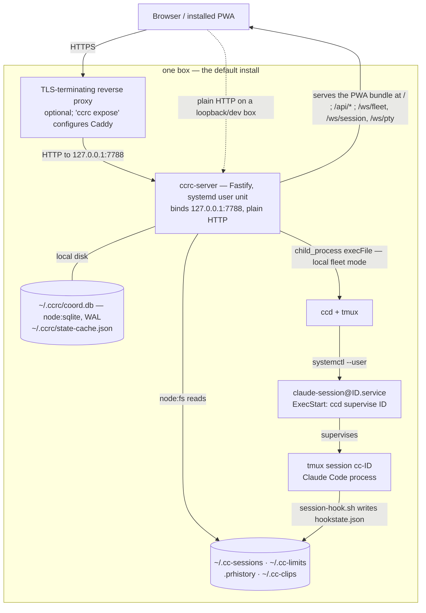
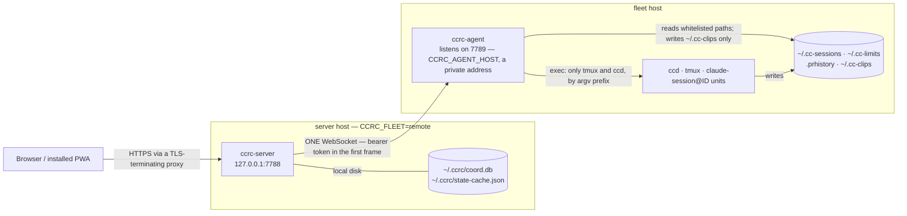

<div align="center">

# ccrc

**Self-hosted remote control for a fleet of Claude Code sessions.**
Run it on your own box. Drive twenty agents from your phone.

[](#license)
[](#requirements)
[](#quickstart)
[](#privacy)
[](#quickstart)

</div>

> Claude Code runs in a terminal, on a box, in a tmux pane. That is fine for one session.
> It stops being fine at twenty — when you are away from the desk, when a session is
> blocked on a question you could answer in four seconds, and when the account it runs on
> hits its limit and the work has to move somewhere else.
>
> **ccrc is the console for that.** One installable web app, served by your own machine,
> that sees every session, answers their questions, and moves a running conversation
> between accounts without losing it.

## Why

The official claude.ai app cannot follow a session across an account swap. ccrc can — and
that is the feature the whole design is bent around.

When a session's account runs out, ccrc relocates the **conversation itself**. The
transcript is found **by uuid**, globally unique, across every project directory under the
source account, rather than by one guessed path. A swap that finds nothing to carry
**refuses** rather than completing and quietly losing your history. The PWA also finds
history that an older, buggier swap stranded on another account — and the chat that had to
look elsewhere says so, under a banner naming where it came from.

Everything else in ccrc exists to serve one loop:

```
spec  →  plan  →  waves of subagents  →  per-PR review lenses  →  whole-branch pass
```

## What you get

| | |
|---|---|
| **Follow a session across accounts** | The swap carries the conversation, located by uuid, and refuses rather than losing it. |
| **Multi-wave programs** | Open a run, dispatch a wave, and the server tracks it — not a human holding state in their head. |
| **Review runs and a stall watch** | A finished wave is read by a separate reviewer session at one measured tip, and the coordinator rules on its report. A silent worker is asked, then its coordinator told, then you — each rung recorded before it is sent, and nothing sent until you arm it. |
| **Claims are re-measured, never believed** | A worker reporting "wave done" is checked against the workspace branch tip and `.prhistory`, from the git refs on disk. |
| **Mail between sessions** | Delivered only into an idle turn boundary, so a nudge never lands mid-thought. The body lives in a durable store; what arrives is one line. |
| **Sessions that stay out of each other's way** | A session claims the paths it is about to edit, all or nothing, and a conflict names the holder to mail. A dispatched worker is denied `gh pr merge` — the coordinator lands work — and deviation numbers are issued by the server, never guessed. |
| **Hook-first session state** | Each session reports its own state through a Claude Code hook; scraping the tmux pane is the ranked fallback, not the source. |
| **A code graph for every tree** | graphify keeps an AST-derived knowledge graph fresh per git tree on the fleet host, and a ccrc session that searches a freshly graphed tree before querying it is turned back, at most three times (`touch ~/.ccrc/graph-gate-off` lifts the gate). |
| **Answer from the lock screen** | A session asks a question; your phone gets a push and you answer it from the notification, without opening a terminal. A worker's question goes to its coordinator first, and reaches you when the coordinator passes on it or two minutes go by. |
| **A terminal, a transcript and a PR in the browser** | The transcript streams as it is written, agent mail rendered as cards; a terminal drawer attaches to the real tmux pane; type, interrupt or attach a screenshot from the phone, and open a PR or a draft — there is no merge button, by design. |
| **Workspace holds** | A program declares a claim on a worktree. No timeout, no expiry — the reason string *is* the display, and the verbs that delete, rename or reclaim the workspace refuse or defer while it stands. |
| **Two-phase workspace destruction** | Nothing irreversible happens on one tap, and every precondition is re-proved at the moment it matters. |
| **Branch names the model already wrote** | The branch takes the name from the work, instead of asking you to invent one. |
| **Accounts are runtime data** | A roster in `~/.ccrc/accounts.json`, edited by `ccrc account` — Claude subscriptions, an OpenRouter key, any Anthropic-compatible endpoint, or a ChatGPT/Codex lane ccrc runs end to end. A lane `ccrc account` connects starts switched off; usage and placement are projected *before* you tap, not discovered after. |
| **One memory store per project** | Claude Code keeps durable memory per account; `ccrc memory --apply` converges every home's copy into one store per project, so a swap stops leaving what a session learned behind. |
| **Model class and effort per session** | Pick them from the phone; ccd applies them at the next idle turn boundary, and placement routes by class. Nothing escalates a session above Opus on its own — the class above it, `fable`, is only ever a human's choice. |
| **Account pools** | Tag projects and accounts into pools; placement, swaps and rescues stay inside one, and a blocked session with no room left in its pool strands, loudly, instead of crossing. |
| **An optional session gate** | Passkeys or a passphrase, off by default, and it fails shut on every ambiguity rather than open. `ccrc expose` arms it. |
| **One whitelisted socket** | Split across two boxes, the server never SSHes the fleet host. It drives it through a closed set of whitelisted operations, and nothing else. |
| **Signed releases, updates that undo themselves** | Every merge to `main` becomes a provenance-attested `dev` release, and `stable` is a promotion behind a full-suite gate. A box moves with one verb or one tap in Settings, behind a health gate that restores the previous build when it fails. |
| **Public in one verb** | `ccrc expose` writes the Caddy config for a DuckDNS name, your own domain or a bare IP, arms the session gate, and prints the root steps instead of running them. |
| **A doctor that names the fix** | `ccrc doctor` prints one verdict per check, with a remedy under every WARN and FAIL, and the install's own exit code is doctor's. |

## Quickstart

One box, no TLS, no exposure — the default install:

```bash
git clone https://github.com/Synapsium-Labs/ccrc-pwa.git && cd ccrc-pwa
bash install.sh
```

That builds the server, the PWA and the agent, then hands off to `ccrc install`, which
seeds `~/.ccrc` (the roster, `ccrc.env`, a node id), places the tree under
`~/ccrc-versions/` with `~/ccrc` a symlink to it, puts `ccrc` and `ccd` in
`~/.local/bin`, installs and starts the systemd user units and timers (on macOS, one
LaunchAgent) — one timer, the telemetry keepalive, spends a little account usage on
purpose ([Privacy](#privacy)) —
registers the session hook and the ccrc skills in every account home the roster names,
and ends by running `ccrc doctor`, whose exit code is the install's. The server comes up
on `127.0.0.1:7788`. Keep the checkout out of `~/ccrc`: that is where the installed tree's
link goes, and a real directory there is moved aside and removed after a green install.

Then:

```bash
ccrc doctor      # one PASS/WARN/FAIL/SKIP line per check, a remedy under each WARN and FAIL; --fix cures what it can
ccrc status      # what is running, where
```

Open `http://127.0.0.1:7788/` in a browser on that box — loopback counts as a secure
context, so the app installs there. A phone needs the box reachable over HTTPS first
(below), and lock-screen notifications need a VAPID key pair (`CCRC_VAPID_PUBLIC`,
`CCRC_VAPID_PRIVATE` in `~/.ccrc/ccrc.env`) that the default install does not create —
see [Attention, notifications and answering](#attention-notifications-and-answering). From another
machine before exposing the box, tunnel instead — `ssh -L 7788:127.0.0.1:7788 <box>`, then open
`http://127.0.0.1:7788/` locally; the box stays on loopback.

Sessions run on git checkouts under `~/projects/<name>` — `ccd` uses that path, and `~/worktrees`
for workspaces, with no override, and the app lists the directories under `~/projects` — so clone
the repositories you want to drive there, or make `~/projects` a symlink to where they live; the
install does not create it. In the app, the floating **+** starts a session
([Using the console](#using-the-console)).

> **Reaching it from your phone.** ccrc binds loopback and speaks plain HTTP on purpose —
> a PWA needs a *secure context* to install, so something in front has to terminate TLS.
> Bring your own reverse proxy, or let ccrc configure one:
>
> ```bash
> ccrc expose duckdns   # a dynamic-DNS name + Caddy + an automatic certificate
> ccrc expose byo       # your own domain: DNS stays yours, ccrc writes the Caddyfile for it
> ccrc expose ip        # no name at all: the box's bare IPv4 + a locally-trusted certificate
> ccrc expose status    # what is configured right now
> ```
>
> Exposing the box to the internet without arming the session gate is the one mistake
> worth being loud about. `ccrc expose` arms it for you, so set the passphrase first
> (`ccrc passwd`): an armed gate with none refuses every request, yours included. See
> [The session gate](#the-session-gate-ccrc_auth-off-by-default).

<details>
<summary><b>Installing from a release artifact instead of a checkout</b></summary>

Release mode skips the clone and the build of ccrc itself — the dists ship prebuilt — but
not the runtime: the staged `ccrc install` it hands off to refuses without `node`, runs
`npm ci --omit=dev` for the server's runtime dependencies (and the agent's on a fleet box),
and on every role but `server` builds the graph engine's venv from PyPI. So the box needs
everything in "Requirements" below, network access to the npm registry and PyPI included.
`install.sh` fetches `SHA256SUMS` first, then the tarball, and verifies it (`sha256sum -c`;
`shasum -a 256 -c` on macOS) **before extracting a single file** — that checksum, from the
same origin as the tarball, is the whole of the first install's verification; every
`ccrc update` after it also verifies the provenance attestation ("Releases"):

```bash
curl -fsSLO https://raw.githubusercontent.com/Synapsium-Labs/ccrc-pwa/main/install.sh
bash install.sh --release              # the newest stable release
bash install.sh --release vX.Y.Z       # one tag — a dev prerelease needs its tag
```

Anything after `--release [vX.Y.Z]` passes through to `ccrc install`, which is how `--role`
rides:

```bash
bash install.sh --release [vX.Y.Z] --role fleet
```

**Which release you get.** Every merge to `main` publishes a release, born a prerelease —
the `dev` channel; `stable` moves only by promotion, so it can trail `dev` by many
releases. A bare `--release` installs the newest **stable** release (`latest/download`
never serves a prerelease); name a tag to take any published build, a `dev` one included.
The repository's Releases page, or `gh release list -R Synapsium-Labs/ccrc-pwa`, lists both
channels. This README describes `main`, so a stable install can predate parts of it —
`ccrc version` names what a box runs. To build an artifact yourself:
`bash deploy/build-release.sh --untagged --out release-out`.

Note that `curl … | bash` (piping the script into a shell) does **not** work: read from
stdin, `BASH_SOURCE` is unset and the script dies under `set -u` before its argument loop.
Download it, or use `bash <(curl -fsSL …)`.

</details>

## Requirements

- **Node ≥ 22.16.0** — not negotiable, and not a style choice: the coordination database
  is `node:sqlite` (flagged below 22.13), and ccrc history needs its FTS5 (absent below 22.16).
  All three packages declare the same floor and a test pins it.
- **git**, **tmux**, **bash**, **curl**, **rsync**, **diff** — `ccrc install` refuses by
  name without `rsync` (it places the tree) or `diff` (every skill installer compares
  with it). **`openssl`** only mints the box and agent tokens by hand (`openssl rand -hex 32`).
- **`gh`** (the GitHub CLI, authenticated with `repo` scope: `gh auth login --scopes repo`)
  — PR state, opening a PR and the merges your sessions make go through it. Doctor FAILs
  without it, or with a token that lacks `repo`, so the install's own exit code does too.
- **`jq`**, **`python3`**, **`flock`** — `jq` reads the box's small JSON files and is what
  the session hook parses its events with; `python3` is what `~/.local/bin/ccd` itself
  starts under — a standard-library launcher in front of the Bash body, which
  `ccrc install` will not place without a `python3` that runs in isolated mode (`-IS`)
  (D-3696) — and, on every role but `server`, the venv for the pinned graph engine
  (`python3 -m venv`; Debian/Ubuntu: `python3-venv`); `flock` is registry locking.
- **Claude Code at `~/.local/bin/claude`**, installed and authenticated for at least one
  account. The seeded roster's one account is the upstream `claude`, and that path is
  literally what `ccd` execs: the native installer puts the binary there; installed
  anywhere else, symlink it. Doctor's `wrappers` check FAILs until it exists.
- **A git identity** — `git config --global user.email` (or `user.useConfigOnly=true` with
  an identity per repository): sessions commit in their workspaces, and doctor's
  `git_email` check FAILs without one.
- **`~/.local/bin` on your `PATH`** — `ccrc`, `ccd` and every remedy doctor prints live
  there (a WARN, not a FAIL).
- **Room on `$HOME`'s filesystem** — doctor FAILs under 2 GiB free and WARNs under 10 GiB:
  each workspace is a full checkout of its project (a git worktree, plus whatever its build
  leaves), and each update keeps the build it replaced.
- **Linux or macOS.** The session layer is tmux plus the box's service manager — systemd
  on Linux, launchd on macOS.

**On Linux**, additionally:

- **systemd user units**, with lingering enabled — without it your sessions die with your
  last login. `ccrc install` runs `loginctl enable-linger` itself and, where that needs a
  privilege it lacks, prints the `sudo` command and carries on.
- **Node on the user manager's `PATH`, not only your shell's.** `ccrc.service` and
  `ccrc-agent.service` start `/usr/bin/env node` in the systemd user manager's
  environment: a distro or NodeSource package (`/usr/bin`, `/usr/local/bin`) is found; a
  Node installed only through nvm is not, until its `bin` directory is on the manager's
  `PATH` (an `~/.config/environment.d/*.conf` fragment).
  `systemctl --user show-environment` shows what the units see; an install whose service
  cannot find `node` fails at the step that waits for it to stay up.
- **A C/C++ build toolchain and the npm registry.** An install that places a new tree,
  and so every update, runs `npm ci --omit=dev` on the box — release mode included — and
  `node-pty` ships no Linux prebuilt binary, so it compiles there through `node-gyp`
  (`make`, a C++ compiler, `python3`; Debian/Ubuntu: `sudo apt install build-essential`).
  A box that cannot reach the registry, or has no compiler, fails the install at that
  step; PyPI is needed too, for the graph engine. macOS uses node-pty's prebuilt binaries.

**On macOS**, additionally:

```bash
xcode-select --install          # a real python3 — /usr/bin/python3 is only a stub until these are installed
brew install bash tmux flock gh jq coreutils
```

- **The Xcode Command Line Tools** (Homebrew's own prerequisite): `ccrc install` refuses
  without a `python3` that runs — `ccd`'s launcher is Python, and the `~/ccrc` flip is one
  `os.replace`.
- **bash ≥ 4.4.** Not optional and not a preference: `ccd` uses associative arrays,
  `[[ -v arr[k] ]]`, `mapfile`, `BASHPID` — and empty-array `"${a[@]}"` expansions under
  `set -u`, which bash treated as fatal until 4.4 — and macOS ships **3.2.57** as `/bin/bash`
  for licensing reasons. Make sure Homebrew's `bin` comes before `/bin` on your `PATH`.
  `install.sh` refuses by version before it builds anything.
- **tmux** and **flock**, neither of which macOS ships. Homebrew's `flock` formula is the
  portable implementation and takes the flags ccd passes.
- **GNU coreutils** (`gtimeout`). macOS ships no `timeout`, and the session hook and the status
  line bound their one `tmux` call with `timeout` or `gtimeout`: with neither on `PATH` the hook
  does nothing at all — no session state, no turn marker, no search-gate or worker-merge deny —
  and the per-session usage sidecar is never written, with no error anywhere; the board falls back
  to reading the pane. Doctor's `timeout` check FAILs on exactly this.
- **Only if you BUILD a release** (`deploy/build-release.sh`, a maintainer's job — not
  something a box needs to install or update): `brew install gnu-tar`. The artifact is made
  reproducible with `--sort/--mtime/--owner/--group`, BSD tar has none of them, and the
  script refuses rather than emitting a tarball whose digest depends on who built it.

Two things a macOS box does **not** get, both stated by `ccrc doctor` rather than left to
be discovered:

- **No linger.** A LaunchAgent runs in your login session: the server and every session
  stop at logout and start again at login. The only thing on macOS that survives a logout
  is a root-owned LaunchDaemon, which would run your fleet as a different user with a
  different keychain — a posture `ccrc install` will not choose for you. For an always-on
  box, stay logged in and turn off sleep.
- **No memory ceiling.** The per-session and fleet-wide caps are cgroup limits
  (`MemoryHigh`/`MemoryMax` on the session unit, per-pane `MemoryHigh`/`MemoryMax`, and the
  aggregate `MemoryMax` on `app-claude\x2dsession.slice`), and launchd has no equivalent of
  any kind. `ccd-cap-scopes` is not installed there either — it caps cgroup scopes, and
  there are none.

`ccrc doctor` checks all of this and tells you which one is missing, rather than failing
somewhere further in.

A macOS box also gets none of the **periodic jobs**. `ccrc install` places one LaunchAgent —
`app.ccrc.ccrc` (`app.ccrc.ccrc-agent` on a fleet box), its plist under
`~/Library/LaunchAgents` and its log at `~/.ccrc/logs/<label>.log`, which
`ccrc logs [-f] [-n N]` tails — plus one per session, and none of the Linux timers: no graph
sweep, temp-dir reaper, account-health probe, telemetry keepalive, model refresh, usage
sweep, Codex usage poller, update watchdog or control-plane pullers (`ccrc expose duckdns` does place its own refresh job
there, `app.ccrc.ccrc-ddns`). A macOS node is not
centrally managed either: `ccrc update` follows `stable` there, and the console offers it
no move.

## How it works

The default install is **one box**. The server is a single Fastify process that serves the
PWA, reads the fleet's flat files directly, and shells out to `ccd` and `tmux`.


```mermaid
flowchart TB
    B["Browser / installed PWA"]

    subgraph BOX["one box — the default install"]
      P["TLS-terminating reverse proxy<br/>optional; 'ccrc expose' configures Caddy"]
      S["ccrc-server — Fastify, systemd user unit<br/>binds 127.0.0.1:7788, plain HTTP"]
      D[("~/.ccrc/coord.db — node:sqlite, WAL<br/>~/.ccrc/state-cache.json")]
      C["ccd + tmux"]
      U["claude-session@ID.service<br/>ExecStart: ccd supervise ID"]
      T["tmux session cc-ID<br/>Claude Code process"]
      R[("~/.cc-sessions · ~/.cc-limits<br/>.prhistory · ~/.cc-clips")]
    end

    B -->|"HTTPS"| P
    P -->|"HTTP to 127.0.0.1:7788"| S
    B -.->|"plain HTTP on a loopback/dev box"| S
    S -->|"serves the PWA bundle at / ; /api/* ; /ws/fleet, /ws/session, /ws/pty"| B
    S -->|"child_process execFile — local fleet mode"| C
    S -->|"node:fs reads"| R
    S ---|"local disk"| D
    C -->|"systemctl --user"| U
    U -->|"supervises"| T
    T -->|"session-hook.sh writes hookstate.json"| R
```

Sessions are not children of the server. Each one is its own systemd user unit (a
LaunchAgent on macOS) running `ccd supervise`, which owns a tmux session — so the server
can restart, or be replaced mid-deploy, without touching a running turn.

<details>
<summary><b>The optional two-box split</b></summary>

Set `CCRC_FLEET=remote` and the same seams are backed by a WebSocket to an agent on the
fleet host instead of local `execFile`. The server never SSHes that box.


```mermaid
flowchart LR
    B["Browser / installed PWA"]

    subgraph SH["server host — CCRC_FLEET=remote"]
      S["ccrc-server<br/>127.0.0.1:7788"]
      D[("~/.ccrc/coord.db<br/>~/.ccrc/state-cache.json")]
    end

    subgraph FH["fleet host"]
      A["ccrc-agent<br/>listens on 7789 — CCRC_AGENT_HOST, a private address"]
      C["ccd · tmux · claude-session@ID units"]
      R[("~/.cc-sessions · ~/.cc-limits<br/>.prhistory · ~/.cc-clips")]
    end

    B -->|"HTTPS via a TLS-terminating proxy"| S
    S ---|"local disk"| D
    S -->|"ONE WebSocket — bearer token in the first frame"| A
    A -->|"exec: only tmux and ccd, by argv prefix"| C
    A -->|"reads whitelisted paths; writes ~/.cc-clips only"| R
    C -->|"writes"| R
```

The agent's exec surface is a closed two-name set — `tmux` and `ccd` — matched on the bare
command name and an argv **prefix**. There is no shell, and no way to add a third name from
the server side. The one spawn outside it is the `update` op, which runs
`ccrc update --to <tag> --detach` or its `rollback` twin — two fixed argv templates, the
release tag their only variable. The agent refuses to bind `0.0.0.0` or `::`; `CCRC_AGENT_HOST`
(default `127.0.0.1`) must name the private address the server reaches it on.

</details>

### The pieces

| Path | What it is |
|---|---|
| `server/` | Fastify (TS ESM), one systemd user unit. Owns `~/.ccrc/coord.db` — programs and runs, mail, claims and asks, the deviation ledger, a mirror of ccd's lifecycle journal, central pool edges and the update control plane — via `node:sqlite` with WAL and migrations that refuse to start rather than open empty. |
| `pwa/` | React + Vite installable PWA. Builds into `server/dist-pwa`, which the server serves at `/`. |
| `agent/` | A small whitelisted exec/file/tail/pty surface over a bearer-token WebSocket. Needed only for the two-box split; local mode never touches it. |
| `ccd/` | The bash layer: `ccd` (the fleet host's sessions), `ccrc` (install, update, doctor and every box's other lifecycle verbs), the Claude Code hook that reports each session's state and its installer, the coordinator, worker and reviewer skills, and the helpers the timers run. |
| `shared/` | The wire vocabulary — server↔agent and server↔PWA types — imported by the server, the agent and the PWA alike. |
| `deploy/` | systemd units and env templates, the release builders (`build-release.sh`, `release-main.sh`, `release-stable.sh`), the provenance verifier with its vendored Sigstore root, the read-only program instruments (`measure-*.py`), and `deploy.sh`, the fallback that pushes a working tree onto an already-installed box. |
| `install.sh` | The bootstrap: build a checkout, or fetch and verify a release, then hand off to `ccrc install`. |

ccd's flat files stay the fleet's own authority for sessions, workspaces and PRs: the
database re-measures them and holds what coordination adds *on top*, never replacing them.
It is not a cache, though — nothing rebuilds its mail, claims, asks, central pool edges or
update intents on its own — so every `ccrc update` (and `ccrc backup`, on demand)
snapshots it into `~/ccrc-backups/<ts>/` first. Without a snapshot, the lifecycle mirror
re-measures itself from ccd's journal and a program's history can be reconstructed by hand
from its markdown ledger, the registry and `.prhistory`; the rest is gone.

## Privacy

ccrc has no telemetry and no analytics, and nothing in it reports to its authors: your
sessions, your fleet and your transcripts are not sent anywhere ccrc chose. Transcripts are
read on the box that holds them and served only to your own browser — in the two-box split,
through your own server. What does leave the box, all of it on your behalf:

- **GitHub.** A `server` or `both` box lists this repository's releases every 30 minutes,
  unauthenticated, for the update screen — `CCRC_RELEASE_API_URL` points it at a mirror
  ("Releases"). `install.sh --release`, `ccrc update`, `ccrc rollback` and `ccrc rollout`
  download release assets from the same repository (`CCRC_RELEASE_BASE_URL` points them
  elsewhere), and `gh`, with your own token, reads PR state and opens the PRs you ask for.
- **Package registries, at install and update** — npm (`npm ci --omit=dev`) and, on every
  role but `server`, PyPI for the pinned graph engine.
- **Your model providers, as each of your accounts.** The Claude Code sessions themselves
  talk to Anthropic — or, on an OpenRouter, Anthropic-compatible or ChatGPT/Codex lane you
  connected, to that provider. And on Linux, on every role but `server`, two timers:
  `ccd-account-health` asks Anthropic's OAuth usage endpoint every 15 minutes whether each
  `telemetry: "anthropic"` account's setup token still authenticates — the token file its
  `exec.secretsFile` declares or, for an `upstream` account that declares none, the legacy
  `~/.cc-secrets/<id>-oauth.env`; an account with no readable token file is refused before
  anything is sent, and a `login`, API-key, `external` or Codex lane is never a subject. It spends
  no tokens (`touch ~/.ccrc/account-health-paused` stops it). And `ccd-telemetry-keepalive` takes one
  minimal turn (the cheapest model, a one-line prompt) on a measured account whose usage
  reading is more than 30 minutes old and that no session is sitting on, so that its limits
  stay known. That turn is paid from the account's own window, and the "telemetry" in the
  name is the account's own usage reading, not a report to anyone
  (`touch ~/.ccrc/keepalive-paused` stops it). The seeded `claude` account is a measured one.
  A ChatGPT/Codex lane adds a third, `ccrc-codex-usage@<id>.timer`: every 15 minutes it sends
  the Codex backend one minimal request ("reply ok", to the lane's haiku-class model) with that
  lane's own token, to read the usage headers on the answer.
- **Only if you set them up** — DuckDNS and an ACME CA, as `ccrc expose` uses them (DuckDNS
  for its `duckdns` arm, the CA for `duckdns` and `byo`, neither for `ip`); your browser's
  push service once VAPID keys are set (each notification is encrypted to the
  subscription's own keys); the model catalogue of any lane you gave a model registry
  (`ccrc-models.timer`, hourly); and the Hetzner Cloud API for the degraded-mode reboot
  (`CCRC_HETZNER_TOKEN`).

---

The rest of this README is the reference, ordered for an outside reader: install and
expose first, operating the fleet in the middle, and — below a second fold — the
internals, written for someone changing the code: how each mechanism actually works,
what the guarantees are, and where they stop.

## Install (single box)

From a **release artifact** — ccrc itself is not built on the box (its runtime dependencies are
still fetched and, on Linux, `node-pty` compiled — below); the clone is only a way of having
`install.sh`:

```bash
git clone https://github.com/Synapsium-Labs/ccrc-pwa.git && cd ccrc-pwa && bash install.sh --release
```

or from the **checkout** — builds the server, the PWA and the agent here, then installs
the same way:

```bash
git clone https://github.com/Synapsium-Labs/ccrc-pwa.git && cd ccrc-pwa
bash install.sh
```

Keep the checkout out of `~/ccrc` — that name is the installed tree's link ("Quickstart", above).

The owner in that URL is `CCRC_RELEASE_OWNER`'s value — defined once in
`install.sh` and matched by `ccd/ccrc`, so `ccrc update` later downloads from
the same place; `CCRC_RELEASE_BASE_URL` is the documented override that points
both download lanes — `install.sh --release` and `ccrc update`/`rollback`/`rollout` — at a mirror
instead (the server's own release catalogue reads the GitHub API at `CCRC_RELEASE_API_URL`). A bare
`--release` installs the newest **stable** release; `bash install.sh --release vX.Y.Z` installs that
tag, which is how a `dev` prerelease is taken ("Channels", below). To build an artifact yourself:
`bash deploy/build-release.sh --untagged --out release-out`, or take the checkout lane.

**What the box needs first.** Three layers refuse, in order. `install.sh` refuses when `node` is
missing or below the floor `server/package.json`'s `engines.node` declares (naming both versions)
and, on macOS, before any build, on a bash older than 4.4 or no `tmux` or `flock` — in checkout
mode; in `--release` mode it refuses only on `curl` and on a download or checksum it cannot verify.
`ccrc install` then refuses, before it writes anything, without `node`, without `systemctl` (Linux)
or `launchctl` (macOS), and without a `python3` that runs in isolated mode (`-IS`) —
`~/.local/bin/ccd` is a standard-library Python launcher (D-3696); on macOS it repeats the bash,
`tmux` and `flock` checks and wants a `python3` that actually runs (the Xcode Command Line Tools).
Mid-install it dies by name on `rsync` (placing the tree), on `npm ci --omit=dev` (no registry, or
on Linux no compiler for `node-pty`) and — on every role but `server` — on `python3 -m venv`/`pip`
for the pinned graph engine and on `diff`, which all four skill installers need. Everything else is
measured by the `ccrc doctor` run the install ends with, whose exit code is the install's. The full
list, with the macOS additions, is "Requirements", above.

Past those refusals `install.sh` builds the server, the PWA and the agent (checkout mode; `--release`
skips the build and hands off to the staged tree — "Releases" below) and hands off to `ccrc install`
(`ccd/ccrc install`), which seeds the roster and `ccrc.env`, places the tree in a version directory,
`~/ccrc-versions/<name>/`, and points the `~/ccrc` symlink at it ("Versioned installs", below),
installs the systemd user units, converges the wrappers your roster declares (the seeded default
roster declares one `upstream`-kind account, so a fresh install writes none), and ends by running
`ccrc doctor` — the install's own exit code is doctor's. **Green means the box is ready**; the PWA
answers at `http://127.0.0.1:7788/`. Re-running either script converges rather than damaging an
existing install. `rsync` and `diff` are hard by-name dependencies of `ccrc install` — `rsync` places
the tree, and `diff` is what all four skill installers (coordinator, worker, reviewer, graphify)
compare a config dir against — with **no doctor check of their own** (`skills` only WARNs that it
could not compare without `diff`); absent, each refuses naming the package rather than failing
opaquely mid-copy, and a refused skill install is fatal to the whole verb. `cmp` is the third of the
class and the mildest: its two call sites — `_inst_atomic` and `_inst_keep_aside` — leave the
comparison unguarded on purpose, so a box without it rewrites identical bytes rather than refusing,
the safe direction. (`_inst_tree_copy` compares with `diff -r -q`, not `cmp`, and degrades the same
way; the refusal on a missing `diff` comes from the skill installers it then runs.)

**What the install leaves running** (Linux, by role — `both` is the default):

| unit | roles | runs | what it does | pause file |
|---|---|---|---|---|
| `ccrc.service` | server, both | always on | the server, on `127.0.0.1:7788` unless `ccrc.env` says otherwise | — |
| `ccrc-agent.service` | fleet | always on | the agent the server box drives — port 7789, loopback until `CCRC_AGENT_HOST` names another address | — |
| `claude-session@<id>.service` | fleet, both | per session | `ccd supervise <id>`, one per session `ccd` starts | — |
| `ccd-cap-scopes.timer` | all | 60 s | caps each new tmux pane scope's memory | — |
| `ccd-pool-sync.timer`, `ccd-update-sync.timer` | fleet | 60 s | pull the account-pool and update projections from the server | — |
| `ccrc-update-watchdog.timer` | server, both | 60 s | re-measures a self-update that died with its updater ("Releases") | — |
| `ccd-graph-sweep.timer` | fleet, both | 15 min | refreshes per-tree code graphs | `~/.ccrc/graph-sweep-paused` |
| `ccd-account-health.timer` | fleet, both | 15 min | probes each setup-token account's credential, spending no tokens | `~/.ccrc/account-health-paused` |
| `ccd-telemetry-keepalive.timer` | fleet, both | 15 min | one minimal turn on an idle measured account (below) | `~/.ccrc/keepalive-paused` |
| `ccrc-models.timer` | fleet, both | 1 h | `ccrc models refresh --all`: every lane's model catalogue | — |
| `ccd-tmp-sweep.timer` | fleet, both | 1 h | reaps Claude Code's per-uid temp dir | `~/.ccrc/tmp-sweep-paused` |
| `ccd-scope-sweep.timer` | fleet, both | 60 s | records every dead ccd pane scope; stops an inert one only when armed (below) | `~/.cc-sessions/scope-sweep-paused` |
| `ccd-usage-sweep.timer` | fleet, both | 4 h | per-account usage totals from transcripts | `~/.ccrc/usage-sweep-paused` |
| `ccrc-codex-usage@<id>.timer` | fleet, both | 15 min | one per `codex` lane: that lane's Codex usage into `~/.cc-limits` | — |

The role's service and `ccd-cap-scopes.timer` must enable or the install fails; any other timer that
will not enable prints the `systemctl --user enable --now` line to run, is named by its unit among the
closing line's degraded steps (`install: done — converged with N degraded steps (…)`), and the install
carries on. A `stable` build can predate some of these units; `ccrc version` says what a box runs. Also running on `fleet` and `both` boxes, outside the table: `ccd-history-sweep.timer` (every 2 min), which copies session text verbatim, secrets a session printed included, into `~/.ccrc/history`; its pause file is `~/.ccrc/history-off`. A rollback to a build with no `ccd/history/` leaves this timer enabled and failing every 2 minutes (the store is untouched): run `systemctl --user disable --now ccd-history-sweep.timer` on that box, as the timer unit's header says; the next install of a build with history re-enables it.
`ccrc expose duckdns` adds `ccrc-ddns.timer` (every five minutes; on macOS the launchd job
`app.ccrc.ccrc-ddns`). `deploy.sh agent` arms the fleet set minus `ccd-update-sync` and the
`ccrc-codex-usage@<id>.timer` instances — it places that template and enables none; `ccrc install` does,
per lane. macOS gets the role's one LaunchAgent, a launchd job per session, and none of the timers above
("Requirements").

**One of those timers spends account usage, on purpose.** `ccd-telemetry-keepalive` takes one
minimal turn on an idle `telemetry: "anthropic"` account — the seeded default account is one — so its
usage reading stays fresh, at most once per `CCRC_KEEPALIVE_FRESH` (1800 s) per account.
`touch ~/.ccrc/keepalive-paused` stops it and `rm` resumes it; that file survives an update, which
re-enables the timer. What it costs and what it never touches: "Account health and the telemetry
keepalive", below.

**Two files in your own namespace.** On a `fleet` or `both` box, `ccrc install` (and every update)
replaces `~/.tmux.conf` with ccrc's `ccd/tmux.conf` — two settings, truecolor passthrough for the
PWA's terminal drawer — and `~/.claude/statusline-command.sh` with ccrc's statusline, which writes the
`~/.cc-limits` telemetry placement and swaps read; a differing original is first copied aside as
`<file>.pre-ccrc-<UTC>`, so a personal one is never lost. `deploy.sh agent` overwrites both without
that copy. The hook installer points each rostered home's `statusLine` at that script only where
none is set; a home with a status line of its own keeps it, and reports no `~/.cc-limits` telemetry
unless that line runs ccrc's script. Beyond those two files, every rostered home gets ccrc's managed
hook entries in its `settings.json` and four skills (`ccrc-coordinator`, `ccrc-worker`, `ccrc-reviewer`
and graphify's) — on a fresh box that home is your own `~/.claude`, so the skills are listed in every
Claude Code session you start there, while the hook entries act only inside a `ccd` session's
`cc-<id>` tmux session and exit at once anywhere else.

**What the install does not place.** Coordination — runs, mail, claims, asks, and a fleet box's pool
and update pulls — needs three things the install leaves to you, once per box; without them the
console still drives sessions, but the box-token routes answer `401` and the clients refuse before
they call:

- **The box token**, one shared secret: `~/.ccrc/mail.token` for the server (`CCRC_MAIL_TOKEN_PATH`
  overrides) and the same value at `~/.cc-secrets/ccrc-mail.token` for the fleet side — both files
  on a single box, one on each of two. Only `deploy.sh`'s secret lane ships it. What the server does
  without it: "The mail bus and its token", under "Fleet coordination" below.
- **`CCRC_SERVER_URL`** in `~/.ccrc/agent.env` — the server's address, which the skills' client,
  `ccd-pool-sync` and `ccd-update-sync` read and never guess. `ccrc install --role fleet` prompts
  for it; a single (`both`) box gets no `agent.env` at all.
- **`~/.local/bin/ccrc-api`**, the closed client every skill calls instead of `curl` ("Programs,
  runs and mail"). `deploy.sh agent` installs it; `ccrc install` and `ccrc update` do not.

The block below is the single-box form: it mints the token on this box and puts it at both paths. On
two boxes mint the value once (`openssl rand -hex 32`) and place that same value at
`~/.ccrc/mail.token` on the server box and at `~/.cc-secrets/ccrc-mail.token` on the fleet box;
minted separately the two disagree and every box-token call answers `401` (`wrong box token`).

```bash
( umask 077; mkdir -p ~/.cc-secrets
  openssl rand -hex 32 > ~/.ccrc/mail.token            # never print it: ls -l, not cat
  cp ~/.ccrc/mail.token ~/.cc-secrets/ccrc-mail.token  # two boxes: this value, at this path, on the fleet box
  # single box only (a fleet box's install wrote its agent.env):
  [ -e ~/.ccrc/agent.env ] || echo 'CCRC_SERVER_URL=http://127.0.0.1:7788' > ~/.ccrc/agent.env )
ln -sfn ~/ccrc/ccd/ccrc-api ~/.local/bin/ccrc-api        # on the box the sessions run on; a link follows every update
systemctl --user restart ccrc.service                     # the server reads the token once, at boot
```

Creating `~/.cc-secrets` has one side effect on `ccrc doctor`: its `credentials` check SKIPs while
that directory is absent, and once it exists FAILs for the seeded account — the roster marks it
`"telemetry": "anthropic"`, so the health probe measures it — until its setup token is at
`~/.cc-secrets/<id>-oauth.env` (`<id>` is `claude` in the seed): mode `0600`, one
`export CLAUDE_CODE_OAUTH_TOKEN=…` line holding what `claude setup-token` prints. "Connecting an
account: `ccrc account`", below, names the helper that mints and writes it.

Push notifications need a VAPID key pair the install does not create either — "Turning push on",
under "Attention, notifications and answering" below.

**What `ccrc doctor` measures.** Each check prints a verdict line — `PASS`, `WARN`, `FAIL`, or
`SKIP` when there is nothing to measure — every WARN and FAIL followed by its `remedy:`, then one
summary line; it exits 1 when anything FAILs (a WARN does not), which is the exit code `ccrc install`
ends with. A `server`-role box SKIPs the checks that measure per-account or per-session state — `wrappers`,
`skills`, `accounts`, `pools`, `memory`, `routing`, `codex`, `graphify`, `graphify-path` (D-3111),
`timeout`, `model-default`, and `jq_regex` (no session hook runs there).

| checks | what they measure |
|---|---|
| `node`, `tmux`, `git`, `gh`, `jq`, `python3`, `flock` | on `PATH`; `node` also against the `engines.node` floor |
| `timeout` | `timeout` or `gtimeout` on `PATH`: the session hook and the status line bound their one `tmux` call with it and skip the call without it — the hook then does nothing at all, and the status line writes no usage sidecar |
| `model-default` | each Anthropic lane's `settings.json` default model (`env.ANTHROPIC_MODEL`, else `model`, else `env.ANTHROPIC_DEFAULT_MODEL`), read as Claude Code reads it — trimmed, any case, `[1m]` in any case: a WARN when it is Fable (`fable`, `fable[1m]`, `best` — Fable where the account is entitled to it — an id carrying `-fable-`, or an alias the lane's own `env.ANTHROPIC_DEFAULT_<ALIAS>_MODEL` points at such an id), because a session there with no routing record, or class `default`, starts on Fable; a file it cannot read or parse, a reader (node) that fails, or a lane with no config dir is a WARN, unmeasured (never a FAIL, no `--fix`: ccrc does not own the key). Not measured: the remap of the account's implicit default when no key names a model |
| `tmux_skew` | the tmux client on disk against the running tmux server (a WARN: restart that server at a quiet moment) |
| `jq_regex` | jq's regex engine can match a lookbehind, which the session hook's merge deny needs to read a command (a jq without Oniguruma leaves the deny failing open); a SKIP with no jq on `PATH`, which `jq`'s own row owns |
| `gh_auth`, `git_email` | `gh` logged in with the `repo` scope; a commit identity |
| `linger`, `path`, `disk` | linger enabled; `~/.local/bin` on `PATH`; free space on `$HOME`'s filesystem |
| `services`, `scopes` | ccrc's installed services and timers active (the graph sweep is judged by its census instead, under `graphify`; the Codex usage timers under `codex`; the usage sweep by neither); no pane scope throttled at its memory cap |
| `config`, `auth`, `rc` | `ccrc.env` coherent for its fleet mode; the session gate and its passphrase file; this box's `--remote-control` setting |
| `exposure`, `update-exposure`, `caddy`, `caddyfile`, `cert`, `name` | the exposure pieces ("Exposure", below) |
| `wrappers`, `skills`, `accounts`, `credentials` | the roster against `~/.local/bin` (Claude Code's binary included); the ccrc skills in every home; declared credential files and provider env blocks (a Codex lane's may omit `ANTHROPIC_BASE_URL`, which its launcher exports, but may not name an endpoint other than its loopback shim); a token file for every account the health probe measures |
| `codex` | for each `exec.kind: "codex"` lane: the four GPT-lane executables in `~/.local/bin` against the shipped tree; the isolated runtime (`ccgpt-runtime check`, which trusts the build's stamp); the roster row and its ports; `exec.authDir` and its `auth.json`, for existence and mode only; `lane.json` against the roster row and the class registry; a `codex` class registry and its haiku-class probe model; the rendered LiteLLM config against the catalogue; the two tiers (half up, foreign, unmeasurable, down under a live session, or running and not proven to run the installed bytes); and its usage timer and `~/.cc-limits` row. Lane state left under `~/.ccrc/codex/` for an id no longer `codex` is a WARN |
| `pools`, `memory`, `routing`, `models` | project pool tags; one memory store per project; lane routing; model-catalogue freshness |
| `pool-sync`, `update-sync` | a fleet box's two pulled projections, present and in lease |
| `graphify`, `graphify-path` | the pinned graph engine, its skill and the sweep's last census; `graphify` on `PATH` resolving to that engine |
| `build`, `provenance`, `fleet` | the running server's build against the stamp; whether this install was verified (never a FAIL); in remote mode, whether the two boxes agree |

`ccrc doctor --fix` cures the failing checks that know how — `skills`, `wrappers` and `codex`, each by
the shipped tree's own installer — and measures them again; the second verdict is the one that counts (D-3113). Without the flag
doctor writes nothing. Only a FAIL reaches a fixer, never a WARN. `wrappers` re-runs `ccrc wrappers` with no flag,
which overwrites only a launcher whose ccrc marker still verifies. `codex` re-places a GPT-lane executable that is
missing or differs, rebuilds a runtime its check refuses, re-renders a lane's stale `lane.json` or `litellm.yaml`
under the lane's lock, and — only when it replaced the shim or the runtime — re-runs the install step that
restarts a stale ccrc-owned tier; it never edits the roster, chooses a port, signs a lane in or enables a unit,
so a usage timer that is not enabled is a WARN whose remedy is `ccrc install`.

**Adding accounts.** The seeded roster holds one `upstream`-kind account (id `claude`) — the Claude
Code you already signed in. Further lanes are connected on the box with `ccrc account`, and every lane
it connects starts switched off until `ccrc account check --id <id>` and
`ccrc account enable --id <id>` — "Connecting an account: `ccrc account`", below.

This is the **single-box** shape only: local fleet mode, localhost, no TLS, no
agent (`ccrc-agent.service` is deliberately not installed — local mode never
touches it). The two-box shape — a fleet box installed with `--role fleet`,
the server box flipped to `CCRC_FLEET=remote` — is "Releases" below plus
"Remote fleet mode"; runbook step 12 is its worked, boxed proof. Checkout mode takes no arguments
and always installs the default role, `both` — `bash install.sh --role fleet` is refused; `--role`
rides only the release lane (`bash install.sh --release [vX.Y.Z] --role fleet`) or, from an already
built checkout, `bash ccd/ccrc install --role fleet` directly.

The steps above are proven hermetically (fixture `$HOME`s, every suite in "Develop" below); the
real-VM proof — an actual fresh box, a stopwatch, RC verifiably off — is the operator's stage gate
and remains pending. `docs/superpowers/specs/2026-08-19-stage2-vm-gate-runbook.md` is its runbook.

## Exposure: a public name and a real certificate (`ccrc expose`)

A box goes public the same way its session gate arms ("The session gate"
below): dark by default, one operator verb, and nothing privileged ever run
by ccrc. Three arms, one decision — how much of the outside world you want
involved:

| mode | you bring | name | certificate | passkeys | third parties |
|---|---|---|---|---|---|
| `ccrc expose duckdns` | a free DuckDNS account | `<sub>.duckdns.org`, zero-cost — a ccrc timer keeps it pointed here | public ACME (automatic) | yes | DuckDNS + the ACME CA |
| `ccrc expose byo` | your own domain | yours — DNS stays yours by contract | public ACME (automatic) | yes | your DNS host + the ACME CA |
| `ccrc expose ip` | nothing | none — the box's bare global IPv4, measured by the verb itself | caddy's internal CA (`tls internal`) — each device trusts the printed root once | no — passkeys need a domain, so the gate runs on passphrase login only | **none at all** |

`duckdns` prompts for a subdomain and token (tty-only, echo off, never argv);
`byo` prompts for your own origin and passkey rp id; `ip` prompts for nothing
but the caddy bind — the address is measured (`hostname -I`, first global
IPv4), and a NAT'd box is refused rather than certified for an address it
does not carry (a changed box IP is a re-run of the verb). Whichever arm, the
verb writes two ccrc-owned files and prints the rest:

- **`~/.ccrc/exposure.env`** (0600 — the DuckDNS token lives here, and is
  never printed: `ccrc expose status` and doctor report it as SET/NOT SET
  only). It carries `CCRC_ORIGIN`, `CCRC_RP_ID` (omitted on the `ip` arm — an rp id must be a
  domain) and **`CCRC_AUTH=on`**: the verb arms the session gate itself, because a box answering
  from the public internet with the gate off is a published fleet (D-162). The `ip` arm adds
  `CCRC_EXPOSE_MODE` and `CCRC_EXPOSE_ADDR`, a chosen bind adds `CCRC_CADDY_BIND`, and the DuckDNS
  arm its trio. It is read by `ccrc.service` as a **second `EnvironmentFile` after `ccrc.env`** —
  systemd's later-file-wins — and to keep the two files from ever disagreeing the verb refuses to
  run while `ccrc.env` still sets any of `CCRC_ORIGIN`, `CCRC_RP_ID` or `CCRC_AUTH`, naming both
  files. **Set the passphrase first** (`ccrc passwd`): an armed gate with no `~/.ccrc/auth.scrypt`
  refuses every request, yours included, and the verb prints `expose: DEGRADED` when it finds none.
  Deleting `exposure.env` and restarting `ccrc.service` takes the box dark again — and disarms the
  gate it armed, so stop Caddy first.
- **`~/.ccrc/Caddyfile`**, regenerated whole on every run: the host, the
  chosen `bind` if any, and `reverse_proxy 127.0.0.1:<CCRC_PORT>`, nothing else. Stock Caddy's automatic
  HTTPS does the certificate through the standard ACME challenges
  (HTTP-01/TLS-ALPN-01) — which is why **a router forwarding ports 80 and 443
  to the box is a prerequisite** the verb states loudly and nothing on the box
  can verify for you. On the `ip` arm the block is
  `https://<ip> { tls internal; reverse_proxy 127.0.0.1:<port> }` instead: no
  ACME and no ports forwarded for issuance — caddy mints the certificate from
  its own root, and the verb prints the **trust ceremony** (`sudo caddy trust`
  on the box; installing
  `/var/lib/caddy/.local/share/caddy/pki/authorities/local/root.crt` on each
  phone, iOS and Android steps included). Doctor's `cert` check holds a
  standing WARN on this arm — the chain is not publicly trusted, by design —
  and names that same ceremony as the remedy.

Everything root-side is a printed three-step ceremony — install caddy from the
distro, copy the Caddyfile to `/etc/caddy/Caddyfile` (a copy, never a symlink:
caddy runs as its own user and cannot read inside your home — D-165),
`sudo systemctl enable --now caddy` — that ccrc never executes: the same
degraded-step doctrine as the installer's linger step, at verb scale. On the
DuckDNS arm the verb also installs a user timer (`ccrc-ddns.timer`; a launchd job on macOS) that
re-points the record at this box every five minutes, reading the token from
`exposure.env` at run time so the world-readable unit file never carries the
0600 secret. Five doctor checks — `exposure`, `caddy`, `caddyfile`, `cert`, `name` — measure each
piece, and all five SKIP on a box that never ran the verb: not-configured is a valid end state, not
a fault. `caddyfile` is the one a re-run trips (D-166): `ccrc expose` regenerates only
`~/.ccrc/Caddyfile`, so the check FAILs while `/etc/caddy/Caddyfile` is missing, is a symlink, or is
older than ccrc's copy — copy it across again
(`sudo install -m 0644 ~/.ccrc/Caddyfile /etc/caddy/Caddyfile`) and `sudo systemctl reload caddy`.
A sixth, `update-exposure`, needs no verb run: on a box that serves ccrc it FAILs while the box is
reachable — `CCRC_HOST` off loopback, `~/.ccrc/exposure.env`, a Caddyfile or a `ccrc-ddns` unit
present — and `CCRC_AUTH` is not
`on` (read from `exposure.env` over `ccrc.env`, the order the unit reads them in), because an
unarmed gate lets whoever reaches the box drive every write route, the update control plane's
included. It WARNs, measuring nothing, when `exposure.env` is there but cannot be read; when `CCRC_AUTH` cannot be
decided from `ccrc.env` or `exposure.env` as its feeder reads each file (the `auth` check's reader, below) and the
box is reachable or its `CCRC_HOST` cannot be decided either — a box provably loopback-only keeps its PASS whatever
the flag says; and when `CCRC_AUTH` is decided and not `on` but an undecided `CCRC_HOST` is the only thing that could
make the box reachable. It SKIPs on a fleet box, which serves none.

Users with their own proxy skip the Caddy step; the documented contract is
"terminate TLS, forward to `localhost:$CCRC_PORT`" (set in ccrc.env at
install; default 7788). ccrc itself never speaks TLS and
listens on loopback unless `CCRC_HOST` says otherwise.

After exposing: restart the server so it reads the new origin, and **re-enrol
every passkey** — passkeys are origin-bound, and a key enrolled at the old
name fails loudly, with the login screen naming the old rp id. (On the `ip`
arm there is nothing to re-enrol: passkeys need a domain — on a bare IP the
gate runs on passphrase login only; **Add a passkey on this device** is still drawn wherever the
browser supports WebAuthn, and its ceremony answers `501` ("The session gate", below).) Then
add the exposed origin to a phone's home screen — Android Chrome / iOS
Safari — for the standalone, installable app. The full
choreography — prerequisites, the sudo ceremony, the expected doctor
transcript, the phone proof — is step 11 of
[`docs/superpowers/specs/2026-08-19-stage2-vm-gate-runbook.md`](docs/superpowers/specs/2026-08-19-stage2-vm-gate-runbook.md).

## Releases — install from an artifact, update, uninstall

Design: `docs/superpowers/specs/2026-08-21-stage4-release-design.md`. Runbook step 12
(`docs/superpowers/specs/2026-08-19-stage2-vm-gate-runbook.md`) is the two-box worked proof of the
install and update verbs in this section.

**The pipeline.** Every push to `main` runs `.github/workflows/release-main.yml`, thin like its
siblings: `deploy/release-main.sh prepare` derives the next patch tag from the highest `vX.Y.Z`, tags
it LOCALLY and runs `deploy/build-release.sh` (the one builder — refuses a dirty tree and an untagged
HEAD); `actions/attest-build-provenance` then signs the tarball's digest with the workflow's own OIDC
identity (keyless — the repo holds no signing secret); and `release-main.sh publish` pushes the tag and
publishes the tarball, `SHA256SUMS` and the bundle `ccrc-<tag>.tar.gz.sigstore.json` with `gh release
create --verify-tag --prerelease`, deleting the tag again if the publish never completes (nothing
reaches origin before that push). A hand-pushed `vX.Y.0`/`vX.0.0` tag rides `release.yml` instead —
same attest step, its identity at the tag — and the next merge derives past it. The tarball is the
matched set — prebuilt dists, the three `package.json`+lock pairs, `shared/`, `ccd/`, the deploy units
and helpers, `install.sh` — with a `MANIFEST` of per-file sha256 digests and a shipped `build.json`
that carries the tag as `version` (`ccrc version` prints it; `/health` emits a sibling `version`;
`buildAgreement` still compares sha+dirty only — the sha is the truth, the tag is the label). Designs:
`2026-09-18-release-rollout-design.md`, `2026-09-20-centralised-update-management-design.md`.

**Channels: every release is born `dev`; `stable` is a promotion.** A release's `prerelease` flag IS
its channel — `dev` while set, `stable` once cleared — and its bytes never change. Promotion is a
fast-forward push of a released commit to the `stable` branch (`git push origin <tag>^{commit}:refs/heads/stable`
from any checkout with the tag fetched; the branch's ruleset refuses force pushes and deletion, and
the script refuses a HEAD that carries no release tag or more than one — a merge commit carries none, so
it cannot be promoted; D-3130 says why there is no linear-history rule), which runs `release-stable.yml`. Its
`gate` job first looks for a green `full-suite` job on that commit from a trusted run — `ci.yml`'s daily or manual
full run on `main`, or an earlier stable gate, never a pull request's — and, finding none, runs `ci.yml` in full
mode; only then does `deploy/release-stable.sh` run (a red gate leaves the branch moved and no flag flipped, which
moves no box — `ccrc rollout` follows the flags, not the branch): `gh release edit <tag>
--prerelease=false`, then `--latest`, then a read-back of `releases/latest` — an already-stable release
still gets that read-back, and one more `--latest`, when latest names another tag. Never a build — a
rebuild would be a different `build.json`, a different digest, bytes nobody ran. Demotion is `gh
release edit <tag> --prerelease` by hand, and moves no box by itself: a node keeps what it runs until
someone runs `ccrc update` — and that update refuses a step backwards on its own, below the per-box
version floor (design §9), unless `--downgrade` is typed.

**Install from a release.** `bash install.sh --release [vX.Y.Z]` (default: the newest stable release —
`latest/download` never serves a prerelease, so a `dev` build needs its tag) downloads the
tarball and `SHA256SUMS`, verifies it (`sha256sum -c`; `shasum -a 256 -c` on macOS) **before extracting a
single file**, extracts to a staging dir and hands off to the STAGED `ccrc install` — no build of ccrc on the
box, though its runtime dependencies are still fetched (`npm ci --omit=dev`, which compiles `node-pty` on
Linux) and, on every role but `server`, the graph engine is installed from PyPI into `~/.ccrc/graphify-venv`
("Requirements" and "What the box needs first", above, list the toolchain, `python3 -m venv` and the registry
access this takes). The first install trusts the transport checksum only and says so; every update from
then on verifies provenance. Everything after `--release [tag]` passes through to that verb; `--role` rides here. Checkout mode
(`bash install.sh` from a clone, as in "Install" above) is unchanged.

**Roles.** `ccrc install --role server|fleet|both` (default `both` = the single-box shape above;
the role is recorded as `CCRC_ROLE` in `ccrc.env`'s first write). `--role fleet` is the fleet
box's installer path: it prompts — tty-only, the token is never echoed — for the server's WS URL
and the agent bearer token, writes `~/.ccrc/agent.env` (0600, seed-once), and installs and enables
`ccrc-agent.service` instead of `ccrc.service`. Wiring the server box to it (`CCRC_FLEET=remote`,
`CCRC_AGENT_URL`, `CCRC_AGENT_TOKEN`) is "Remote fleet mode" below. `--role server` installs `ccrc.service`
and the update watchdog and converges nothing per account — no wrappers, account config dirs, hooks, skills,
session files, graph engine or Codex runtime, and none of the fleet's timers except `ccd-cap-scopes.timer`,
which runs on every role (Linux; "What the install leaves running", above) — because a server box hosts no
sessions; its `ccrc doctor` SKIPs those checks and says why (D-3111). Every role's first `ccrc.env` reads `CCRC_FLEET=local`; a two-box server is flipped to `remote`
by hand (below). The role is recorded only on that first write, so re-running `ccrc install` with another
`--role` installs that role's units but leaves the recorded role — the one `ccrc update`, `ccrc logs` and
`ccrc rollout` read — as it was.

**Two boxes from releases, end to end.** On the server box,
`bash install.sh --release [vX.Y.Z] --role server`. On the fleet box, from a terminal,
`bash install.sh --release [vX.Y.Z] --role fleet`, answering with a server URL the fleet box can reach — the
server's exposed origin ("Exposure", above), or a private address once the server box's `CCRC_HOST` names it
(`ccrc.service` binds loopback by default, and doctor's `update-exposure` check then wants the session gate
armed) — and a fresh agent token (`openssl rand -hex 32`). Then set `CCRC_AGENT_HOST` in the fleet box's
`~/.ccrc/agent.env` and restart `ccrc-agent.service` ("Config", under "Remote fleet mode", below), and place
the box token and `ccrc-api` by hand as "What the install does not place" (under "Install", above) shows — the
token is the SAME value on both boxes. Finally set `CCRC_FLEET=remote`,
`CCRC_AGENT_URL=ws://<fleet address>:7789/agent` and the same `CCRC_AGENT_TOKEN` in the server box's
`~/.ccrc/ccrc.env`, restart `ccrc.service`, and check the link as "Verifying a remote-mode deploy" (below)
shows.

**Update and rollout.** `ccrc update [--to vX.Y.Z] [--check] [--force] [--allow-unsigned] [--downgrade]` (with `--channel`, `--no-gate`, `--detach`
and `--from`, below) — per box, explicit; unattended only under `auto` (below). `--check` prints where this box stands against its target (`--to`, the control plane's projection on a managed box, or stable) (a fixed-shape
`check:` line, then a sentence; exit 0 only when current) and writes nothing. A box already
running the target whose install COMPLETED — stamp sha, staged sha and `~/.ccrc/installed` (the spine's
last write) all agreeing — is left alone; `--force` reinstalls. Otherwise the spine, each step refusing
loudly: resolve (`SHA256SUMS`; with `--to`, the tarball it names must BE that tag), the floor
(`~/.ccrc/floor`, the highest version this box ever completed an install of — a target below it is refused
whichever way it was resolved, and `--downgrade` is the typed way down); fetch + verify (transport
checksum, then the release's provenance bundle `ccrc-<tag>.tar.gz.sigstore.json` checked by the INSTALLED
tree's `deploy/verify-provenance.mjs` against the vendored Sigstore root and exactly the two release
workflows' identities — `--allow-unsigned` admits a release with NO bundle, never one that fails, and the
box records the install as unsigned, which `ccrc version` says); extract, check the per-file `MANIFEST`
(the cheaper refusal, so it runs first — D-3149), then bind the extracted `build.json` to the resolved
version; back up to `~/ccrc-backups/<ts>/` (coord.db via
`VACUUM INTO`, dists, ccd, units, `~/.ccrc/memory`) before any install write; re-run the install spine from
the staged tree (role-aware, atomic, seed-once files untouched, every rostered home's skills converged; it places the
tree in a version directory of its own and flips `~/ccrc` to it — Versioned installs, below; it mints `~/.ccrc/node-id`
once, rewrites `~/.ccrc/ccrc-caps` with what this install can do, and raises the floor last); the health gate (below);
the supervisor sweep behind its mandatory `KillMode=process` preflight, each restarted supervisor then held to the
stay-up check (`deploy/verify-service.sh` on Linux), all of them in one shared window (on Linux: for up to
`CCRC_SWEEP_VERIFY_JOBS` units, default 128, given a scratch directory; more take one window per chunk, and with no
scratch directory each unit is verified alone, in turn) — a unit that was active before the restart and that the
post-restart listing shows `activating` or `failed` is verified too — and a crash-like first failure gets ONE
re-check, alone: it fails the
run (exit 1, reported `failed` unless a newer update owns the report) only if that fails too, and the re-checks stop at
the first that fails; macOS runs the same window and re-check in-process, with no stop-on-purpose classifier. On Linux a
session stopped on purpose while the sweep walks (its unit settled `inactive` with ccd's
`~/.cc-sessions/<id>.stopped` stamp present or its registry row purged; a stop with neither still fails) passes on a
line of its own, as it does in `deploy.sh agent`'s sweep (a serial loop with no re-check); then the from→to report, and, after a passed gate and a
finished sweep, the `~/ccrc-backups` prune (`CCRC_BACKUP_KEEP` from the process environment, default 10).
Rolling back is `ccrc rollback` (below), which, like any move below the floor, prints the coord.db restore commands rather than
auto-restoring. **Across a two-box fleet, `ccrc rollout [--to] [--server-first] [--check] [--force]`** (with `--channel`,
`--downgrade` and `--allow-unsigned`, below) from a machine holding `~/.ccrc/deploy.env`
does it in order — roles preflighted, version pinned once from SHA256SUMS, fleet box then server
box, stop on the first failure (a box's exit 3 is relayed and the rollout goes on; its exit 4 stops it),
both boxes re-measured. `ccrc doctor`'s `build` check compares the
running server against the stamp, `skills` every home against the shipped tree (`ccrc doctor --fix` cures it,
D-3113), `fleet` names `ccrc rollout`,
and `update-exposure` FAILs a reachable server box whose session gate is unarmed (Exposure, above).

**Before the first `ccrc rollout`.** Rollout runs from a machine whose `~/.ccrc/deploy.env` (or environment)
sets `CCRC_BOX` (the server box), `CCRC_AGENT_BOX` (the fleet box — never defaulted from `CCRC_BOX`; on a
single box set both to the same `user@host`) and `CCRC_SSH_KEY` (`CCRC_SSH_PORT` optional); it needs `ssh`,
`curl` and `jq` there, key-based ssh (it runs `ssh -o BatchMode=yes`), and a bare `ccrc` on each box's
non-interactive ssh `PATH` — `ssh <box> ccrc version` must answer, and `~/.local/bin` is often missing from that
`PATH`. Its closing re-measure asks the server box for `http://127.0.0.1:7788/health`, so a server not
listening there (another `CCRC_PORT`, or a `CCRC_HOST` off loopback) ends the rollout `NOT agreed`, exit 1,
after both boxes moved. It reads `CCRC_ROLE` from each box's `~/.ccrc/ccrc.env` and refuses unless the
fleet box records `fleet` and the server box `server` (one box: `both`), and it refuses a box whose `ccrc`
predates `update --check`. `deploy.sh` never writes a role, so **the first move onto the release lane is by
hand, once per box (D-3106):** add the `CCRC_ROLE=` line to that box's `~/.ccrc/ccrc.env`, then
`ssh <box> ccrc update --to vX.Y.Z`, fleet box first. Every release after that is `ccrc rollout`.

**Control plane (update-management W2).** The server now measures and records the fleet's update state; what moves
a node is the one-tap, below. `coord.db` (migration 14) holds a **release catalogue** — the repo's GitHub releases
listing, read every 30 minutes with `If-None-Match` and no token (owner and repo come from the installed tree's
`ccd/ccrc`, or from `CCRC_RELEASE_OWNER` and `CCRC_RELEASE_REPO` when both are set — a pair that is not two
plain names stops the poll rather than falling back; the API root is `https://api.github.com` unless
`CCRC_RELEASE_API_URL` names a mirror — https anywhere, or http to loopback only, with no query, fragment or
userinfo; a refused value stops the poll and says why at boot); a release that vanishes from the listing is marked
yanked, never deleted — a **node inventory** re-measured every 60 seconds (each node's `~/.ccrc` stamp,
install record, `ccrc-caps`, floor, previous version, `node-id` and update report; every file lstat-gated,
capped at 64 KiB and validated; the fleet node's read through an exact-basename read set on the agent, never a
prefix of `~/.ccrc`), and one **desired-state intent** per scope (`*`, or a node id: channel, pin, auto,
notify), each write journalled to `~/.ccrc/update-intent.log` under a rising epoch. The catalogue and the
inventory keep their cadence when the fleet registry cannot be listed. After every inventory sweep the server
resolves each node's desired tag — the newest eligible release on its channel, never below the node's floor
(the higher of its recorded floor and the version it runs), pinned or not — and on a `server` or `both` box
writes its own projection, `~/.ccrc/update-intent` (whole, by rename; mode 0600; times in unix seconds). The
role is `CCRC_ROLE` from the environment; absent or invalid, it is derived from `CCRC_FLEET` and the boot log
says so. `GET /api/updates` (session-gated) reads all of it; `POST /api/updates/intent`, `/api/updates/refresh`
(rate-limited to at most once every few minutes, derived from the catalogue's own request budget) and
`/api/updates/ack` are session-only — the box token never writes intent — and
`GET /api/updates/intent/:nodeId` serves a node its projection as plain text under a session or the box token.
`/api/fleet/health`'s `builds` is a view of the inventory rows, and the PWA no longer reads it. An `auto`
other than `off` is refused (`409`) until every node the intent covers lists `update-gate` in its `ccrc-caps`
(an install of the W4 node side writes it); the dispatcher checks the same word again at every auto move.

**One update at a time, reported, gated, and undone.** An installing `ccrc update` holds `~/.ccrc/update.lock`
(`flock`; macOS needs `brew install flock`) from just after its arguments are checked until just before the supervisor
sweep, so a second run is refused and told the holder's pid and target (only `flock`'s own contention, rc 1, reads as a live
holder; any other `flock` failure refuses as unmeasured, never as busy). Every phase is reported to
`~/.ccrc/update.json` — one line of JSON (`target`, `phase`, `startedAt`, `updatedAt`, `detail`, `from`, `pid`; the
two times in unix seconds), placed by rename; a write that fails is a WARN, never a failed update — from `queued` or
`resolving` through `done`, or `failed`, `restoring` and `reverted`, and it is what the console reads. `--from` names
who asked: one of `cli` (the default), `pwa`, `restore`, `rollback`, `watchdog` or `rollout` — `restore` is the automatic
restore's own word, spoken only as arm 2's own child and refused (exit 2) if typed by hand without its parent's lock;
any other word is a usage error. Before the staged install the run records the build it replaces in `~/.ccrc/previous` (its tag and sha,
`untagged` for an unversioned build) — except when `--from` is `restore`, `rollback` or `watchdog`: that run returns
to a known build and is no new baseline. Nor is a `--force` reinstall of the running tag, or a box whose last update
never completed: a `previous` already recorded is kept. After the install and before the sweep comes
**the health gate**, bounded by `CCRC_UPDATE_HEALTH_S` (default 90 seconds): on a `server` or `both` box
`ccrc.service` is active and its `/health` (at the configured server address, loopback by default) answers the staged
`version`; on a fleet box `ccrc-agent.service` is active and stays up (on macOS, launchd's view of the same jobs). A
gate that passes under a failing doctor is still exit 3. A gate that fails restores the box, and the run exits **4**:
arm 1 flips `~/ccrc` back to a kept previous version (Versioned installs, below); failing that, arm 2 re-installs
`previous`'s tag through a child `ccrc update --to <previous> --no-gate --from restore` that runs
under the parent's lock, passing `--allow-unsigned` only when the replaced install was itself unsigned (a verified box
whose previous release ships no bundle refuses arm 2 and prints the command to run by hand); the child exiting **3** (its
own spine completed but ITS doctor FAILed) still counts as arm 2 restored, never a fall to arm 3 — arm 3 runs only when
arm 2 cannot run or its child fails outright, copying the pre-update backup back and restarting the unit — usually a MIXED tree, whose remedy is `deploy.sh`. Arm 2 never re-installs the tag whose install just failed, and it is skipped, with a line saying why, in two cases: `previous` names that tag, or the run is a same-tag rerun over a completed install of that tag — the second even when `previous` names a different, restorable release. Arm 3 then runs. The staged sha decides whether arm 3's tree is MIXED: a staged sha that differs from the running stamp's is MIXED, whatever the completed-install record says, remedy `deploy.sh`; on a same-tag run with the same sha, arm 3's backup is that same version's pre-update tree, and arm 3 says "same build, not mixed" only when that tree was a completed install, while a same-sha run with no completed record is a pre-update tree that may itself be MIXED, remedy `ccrc update --to <tag> --force` once the box is healthy.
`update.json` ends `reverted`, naming the arm; neither `coord.db` nor `~/.ccrc/memory` is ever restored, and the
restore does not sweep. A spine that dies before it replaces the tree changed nothing and exits 1
(`~/.ccrc/install-step` names the step it died in; a spine older than W4 writes none, and counts as after the tree
once the box's stamp has moved, else it exits 1 saying the tree's state is unknown); one that dies after is gated — a
failing gate restores it (exit 4), a passing one exits 1 and names the rerun. `--no-gate` skips the gate — the restore
child passes it — and `--detach` (Linux only, and it needs `--to`) re-runs `ccrc update --to <tag> --from <who>`, with
the flags typed beside it, as a transient `systemd --user` unit and returns at once, so a server box's update outlives
the `ccrc.service` restart it causes; `update.json` is its progress.

**Rolling back, and the watchdog.** `ccrc rollback [--to vX.Y.Z] [--detach] [--from <who>]` takes the lock and
re-installs `previous`'s tag, or the one named — a version kept under `~/ccrc-versions` is flipped back to with no
download (Versioned installs, below); any other must be a published release (a `SHA256SUMS` that answers
404 is exit 2) — as a downgrade that leaves the floor where it is, then runs the gate, then the supervisor
sweep behind the same `KillMode=process` preflight. A rollback whose gate fails is left for the operator at
exit 1, never restored over, and an `untagged` previous build is refused by name (`--to` names one). On a
`server` or `both` Linux box, `ccrc-update-watchdog.timer` runs `ccrc watchdog` every minute, for the one update
nothing else can watch — the server's own, whose updater can die with the unit it restarts. An in-flight report
older than `CCRC_UPDATE_DEADLINE_MS` (default 15 minutes) with no live lock holder is re-measured, the report
re-read under the lock so a run that moved since is left for the next tick rather than acted on stale: a box
that answers healthy and on its target has its report closed as abandoned, with what was measured, and nothing
is reverted — one healthy but off its target past `backing-up` instead has its report LEFT open, re-measured
each tick. Only a box that fails three probe samples (`CCRC_WATCHDOG_PROBE_GAP_S` apart, default 5 seconds),
whose report is past `backing-up` (the tree has moved) and whose running stamp carries a version, gets
`ccrc rollback --from watchdog`; a failing box whose tree never moved, or an unversioned one, has its report
closed as abandoned too, never rolled back. A live holder is left alone until its report is twice the
deadline old, and is then named wedged; a lock the watchdog cannot measure, it does not act on.

**Following the control plane.** With no `--to`, `ccrc update` asks one reader for this node's projection,
`~/.ccrc/update-intent` — nine lines ending `end`, times in unix seconds, its lease 15 minutes. On a fleet box
`ccd-update-sync.timer` (installed with the fleet role, Linux only) pulls it every minute from
`GET /api/updates/intent/:nodeId` with the box token and places it (mode 0600, by rename) only when the whole
document parses, carries no NUL byte and no epoch wider than 18 digits, its `desired` line agrees with its
`desired-<channel>` line, its body is under 64 KiB, and its times are seconds within a day of now; on a
`server` or `both` box the server writes it itself. The reader answers by role, and exactly one of its answers is a fallback: a box with no control
plane — macOS, or a fleet box (or one with no recorded role) whose puller timer is not installed, such as a
`deploy.sh` install — follows `stable` through `latest/download` and says so. A readable, in-lease projection
is followed (`desired`, or `desired-<ch>` with `--channel stable|dev`) and the run says that instead. Every
other answer refuses and names its remedy: an unreadable, stale or malformed projection
(`systemctl --user start ccd-update-sync.service` on a fleet box, a `ccrc.service` restart on a server box),
a `none` target (its reason is on the console's update screen), and `--channel` off the control plane. The
floor applies whichever way the target was chosen. `ccrc channel` prints the projection and changes nothing —
the channel is set from the console. `update --check`'s machine line carries `caps=` (what this `ccrc` can
do) and `floor=` ahead of `state=`, and a target below the floor on a box not already `current` reads
`state=below-floor` (a `current` box keeps `state=current` — it has nothing to move).
`rollout --channel stable|dev` reads each box's own projection over ssh and pins the one tag they name (a box whose projection names none must already run that tag, or nothing moves); a box
whose floor tag sits ABOVE the pinned target — whatever its `--check` state, a box rolled back below its own
floor and reading `current` on the older tag included — stops a rollout before anything moves unless
`--downgrade` is passed, and a box whose floor file is unreadable or malformed stops it either way
(`--downgrade` and `--allow-unsigned` reach each box's update only when typed); `--from rollout` reaches only a box whose `--check` line lists `update-json` in
`caps=`, so a box still on an older `ccrc` is never handed a flag it does not know.

**Two trust roots, both named.** Everything above verifies against two things nothing on the box verifies: the
Sigstore trusted root vendored in the INSTALLED tree at `deploy/sigstore-trusted-root.jsonl` — a snapshot taken
when it was vendored, whose age nothing on the box reports, so an upstream key rotation it outlives makes it
refuse every newer bundle until refreshed (the override below, for one update) — and a box's first
`install.sh --release`, which trusts the transport checksum alone — trust on first use — and places the verifier
every later update runs. Whoever controls the environment can substitute the vendored root through
`CCRC_SIGSTORE_TRUSTED_ROOT` — including a value set in the user manager's environment, which reaches a
`--detach` unit and the watchdog, though a value exported only in a shell does not. A separate supply-chain fact,
not a third root: the verifier's own npm dependencies are fetched from the registry, pinned by the attested
tarball's own lockfile integrity hashes, never installed from the tarball's bytes directly. Doctor's `provenance`
check PASSes, naming the next step, while `~/.ccrc/installed` says `unsigned`, whatever made it so (a checkout
install, that first install, or `--allow-unsigned`); the next `ccrc update` that installs a release (a newer one, or `--force` on this one) verifies it and clears the mark.
To narrow the first-install gap by hand, verify the artifact before running `install.sh`: fetch the release's
assets (with a logged-in `gh`: `gh release download vX.Y.Z --repo Synapsium-Labs/ccrc-pwa`; or save the same
three files from the release page — `ccrc-vX.Y.Z.tar.gz`, its
`.sigstore.json` bundle and `SHA256SUMS`), run
`gh attestation verify ccrc-vX.Y.Z.tar.gz --bundle ccrc-vX.Y.Z.tar.gz.sigstore.json --repo Synapsium-Labs/ccrc-pwa`
(gh ≥ 2.49; the box's own verifier is stricter, also pinning the signing workflow —
`release-main.yml@refs/heads/main`, or `release.yml@refs/tags/<tag>` for a hand-cut tag), check the tarball
against `SHA256SUMS` (`sha256sum -c SHA256SUMS`, or `shasum -a 256 -c` on macOS), then install that tag —
`install.sh --release vX.Y.Z` fetches and checks its own copy against the release's `SHA256SUMS` again, so
this narrows the first-install gap rather than closing it.

**Settings, the update banner and release pushes (update-management W3).** The fleet header's **Settings**
door opens `/settings`, which reads `GET /api/updates` once a minute and whenever the page is shown again.
Updates: the fleet's channel (stable or dev); auto-install (off; stable releases only and every release on
my channel — the latter two disabled, naming the nodes, until every node lists `update-gate`); **Check
now** (`POST /api/updates/refresh`); and the catalogue line — how long ago GitHub was last reached, amber
with the reason when it could not be, `never checked` until the server's first poll since it started, and
never "up to date" while nothing was reached. Then the release list (newest first by version; `verified`
only when a node runs that tag and its bundle verified — a listed bundle alone reads `bundle listed`;
notes as plain text, never markup) and the node inventory (what each node runs and should run, its request
and its state; **Ack** returns a settled node to idle and clears its request and refusals). Every control
that would move a node — Install, Roll back, Update, Update all — opens one confirm sheet
(below). A red banner warns when the sign-in gate is off and the page was reached over a non-loopback
address. A **Box token** card follows, read from the same answer's `boxToken` field: the current value's
generation and age, the last rotation, the state (idle, rotating, grace, held with the server's reason,
failed with its word), whether a rotation is owed and why, whether the fleet confirmed the current
generation, its transport (`http` said as unencrypted), the previous and retired values still presented, the
proof that the retired value is refused, a boot recovery, a token-file finding from the last re-read, an
alert after three failures in a row or a stall (a failed mint, a rotation owed for a day), and **Rotate now**
(`POST /api/token/rotate`, session-only). Settings then has
a further section, **Notifications**: the phone-push bell for this browser (the same
toggle as the fleet header's) and **Release notifications** — `on my channel`, `stable only` or `off`, written
as the fleet intent's `notify` through `POST /api/updates/intent`. In remote mode the foot of the fleet screen always
carries `BuildLine`: `fleet <version> · server <version>`, read from the node inventory. A side reads
`unversioned (<sha>)` for a stamp with no tag and adds `dirty` for a dirty tree; it is amber unless the side
is a clean versioned release, and `—` when that node's stamp cannot be stated (never measured, unread, or the
node unreachable). On the fleet screen an update banner (`vX is out on <channel> — …`, with a door to
`/settings`) and a `→ vX` on that node's side of `BuildLine` appear while a measured node with a channel,
whose stamp was read, that is not a macOS node, has a newer desired tag; the banner also waits until GitHub
has answered since the server started. A `server` or `both` box sends at most one Web Push per release tag,
for the newest tag its release-notification setting (on my channel, stable only, off) selects, recorded in
`coord.db` before it is sent: a restart never repeats it, a failed send is not retried, and a tag every
measured node already runs is recorded without a push. It has no session, so an open app does not suppress
it; tapping it opens `/settings`.

**Moving a node from the console (update-management W4, server side).** Install and Roll back on a release, Update and Roll
back on a node, and Update all on the fleet screen's banner each open one confirm sheet that names the nodes the move takes,
fleet first, and sends `POST /api/updates/apply` (`{nodeId}` or `{all: true}`, with an optional `tag` — without one, the node's
desired tag) or `POST /api/updates/rollback` (`{nodeId}`, with an optional `to` — without one, the node's previous version).
Both are session-only: the box token never moves a node. A single-node move the dispatcher would refuse answers `409` with its
word in the same request (not newer, an unread stamp or floor, halted, the node's own lease busy, a missing capability, an
agent that predates the op, an unknown or refused tag, a rollback to a release the catalogue lists no provenance bundle for on
a verified node, no previous version, no desired tag); `{all: true}` always answers `202`, writing a request only for a node
the tag takes forward and the dispatcher could move, and naming every other live node as skipped, with its word: a node whose
own lease is busy, or that is itself halting, is skipped, and while a fleet node is skipped for either, so is every server-role
node (`waiting-for-fleet`); a halt caused by another row still writes the request. What is written is a **request** on the
node's row, never a command. On a `server` or `both` box the dispatcher reads the rows after every inventory sweep, every
intent write and every request write, and moves at most one node at a time across the fleet: fleet-role nodes before
server-role ones, and the server node waits while any fleet node's request is outstanding. A fleet node is moved over the agent
link by the `update` op, which only an agent that advertises it in its ready frame is ever sent (an older agent's node is
refused `agent-predates-update-op` until that box is updated by hand). The agent answers `busy` while a run is in flight (its
report's writer alive, or no readable pid) or the lock is held; otherwise it runs `~/.local/bin/ccrc update --to <tag> --detach
--from pwa`, or `rollback` in place of `update` — two fixed argument lists with the tag the only word that varies, outside the
exec whitelist — and answers `accepted` once the detaching parent has exited 0 (killed at its bound it answers `accepted` too
if it queued or cannot be attributed). The server node is spawned the same way on its own box, after the same `busy` check.
`accepted` only holds the lease (the row reads `pending`): it settles on the node's own report naming the tag, confirmed by a sweep that
measures the target, and a request for the tag a node already runs is settled without a move. A refusal releases the lease in
the same turn and never consumes the request — `busy`, or a link that was down before the op left the server, returns the row
to `idle`; a link that fails after the op was handed to it holds the lease until the node's own report of the run settles it or
the deadline fails it, because the node may already have started the run — while a spawn that fails, a tag or kind the agent
refuses, or a `bad-request` from an agent that advertised the op fails it; a capability refusal takes no lease, is noted on the
row and waits. A `failed` or `reverted` row **halts** every further move until **Ack** (`POST /api/updates/ack`) returns it to
idle and clears its request and refusals; a `provenance:` verdict on a release does not halt (the row keeps `failed` and that
detail), and the node moves on to the next release eligible for it. A lease is failed `deadline` once `CCRC_UPDATE_DEADLINE_MS`
(default 15 minutes) has passed since the later of the dispatch and the node's last report, and at all events four deadlines
after the dispatch; that halts too. With `auto` on (`stable` only for a node on the stable channel), the dispatcher moves a
node to its desired tag with no request, and refuses a node whose `ccrc-caps` lacks `update-gate` at that moment, whatever the
intent route admitted. A macOS node lists no `detach` capability (`--detach` is Linux-only), so the console offers it no move
and the dispatcher refuses one; `ccrc rollout` stays the path when the console itself is down.

**Versioned installs, and rollback by flip.** A box keeps each release it installs as a tree of its own under
`~/ccrc-versions/<name>/` — the release tag; `untagged-<the first twelve hex digits of its sha>` for a checkout that
is its own repository's top level, or an unversioned build; `unstamped-<twelve random hex digits>` for a tree whose
identity cannot be measured — and `~/ccrc` is a symlink to the one that runs, so the launcher, the units, the plist
and doctor all resolve through it unchanged. An install places the new tree beside the running one, runs `npm ci`
there, and only then points `~/ccrc` at it in one rename (GNU `ln -sfn` then `mv -fT`; on macOS python3's
`os.replace`, so `ccrc install` there needs the Xcode Command Line Tools). A reinstall of the name already running
writes in place, and a kept version (its record present and its digest matching) run from its own directory
copies nothing and runs no `npm ci`. A
symlink or a non-directory standing at a version's name is refused before anything is written. Every completed
install keeps a copy of the box's stamp and install record inside its version directory, and a digest of the
version's bytes (`.ccrc-digest`, written before the record; `node_modules` excluded, because `npm ci`'s output is not
stable bytes); a flip back restores the stamp and the record. "Kept" means the record is there AND the digest still
re-measures equal: `deploy.sh`, a pre-W6 `ccrc` run from a kept version, or a restore copy that changes the bytes
makes the version read written through, so no flip returns to it and the install that would have trusted it runs
`npm ci` in place instead.
A box whose `~/ccrc` is a real directory is migrated once: the new tree is placed fully, the old one is moved to
`~/ccrc.migrating`, the link is placed, and `~/ccrc.migrating` is removed only after a gate passes — `ccrc update`'s
or `ccrc rollback`'s health gate, or a plain `ccrc install`'s own doctor when that install can take
`~/.ccrc/update.lock` itself (an update's staged install cannot, and leaves it to the update's gate). A staged spine
of this layout that dies while `~/ccrc` is still the real directory replaced nothing: the run exits 1 and runs no
restore arm. The first move onto this layout is made by a box's older updater: one that holds that lock has a gate
that knows nothing of the migration, so the old tree outlives that run and goes at the next one, while one older
than the lock leaves it to the staged install's own doctor; `--no-gate` keeps it too. A crash between the move and
the link leaves `~/ccrc.migrating` and no `~/ccrc`, where the launcher cannot run: the placed version's own
`bash ~/ccrc-versions/<name>/ccd/ccrc install` completes the link from `~/.ccrc/migrating-to` before it does
anything else, and refuses, naming both by-hand remedies, when that record is missing or names no placed version.
With the previous version kept, a failed gate's restore tries arm 1 first: it flips `~/ccrc` back, restores that
version's stamp and record, re-runs its own install spine (the executables, hooks and units, with no download) and
runs the gate once more, falling to arm 2 only when there is no kept version or that fails. `ccrc rollback` to a
kept version makes the same flip, spine and gate, and asks the release host nothing: below the floor if need be, the
floor itself never lowered, and exit 3 when the kept spine's doctor fails after the gate passes; a bare one checks
`previous` against the layout before it trusts it, and admits the one disagreement a killed update leaves (the link on
the new version, the stamp on the old build, no install record, the old build kept) to a flip and nothing else
(D-3466). A staged release older than this layout is first given a
directory named for its own tag to write into, and `~/ccrc` goes back to the version it named when that spine dies
before replacing anything. A staged spine that dies having replaced nothing, of any age, has the run put back what
it cleared before it: the caps file, and the install record only when it was a completed install of the running
build's own sha, provided `~/ccrc` names the tree it named before (D-3462); neither comes back for a marker-less
spine whose stamp did not move, or when a legacy flip-back failed. Arm 3's MIXED tree loses its kept record, so no
flip returns to it. `ccrc versions` lists the kept trees (`*` marks the one `~/ccrc` points at; `written-through` marks one whose
bytes are no longer the kept ones, and `unmeasured` one `ccrc` cannot show to be complete — for example kept before digests existed, its tree or digest unmeasurable, its
`ccd/ccrc` or its role's build missing, or its kept stamp missing, unparseable or naming another tag; neither changes a prune verdict). After an install or update whose
gate passes, and by `ccrc versions --prune`, the trees nothing needs are removed, each by a rename to a dot-name first: never the one `~/ccrc` points at, `previous`, a
tag this node's projection names, or a version a running unit's command resolves to, and beyond those the newest `CCRC_VERSIONS_KEEP` (default 3) complete trees
stay. An input that cannot be read prunes nothing (a `CCRC_VERSIONS_KEEP` that is not a whole number from 0 to 9999 is one), a dead process's `.pruning-`/`.incoming.` leftover is swept once per prune, and only `--prune` removes an incomplete tree. `deploy.sh` still
pushes its tree through `~/ccrc`, into whichever version directory that points at.

**The `ccrc` verbs at a glance** (`ccrc --help` has each one's full text; exit 0 is success, 1 the tool ran
and the answer was bad, 2 a usage error — `update` adds 3 and 4, and `rollback` and `rollout` add 3, above):

| verb | does |
|---|---|
| `install [--role server\|fleet\|both]` | converge this box from the shipped tree, then run doctor (above) |
| `doctor [--fix]` | one PASS/WARN/FAIL/SKIP line per check, each non-pass followed by its remedy; `--fix` cures the checks that know how |
| `status`, `version` | what this box is (its build, role, services, sessions and whether the two boxes agree); the build it runs — both read-only |
| `update`, `rollback`, `versions`, `channel`, `rollout`, `watchdog` | this section |
| `backup`, `logs`, `uninstall` | the maintenance verbs, below |
| `expose duckdns\|byo\|ip\|status` | a public name and a certificate ("Exposure", above) |
| `passwd` | set or rotate the PWA passphrase ("The session gate", below) |
| `adopt`, `wrappers` | rediscover the roster from `~/.local/bin`; write the wrappers the roster marks generated ("Accounts", below) |
| `account <subcommand>` | connect, check and remove account lanes: `add`, `candidates`, `check`, `credential`, `declare`, `disable`, `enable`, `remove`, `roster` |
| `memory [--apply]` | census each project's memory, then converge it into one store ("One memory store per project", below) |
| `models <id> <subcommand>`, `models refresh <id>\|--all`, `models litellm <id>` | a lane's model-class registry, and the provider catalogue it is classified against |
| `codex start\|stop\|status\|login <id>` | a Codex lane's LiteLLM gateway and shim; refused on a server-role box |
| `restamp <file>` | re-stamp a file carrying a `ccrc:generated` marker after its body changed |

**The maintenance verbs.** `ccrc backup` runs update's backup step standalone (same set, same directory shape, pruned
to the newest `CCRC_BACKUP_KEEP` (0 to 9999) timestamped dirs, default 10 — never the backup it just made, a dir named
at or after the second it began, or the newest earlier tree backup and coord.db snapshot, and nothing at all, exit 0,
while another ccrc run holds `~/.ccrc/update.lock`, `flock` is missing or the lock cannot be measured; hand-made
siblings are never touched), as update and rollback do after a passed gate.
`ccrc logs [-f] [-n N]` is `journalctl --user` against this box's own unit (`ccrc.service`, or `ccrc-agent.service`
when the recorded role is `fleet`) — on macOS it tails the LaunchAgent's `~/.ccrc/logs/<label>.log`, with `-f`/`-n`
passed through. `ccrc uninstall` takes the box off ccrc and leaves reinstall safe: it refuses while live sessions
exist, and while an update holds `~/.ccrc/update.lock` or that lock cannot be measured (`--force` passes both;
D-3453), removes the units (every enabled `ccrc-codex-usage@<id>.timer` disabled first, while its template is still on
disk; another tool's `ccgpt-usage@` units are never touched), ccrc's managed settings.json hook entries (per-file
backup; unmanaged entries survive byte-identically), marker-verified wrappers only, ccrc's own artifacts inside
`~/.cc-sessions` file-by-file, `~/ccrc`, a staged `~/ccrc.new` link (D-3452), every kept tree under `~/ccrc-versions`
and a leftover `~/ccrc.migrating`, and the installed executables — and preserves `~/.ccrc` (less the node's
install-state files — `installed`, `node-id`, `ccrc-caps`, `floor`, `previous`, `install-step`, `update.json`,
`update.lock`, `update-intent`, `migrating-to` — which leave with the tree), the registry rows and operator switches,
worktrees and `~/ccrc-backups`, printing (never running) the keep-aside restore commands. `--purge` additionally
removes `~/.ccrc`'s config (roster, identity, `ccrc.env`, `build.json`, …) and `~/ccrc-backups` — but **preserves
`~/.ccrc/memory`** (every project's durable memory, the sole live copy since `ccrc memory --apply`;
a session's prose is not configuration) unless `--purge-memory` is also given, which extends `--purge`
to remove it too; it likewise preserves `~/.ccrc/history` (the session-history store: verbatim session text, which Claude Code's retention may already have deleted elsewhere) and the `~/.ccrc/history-*` operator files, which only `--purge-history` (refused without `--purge`) removes, and `--purge-memory` never reaches them; never worktrees, never tmux state. It also removes graphify's skill from every rostered home,
ccrc's `~/.local/bin/graphify` link and the Codex runtime under `~/.ccrc/runtime/codex`, and stops any Codex lane
tier it can prove is that lane's own. It leaves, for you to remove by hand, the three ccrc skills — `skills/ccrc-coordinator`,
`skills/ccrc-worker`, `skills/ccrc-reviewer` — in each account home, a hand-placed `~/.local/bin/ccrc-api`, and
the `ccrc-ddns` units `ccrc expose duckdns` installed, whose timer keeps re-pointing the DNS record (after
`--purge` removes `~/.ccrc/exposure.env` it fails every five minutes instead —
`systemctl --user disable --now ccrc-ddns.timer` first).

## The session gate: `CCRC_AUTH` (off by default)

The PWA and its API can be put behind a **passphrase**, with optional
**passkeys** on top. It is **off in the shipped default**, and that is the whole
deploy story: with the flag off the gate's one `onRequest` hook is a
passthrough, nothing reads a passphrase file, and the box behaves exactly as it
did before the gate existed — so the mechanism ships to a live fleet before
anyone decides to turn it on. A box that never arms it is a box anyone who can
reach it can drive, which is the pre-existing posture, stated rather than
implied.

**A passphrase on its own changes nothing; the flag on its own locks the console.**
Armed with no passphrase file, the gate fails shut — every non-exempt route answers
401 (a write or socket upgrade from a foreign origin is refused 403 first) and no
login can succeed, with one boot line saying so — until `ccrc passwd` writes one
(the gate re-reads the file per request, so no restart). Arming is one
operator act with two halves, and the order is: set the passphrase, then arm the flag.

```bash
ccrc passwd                       # prompts twice, echo off, 12-char floor,
                                  # writes ~/.ccrc/auth.scrypt at 0600
$EDITOR ~/.ccrc/ccrc.env          # CCRC_AUTH=on  +  CCRC_RP_ID  +  CCRC_ORIGIN
systemctl --user restart ccrc.service   # macOS: launchctl kickstart -k gui/$UID/app.ccrc.ccrc
```

**On a box exposed with `ccrc expose`, skip the edit.** The verb writes `CCRC_AUTH=on` and
`CCRC_ORIGIN` into `~/.ccrc/exposure.env` itself — and `CCRC_RP_ID` too, on every arm but
`ip`, where an address cannot be an rp id and the gate runs on the passphrase alone — and
refuses to run while `ccrc.env` sets any of the three, so there the order is `ccrc passwd`,
then `ccrc expose …`, then the restart. The `ccrc.env` edit above is for a box ccrc did not
expose: one behind a TLS-terminating proxy of your own.

> **`CCRC_RP_ID` and `CCRC_ORIGIN` must be set in the same edit that arms
> `CCRC_AUTH`.** Their defaults are `localhost` and `http://localhost:<port>`;
> armed with those on a box actually reached under a real name, **every
> non-exempt write and every `/ws/*` upgrade is refused** — a console that
> loads, reads and cannot act — **and nothing warns at boot.** The pair is
> internally coherent, so the boot check that catches a *disagreeing* pair
> passes it, and a self-check that could catch it is not implementable behind a
> TLS-terminating proxy at all: the server never sees the hostname it was
> reached under, the proxy is the only party that knows it, and a check that
> tried to guess would have to fail shut on correctly-configured boxes too.
> The only signals are one journal line per refusal and a `foreign-origin`
> failure on every write.

`CCRC_RP_ID` is the **registrable domain** the box is reached at — `example.com`
for `ccrc.example.com` — never a bare public suffix, and never derived by
stripping labels off the hostname. The trap is the normal case for a self-hosted
box, not an exotic one: the dynamic-DNS and tunnel providers people reach a home
server through are themselves on the Public Suffix List, so under a name like
`<you>.duckdns.org` the registrable domain is the **whole** name — strip one more
label and you have a suffix shared with every other tenant of that provider,
which browsers refuse outright. Nothing here carries a PSL to know which is
which, so the operator states the value rather than the server deriving it;
`PUBLIC_SUFFIX_TRAPS` (`server/src/auth/webauthn.ts`) rejects the short list of
traps it can actually hit, and that list is not a PSL and must not become one. A credential records the rpId it was enrolled under, so
changing it makes existing passkeys fail **loudly** ("re-enrol"), which is the
intended way for a rename to behave. Full key-by-key documentation, including
the path overrides and the `Secure`-cookie opt-out, is in
[`deploy/ccrc.env.example`](deploy/ccrc.env.example); the step-by-step arming
procedure and the operator runbooks (lost device, corrupt secret, disarming) are
step 10 of
[`docs/superpowers/specs/2026-08-19-stage2-vm-gate-runbook.md`](docs/superpowers/specs/2026-08-19-stage2-vm-gate-runbook.md).

<!-- ORDER-PINNED PASSAGE. `server/test/box-token-census.test.ts` reads the number
     words in the paragraph below and asserts them IN SEQUENCE, so this paragraph
     states the TOTAL first and the breakdown second. Rewriting it the other way
     round is a correct sentence and a red suite: move the expectation in that file
     in the same change. It also asserts that every exempt-but-authenticated GET is
     named here, derived from `gate.ts`'s own EXEMPT reasons (D-1233/D-1234). -->

What is gated, and what is not: **everything except** `/health` (deploy's own
liveness gate reads the shipped sha out of it), the twenty-seven machine lanes the
fleet host reaches (twenty-four box-token-consulting coordination routes plus
`/api/notify`, which refuses an absent token like every lane,
`/api/pools/epoch` and `/api/updates/intent/:nodeId` — the callers are `curl` inside a
Claude Code session, `ccd-pool-sync.timer` and, from update-management W4, `ccd-update-sync.timer`, none with a cookie jar, though the
exempt-but-authenticated GETs among them (`/api/runs`, `/api/runs/:id/items`,
`/api/runs/:id/signals`, `/api/feed`, `/api/lifecycle`, `/api/peers`, `/api/claims`,
`/api/asks`, `/api/pools/epoch`, `/api/updates/intent/:nodeId`) take a live session
cookie **or** the token, which is how a coordinator reads its own wave ledger from
the fleet host), `POST /api/token/claim` (the box token's claim door, which
authenticates by a single-use code the server issued over the agent link), the
login and passkey-assertion doors themselves,
`GET /api/auth/status` (with a minimized anonymous body), and `GET /*`, the
static bundle a browser has to
download before it can show a login screen. Enrolling a passkey is **not**
exempt — it requires already being signed in, which is what makes
`attestation: 'none'` safe.

**Adding a passkey** is Accounts → **Your sign-in** → **Add a passkey on this device**, shown
only where the browser can create one (WebAuthn Level 2, which needs a secure context). On an
armed box with no passkey yet, the fleet screen shows such a browser a line reading *Passphrase
only — add a passkey* that links there; it cannot be dismissed, and it retires the moment a
passkey exists. Both are drawn from the browser's capability alone, not from the box's
relying-party config: on a box whose `CCRC_RP_ID`/`CCRC_ORIGIN` pair the server will not run a
ceremony under — an `ip`-arm box, whose origin is an address, is the usual one — the button and
the line still appear and the ceremony answers 501; the first boot warning below names that pair.

**Ending a session** is Accounts → **This session** → **Sign out**: it revokes
this browser's session server-side and leaves other devices signed in. Enrolled
passkeys survive it, which is why it is not the lost-device procedure.

**How long a sign-in lasts.** A session is good for 30 days from sign-in and lapses sooner
after 4 days unused. The store, `~/.ccrc/sessions.json` (`CCRC_SESSIONS_PATH`), holds sha256
hashes of live tokens, never the tokens, and is read once at boot: lost or unreadable, the
server starts with nobody signed in and the cost is a fresh sign-in. Deleting it under a
running server signs nobody out — `ccrc passwd`, below, is the way to end every session at
once. The passphrase door counts failures box-wide, not per address: after 8 inside its
one-minute window it answers 429 with a `Retry-After` until the window ends, and a correct
passphrase resets the count. The passkey door keeps its own, looser budget of 60 per window,
which every challenge it issues also spends.

**`ccrc passwd` invalidates sessions, not passkeys.** A rotation bumps the
file's generation and every logged-in browser is expired at once with no
restart; every enrolled authenticator keeps working, deliberately. For a lost
device the order is therefore **revoke the passkey in the PWA (Accounts →
Your sign-in → Passkeys → Revoke) first, then rotate the passphrase**.
`rm ~/.ccrc/passkeys.json` on a running server revokes nothing — the store is
loaded once at boot and rewritten from memory on the next accepted assertion.

**Two boot warnings worth knowing**, because each catches a misconfiguration
that is otherwise silent: an `rpId`/`origin` pair that disagrees, is malformed,
or is an IP literal (passkeys go 501, the passphrase door keeps working); and a
cookie policy that contradicts the origin's scheme — an `http:` `CCRC_ORIGIN`
with a `Secure` cookie, which produces a login that answers 204 and bounces
straight back to the login screen with nothing failing anywhere, or an `https:`
one with the dev opt-out left on.

**`ccrc doctor`'s `auth` check** reports where a box actually stands: a PASS on an un-armed box (that is the
shipped default, and a doctor that warned about it would train an operator to skim), a FAIL on an armed box
with no passphrase file, and a FAIL on a passphrase file the server would refuse to boot on. It SKIPs on a
fleet box (`ccrc-agent.service` and no `ccrc.service`), where nothing reads a passphrase file, and WARNs,
measuring nothing, when `exposure.env` is there but cannot be read. The flag is read exactly as
`ccrc.service` gets it — `ccrc.env`, then the exposure file, the later one winning, each as its feeder reads
it (systemd; on macOS the launchd job's shell) — never from the shell doctor runs in; what it cannot decide
is not measured. It prints no byte of the file's contents, and neither does the server's own boot refusal.

## The box decides `--remote-control`: `~/.ccrc/remote-control`

Per-box runtime config, under the same ownership rule as the account roster
`~/.ccrc/accounts.json` ("Accounts" below): **one line**, `on` or `off`,
created once by whichever lane installed the box and never rewritten after.

| Lane | Seeds | Why that value |
|---|---|---|
| `ccrc install` (`_inst_rc`, every `--role`; `ccrc update` runs the same seed-once step) | `off` | `--remote-control` publishes a session to claude.ai; a fresh install — a fleet box placed from a release included — has made no such claim and must not start because an installer defaulted it |
| `deploy/deploy.sh agent` | `on` | a box that was already running every session with the flag; seeding `on` **describes** that box rather than deciding something new about it |

`ccd`'s `_rc_enabled` is the only reader and the authority: first line,
whitespace stripped, must be exactly `on`; **absent, unreadable, empty or
anything else is off**, because a garbled file must not half-enable a mode. That
strictness includes a missing trailing newline (bash's `read` returns non-zero
at EOF-before-delimiter), so `printf 'on' > ~/.ccrc/remote-control` reads as
**off** — both writers end the line, and `ccrc doctor`'s **`rc`** check names
that case as `PASS rc: off (unparseable …)` rather than reporting it as a
deliberate `off`. To turn it on, `printf 'on\n' > ~/.ccrc/remote-control` on the box that
runs the sessions (the fleet box, in the two-box shape); the flag is read at spawn, so each
session takes it at its next spawn and a running pane keeps the one it was spawned with.

The box decides for **ordinary** sessions only. A dispatched program worker is
declared `--no-rc` at `ws-add` by the server's dispatch path (the 2026-08-13
ruling, orchestrator task #37): `ccd ws-add --no-rc` stamps the per-session
registry field `rc` as `off`, and `_spawn_start`'s consult then strips
`--remote-control` from that session's every spawn — across swap and every
`Restart=always` cycle — no matter what the box flag says. Absent, or anything
but the exact string `off`, follows the box: the field can only ever suppress,
never enable, and it dies with the row at reap. The PWA's ordinary
workspace-add composes no flag and stays box-default, and the doctor's `rc`
check keeps reporting the box flag alone.

The LANE is the third suppressor (2026-09-07): a session spawns with
`--remote-control` only on an account whose roster `telemetry` is `"anthropic"`
(`CCRC_ANTHROPIC_BACKEND` in `accounts.sh`, read by ccd's `_is_anthropic_backend`).
A lane on any other backend — a ChatGPT/Codex lane, which holds no claude.ai OAuth
and runs Claude Code in token mode against a local proxy, or any lane declared
`telemetry: "codex"` or `"none"` — spawns without it whatever the box flag and the
row say, because Remote Control needs a claude.ai token with the inference scope
and that lane cannot present one. The backend decides, not placement: an Anthropic
account held out of placement with `homeAble: false` keeps the flag, a home-able
Codex lane is suppressed, and `homeAble` is consulted only on a box whose
`accounts.sh` predates the backend array. The flag returns on the next spawn back
on an Anthropic lane. So a session that is not driveable from claude.ai while it
sits on such a lane is behaving as designed, not misconfigured — the PWA, which
drives panes through `ccd` and tmux rather than Remote Control, reaches it either way.

`rc` is a check of its own, deliberately: it reads the flag file and nothing
else — no `ccrc.env`, no unit files, no box role — so it answers on a **fleet
host**, which runs no server (one placed by `deploy.sh` has no `ccrc.env` at all)
and is where `ccd` reads the flag at every spawn. It is always a PASS:
the state is a fact about how the box is configured, not a defect, and this
doctor's rule is that a WARN owes a remedy.

**Ordering, on a fleet host:** the flag must be seeded *before* a new `ccd`
lands, because absent reads off and the gap between the two is a window in which
a respawn strips `--remote-control` from a live session. `deploy.sh` seeds it in
the same run, above its own installs, and `agent/test/deploy-verify.test.ts`
pins that order.

## Accounts: roster, connection, usage and placement

### The roster is runtime data: `~/.ccrc/accounts.json`

**The account list is not in the code.** It is a JSON file on each box, and
without it neither half of ccrc runs:

| File | Owner | Read by | Missing ⇒ |
|---|---|---|---|
| `~/.ccrc/accounts.json` | **you** — ccrc seeds it once and never overwrites it on its own; `ccrc account` edits it only when you run it | the server, at boot (`loadConfig` → `loadRoster`, `server/src/config.ts`) | the server **refuses to boot** (`RosterError`, naming the remedy) rather than run against a roster that is not the box's |
| `~/.ccrc/accounts.sh` | **ccrc** — regenerated and replaced wholesale by every `ccrc install` (and so every `ccrc update`), every roster change `ccrc account` makes, and every agent deploy | `ccd` on **every invocation**; also the agent (its roster fingerprint, below), the statusline hook, the `ccrc-codex` launcher, `ccd-account-auth`, the usage, temp-dir and graph sweeps, the telemetry keepalive, `ccrc account`, doctor, and every installer (`install-session-hooks.sh`, `install-coordinator-skill.sh`, the worker, reviewer and graphify skill installers) | `ccd` dies (`ccd: no account roster at …`) and every installer `exit 1`s |

`accounts.sh` is a pure projection of `accounts.json` — `deploy/gen-accounts.mjs`
produces it (`CCRC_ACCOUNTS`, `CCRC_HOME_ABLE`, `CCRC_MEASURED`,
`CCRC_ANTHROPIC_BACKEND`, `CCRC_SUBAGENT_CLASSES`, `CCRC_CODEX_BACKEND`,
`CCRC_UPSTREAM`, `_ccrc_cfg_dir`, `_ccrc_id_wrapper`, `_ccrc_dir_id`,
`_ccrc_label`, `_ccrc_hue`, `_ccrc_pool`, `_ccrc_secrets_file` — the whole emitted surface, because a
field the projection drops is a field no drift detector can see). `ccrc install` generates it from the box's
own installed roster, and the deploy fallback from the
roster **read back off the box**, never from the local file, so ccd's routing
can never disagree with what the server serves from that same box's copy.
Nothing hand-edits it; a torn one would take out every live session at once,
which is why both write it to a temp file and `mv` it into place — the deploy via the same atomic
scp-to-temp + `mv` as `ccd` itself, landing it **before** `ccd` and before every installer.

An account entry is `{id, label, configDirSuffix, exec, homeAble, hue, telemetry,
hidden, pool}` — validated by `shared/roster.ts` (`parseRoster`), whose errors all
carry a remedy. `id` is `^[a-z][a-z0-9-]{0,31}$` because it becomes a filename
under `~/.local/bin/`, a bash `case` pattern and a session-id prefix; `label` is
what the PWA renders; `homeAble: false` holds an account out of automatic
placement and out of being any session's default home, while leaving it in the
auto-swap rotation as an **overflow lane** — a LAST RESORT, chosen only when no
home-able account survives the rotation's whole filter, never merely because it
scored better — for as long as it is installed and not kill-switched.
`touch ~/.cc-sessions/<id>-disabled` is the per-lane brake, and a session that
overflowed onto it returns home when home has headroom again *and* home is still
servable for the project's pool;
`telemetry` is `'anthropic'`, `'codex'` or `'none'`: `'anthropic'` means the statusline publishes this
account's 5h/7d windows and ccd treats the lane as speaking Claude Code's own protocol
(`CCRC_ANTHROPIC_BACKEND` — `--remote-control`, the spawn-time effort, the 429 exclusion writer and Fable
eligibility all key on it); `'codex'` means usage is published in Codex's weekly shape by the lane's own
publisher, never the statusline; `'none'` says the account will never report rate limits,
so its permanent unknown is not read as permanent emptiness; `hidden: true`
declares the entry to be roster PLUMBING rather than one of your accounts — the
`upstream` entry naming the binary every generated wrapper `exec`s — so no
surface presents it as an account you hold; and `pool` is an optional pool name
carrying `id`'s own grammar, which is the account half of the rule "Account
pools" below states in full. The two keys this section adds are optional, and
both default to the old behaviour when absent: `hidden` to `false`, `pool` to
untagged, which means unconstrained. (`hue` is the roster's third optional key —
left out, `assignHues` picks one.)

Both clauses above were unconditional until account pools shipped, and neither is
any more (D-1911; the ruled behaviour named below is D-1908, and the section D-1918 said this file owed is
"Account pools" below). The rotation's filter is the pool rule, then the kill-switch, then
headroom — so the home-able bracket can empty with every account perfectly
healthy, simply because they are in another pool; and the return home is
pool-gated, so a session whose home is in the wrong pool is re-homed rather than
returned. One consequence is worth stating plainly because it looks like a bug:
an account with **no** pool tag is servable for every pool, so an untagged
overflow lane can be chosen while healthy tagged accounts sit refused. That is
ruled behaviour, and such a move is deliberately **not** recorded as a pool
crossing — nothing was overridden, because nothing constrained it.

`exec` says how ccrc reaches the account's binary, and it carries the account's
connection: `{kind: 'upstream' | 'generated' | 'external' | 'codex', secretsFile?, provider?, baseUrl?,
models?, proxyPort?, litellmPort?, authDir?}`. `secretsFile` is legal on every kind — on a
`generated` account it is the 0600 file ccrc writes and the wrapper sources; on
`upstream` and `external` it is DECLARATIVE, naming the file somebody else's launcher
sources so `ccrc doctor` can say whether it exists without ever opening it.
`codex` is a ChatGPT/Codex subscription lane ccrc owns end to end ("A ChatGPT/Codex lane" below), and it
alone takes three topology fields, none of which has a default — a defaulted port is how one lane binds
another lane's: `proxyPort` and `litellmPort`, two different unprivileged loopback ports that no other
`codex` lane in the roster uses, and `authDir`, the `$HOME`-relative directory holding the lane's OAuth,
which the parser refuses under `~/.ccrc`.
`provider` is one of `anthropic`, `openrouter`, `compatible`, `openai`
(`shared/providers.ts`, the only file that enumerates them); it is required on
`generated` and defaults to `anthropic` there with one warning per parse, required on `codex` where it must
be `openai`, optional on `external` where absent means *undeclared*, and not spelled on `upstream`.
`baseUrl` is the endpoint the lane talks to — `https:`, or `http:` on
`127.0.0.1`, `[::1]` or `localhost`, with no `user:password`, no query string
and no fragment — required when `provider` is `compatible`, which ships no
default. `models` is the api-key lane's four-alias routing map plus an optional
`selectable` allowlist, and is legal only where the provider table says a lane
has one.

**Two validators, one roster, and neither may be laxer.** `shared/roster.ts`'s
`parseRoster` runs in the server, which refuses to boot on a roster it rejects.
`shared/roster-json.mjs`'s `rosterFromJson` runs under a bare `node` in the
deploy path, which cannot import TypeScript — so it re-implements the same
checks, with ONE exception it now imports instead (`BASE_URL_OK`, from
`shared/base-url.mjs`, because a stricter endpoint gate on the deploy side
refuses a roster the server boots on), and its header states the asymmetry the
rest live by: they may be STRICTER, never laxer. A roster it wrongly rejects
fails a deploy loudly; a roster it wrongly accepts regenerates a box's
`accounts.sh` and wrappers and then leaves the server unable to start.
`server/test/gen-accounts.test.ts` is the mechanism: one direction compares the
two implementations' generated bash byte for byte, the other asserts that every
roster `parseRoster` throws on is refused by the CLI too.

#### What the parser and the mirror each check

| field | parser rule | mirror line | `gen-accounts.test.ts` CASES row |
|---|---|---|---|
| `hidden` | `non-boolean hidden` — optional, but a present value must be a boolean | `non-boolean hidden` | “a non-boolean hidden” |
| `exec.secretsFile` | `SECRETS_SAFE_RE`, no leading `/`, no `..`, no trailing `/` — on every kind | `SECRETS_SAFE_RE` | “an absolute EXTERNAL secretsFile” |
| `exec.provider` | `isProviderId`, defaulted to `anthropic` on `generated` | `PROVIDER_IDS` | “an unknown exec.provider on a generated account” |
| `exec.baseUrl` | `BASE_URL_OK`, and `base-url-required` where the provider ships no default | imported — `BASE_URL_OK` from `./base-url.mjs`, the one rule this file does not re-spell | “an unparseable exec.baseUrl” |
| `exec.models` | `MODEL_ID_RE` over four required aliases, plus `selectable` containment | `MODEL_ID_RE` | “exec.models missing the subagent alias” |

Each row is resolved against the three files it names by
`server/test/readme-roster-mirror.test.ts`, so a gate deleted from either
validator reds this table as well as the suite that owns it — the same treatment
`readme-holds.test.ts` gives the holds paragraph, and for the reason its header
records: prose that was true when written is the kind an operator acts on after
it stops being true.

**Getting the file onto a box.** `ccrc install` seeds it, create-if-missing, and the deploy fallback does the
same on both targets:

```bash
ccrc install                         # seeds ~/.ccrc/accounts.json if absent, then regenerates accounts.sh from it
bash deploy/deploy.sh agent <host>   # the fallback: seeds if absent, then generates + ships accounts.sh
CCRC_ACCOUNTS_JSON=path/to/roster.json bash deploy/deploy.sh agent <host>   # seed your own roster, not the default
bash ccd/ccrc-adopt                  # a HAND-BUILT box: rediscover its accounts from ~/.local/bin and write accounts.json
ccrc wrappers                        # the other direction: roster → ~/.local/bin/<id>, writing only what ccrc marked as its own
ccrc account add …                   # connect a lane by verb rather than by hand ("Connecting an account" below)
```

- `deploy/accounts.default.json` is the roster a fresh install starts from: a
  single account, no generated wrappers. `CCRC_ACCOUNTS_JSON` points the deploy
  at a roster of your own — and the deploy validates that file
  **locally, before seeding it**, because a seeded roster is never overwritten
  again and a bad one would have to be deleted by hand over ssh.
- `ccd/ccrc-adopt` goes the other direction — disk → roster — for a box built
  before this file existed as a concept. It reads `~/.local/bin`, classifies
  each wrapper (`upstream` / `generated` / `external`, every uncertain call
  landing on `external`), and writes `~/.ccrc/accounts.json` only if absent
  (`--force` to overwrite, `--out` to write elsewhere). It writes nothing else:
  no wrappers, no units, no hooks. On a box that has never run `ccrc install`
  there is no installed `ccrc` binary yet, so it runs from the checkout, as
  `bash ccd/ccrc-adopt`; on an installed box it is reachable as `ccrc adopt`.

  **The upstream account may be a launcher script (D-155).** Adopt elects the
  upstream by counting which binary the generated wrappers `exec`, and it used
  to refuse the winner if the file started with `#!`. That was a proxy for the
  hazard it actually meant to catch — electing an *account wrapper*, which would
  leave those wrappers exec'ing a wrapper — and the proxy stopped tracking the
  hazard the day a box's `~/.local/bin/claude` became a version-picking,
  token-injecting launcher instead of the installer's symlink. It now asks the
  real question: the elected upstream is refused if it sets its own
  `CLAUDE_CONFIG_DIR`. This is not one box's quirk — an npm- or mise-installed
  Claude Code lands a `#!` shim at the same path.
- `ccrc wrappers` goes roster → disk for every `generated` and `codex` account — a `codex` wrapper execs
  `ccrc-codex` rather than the upstream binary — and is the reason `accounts.json` now
  PRODUCES `~/.local/bin/<id>` rather than merely describing it. **It writes
  only the wrappers ccrc marked as its own** (`shared/mark.mjs`'s provenance
  marker) **and refuses everything else, with a remedy** — a hand-edited
  wrapper, somebody's bespoke launcher, a file it could not read. It backs up
  before every overwrite (`<id>.pre-ccrc-<UTC>`, a name no account id can
  match; a symlink is backed up as the link itself, never as a copy of what it
  points at) and writes atomically. `upstream` and `external` accounts are never
  written, backed up, moved or removed, under any flag. `--dry-run` reports
  without touching anything; `--adopt` takes over a hand-written wrapper that
  already says exactly what the roster says; `--force` overwrites ccrc's own
  edited files and, after a backup, any foreign file **that this reader can
  parse as a wrapper** under a generated id. Orphans — a marked wrapper the
  roster no longer names — are reported and never removed.

  **Four things no flag overrides:** `unreadable`; `oversize` (D-81); a foreign
  file this reader cannot parse as a wrapper at all (D-155); and any id that
  another file already on disk `exec`s as its upstream binary (D-156, "lock 5").
  The last two exist because the sentence above about `upstream` accounts is
  conditional on the ROSTER, not on the path: it holds while the roster says
  which id is upstream, and a mis-edited roster is internally consistent, so
  every other lock believes it. Measured on the reference box — where
  `~/.local/bin/claude` is a launcher script rather than the installer's symlink
  — flipping that id to `generated` and running `ccrc wrappers --force`
  overwrote the launcher and exited 0, closing an exec loop across every lane at
  once. And `--force` was never the only route: obeying ccrc's own "move it
  aside and re-run" remedy makes the path `absent`, which the absent arm writes
  with no flag at all. Lock 5 is keyed on the OTHER files precisely so that
  moving the subject file away does not defeat it.
- `CCRC_ACCOUNTS` (in `~/.ccrc/ccrc.env`) overrides where the **server** reads
  the roster from. `ccd` has no such override on purpose: it derives the path
  from `HOME` alone, so a stray `Environment=` cannot run a live box against
  someone else's account list.
- **The two boxes are checked against each other, continuously.** `accounts.json`
  is user-owned and never overwritten, and the boxes are installed and updated
  separately (`ccrc update` on each, or two runs of `deploy.sh`) — so an account
  added to one and not the other is
  one hand-edit away, and the symptom (a session attributed to the wrong
  account, a swap target ccd rejects) names nothing. The agent reports a
  fingerprint of its **installed `~/.ccrc/accounts.sh`** on the `ready` frame;
  the server compares it against the fingerprint of the projection its own
  roster produces, and `GET /api/fleet/health` answers
  `roster: 'agreed' | 'divergent' | 'unknown'`. The PWA shows an amber banner on
  `divergent` and nothing on `unknown` — an older agent sends no fingerprint,
  and absence of evidence must not render as evidence of absence.

  It compares the **projections**, not the two JSON files, which catches
  strictly more: a fleet host whose `accounts.json` was hand-edited but never
  redeployed has two files that agree and a `ccd` that behaves like neither,
  because `ccd` sources the generated `accounts.sh` and nothing reads
  `accounts.json` at runtime. On a box whose server is in remote mode and whose
  session gate is off, `ccrc status` prints the same answer on its `fleet:` line
  (`fleet: <overall> — build <b>, roster <agreed|divergent|unknown>`); with the
  gate armed it prints `not measured`, because `/api/fleet/health` sits behind
  the gate. Each `deploy.sh` run also prints
  `roster fingerprint on <box>: <sha256>`, which is the same value — that line
  is the only signal in the agent-only and single-box cases, where there is no
  server on the other end of a socket to disagree with.

  Digesting the PROJECTION rather than the JSON also decides, per key, whether a
  cross-box disagreement is visible at all, and the two optional keys fall on
  opposite sides. `pool` is **inside** the digest: `_ccrc_pool` is emitted for
  every tagged account, so two boxes whose pools disagree read `divergent` and
  the banner's existing remedy is the right one. `hidden` is **outside** it:
  nothing in `accounts.sh` carries that key, so two copies that disagree about
  `hidden` project byte-identical bash and report `agreed` — the same gap a
  `generated`/`external`/`codex` `exec.kind` sits in, and a codex lane's
  `proxyPort`, `litellmPort` and `authDir` with it (an `upstream` flip is visible,
  because it moves `CCRC_UPSTREAM`), and the reason `ccrc doctor`'s wrapper check
  rather than the fingerprint is what catches that. `exec.secretsFile` left that
  gap with D-3524: `_ccrc_secrets_file` is emitted for every account that declares
  one, so it is **inside** the digest, like `pool`. Between the
  two lanes of one agent-first deploy that changes pools, `divergent` is
  EXPECTED for the minutes in between, and the deploy says so as it runs.

- **Limit telemetry is roster-driven too**, which is what makes free-form ids
  real rather than half-delivered. `ccd/statusline-command.sh` is a Claude Code
  statusline hook — it is handed a `CLAUDE_CONFIG_DIR` and nothing else — so it
  sources `~/.ccrc/accounts.sh` and asks it four questions: `_ccrc_dir_id`
  (which account owns this config dir), `_ccrc_label` and `_ccrc_hue` (how to
  name and colour it), and `CCRC_MEASURED` (whether the statusline should publish this account's rate
  limits at all — only `telemetry: "anthropic"` accounts are in it: a `telemetry: "none"` lane's
  `~/.cc-limits/<id>.json` would be indistinguishable from a measured zero, and a `telemetry: "codex"` lane's
  file already has its own writer, `ccgpt-usage.py`, which a second writer would race). One copy of the script
  serves every account, because `$HOME` is shared and only `CLAUDE_CONFIG_DIR` differs — and the upstream
  account, which runs with none, is found through a fifth, `_ccrc_cfg_dir` on `CCRC_UPSTREAM`.
  A box with no roster still renders a status bar; it just falls back to the
  config dir's own name and writes no telemetry.

  This was the last hand-written roster copy in the tree, and it mattered:
  an account its four `case` arms did not name was **never measured**, and
  since an unmeasured account ranks below every measured one for placement
  (stage 2a's "unknown is not zero" fix in `projectHome`,
  `server/src/limits.ts` — an account nobody could see used to score 0 and
  beat every real one), such an account would never receive a workspace,
  silently and permanently. `server/test/statusline-script.test.ts` runs the
  real script against a fixture `HOME` with a free-form account and goes red
  if the map ever comes back.

**`/accounts`** (one of the app's top-level routes, reached from the labelled **Account** button in the fleet
header, or by tapping the compact `AccountsStrip` — a bar across the top on a wide screen, inside the fleet
list on a phone) shows every account ccd knows about, not just the ones with headroom.
It rides the existing `GET /api/accounts` pipeline — no new route, no new
whitelist grant — with its own 20 s poller. Per account:

- Both windows (5h / 7d) as bars with the strip's exact `%`/`reset`/`—`
  three-way, never collapsed: `reset` means the window ended and the zero is
  *inferred* from the reset timestamp; a measured `0%` means something ran
  and the account really is empty; `—` means nothing has ever been measured.
- A freshness line, **"last reported *age*"**. Telemetry is a byproduct of a
  session rendering its statusline, so an idle account simply stops
  reporting — the screen reads as "last known", never as live. There is no
  refresh button. On a Linux box that hosts sessions `ccd-telemetry-keepalive.timer` keeps an idle
  `telemetry: "anthropic"` account's reading recent at the cost of one minimal turn ("Account health and the
  telemetry keepalive" below).
- A disabled lane (`~/.cc-sessions/<wrapper>-disabled` present) renders
  **greyed with "disabled on the fleet host" — shown as switched off, never
  hidden.** The compact strip still hides a disabled lane entirely (right for
  an always-on bar); the screen's whole job is "show me my accounts", so
  hiding one here would be the wrong call in the other direction.
- A lane whose credential the health probe measured dead (`~/.cc-sessions/<wrapper>-authdead`) renders
  greyed with **"sign-in expired on the fleet host"** — both notes when it is also disabled, because the two
  are cleared by different acts. `GET /api/accounts` carries them as two flags, `disabled` and `authDead`,
  never folded.
- Each rostered account carries a **pool chip** that opens the account-pool editor ("Account pools"
  below). It reads the pool's name or `no pool` (and has words of its own — `pool malformed`,
  `pool unreadable`, `pool stale` — for a tag nobody can decide), records which carrier decided
  (`data-origin`: `central` or `declared`), and dims with "fleet ccd predates account pools" when the fleet
  host's ccd cannot enforce them.
- Live sessions whose `wrapper` matches the account, each tapping through to
  `/s/<id>`.
- A projection line naming ccd's own placement rule ("next workspace lands
  here — least-loaded"), including the all-disabled case below.

Below the accounts, on a box with the session gate armed, the screen carries the passkey list and **Sign out**
("The session gate" above).

Band coloring uses one writer (`limitBand` from `LimitBar.tsx`) everywhere,
including the strip: `crit` is `> 75`, matching `pwa/design/DIRECTION.md`, not `>= 75` —
the strip used to carry its own copy of the threshold and disagreed with the
limits bar at exactly 75.

### Connecting an account: `ccrc account`

**A verb connects, checks and removes lanes; the roster stays yours to edit.** `ccrc account` is that verb, for
the lanes a box runs sessions on. It is built to be driven by a program: every subcommand prints **exactly one JSON object on
stdout** — a refusal included, as `{ok: false, error, detail}`, with the same sentence on stderr — and exits
`0`, `1` (the request was legal and the box said no: an id already rostered, a config dir another account
holds) or `2` (malformed on its face). It needs `node` and `jq`; a missing `node` is the one refusal it cannot
phrase as JSON. There is no PWA surface for it in this build: run it on the box whose sessions the lane will serve
(the fleet host, in remote mode).

```bash
ccrc account roster                        # the roster, as JSON
ccrc account candidates                    # launchers in ~/.local/bin that look like accounts and are not rostered
ccrc account add --id <id> --provider <anthropic|openrouter|compatible> --label <text> --hue <hue> \
    [--suffix .claude-<id>] [--method <m>] [--base-url <url>] [--models <json>] [--credential -]
ccrc account declare --id <id> --label <text> --hue <hue> [--provider <p>] [--base-url <url>] [--suffix <s>]
ccrc account check --id <id>               # is this lane's credential alive? (may spend one minimal turn)
ccrc account enable --id <id>              # remove the -disabled marker, under the placement lock
ccrc account disable --id <id>             # write it; refused for the last placeable home-able lane
ccrc account credential --id <id> --credential -   # replace a token lane's 0600 key file
ccrc account remove --id <id> [--keep-credential]
```

- **`add`** creates a ccrc-written lane (`exec.kind: "generated"`, `homeAble: true`, `telemetry: "anthropic"`)
  in a fixed order: the credential (token lanes only), the `-disabled` marker, the roster entry, then the
  converge — `accounts.sh`, the wrapper, and the config dir `$HOME/<suffix>` (default `.claude-<id>`; it must
  start `.claude`, the only place the agent may read) with, for a key lane, an endpoint and model `env` block
  in its `settings.json`, then the session-hook and skill installers run against that one home. Nothing after
  the roster entry rolls back; the cure for a failure there is `ccrc install`, which converges the same home.
  `--hue` is one of `cyan`, `violet`, `blue`, `magenta`, `amber`, `green`. `--method` says how the credential
  arrives: an `anthropic` lane defaults to `login` — no key file; the credential is the `.credentials.json`
  Claude Code writes in the config dir — and also takes `paste` or `setup-token`, a long-lived OAuth token
  kept in `~/.cc-secrets/<id>-oauth.env`. `openrouter` and `compatible` are key lanes, the key kept in
  `~/.cc-secrets/<id>-<provider>.env`; `compatible` requires `--base-url`, and `openrouter` defaults to its own
  endpoint. `--models` is a key lane's four-alias map — `opus`, `sonnet`, `haiku` and `subagent`, all four
  required, and refused on an `anthropic` lane. `add` refuses a `selectable` list: add the account first, then
  put `selectable` on its `exec.models` in `~/.ccrc/accounts.json` and run `ccrc install`. `--provider openai`
  is refused: `add` writes only `generated` lanes, and a ChatGPT/Codex lane ccrc runs is a `codex` roster row
  (below).
- **A credential only ever arrives on a pipe.** `--credential -` is the only spelling — a literal would sit in
  world-readable argv — and a terminal on stdin is refused rather than prompted:
  `ccrc account add … --credential - < keyfile`. A `login` lane takes no `--credential`.
- **Every lane a connect verb creates starts switched off**, so nothing is placed on a credential nobody has
  measured. `check` measures it: on an `anthropic` lane it first asks Claude Code's own `auth status`; when
  that does not settle it — and on every other provider — it runs one minimal turn through the lane's own
  launcher in `~/.ccrc/probe` (`CCRC_ACCOUNT_PROBE_TIMEOUT`, default 60 s), so a check can spend a few
  tokens. Then `enable`.
- **Signing a lane in.** A `login` lane's credential is Claude Code's own: run the lane's wrapper
  `~/.local/bin/<id>` and `/login`, and Claude Code writes `.credentials.json` into that lane's config dir. A
  `paste` or `setup-token` lane's credential is a long-lived OAuth token — the one Claude Code's `setup-token`
  prints — piped to `--credential -`, and `credential` replaces it later. The helpers on the box that drive
  the same acts without a terminal are `ccd-account-auth <id> <login|setup-token|openai-login>` and
  `ccd account-pane --id <id> --method setup-token`, which runs that helper's mint in tmux session
  `cc-auth-<id>` (`--cancel` stops it) and writes the token straight to `~/.cc-secrets/<id>-oauth.env`. The
  helper publishes its state and the sign-in URL — never the credential — to `~/.cc-sessions/.auth/<id>.json`,
  and takes the code pasted back through the FIFO beside it, `~/.cc-sessions/.auth/<id>.run/in`.
- **`declare`** records a launcher somebody else wrote — `candidates` lists them — as an `external` entry with
  `homeAble: false` and `telemetry: "none"` (default suffix `.<id>`), also switched off. ccrc never writes,
  moves or removes that launcher.
- **`credential`** replaces a token lane's key file in place. It refuses an `external` lane (its launcher owns
  its credential), a `codex` lane (`ccrc codex login`) and a `login` lane.
- **`remove`** refuses the upstream account, a lane with a live pane (or one whose pane liveness it cannot
  measure), and the last placeable home-able lane. Otherwise it rehomes every registry field that names the
  account onto the upstream account — and names those rows in its answer — stops a Codex lane's tiers, drops
  the roster entry, regenerates `accounts.sh`, and removes what ccrc put there: its wrapper (an `external`
  launcher, or a wrapper edited since ccrc wrote it, is kept), ccrc's own `ccrc-codex-usage@<id>.timer` if
  this box has it enabled, whatever the lane's kind (when systemd will not disable it, the command is one of
  the answer's `operator-steps`), the `-disabled` marker, the limits file and the ccrc-managed settings,
  hooks and skills in the config dir. The config dir and its transcripts stay; the key
  file is removed, and a `login` lane signed out, unless `--keep-credential`; the lane's model-class files
  stay until `ccrc models <id> rm`.

`add`'s answer also carries `operator-steps`: box tooling outside ccrc that enumerates accounts by hand and
may need the new id.

### Model classes per lane: `ccrc models`

**A session asks for a class; a lane says what the class means there.** Sessions route by four classes —
`haiku`, `sonnet`, `opus`, `fable`. On a lane whose roster `telemetry` is `"anthropic"` those are Claude
Code's own aliases and there is nothing to classify: `show` answers read-only and every change is refused.
That includes every lane `ccrc account add` creates, whose key lanes route through their own `--models` map
(`exec.models`) instead. A lane whose `telemetry` is `"codex"` or `"none"` — a Codex lane, or an OpenRouter or
Anthropic-compatible endpoint rostered that way by hand — carries a **class registry**,
`~/.ccrc/models/<id>.classes.json`, naming the concrete model each class means on that lane, which class
subagents run as, and a default effort per class. Every accepted change is re-validated and then materialised
into that lane's own `settings.json` `env` block — the four alias defaults, the primary and small models, the
subagent model, and a context-window key that never exceeds the client's 200k default — plus
`<id>.classes.tsv`, `<id>.effort.json` and, on a Codex lane, `~/.ccrc/codex/<id>/lane.json`, so nothing reads
a registry the lane's settings disagree with.

```bash
ccrc models <id> init <codex|openrouter|compatible> [--base-url <url>]   # seed a registry
ccrc models <id> show [--json]             # classes, subagent class, catalogue, settings drift
ccrc models <id> set-class <haiku|sonnet|opus|fable> <modelId|none>
ccrc models <id> set-subagent <haiku|sonnet>
ccrc models <id> set-effort <class> <level|default>
ccrc models <id> discovery add <modelId> | rm <modelId> | catalogue
ccrc models <id> rm                        # reap the lane's model files
ccrc models refresh <id> | --all           # re-probe the provider catalogues
ccrc models litellm <id>                   # re-render a Codex lane's LiteLLM model list
```

`set-subagent` takes `haiku` or `sonnet` only: measured on Claude Code 2.1.267, a subagent set to `opus` or
`fable` runs on the sonnet slot regardless. The catalogue each registry is classified against is
`~/.ccrc/models/<id>.json`, written by `ccrc-models-probe` and refreshed hourly by `ccrc-models.timer`
(`ccrc models refresh --all`, installed on a Linux box of any role but `server`). A failed probe never deletes
a catalogue: it rewrites the last one with `stale: true` and the error in `lastError`. A model that has left
the catalogue shows as `RETIRED` and is unavailable for routing; a new one is listed as unclassified, never
classed on its own. OpenRouter starts with an empty discovery list — its public catalogue is large, so you
`discovery add` the ones you want (`discovery catalogue` is refused on an OpenRouter lane) — while `codex` and
`compatible` start from the whole catalogue. `init codex` is refused (`codex-registry-needs-codex-lane`) on a
lane whose `exec.kind` is not `codex`: only a codex lane declares the `authDir` its probe reads, so a codex
registry anywhere else would be probed with another lane's OAuth (a registry that already exists is left as it
is). On a codex lane `ccrc-models-probe` runs under the isolated runtime's interpreter with that lane's own
`exec.authDir` and no default, and refuses with the remedy first — `ccrc install` when no runtime is current,
`ccrc codex login <id>` when the authDir holds no `auth.json` or a token that can be neither used nor refreshed;
it never starts a device-code sign-in. `show` says when no class on a lane is available, and a Codex
lane's launcher refuses to start on such a lane. Doctor's `models` check WARNs on a catalogue that is stale,
unrewritten for three hours, or never probed. Every subcommand prints one JSON object on stdout; `show` adds a human summary on stderr unless `--json`. An
account whose id is `refresh` or `litellm` cannot be addressed here — `ccrc models refresh …` refuses rather
than guess which was meant. `ccrc models` needs `node` and `jq`, and has no PWA surface in this build.

### A ChatGPT/Codex lane: `exec.kind: "codex"` and `ccrc codex`

**ccrc can run a ChatGPT/Codex subscription as a lane, end to end.** Claude Code talks to a loopback **shim**
(`ccgpt-proxy.py`) on the lane's `proxyPort`, which forwards to the lane's own **LiteLLM gateway** on
`litellmPort`, which speaks to the Codex backend with the lane's OAuth. The shim exists because Codex refuses
`system` messages through either door Claude Code sends them by: it folds the top-level `system` field and
every mid-conversation `role: "system"` entry into user turns, sets `reasoning.effort` per request (the
client's own, else the lane's `set-effort` default for that model), and answers `400` or `415` for a body it
cannot parse or an encoding it does not implement rather than forward it unexamined.

**Adding one is a roster edit** — `ccrc account add` does not create this kind. Add an entry to
`~/.ccrc/accounts.json` (`homeAble: false` keeps it an overflow lane, as above; `true` lets placement pick it;
the two ports are examples — any two free ports above 1023 that no other `codex` lane uses):

```json
{
  "id": "<id>", "label": "<label>", "configDirSuffix": ".claude-<id>", "hue": "green",
  "homeAble": false, "telemetry": "codex",
  "exec": { "kind": "codex", "provider": "openai", "proxyPort": 18001, "litellmPort": 18002,
            "authDir": ".local/share/ccrc/codex/<id>" }
}
```

```bash
ccrc install                      # accounts.sh, the wrapper, the Codex runtime and the lane's usage timer
ccrc codex login <id>             # device-code sign-in through the lane's own runtime, into exec.authDir
ccrc models <id> init codex       # seed the class registry — the launcher refuses a lane with no model class
ccrc codex status <id> [--json]   # each tier: running, starting, stopped, foreign or unknown
ccrc codex start <id>             # optional: the lane's wrapper runs it on every session start
ccrc codex stop <id>
```

The wrapper `ccrc wrappers` writes for a `codex` row execs `ccrc-codex`, which runs `ccrc codex start`, refuses
a lane whose `settings.json` names no model, and then execs the roster's upstream Claude Code against the shim.
`start` is idempotent: it adopts a tier already answering as this lane, starts what is missing as a transient
user service (under `nohup` on a box with no user manager), refuses a port or unit it cannot identify, and
waits until both tiers answer; `stop` stops only what it proves is this lane's and names anything else it
leaves running. The runtime is an isolated LiteLLM venv under `~/.ccrc/runtime/codex/`, built by
`ccrc install` when the roster has a `codex` lane (`ccgpt-runtime build`, which needs `python3` with `venv`;
pip installs the `litellm[proxy]` range `ccgpt-runtime` pins, which can take minutes) and made current only
after a behaviour probe passes; a failed build keeps the previous generation. Per-lane state lives in
`~/.ccrc/codex/<id>/` — `lane.json`, `litellm.yaml` (re-rendered by `ccrc models litellm <id>`; it carries no
`reasoning` keys because the shim owns effort) and `runtime.env`, which holds the gateway key — and logs in
`~/.ccrc/logs/codex/<id>/`. The verbs need `jq` (and every one but `login` needs `node`) and are refused on a
`server`-role box.

**`exec.authDir` is the lane's, not ccrc's.** ccrc hands the path to the lane's own runtime and never moves,
rewrites or removes what is in it — not on `ccrc account remove`, not on `ccrc uninstall` (which stops the
lane's proven tiers, removes the runtime, and keeps the lane directory and logs), and not on `--purge`, because
the parser refuses an `authDir` under `~/.ccrc`.

**Usage.** `ccgpt-usage.py` publishes a lane's Codex usage into `~/.cc-limits/<id>.json` — the weekly window
as `seven`, a 5h-style window as `five` only while it is active — so the swapper and the accounts screen see
real headroom instead of guessing from 429s. Each poll sends one minimal request — the lane's haiku-class
model, read from `lane.json` — with the lane's own token, and publishes what the answer's usage headers say. On a
Linux `fleet` or `both` box `ccrc install` (and every update) places ccrc's own
`ccrc-codex-usage@.{service,timer}` pair and converges its enabled instances to exactly the roster's `codex`
lanes: `ccrc-codex-usage@<id>.timer` (every 15 minutes) is enabled for each, and one still enabled for an id
that is no longer a `codex` lane is disabled. A lane's instance is withheld — and disabled if ccrc had enabled
it — while another tool's `ccgpt-usage@<id>.timer` is enabled for that lane, because two publishers would race
its `~/.cc-limits` row and two token refreshes its OAuth (the install names the unit to disable, and never
disables it for you); a roster it cannot read converges nothing, and each of those is a degraded step. macOS
places none. The publisher never starts a device-code sign-in: a lane whose token can be neither used nor
refreshed fails the poll naming `ccrc codex login <id>`, and the unit is bounded at 300 s. Doctor's `codex`
check WARNs when a lane's timer is not enabled, when another tool's is, and when the lane's row is missing or
older than three polls. `ccrc account remove` disables the removed lane's instance and `ccrc uninstall` every
one, each found through systemd's own enablement links rather than the roster. Because the lane's `telemetry` is
not `anthropic`, its sessions never get `--remote-control`, placement never sends it `fable`-class work, and
the rescue never chain-waits it.

### Placement honors the disabled marker

`~/.cc-sessions/<wrapper>-disabled` used to be a **UI-only** kill-switch:
`server/src/limits.ts` parsed it for every lane, but ccd itself honored it
for exactly one (`gpt`, via `_gpt_enabled`) — `touch`ing it for any other
wrapper hid the account from every picker and changed nothing about where
ccd actually placed sessions. ccd now generalizes the check:

- `_lane_enabled <w>` — true iff `~/.cc-sessions/<w>-disabled` is absent.
- `_account_ok <w>` — true iff the wrapper is executable **and** its lane is
  enabled. `_gpt_enabled` is now just `_account_ok gpt`, same file, same
  semantics, one definition.

Both of ccd's automatic pickers gate on `_account_ok`: `_ws_least_loaded`
(`ws-add`'s placement rule) skips a disabled or missing lane outright, and
`_swap_target`'s candidate loop does the same, as does its "home recovered,
go back" branch — a session never auto-rotates back onto a home that has
since been disabled. **The two "stay put" branches are unchanged on
purpose**: disabled excludes a lane as a *destination*; it never evacuates a
session already sitting there. Manual placement (`ccd start`, `ccd swap`,
`ccd prefer`) overrides the **disabled** gate — naming a wrapper by hand is an
operator override by construction — but it is not a blanket override of every
placement rule, because all three verbs refuse a target whose pool disagrees
with the project's unless you pass `--cross-pool` (see "Account pools" below).
One correction to that override: `ccd
start` no longer **rewrites** an existing row's account. For an id that
already has a registry entry, the registry's own `wrapper` wins and a
differing argument is only a warning naming the verb that would actually move
it (`ccd swap`); `ccd swap` stays the only verb that moves a session between
accounts. `ccd start <id>` and `ccd enable <id>` also take a one-argument
form now, for exactly the reason this matters: a session keeps the id it was
born with across every swap, so an operator reading the account off the board
and typing it back into the two-argument form used to mint a *second* id for
a session that already existed — the one-argument form takes the existing
row's id whole and starts it under whichever account the registry says it is
actually on.

**Pressure alone still never refuses a class-less placement** — a fully pinned account is
still the least-bad choice, and the headroom display is the warning, not a
refusal. A session placed *with a model class* (`ccd ws-add --route class=<c>`) is where pressure counts: a
lane whose seven-day figure stands at the swap ceiling (`SWAP_CEILING`, 98%) — or, for `fable`, whose Fable
share is at its ceiling or whose backend is not Anthropic — cannot serve that class, so placement takes the
least-loaded lane that can, steps one class down when none can (which helps for `fable` only — the other three
classes read one seven-day figure against one ceiling), and refuses an explicit `--route class=`
rather than land it where it cannot run. If *every* home-able lane is excluded — missing, disabled, outside
the project's pool, or (for an explicit class) unable to serve it — `ws-add` refuses **before creating
anything** — no worktree, no branch, no registry entry — naming each lane and why (`missing`, `disabled`, a
pool or projection mismatch, or `class=<c>-unservable`): `die "no account available for placement — … —
nothing was touched"`.

That refusal only covers the *declared* case; the undeclared one is handled by the score, and since stage 2a's
"unknown is not zero" fix the quiet account ranks **last**, not first. `_limit_field` prints nothing for a
sample its own window has outlived — a `five` older than 18000s, a `seven` older than 604800s, or either past
its own `resetAt` — and `_limit_score` answers `""` unless both windows are measured (a limits row that
declares `fiveWindowMinutes: 0` is scored on `seven` alone). `_ws_least_loaded` skips an account with no
score, and falls back only when nothing was scored: to the first eligible account the roster says can report
(`telemetry: "anthropic"`), then to the first eligible account at all, and — only when the health probe has
condemned every eligible lane — to the first auth-dead one. `_swap_target` ranks an unscored candidate at
`100`, below every scored one, and an auth-dead one at `101`, below that. So an account nobody has heard from
in a week takes work only when nothing measured can, and the server's `projectHome` forecasts the same
tiers (with one difference: it scores a `telemetry: "codex"` lane, which ccd's placement leaves out of its
measured tier). The accounts screen's "last reported *age*" line still tells you which case a pick was, and
`touch`ing `-disabled` is still how an operator excludes a lane outright.

The server mirrors only the half it can honestly see. `projectHome` filters
`disabled` lanes before scoring, and returns `null` when every home-able
lane is excluded — `ProjectedHome | null` on the wire (`GET /api/accounts`'s
`projected` field), rather than inventing a target. It cannot see `-x`: the
server has no filesystem authority over `~/.local/bin`, so a projection can
still name an account whose binary is gone. **ccd's refusal at `ws-add` is
the authority; the server's projection is a best-effort forecast of it.**
Kept in lockstep with the bash by the shared fixture harness
(`server/test/fixtures/leastLoaded.ts`, run against both implementations).

Sign-in is **measured, never declared**, and the two facts are kept apart. The `-disabled` marker is
operator intent: `touch`/`rm` by hand, or `ccrc account disable --id <id>` / `enable --id <id>`, which take
the placement lock — and `disable` refuses to switch off the last placeable home-able lane
(`last-enabled-home`); `ccrc account add` and `declare` write it for every lane they create. A dead
credential is a different file, `~/.cc-sessions/<id>-authdead`, written by the health probe or by a rescue
off a 401; it costs a lane preference, never eligibility, and `_account_ok` never reads it. The probe is
described under "Account health and the telemetry keepalive" below; `ccrc account check` is how you measure a
`login` lane.

### Account pools: tagging a project to a set of accounts

**The rule, once.** An account carries an optional pool name; a project carries
an optional pool name; an account may serve a project when either side is
untagged or the two names are equal. That is the whole policy. An account is
tagged centrally (from the Accounts screen) or by a declared default in
`~/.ccrc/accounts.json` (`"pool": "pool-a"`, carrying `id`'s grammar); a project
is tagged by a one-token file at `~/.cc-sessions/pools/<project>` on the fleet
host. **Untagged means unconstrained** — every account and every project starts
untagged, and tagging only ever tightens, so nothing on the box behaves
differently until you tag something.

**`ccd` decides; the server refuses and forecasts.** Every place ccd chooses an
account applies the rule: `ws-add`'s placement, the 5 s auto-swap tick, and the
manual verbs. The server reads the same file through the agent and uses it for
three things — refusing a swap or a create it can already see is wrong
(`409 pool-mismatch`, or `503` when the tag cannot be read), forecasting where
the next workspace would land, and composing the pool state every PWA surface
renders. It never places a session and it never writes the marker itself — the
phone's tap runs `ccd project-pool` on the fleet box, and the agent's write root
is unchanged.

**The account side is central and leased.** The pool chip on each rostered
account's row of the Accounts screen (`/accounts`, above) opens an editor: the
pools accounts already carry, **no pool**, and a field for a new name.
`POST /api/pools/accounts/:id` (`{"pools": ["pool-a"]}`, or `[]` to clear; one
pool per account, `multi-pool-not-supported` otherwise; session-gated when the
auth gate is armed, no box token) records it in `pool_edges` in the server's
`~/.ccrc/coord.db`, journalled to `~/.ccrc/pool-edges.log` under an epoch that
only rises. A central tag wins; the `pool` key in `accounts.json` stays as the
lowest-precedence default, so clearing a central tag lets a declared one take
over — the editor says when a tag is the roster default.

**The fleet places from a leased projection.** The fleet host never asks the
server at placement time. `ccd-pool-sync.timer` — installed on a Linux
`--role fleet` box and by `deploy.sh agent`, firing every 60 s — pulls
`GET /api/pools/epoch` with the box token: the RESOLVED pool per account
(central, else declared in the server box's own `accounts.json`), written to
`~/.cc-sessions/pool-epoch` only when the whole answer arrived. On that box ccd
places from that file alone. The document carries a lease (`CCRC_POOL_LEASE_MS`
in the server's environment, default 15 minutes) that every pull renews. On a
box running the timer, a projection never pulled reads `unreadable` and one not
renewed within its lease reads `stale` — two words, two remedies (the file
versus the control-plane link), never folded into untagged — and either refuses
placement into a **tagged** project; untagged projects place as before. A box
with no `ccd-pool-sync.timer` — `--role both` or `--role server`, the
single-box default, or any macOS box — has none of this: with no projection on
disk it reads the declared tag, as before, so there a central tag is the
server's refusal and forecast while ccd's own placement still follows
`accounts.json`. The server never nudges; convergence is the timer's pull
alone, so a central change reaches the fleet within about a minute. On a fleet
box running the timer, the fleet header shows `epoch N / observed M` (or
`observed never synced`) while the fleet's projection lags the server's epoch;
on a box with no timer there is no projection to lag, and the same header reads
`epoch N / observed never synced` for good (`epoch 0` until a central tag is
set) without meaning anything. `ccrc doctor`'s `pool-sync` check FAILs a fleet
box whose projection was never written (after a two-minute grace from install)
or is past its lease, and skips a box with no timer.

**Tagging.** From the phone: tap a project card and pick a pool. The list is
derived from the pools your accounts actually carry, central or declared, and
the project sheet never takes a brand-new name — deliberately, because a pool
with no account in it is the shortest path to a stranded session. A pool is
created on the **account** side: the pool chip on an Accounts-screen row takes a
new name (above). The shell verb still accepts any legal name, and warns
`no rostered account is in pool <name>` when no declared tag carries it. From a
shell on the fleet host:

```bash
ccd project-pool --project demo --pool pool-a   # tag
ccd project-pool --project demo --clear         # untag; always allowed, even for a deleted project
echo pool-a > ~/.cc-sessions/pools/demo         # the 2 am idiom; the trailing newline is stripped
ls ~/.cc-sessions/pools/                        # every tag on the box, in one listing
```

The file holds one token matching `^[a-z][a-z0-9-]{0,31}$`, and the reader
answers one of four words — `named <n>` for a usable tag, `untagged` when there
is no file at all, `malformed` for a file whose contents are not one legal token,
and `unreadable` when the reader cannot decide at all. Read that last one
carefully: four of its six arms are DIRECTORY-level — an unsearchable `$REG`, a
`pools/` that is a dangling symlink, not a directory, or not searchable — and
they fire while the project's own tag file is perfectly good, so `chmod 0600
~/.cc-sessions/pools` reads `unreadable` for every project on the box. The remedy
is on the directory, not on the file.
Anything but that token — two words, an uppercase letter, a directory in its
place, a file the reader cannot open — is `malformed` or `unreadable`, and
**neither is ever quietly downgraded to untagged**: on a tag nobody can read,
nobody decides. Creation refuses naming
the path, the auto-swapper holds where it is, and the server answers 503. A
typo strands one project, which is the point of one file per project.

**Why the tag lives there.** `~/.cc-sessions/pools/<project>` is a dotless
subdirectory of the registry, beside the switches you already touch by hand
(`<wrapper>-disabled`, `coordinator-paused`). Two other homes were designed in
full and rejected. Inside the project's own checkout (`<project>/.ccrc/pool`)
puts policy in the tree every session runs in: one `git clean -fdx` deletes it
and the project silently reverts to unconstrained, and one `git add -A` commits
a pool name into a public repository. One JSON document for every project
(`~/.ccrc/projects.json`) makes a single hand-typed trailing comma unreadable
for *every* project at once — no placement and no rescue anywhere on the box
until somebody fixes it. `$REG/<project>.pool` was not an option either: session
ids are `<wrapper>-<project>`, so tagging a project named `acct-a-demo` would be
writing session `acct-a-demo`'s own registry field.

**What the tag outlives.** Nothing that cleans up a workspace touches it —
`ws-rm`, `ws-reap`, `ws-gc`, `ws-archive`/`ws-restore` and `forget` never name
`pools/` — so a project's tag survives every one of its sessions and workspaces.
It is operator intent, not session state. `ccrc uninstall` leaves it too, like
the `-disabled` markers and the rest of the registry's operator switches. And
like every other marker it is **not backed up**: the backup set is ccd, the
units, the served dists, coord.db, `~/.ccrc/memory` and three `~/.cc-sessions`
files (`session-hook.sh`, `compact-card.mjs`, `notify.sh`) — never
`~/.cc-sessions` markers. A box rebuilt from a backup comes back untagged, which
is to say unconstrained, and nothing says which: the PWA shows the same
`no pool` chip it shows a project that was never tagged. The account side's
central tags live in coord.db, so they are in that set.

**Retagging a running project, and when it takes effect.** A retag is not a
restart. Within one 5 s tick, every session of that project whose *home* account
is out of pool is re-seeded to an in-pool home (a `rehome` line in `swap.log`
and a `rehome` act in the lifecycle journal), and every session whose *current*
account is out of pool becomes a must-leave. When it actually moves is the part
worth knowing: the move goes through the same two gates every auto-swap does —
`SWAP_COOLDOWN`, 900 s since that session's last landed swap, and
`SWAPBLOCK_COOLDOWN`, 1800 s since a refused one — so a session that swapped in
the last quarter hour keeps running on the wrong-pool account until its gate
opens, and then goes with an `auto-pool` line. Two sessions do not wait:
a hard-blocked one takes the rescue arm immediately, and a session under a
program hold does not move *at all* until it is released — a retag never breaks
a hold. The visible waiting state is `data-offpool` on the session row: the
account chip says this session is running in one pool while its project is in
another, which is exactly true, and reads as "queued", not "stuck". Retagging
deliberately does not bypass `SWAP_COOLDOWN`; that gate exists to stop a swap
storm and a retag is not a good reason to reopen one.

**An empty pool strands, loudly.** When a session is hard-blocked and no account
in its pool can take it, ccd **stays in the pool** and makes the state visible
rather than crossing out of it: a `stranded` line in `swap.log` naming each
candidate and the first reason it failed (`pool=…`, `disabled`, `missing`,
`limit`; when nobody can decide, one token naming the file instead,
`tag:<state>` or `projection:<state>`; when the only in-pool accounts with room
are ones this session left blocked inside the hour, one sentence naming the best
of them, stage 4's do-not-bounce), a marker on the row, one notify banner
(`cc swap STRANDED: …`, floored to one per 1800 s so a scrolling limit banner
cannot storm it), a stranded cell on the session row and an `N stranded` count
on the project card. Three remedies, all yours: enable a lane in that pool (`rm
~/.cc-sessions/<wrapper>-disabled`), tag another account into the pool (its pool
chip on the Accounts screen), or untag the project
(`ccd project-pool --project <p> --clear`). Nothing stamps a cooldown, so
recovery needs no further action — the first tick on which an in-pool account
has room rescues the session and writes `unstranded`; a do-not-bounce strand
waits instead for an account it did not just leave, or for the skip on the one
it left to lapse (`RESCUE_CHAIN_WINDOW`, or sooner at that rescue's logged
`reset=`). This also
made an **older** silence loud: a hard-blocked session with every account at
ceiling used to retry every 5 s forever with no marker and no log line, and it
does not any more, tagged project or not.

**Crossing on purpose: `--cross-pool`, which is not `--force`.** `--force` means
one thing and still means only that — accept the transcript loss a swap costs. A
crossing is a different decision, so it takes its own flag on `ccd swap`, `ccd
start`, `ccd enable` and `ccd prefer`, and the two compose. From the PWA the
mismatched accounts sit behind a **show other pools** disclosure in the swap
sheet, and picking one there is what sets the flag; a plain pick posts the body
it always did, and a mismatch comes back `409` with the sentence naming both
pools. The new-session sheet does the same for a project in another pool. Every
crossing writes a per-session marker, and that marker is what stops the pool
machinery undoing the crossing on the next tick. What each verb ADDS to
that marker differs, which matters if you audit crossings from one record rather
than the other: `swap --cross-pool` writes BOTH a `cross-pool` line in `swap.log`
and a `dec.crosspool` act in the lifecycle journal; `prefer --cross-pool` writes
the journal act and no log line; `start --cross-pool` writes the marker alone. It is deliberately narrow. `swap --cross-pool` moves the session and
leaves its home alone, so when home recovers the session returns home exactly as
it does after any manual swap today — and that return is a move off the crossed
account, which ends the crossing (`crosspool-ended`). To stay crossed through a
home recovery, move the home: `ccd prefer --cross-pool`. **Automatic moves never
cross**, marker or no marker: the candidate loop stays pool-filtered in every
case.

**Deploy order, and what half-deployed looks like.** Pools touch `ccd/`, so the
fleet host goes first — `ccrc rollout`'s default order; on the fallback lane,
`bash deploy/deploy.sh agent <host>`, then `bash deploy/deploy.sh`.

| State | What you see |
|---|---|
| New server, old `ccd` | Tags display but nothing on the fleet enforces them: the chips dim, the fleet banner says the fleet host's ccd does not honour project pools yet, the tag route answers `501` and so does a cross-pool tap. The server's own refusal still stands — a mismatched swap gets `409`, so this state produces refusals, never wrong placements. An account's pool chip dims the same way (`fleet ccd predates account pools`): a central tag is still recorded, and nothing on the fleet reads it yet. |
| New `ccd`, old server | The fleet enforces everywhere and strands loudly; the PWA has no override yet, so a mismatched swap dies inside ccd and surfaces as a `502` carrying ccd's own sentence. |
| New `ccd`, old `accounts.sh` | On a box with no `ccd-pool-sync.timer`, every account reads untagged — the pre-pools behaviour, no noise. A fleet box running the timer places from its pulled projection, so the old file does not decide its account side. |
| A fleet box whose `ccd-pool-sync.timer` has not pulled yet, or whose last pull is past its lease | Placement into every **tagged** project refuses (`unreadable` / `stale`) until a pull lands; untagged projects place as before. The fleet header's `epoch N / observed never synced` is the tell for the first; `ccrc doctor`'s `pool-sync` check names both. |
| Mid-deploy, one deploy long | New placements and manual verbs bind the rule at once; each running session's auto-swapper is still the pre-deploy code until its unit restarts, and a refusal inside a dispatch from the NEW ccd marks a strand; one dispatched by a still-running pre-deploy supervisor refuses silently until the `claude-session@*` unit sweep restarts it. |
| The two `accounts.json` copies disagree | `roster: 'divergent'` and the amber banner. On a box with no `ccd-pool-sync.timer`, ccd obeys the fleet host's copy and the server refuses by its own, so a disagreement is loud in both directions rather than silently permissive; a fleet box running the timer places from the projection, whose declared tags come from the server box's copy. The project tag has one copy and cannot skew at all. |

**Rolling it out.** Nothing changes until something is tagged, and every step is
reversible by untagging.

1. **Ship the code with nothing tagged.** Agent lane first, then the server. Zero
   behaviour change: every account untagged, `pools/` absent. Expect
   `roster: 'divergent'` between the two lanes; it clears on the second deploy.
2. **Tag accounts.** On the Accounts screen, tap an account's pool chip and name
   its pool; the server records it and a fleet host running
   `ccd-pool-sync.timer` converges within a minute (a box without the timer
   places by the declared key alone, above). Or declare it as a `pool` key in
   `~/.ccrc/accounts.json` on both boxes and redeploy both lanes — a central
   tag overrides a declared one. Still
   no behaviour change — no project is tagged yet, so the rule permits
   everything.
3. **Check the pools exist.** On the fleet host `ccrc doctor`'s `pools` check
   passes (and `pool-sync`, where that timer runs), `GET /api/accounts` shows
   each account's `resolvedPool` (the declared `pool` beside it), and the pool
   sheet lists the names you expect. The `pools` check reads the declared tags
   only, so a pool that exists only centrally can draw a `pools-orphan-pool`
   warning once a project is tagged into it.
4. **Tag projects one at a time**, starting with one whose pool has headroom.
   Watch `swap.log` for `rehome`, `auto-pool` and `auto-rescue`, and the cards
   for `N stranded`.
5. **Expect strands where a pool is thin.** A pool of one or two accounts, both
   at ceiling, strands its hard-blocked sessions instead of crossing. That is
   the design working, not a fault; the banner names the three remedies.
6. **Rollback** is `ccd project-pool --project <p> --clear` — nothing moves,
   because untagged is unconstrained. For the account side, set each central
   tag to **no pool** on the Accounts screen (`POST /api/pools/accounts/<id>`
   with `{"pools": []}`), which leaves any declared `pool` key in force; remove
   those keys and redeploy agent-first. The per-session pool fields purge with
   their registry rows and are harmless if left behind.

### Login screens get no keystrokes, and lost auth joins the rescue lane

A session spawned onto a broken account used to spin its full ~15-minute
startup window, return with no diagnostic, and then type `/effort ultracode`
+ Enter **into the login screen** — an unreviewed keystroke into an auth
flow. `_accept_first_run_prompts` now recognizes a login screen (`Select
login method`, `Invalid API key`, `Please run /login`) only **after** every
ready-marker and startup gate — the hard-block check (`5`, below) is the one
test after it — and returns a distinct code instead of a silent success;
`_spawn_settle` (the blocking half of `_spawn`) skips the `/effort` injection on
that code, so no synthesized keystroke reaches an auth prompt. Instead it
warns, naming the session **and** the account (`_accept_first_run_prompts`
only ever sees the tmux name, so `_spawn_settle` is what emits this, once it has
both back): `<id> is waiting for login on <wrapper> — attach and run
/login`.

The startup verdict is six-valued now, not the one non-zero code above: `0`
a live marker appeared, `2` a login screen (unchanged, above), `3` the tmux
session vanished mid-poll, `4` the window expired with no marker, `5` a hard block (a limit/spend banner or lost auth), `6` a live pane too narrow to read (or of unreadable width), so the startup gates stood down. `3` ends
the wait **immediately** — a debounced second probe, not the ~15-minute wait
a vanished pane used to cost. Every verdict, success included, is recorded in
`$REG/<id>.spawn` as `<epoch> <rc>`, which is the one channel from a spawn
that happened inside the supervisor unit to a `ccd start` polling from
another process. The unit's `StartLimitIntervalSec`/`StartLimitBurst` turn an
instant-death restart loop into a **failed** unit rather than a silent
crash-loop — a failed unit heartbeats nothing, so it reads as `orphan` on the
row, and `ccd start <id>` (which runs `reset-failed` before it re-enables the
unit) is what revives it.

Mid-session auth loss joins the same rescue lane a 429 uses: the
hard-blocked pane grep that drives `_auto_swap_check`'s emergency swap now
also matches `Invalid API key` and `Please run /login` — a session that
*was* working and lost auth evacuates immediately, exactly like a rate
limit. **`Select login method` deliberately stays out of that grep** — that
screen appears during an intentional operator login, and evacuating a
session out from under someone mid-login would be wrong; that screen is the
one case `_accept_first_run_prompts`'s login check owns instead, by warning
and stopping rather than swapping.

### A restart re-drives the turn it interrupted (D-2226)

A usage-limit rescue is a `ccd swap`: the unit stops, the transcript is carried, the destination
runs `<wrapper> --resume '<uuid>'`. Claude Code's own recovery for a limit — "Usage limit reached ·
continuing automatically at HH:MM" — is an in-memory timer and dies with the old process. On the
resume, Claude Code writes a META "Continue from where you left off." and a synthetic "No response
requested." and submits the prompt **only** when `CLAUDE_CODE_RESUME_INTERRUPTED_TURN` is set.
Before 2026-09-09 ccd never set it, so every rescue landed idle until a human typed (spec
`docs/superpowers/specs/2026-09-09-post-swap-redrive-design.md`, four of four sessions measured).

Now, on every spawn, `_spawn_start` exports that flag plus a ccd-authored `CLAUDE_CODE_RESUME_PROMPT`
(`RESUME_PROMPT`, telling the model its previous process and every background task it owned are
gone). Because the flag is a third-party default, `_spawn_settle` **measures** the landing:
`_transcript_stalled_pair` reads the transcript tail, and if the newest real turn is still that
unsubmitted pair after `REDRIVE_WAIT_S`, `_redrive_after_spawn` types the prompt itself and writes
`redrive <id>: …` to `swap.log` (`redrive-skip` when the box holds a draft, the pane is
hard-blocked or too narrow to read, or an auto-continue is armed). Hookstate is not the
measurement: `working` proves tool calls, not that the re-drive took.

The one thing ccd must never do is cancel Claude Code's armed auto-continue with a keystroke.
`_pane_auto_continue_armed` ("continuing automatically" / "continuing shortly") gates the compactor
(`compact-skip <id>: auto-continue`), the `/effort` injection, and the fallback re-drive. The rescue
arm is not gated on it either — a swap that re-drives beats waiting out the window — except within
ten minutes of the account's own five-hour reset, where it now waits (next section but one). On the PWA the
pair renders as two system lines, the second reading "interrupted turn not re-driven — send a
message to resume"; the server parser keys on the structural markers — `isMeta` for the prompt
line, `message.model === '<synthetic>'` for the padding — each narrowed by the exact sentence
(`RESUME_PROMPT_PREFIX` / `NO_RESPONSE_TEXT`, `shared/api.ts`); ccd's `RESUME_PROMPT` must keep
starting with that prefix, which `server/test/ccd-resume-flag.test.ts` pins (D-2228).

### A limit is measured on the transcript, and Claude Code's own recovery is left alone (D-2360–D-2370)

The follow-ups to the restart re-drive, measured on 2026-09-10 after 53 landings
(`docs/superpowers/specs/2026-09-10-limit-recovery-followups-design.md`):

- **A stale auto-continue gets its Enter.** When Claude Code slept through its own reset
  (`Your usage limit has reset · press enter to continue`), `_auto_stale_check` presses Enter
  once per `STALE_PRESS_COOLDOWN` — never with a running turn, never over a non-empty box —
  and logs `stale-resume` / `stale-skip` in `swap.log`. An armed auto-continue is never
  touched (D-2229).
- **The transcript is a second limit detector.** `_transcript_limit_banner` reads the row
  Claude Code appends on a 429 (`isApiErrorMessage:true`, `error:"rate_limit"`, `resetsAt`).
  `_session_hard_blocked` always asks the pane first; only its transcript arm stands down for a
  running turn, a non-empty input box, or a fresh `$REG/<id>.stalepress` stamp inside
  `STALE_RESUME_GRACE=30` (D-2443). Its positive or negative transcript verdict is cached in
  `$REG/<id>.tscan` for `TRANSCRIPT_ARM_INTERVAL=30` seconds (D-2444), while the draft guard is
  still re-measured on every positive verdict. The rescue arm and the strand verdict both use
  this classifier; a blank pane no longer blinds the rescue, and the `auto-rescue` line says
  ` via=transcript` when the pane alone would not have fired. The pane regex is deliberately not
  widened (D-2364).
- **Auth loss is stuck too (D-3522).** Claude Code 2.1.280 renders every final banner four rows
  above the prompt box, out of the rescue's pane window, so a 401 (`Invalid API key`, `Please run
  /login`) reached no detector at all. The transcript arm now reads it in `stuck` mode:
  `error:"authentication_failed"` with `apiErrorStatus:401`, written at or after the pane's tmux
  `session_created` — a swap carries the transcript, so an earlier process's 401 is not evidence about
  this account. Same stand-downs, same cache. A rescue off such a 401 writes the account's auth-dead
  marker (`rescue-401`) unless one stands, and `_swap_target`'s "home recovered" arm no longer sends a
  session back to an auth-dead home; the candidate loop still ranks one last rather than never, so a
  rescue always has somewhere to go. `ccd-account-health` clears the marker on a live answer; the next
  point says what else ends it. A 403, exhausted credit (`billing_error`) and a 529 are
  not read. No pane reader was widened: `--resume` re-renders old API-error rows, which is what D-2364
  feared.
- **The auth-dead marker lasts until the credential changes (D-3524).** A clean spawn is no evidence:
  Claude Code 2.1.280 shows its prompt on a dead OAuth token, so the old rc-0 clear wiped a rescue's
  fresh marker and the home arm sent the session back into the 401. The account's credential FILE
  decides instead — the roster's `exec.secretsFile` (projected into `accounts.sh` as
  `_ccrc_secrets_file`), else the upstream's `.cc-secrets/<id>-oauth.env`. Once its ctime is at or
  after the marker's epoch, any ccd reader expires the marker, so a re-login revives the account at
  the next placement or home decision with no spawn. A clean spawn clears the marker only then, or on
  a lane whose credential ccd cannot name — any lane that declares no `secretsFile` (a login lane, an
  external lane) or an older `accounts.sh`; a config dir's `.credentials.json` is never read, because
  it changes without a re-login. A rescue writes none when the named file changed after the pane was
  born. `ccd-account-health` measures only what its timer reaches (Linux, not a `server`-role box) whose
  `telemetry: "anthropic"` credential identity is an OAuth setup token: an upstream lane's declared
  `exec.secretsFile` (or its legacy `.cc-secrets/<id>-oauth.env`) and a generated Anthropic lane with a
  declared setup-token file. API-key and login lanes are refused before a stale guessed OAuth file can
  answer for them. On a lane it cannot measure but ccd can name (an API-key lane's
  `<id>-<provider>.env`, any lane on macOS) the marker stands until that file is rewritten or an operator
  `rm`; a probed account revived
  with no local trace (a transient 401) keeps its marker until the probe's next live answer.
- **A carried-in banner is not a block (D-3526).** A swap carries the transcript with every row's own
  timestamp, so the old account's rate-limit row lands on the new account unchanged, and it stays the
  newest real row when the new process writes nothing. Once `SWAP_COOLDOWN` lapsed the rescue read it
  as a block on the new account and moved the session again (26 of 259 rescues from 2026-09-08). The
  rate limit is now dated against the same clock as the 401, the pane's tmux `session_created`: a
  `rate_limit` row provably older than it answers rc 3 in `stuck` mode, with the row's epoch. It is
  carried in only if a swap also came after it — `$REG/<id>.lastswap` (stamped by the rescue and
  affinity dispatches and by the landing, deleted by a refused swap) later than the row — so a
  same-account restart (an OOM kill, a revival, stop/start) keeps its own account's block: the strand
  stays, and the session moves when a target frees. A carried-in row is not a block on any rung — the
  pane rungs ask the same read before they fire, unless the pane shows an auth failure, and cache its
  answer in `$REG/<id>.tdate` on the pane's birth and the transcript's path, mtime and size, so a
  stranded pane re-reads nothing until the file changes. The one exception is a process that never came
  up (`$REG/<id>.spawn` records rc 4 at or after its birth): that session is still moved. Each process
  logs one `carried-in <id>: via=<transcript|pane|banner> rate-limit row at <epoch> predates this pane's
  process (born <epoch>) — not a block [wrapper=<w>] [spawn=<rc>]` line in `swap.log`, floored by
  `$REG/<id>.carriednote`. A pane positive is dated by the transcript's newest real row, so once the
  process has written a real row nothing is suppressed. Carried: the 30-second `tscan` cache is not
  keyed on the process, and a dispatch that neither lands nor is refused leaves its `lastswap` stamp.
- **The banner is a system line in the PWA** — `usage limit · resets HH:MM` in your clock,
  Claude Code's sentence as the tooltip (`origin: 'limit'`, `resetsAt` in epoch seconds).
- **The mail nudge holds while an auto-continue is armed.** `sendPrompt` refuses
  `auto-continue-armed` for the mail lane only; the sweep holds the delivery five minutes
  without counting an attempt and tells the sender once. Your own send from the PWA is not
  held: typing is Claude Code's documented cancel and the pane is on your screen.
- Both transcript readers pair `-f` with `-r` (D-2370, closing D-2347).

### The rescue waits near a reset, and spreads (session-continuity stage 4)

Rules 2–3 of `docs/superpowers/specs/2026-09-23-session-continuity-design.md` §5.4; rule 1 is the carried-in
banner above (D-3526). Before them no rescue read the reset its transcript row already carried, and four sessions
were rescued four times inside an hour (2026-09-08..09-23).

- **The dated row.** The verdict keeps a rate-limit row's `resetsAt`, `rateLimitType` and own epoch only when the
  dated read — `_transcript_limit_banner`'s `dated` mode, `stuck` mode plus the row's epoch — answered rc 0 on a
  row this pane's process wrote. `$REG/<id>.tdate` caches that row beside the answer, so the pane rungs, and the
  transcript rung on a tick its `tscan` cache answers, read it with no second pass. Four inputs date nothing and
  so take no wait of any kind: lost auth (an auth-failure pane, or a 401 newer than the rate-limit row, whoever
  wrote it); a pane whose process tmux cannot place; a carried-in row, even one D-3526 keeps a block; and — for
  its reset — a row written at or after its own `resetsAt`, which proves that reset did not turn the account.
- **Near a five-hour reset the rescue waits.** A `five_hour` block on an Anthropic lane whose kept reset is within
  `RESCUE_WAIT_BOUND=600` seconds, with Claude Code's auto-continue armed on the pane, leaves that auto-continue
  alone and types nothing. Armed means Claude Code's own footer — below the prompt box, on its `·`-separated
  line — never a draft in the box or a line of prose that says the words, because a false "armed" parks a stalled
  session. The wait ends at the reset (Claude Code's own timer, or the stale-phase Enter), or
  `RESCUE_WAIT_GRACE=120` seconds after it: in a swap if a newer rate-limit row exists; otherwise, while the pane
  is still armed, in place, and never in a swap away from an account that has just reset — for a wait that was
  open before that grace ran out; one first taken after it never saw the account turn and is rescued as before.
  That hold in place lasts until `RESCUE_CHAIN_WAIT=1800` seconds past the reset: an armed footer that far past
  it, with the 429 still the newest row, says Claude Code is not continuing, and the session is rescued as before.
  `0` turns the near wait off; a wait of another kind still ends in place at its reset. A stalled session
  (nothing armed), a `seven_day` or Codex-lane block, or a row with no kept reset swaps as before; `~/.cc-limits`
  is not a fallback, because it cannot say which window blocked.
- **No room is a wait too.** The `stranded` path also records `kind=noroom` when its block is dated; every
  line it logged before is unchanged. It ends in a swap the moment a target gains room — for a stalled pane
  inside the grace after its reset too. At its reset an armed session ends it in place, held there up to that
  same bound; a stalled one stays in it and swaps once a target has room, whose `--resume` spawn re-drives the
  turn. When its own account is the only one with room it idles there as before; `--stage 4` counts those waits
  and the seconds each spent past its reset (spec §11 item 6). A rate-limit row written at or after that reset
  proves it did not turn the account: the wait ends `stale` (the strand stands, as before), and the count leaves
  it out.
- **Spread, do not bounce, chain-wait.** A rescue skips every account this session left blocked in the last hour
  (until that rescue's logged `reset=` passes), and prefers a target no session's rescue was dispatched to in the
  last `RESCUE_SPREAD_WINDOW=600` seconds (every dispatch counts, landed or not: a move still carrying is the
  herd) when another has room — never at the price of a class degrade, never by turning a rescue with a target
  into an undecidable one, and never by passing over the session's own recovered home (the affinity path would
  only move it back). After three landed rescues within the hour, a fourth on an Anthropic lane, on a
  dated block not already past its five-hour reset's grace, first waits up to `RESCUE_CHAIN_WAIT=1800`
  seconds (`kind=chain`), then swaps; with no room it becomes the no-room wait; at its account's reset it ends in
  place if armed and is rescued if stalled. A Codex-lane session is never chain-waited, so the lane's "pool is
  full" signal is written at once. Rule 3 reads the tail of `swap.log` (`RESCUE_LOG_TAIL_BYTES`) only when a
  decision needs it — not on the ticks a genuine no-room strand waits through (a do-not-bounce strand reads it).
  A rescue counts, and marks the account it left, only once `cmd_swap`'s landing line follows it: a refused swap
  never left.
- **Where to look.** `$REG/<id>.rescuewait` holds the one current or last wait (`state= kind= since= reset=
  wrapper=`, plus `until= end=` once it ends) and purges with the row. `swap.log` says `rescuewait <id>: …` once
  on entry and `rescuewait-end <id>: … end=<word>` once on exit — never the word `hold`, which is the
  workspace-reap hold. The `auto-rescue` line appends ` reset= type= row=` when the verdict kept them (`row=`
  alone for a carried row D-3526 kept a block). `python3 deploy/measure-continuity.py --stage 4` reads it all
  back, read-only.

### The operator's own `/model` and `/effort` survive a restart (session-continuity stage 7)

`docs/superpowers/specs/2026-09-23-session-continuity-design.md` §5.7. A `/model` or `/effort` typed in a session
changes the running process only, and every spawn rebuilds its command line from the route record, so an
operator's switch was undone by the next swap (§1.4: Opus typed by hand, Fable again after an auto-home).

- **Before a stop that a spawn follows** — `cmd_swap` (every rescue, auto-home, manual, PWA or `swap-self` move),
  `ccd stop` (a later `start`/`enable` respawns from the record) and `ccd ws-archive` (`ws-restore` does) —
  `_operator_choice_keep` reads the transcript for the newest acknowledged `/model` and `/effort` that no journal
  row explains and writes an operator's value through `cmd_route`'s own writer: `route <id>: class fable -> opus
  [actor=operator-session]` in `swap.log`. A spawn that follows no ccd stop (a supervisor revival, most often after
  a pane-scope OOM kill or an `/exit`; the unsupervised fallbacks of `_supervised_start`) keeps the
  choice too, because `_spawn_start`, the one choke point of every spawn, runs the keep before its own journal-floor
  write. Each keep leaves a one-shot `$REG/<id>.choicekept` marker that `_spawn_start` honours and then clears, so a
  restart reads once and logs at most once per kind (one `/model` line, one `/effort` line). The marker means Claude
  Code is not running: a stop whose pane kill failed on a session not proven gone removes it, so that session's next
  revival reads.
- **ccd's own keystrokes are not the operator's.** The settle's `/effort` and `route --apply` journal what they
  type in `$REG/<id>.typed` (`<epoch> <model|effort> <value>`, the last `TYPED_KEEP_ROWS=16`, purged with the
  row); a command with the same value within `TYPED_MATCH_WINDOW=60` seconds of a row is ccd's and is left alone.
  The journal's first row is its floor (`<epoch> since`, written at this ccd's first spawn of the row): no command
  older than it is read, since an older ccd typed without journalling, and a stop that finds no floor opens one and
  promotes nothing that time.
- **The value** is the command's argument, or — for the picker and the slider, which take none — the one Claude
  Code's acknowledgement names (``Set model to `Opus 5.5` …``, ANSI bold on older builds; a `(default)` row is the
  `default` class). A `/model` maps through the class vocabulary itself (`opus`, `sonnet`, `haiku`, `fable`,
  `default`, each also with `[1m]`, which the record cannot hold), then a full model id through
  `_model_family_class`, the bash port of `familyClassOf`'s dash-token rule, pinned to it.
- **It never fails a stop, and loses a choice silently only in the cases listed below.** A value outside the
  vocabulary, or one the record's own checks refuse (`haiku` with an effort level), is logged as
  `operator-choice <id>: …` and leaves the record unchanged. A `/model` and an `/effort` are written by ONE
  `cmd_route` call, so a pair the record refuses is refused whole (`/model haiku` beside `/effort high` keeps
  neither, and two lines say so). A stop that cannot read at all, or whose newest `/model` or `/effort` has no
  acknowledgement in the wording this ccd recognises (Claude Code's own wording drifted, Claude Code itself
  refused the command — `/effort`'s `Invalid argument …`, 18 rows in the 6,794 fleet transcripts counted on
  2026-10-05; a dismissed `/effort` slider wrote no row there, no `Kept effort level as …` at all), logs `operator-choice <id>: unmeasured (…)`, once per keep. A field written after the keystroke (the PWA picker, a coordinator's
  route, this step's last write) is the later choice and wins, and is asked first, so an older command is not logged either. `python3 deploy/measure-continuity.py --stage 7`
  counts the writes, the stops that logged a `/model` ccd could not keep, and, in
  `stops_that_could_not_read_the_transcript`, the KEEPS that could not measure: one per `unmeasured (…)` line, so a keep at a
  spawn counts and so does the acknowledgement-drift line (a successful read of a command with no recognised acknowledgement).
  A refused command, and the drift line, repeat at every keep until a later operator command of its kind is
  acknowledged or its field is written after it (a `route --set`, the PWA picker; a ccd keystroke does not clear it). The row
  counts keep-time STOPS that a spawn may follow, not distinct choices or restarts: a `/model` the record cannot hold
  is logged again at every later keep until a newer command replaces it, since it reverts again at each, and a
  session stopped for good, or archived and then removed, is counted although no restart happened (an over-count by
  design).
- **Skipped, and the known costs.** A session on a non-Anthropic lane is skipped, silently (`_is_anthropic_backend`,
  as the settle is), and a swap that crosses lanes moves the journal floor to the landing, so nothing typed on the
  other lane is read. `/model opus[1m]` is kept as `opus` and loses its 1M context (the record has no context
  field). The floor costs twice, once each: a `/model` typed in a session already running at the deploy, before its
  first post-deploy stop or respawn, is not kept at that stop (the first such stop logs `unmeasured` once when the
  transcript exists; but if a `route --apply` keystroke opened the journal first, an earlier operator `/model` is
  dropped with no line); and after a rollback and a roll-forward, keystrokes the older ccd typed after a floor was
  opened are unjournalled and newer than it, so they could read as the operator's.
- **Known silent costs**, each a choice lost with no line (a command whose acknowledgement drifted is not one: it
  is logged `unmeasured`):
  - a `/model` or `/effort` typed before a `/clear`: `/clear` starts a new transcript and the keep reads only the
    current one (deferred to a later wave);
  - an operator command typed within `TYPED_MATCH_WINDOW` after a ccd keystroke that rotated out of the journal,
    and never through a stop since;
  - an Anthropic-lane command typed before a round trip through a non-Anthropic lane, and never through a stop
    since (nearly empty: the outbound move is itself a swap whose keep runs on the Anthropic side);
  - a session whose source account is not on the roster: `cmd_swap` dies at its "no config-dir mapping" check
    before the keep, and at a stop or revival the wrapper reads as non-Anthropic (`_is_anthropic_backend`), so the keep
    returns before it reads: nothing is kept (deferred);
  - a route field whose mtime cannot be read: the keep does not overwrite what it cannot date;
  - a deploy-transition `/model` whose journal a `route --apply` keystroke opened first (above);
  - an interrupted stop: if a stop dies between its keep (which writes the marker) and its kill, the pane survives marked, and
    a later stop or revival skips its read, so a choice typed in between is lost (narrow; closing it needs the marker bound
    to a pane instance).

### A return visit merges the session's sidecar (session-continuity stage 1)

A swap carries more than the transcript: beside it sits the session's sidecar directory — every subagent
transcript, workflow journal and tool result it wrote. A first carry onto an account copies that tree whole
(`cp -al`, then the link route below, falling back to `cp -a`; `swap.log` says `(link)`, `(link: via-mount)` or
`(copy: <cause> <bytes> bytes)`). A return visit — a session carried back
onto an account it once left — used to find the directory already there and log `(kept)`, leaving everything
written since on the source: 774 of 1,310 carries in the measured window, and every "journal not on disk" resume
refusal measured came after `(kept)` carries only. Now the carry walks the source file by file and deletes
nothing. A file the destination lacks is linked or copied (`+N`); one equal by inode, by size and mtime, or by
bytes is left alone; a `.jsonl` log whose destination is a strict prefix of the source, or a rewritten record
(`workflows/<runId>.json`, `workflows/scripts/*`, `agent-*.meta.json`) whose source is newer, is replaced by
temp-and-rename (`~R`); a destination log the source prefixes is kept as further along, and anything else that
differs is kept and counted (`!D`, each with its own `sidecar <uuid> diverged …` line).

Two bounds, neither of which waits, because the unit is already stopped: one box-wide non-blocking slot,
`$REG/.carry.lock` (never unlinked; contended, the carry logs `(kept: busy)`), and `CARRY_MERGE_BUDGET` (512 MiB
per visit), spent as a priority fill — rewritten records, then the runs' journals, then other logs, then the
rest, newest first within each — so what does not fit is deferred whole to the next visit. The
`sidecar <uuid> -> <dst>` line says `(merged +N ~R !D)`, `(merged +N ~R !D, deferred K)`, `(kept: budget)` when
the first action alone overruns the budget, or `(kept: error)` — no `flock`, no `python3`, a destination that is
not a real directory, or the walker's own failure. `python3 deploy/measure-continuity.py --stage 1` reads it back,
read-only.

**A link that the mounts refuse goes through a common mount, and a copy says why (issue #317).** `link(2)` answers
`EXDEV` between two mounts even when both are one filesystem, so on a box where each `~/.claude-*` is its own bind
mount every carry used to copy. When a direct link fails — a first carry's `cp -al`, or the walk's link of an absent
file, and then only for `EXDEV` — ccd reads the kernel's mount table (`/proc/self/mountinfo`), looks for a read-write
mount of the same filesystem under which both trees appear, and links through it only when each alias is provably the
same directory (equal device and inode). A mount stacked over the alias, or one inside either tree, rules it out, and
a read-only destination mount is never routed around. Nothing is asked while linking works. A wrong table costs a copy,
never a link into another tree: the inode proof covers both roots, and beneath them the alias shows the same files
only if the table lists every mount inside the trees — the kernel's own table always does. A first carry that
linked this way logs `(link: via-mount)`; a merge adds `, via-mount V`. Every copy that remains names its cause and
its bytes — `(copy: <cause> <bytes> bytes)` (`?` when the tree could not be sized), and on a merge one
`, copy: <cause> <F> files <B> bytes` per cause — with the same sentence on stderr. A bare `(copy)` is a line written
before this change.

| cause | what it means | the fix |
|---|---|---|
| `exdev-other-fs` | the two roots are on different filesystems (by `stat`, or their mounts name different devices) | put both roots on one filesystem |
| `exdev-no-root` | separate mounts, and no read-write mount of that filesystem exposes both | mount the filesystem, or a directory above every account root, read-write at a second path |
| `root-unreachable` | the alias could not be stat'ed | give the fleet user search permission along the common mount's path |
| `root-mismatch` | the alias is another directory, or a mount sits inside a tree (also when one mount holds both trees) | inspect `findmnt`: a mount inside an account tree makes every carry of it copy; nothing was written through the alias |
| `root-failed` | the link failed through a proved alias | check the filesystem is writable, and for EMLINK, ENOSPC or a quota |
| `mounts-absent` | no mount table: expected on macOS; on Linux, no `/proc` | nothing on macOS; on Linux, mount `/proc` |
| `mounts-unreadable` | the table could not be read, no line in it parses, or no mount in it holds a tree | check that the fleet user can read `/proc/self/mountinfo`; otherwise report it |
| `link-failed` | the link failed on one mount for a reason other than `EXDEV` (EMLINK, ENOSPC, EPERM), or the destination's own mount is read-only | check the disk and the link counts, and whether the destination account root is mounted read-only |
| `route-error` | `python3` is missing, the route program crashed, or it answered outside its shape | read the swap's stderr: `ccd: carry route failed:` or a traceback names a crash; with neither, install `python3` if the box has none, else report it (a malformed answer is a defect) |

Transcripts still copy (they are appended to, so a shared inode would grow a conversation the other account never
had). `--stage 1` counts the new forms: `link_via_mount`, `merged_via_mount`, `copy_by_cause` (first carries, merged
files and bytes per cause), `copied_bytes`, `copy_legacy` for a bare `(copy)` and `copy_unsized` for `?`.

### Account health and the telemetry keepalive

**A dead sign-in is measured every fifteen minutes, without spending a token.** `ccd-account-health`
(`ccd-account-health.timer`: seven minutes after boot, then every 15 minutes; installed on a Linux box of any role
but `server`) asks Anthropic's OAuth usage endpoint about each `telemetry: "anthropic"` account whose
credential is an Anthropic setup token (the files the D-3524 point above names). The endpoint authenticates
before it checks scope, so a `401` writes `~/.cc-sessions/<id>-authdead` (`"<epoch> <reason>"`) and a `403`
naming `oauth_scope_insufficient` clears it; a `429`, any other status, a timeout or a network failure writes and
clears nothing, so a standing verdict survives a pass that could not measure. The token is sourced in a subshell
and reaches `curl` on stdin — never argv, never a log. `touch ~/.ccrc/account-health-paused` stops it; doctor's
`credentials` check says whether every probed account has a non-empty token file, by existence only.

**The marker costs a lane preference, never eligibility.** It is a measurement, and a measurement can be wrong,
so it never joins `_account_ok` and never refuses a manual verb. `ws-add` places on an auth-dead lane only when
every eligible lane is condemned; the swapper ranks it below even an unmeasured candidate; the server's placement
forecast leaves it out of scoring; the home-recovered arm will not send a session back to it. The Accounts screen
greys the lane with *sign-in expired on the fleet host*. A re-login ends it (the credential file's change expires
the marker, D-3524 above), as does the probe's next live answer or an `rm`.

**An idle account is kept measured, and that costs a turn.** Limits are a byproduct of a session rendering its
status line, so an account nobody is using stops reporting. `ccd-telemetry-keepalive`
(`ccd-telemetry-keepalive.timer`: every 15 minutes, on the same boxes) takes **one minimal turn** —
`CCRC_KEEPALIVE_MODEL` (default `haiku`), the prompt `Reply with the single word: ok`, in the empty directory
`~/.ccrc/keepalive-cwd` — on each `telemetry: "anthropic"` account whose `~/.cc-limits` row is older than
`CCRC_KEEPALIVE_FRESH` (1800 s). That turn is paid from the very window it refreshes: at most 48 turns per account
per day, throttled on the attempt rather than the success. It never touches an auth-dead account or one a
registered session is sitting on (a live pane or a fresh supervisor heartbeat; unmeasurable reads as occupied),
and after `CCRC_KEEPALIVE_BACKOFF_AFTER` (3) failures in a row it waits a window that doubles from 1 h to 24 h.
The last ten passes' rows land in `~/.ccrc/keepalive.json`, with `fiveBefore`/`fiveAfter` so the cost is a
measurement rather than an estimate. Raise `CCRC_KEEPALIVE_FRESH` in a drop-in
(`systemctl --user edit ccd-telemetry-keepalive.service`) to spend less; `touch ~/.ccrc/keepalive-paused` stops it
entirely, and `rm` resumes it.

### ccd compacts an idle session before Claude Code has to

At a clean idle turn boundary — the session quiet for 60 s (`COMPACT_QUIET`), its prompt box empty, no
auto-continue armed — ccd types `/compact` into a session whose own context reading has reached 50%
(`COMPACT_THRESHOLD`, or the routing record's `compact` field, below), at most once per 30 minutes per session
(`COMPACT_COOLDOWN`), and never again before a real turn has followed the last compaction. Within half an hour of
a swap it holds off unless the reading is 80% or more (`COMPACT_LANDING_WALL`), measuring the landing's
compaction rather than assuming one. The reading is the `ctx … NN%` segment of the session's own status line; it
rides the fleet wire as `ctxPct`, and from 80% the row shows a `ctx NN%` chip, with `· stalled <age>` when no turn
boundary has come for a while — the shape of a session wedged in Claude Code's own blocking compaction. `swap.log`
records a send as `auto-compact <id>: ctx N% >= T%`, and every refusal past the cheap gates at most once per
30 minutes per session as `compact-skip <id>: <reason>` — `pane-narrow`, `no-ctx-segment` (the status line carried
no context reading), `post-swap` and `no-turns-since-compact` among them.
`touch ~/.cc-sessions/autocompact-disabled` stops it fleet-wide.

### One memory store per project: `ccrc memory`

**A project's durable memory is per-ACCOUNT, and ccrc exists to move sessions between
accounts.** Claude Code keeps it at `<config dir>/projects/<slug>/memory` — inside the
*account's* home, not the project's — so the swap this whole design is bent around carries
the conversation across and leaves the memory behind. Each home a box carries accumulates its
own copy of what sessions learned about the same repo, and they drift apart.

The answer is one store per **project**, shared by every home on the box:
`~/.ccrc/memory/<slug>`, with each home's `projects/<slug>/memory` a symlink into it.
Nothing has to move on a swap, because nothing was ever the account's to hold.

```bash
ccrc memory            # the census: one line per (home, project) pair, then a count
ccrc memory --apply    # the union — the only step in any of this that moves a byte
```

**The census is read-only.** A pair is a home's `projects/<slug>/memory` that exists at all —
a project a home has never held is not a pair and is not listed — and it reads either
`converged` (the link *resolves* to the store and the store is a directory: resolution, never
the link's spelling) or `forked` (a real directory, or any link that does not resolve to a
store directory — pointing at another home, dangling, or landing on a plain file).
**Homes are enumerated from the FILESYSTEM (`~/.claude*/`), never from the roster** — the
roster describes the accounts ccrc places work on and was never a census of homes, and a box
can carry config dirs no roster entry names. **Scratch slugs are skipped**, because the harness
mints one for every throwaway directory a session was started in — four prefixes, because the OS
scratch root is not spelled alike on the two platforms ccrc ships to: `-tmp*` (Linux `/tmp`),
`-private-tmp*` and `-var-folders*`/`-private-var-folders*` (macOS `/tmp` resolves through
`/private`, and `$TMPDIR` is a per-user `/var/folders/<x>/<y>/T`) — and one infix, `*--cc-tmp-*`,
a marked child's own temp root (`$HOME/.cc-tmp/<id>`, which is its `TMPDIR`), wherever that home
lives. `/var/tmp` is **not** scratch by the prefixes — POSIX makes it persistent — so a project kept
there is censused like any other, unless its path runs through a `.cc-tmp` directory. The
summary line names what the rule dropped (`N pairs, M forked, K scratch skipped`), counting only
slugs that would otherwise have been pairs, so the three numbers reconcile against one unit.

**`--apply` keeps both sides of a conflict rather than choosing one.** A file unique to one
home is copied across; a byte-identical collision stays one file; a same-named file whose
content *differs* keeps **both** copies, the incoming one suffixed with the home it came
from, for a human to reconcile. `MEMORY.md` is the exception — an index of one line per file,
derived from each file's own `name`/`description` frontmatter where it has one. A file that
does not (measured: a small minority fleet-wide) is dropped from the index — there is nothing
to derive a line from — but never silently: the run counts what it dropped and names the
count and the store in its own `NOTE:` line, the same discipline a suffixed conflict copy
already gets. It is therefore rebuilt rather than merged. Sub-directories and non-`.md` files
are not memory files: they are counted, not copied, and the run names how many stayed behind
and where — a backup path on the plain-directory arm, the resolved source itself on the
symlink arm, whichever ran. Only a **real directory** is backed up — beside itself as
`memory.pre-ccrc-<UTC>`, with the path printed on that pair's line; the symlink arms take no
backup, because a link holds no data. And it **refuses rather than reporting a success it did
not achieve**: a union that cannot read a source or land a copy stops the *whole run* at that
pair — the operator sees the failing pair's own diagnostic (or, on the symlink arm, the
resolved target that could not be read, which names neither home nor project slug), but every
home not yet processed is simply never reached and never mentioned, converged or not. Only the
plain-directory arm's own source is guaranteed left exactly where it stood; nothing else is,
once one pair fails. It also normalises a converged link whose own text is not the store — a
relative spelling, or a *chain* through another home's link, which would quietly make one
account's home load-bearing for every other, reintroducing one level up the very failure this
replaces.

`--apply` is a one-time operator act; two mechanisms keep it honest afterwards. The
SessionStart hook converges one `(home, project)` pair per start and **never merges data** —
it acts only where there is nothing to lose (an absent link, or a plain directory that is
empty, tested by `rmdir`'s own failure so there is no check-then-act window across a live
fleet), leaving a non-empty directory or a link pointing elsewhere exactly as found.
`ccrc doctor`'s `memory` check then reports what the hook declined to touch, in three
conditions it never collapses into one, each its own severity: **forked** pairs are a
**WARN** (remedy: `ccrc memory --apply`) — a fork is the expected state of every multi-home
box before its one-time migration, not a misconfiguration, and FAILing it would end every
`ccrc install` at exit 1 and every `ccrc update` that installs at exit 3 (D-3114), coercing an
unrelated verb into demanding that migration; homes the hook **cannot reach at all** are a **FAIL**, because
`install-session-hooks.sh` builds its default list from the roster (remedy: add the account to
the roster, or register `session-hook.sh` in that home's `settings.json` by hand) — nothing
repairs that on its own; and a `settings.json` that exists but **cannot be read** earns its own
**WARN** and remedy — "I could not measure it" is not "it is definitely not wired".

### A session's model class is a record, and placement honours it

**Every session can carry a routing record** — registry fields `class` (`haiku`, `sonnet`, `opus`, `fable`, or
`default`: the lane's own settings decide), `effort` (`auto`, `low` … `max`, `ultracode`), `subagent` (`haiku` or
`sonnet`), `workflow` (`on`/`off`) and `compact` (its own auto-compact threshold, 10–100), plus `degraded` and
`inert`, which only ccd writes. ccd is the one writer —
`ccd route --session <id> --set <field>=<value>… [--apply]`, or `--route <field>=<value>` at creation — and it
validates every value before it writes anything. Without `--apply` the verb writes the record and types nothing
itself: the supervise tick (about every five seconds on a live session) types a changed `class` or `effort` — the
session-only `/model` or `/effort` — once the pane is idle, not drafting and not sitting out a limit, while
`workflow` and `subagent` take effect at the next spawn and `compact` at the compactor's next tick. With `--apply`
ccd tries those keystrokes at once, under the same test; a pane that fails it has the refusal recorded, the verb
answers `queued`, and the tick retries. The `/model` keystrokes find the picker anywhere on the pane by its title,
taking only a picker that was not already on screen before `/model` was typed, so a picker quoted in the
conversation is never driven. They answer the cache form of Claude Code's `Switch model?` confirmation (raised
whenever the conversation has turns), and only when it names the row chosen; a PreModelSwitch hook's confirmation
is never answered, and that apply ends `apply-unconfirmed`. A switch counts only on the pane's newest `Set model to
… for this session only` line naming the row chosen, whole: the Default row's name is the model in its own
`(currently …)` plus ` (default)`. A class the pane already runs needs no keystroke: when the session's usage
sidecar (below) is under 30 minutes old, was written after `routeapplied` was last stamped (a spawn, an apply, a
read-back), belongs to the session's own `uuid`, and names a model of the pending class, the tick records the class
applied, clears its retry count and refusal note, and writes one `route-readback` line to swap.log. An effort level
never reads back, since the status line shows a model's default level the same way as one that was set, and the
tick types it. `default` never reads back either, since no model id names it. `haiku` takes no effort level, and
the pair is refused whichever order it arrives in. A session
with no record spawns as it always did.

**From the phone**, the session header's model and effort chips (or **Change model** / **Change effort** in its
menu) write one field each through `POST /api/sessions/:id/route`, which runs `ccd route … --apply` (`501` from a
fleet `ccd` that does not advertise `route-apply-v1`); the chip wears `queued` until the pane reads the change
back (on a session whose row carries no routing record yet, a toast says so after 60 s without a read-back). The
new-session sheet seeds `class`, `effort` and `workflow` at creation. An operator spawn with nothing chosen gets
the coordinator row, `class=opus effort=ultracode subagent=sonnet workflow=on`; a dispatched worker gets a record
only when its run names one. **Fable is never reached by a default or an escalation** — both automatic ladders
(`shared/routing-ladder.ts`) stop at `opus` — only by an explicit class choice: the picker's Fable row,
`ccd route --set class=fable`, `--route class=fable` at creation, a coordinator's manual `field`/`value` write
through `POST /api/runs/:id/route`, or the operator's own `/model fable` typed in the session, which the next
stop or spawn keeps in the record (`[actor=operator-session]`, stage 7 above).

**Placement and swaps route by class.** A lane serves `fable` only on an Anthropic backend whose **Fable share** —
the part of the account's API-priced usage over the sweep window that was Fable's, a proxy — is under 40%
(`FABLE_SHARE_CEILING_PCT`), and any other class only while the account's seven-day figure is under the swapper's
98% ceiling (`SWAP_CEILING`). Placement applies the pool rule first, then this. A lane that cannot be measured —
for `fable` no sweep, no row for the account or a pass older than eight hours; for another class no seven-day
figure — is neither servable nor unservable: placement does not skip it and never degrades on it. When at least
one in-pool lane measured unable to serve the requested class, placement tries one rung down
(`fable → opus → sonnet → haiku`), stamps the session `degraded` (the picker shows the served class beside the
intended one) with a `route` row in the lifecycle journal, and restores it when a lane can serve it again. When
nothing places even then, an explicit `--route class=` refuses rather than land on a class its own record forbids;
the coordinator row's class, which nobody typed, falls back to class-blind placement.

**The usage sweep** (`ccd-usage-sweep.timer`, every four hours on a Linux box of any role but `server`) is what
measures the Fable share: it reads every rostered account's transcripts for the last `CCRC_USAGE_SWEEP_DAYS` (7),
read-only, de-duplicates the records by message id and writes `~/.cc-sessions/usage/sweep/latest.json`, which ccd
and the server (`server/src/shares.ts`) both read as each account's share; a census of its last ten passes goes to
`~/.ccrc/usage-sweep.json`. `touch ~/.ccrc/usage-sweep-paused` stops it, and an empty roster projection is a
refusal, not a pass of nothing. Beside it, the status-line hook writes a per-session usage sidecar on every render,
`~/.cc-sessions/usage/<ccd-id>.json` (`model`, `effort`, `ctxPct`, `cost`, `ts`; a subagent's render goes to
`<ccd-id>.agents/`), which the fleet row reads and calls stale after 30 minutes. Doctor's `routing` check FAILs an
Anthropic lane whose `settings.json` sets `CLAUDE_CODE_EFFORT_LEVEL`, or pins `CLAUDE_CODE_SUBAGENT_MODEL` while
every live session carries a record (a WARN while any does not) — either key would silently override the record.
Its `model-default` check WARNs an Anthropic lane whose `settings.json` defaults the model to Fable: Claude Code's
`/model <name>` saves that default (`s` in the `/model` picker, which ccd presses, is session-only), and a session
there with no record, or class `default` — a dispatched worker whose run names no class included — starts on Fable.

## Using the console

The PWA is one page with seven routes: `/` (the fleet board), `/s/<id>` (one session), `/runs` (the run board,
"Programs, runs and mail" below), `/mail` (the feed), `/accounts`, `/settings` and `/archive`. A phone shows one
route at a time; at 900 px and wider the page splits into two panes — the fleet board stays as a sidebar beside
whatever is open — and the account gauges move to a bar across the top. Light or dark follows the system setting.

**Offline**, the service worker serves the cached app shell (`/api/` and `/ws/` are never cached), and the last
fleet snapshot is kept in this browser's `localStorage`, so a cold start with no network renders the fleet at once
under *Last known state — connecting…* instead of a blank page; nothing on it is current until the socket opens.
**A new build** reaches an open tab by itself: the service worker looks for one every 15 minutes, whenever the app
returns to the foreground, and reloads onto it (a block by the fleet socket's protocol handshake would check at once,
but that handshake is dormant — "The PWA↔server protocol handshake", below).

### The fleet board (`/`)

**The header** counts sessions and how many are waiting, and carries four doors: **Account** (`/accounts` — usage,
pools, passkeys, sign-out), **Settings** (updates and notifications), the envelope (`/mail`, with this device's
unseen count) and the bell (push for this browser, below). **Banners** under it are about the box, not one
session: the fleet host unreachable (remote mode; **Reboot**, which needs the Hetzner token "Remote fleet mode"
describes, behind a confirm that names the collateral), the two boxes projecting different rosters or running
different builds, a fleet `ccd` too old for project pools, tmux unreachable on every watched row ("How a
session's state is known"), a release out, the socket reconnecting, a dismissible swap notice and — on an armed
box with no passkey — *Passphrase only — add a passkey*. `Runs · N active` opens `/runs`, beside the **Class**
chooser (next section); a **Hot files** strip appears only while some session holds a file claim (read-only;
"Fleet coordination" says what a claim is).

**Bucket chips** count every session by bucket — `Attention`, `Working`, `Done`, `Idle`, `Cleanup`, `Archived`,
`Dead` — and the three that want a human add this device's unseen count and **Mark all seen**. **Each project gets
one card**; tap its name to fold it (remembered per browser). Its head shows the account the project is pinned
to, a dot while anything on it waits on you, `N working` while folded, `N stranded`, the project's pool chip (tap
to tag the project) and a **+** that adds a workspace. **Each row is one session**: a dot and a state word
(`waiting`, `working`, `done`, `idle`, `merged`, `archived`, `exited`), its label and account, and chips for what
else the row knows — a hold reason, a `⚠` when its account's 5h or 7d window is over 75%, context at 80% or
more, running subagents, a stranded or refused swap, an off-pool account, the last spawn verdict, a lifecycle
qualifier. A coordinator's workers sit bracketed under it (`└─`); `Released (N)` and `Archived (N)` fold at the
card's foot.

**A row's `···`** opens its actions sheet, which says in a sentence what is wrong with the row when something is,
and what would revive it: **Restart session**; **Swap account** — every other account you have not switched off,
with gauges, the least loaded by measured numbers tagged `suggested`, a lane whose sign-in expired listed and
marked but never suggested, other pools behind **show other pools**; **Archive** or **Restore**; **Hold** with a
reason, or **Release** (workspaces); **Clean up workspace…** on an archived workspace ("Workspace holds &
programs"); and **Forget session…** on a dead session that is not a workspace — its registry row goes, while the
transcript, pasted images and git are untouched. Below the cards, `Archived on disk · N · <size>` opens
`/archive`: every archived workspace across all projects with what removing it would free, as `ws-archive`
measured it. In remote mode a build line at the foot says which build each box runs.

### Starting sessions and workspaces

The floating **+** opens **Start a session**: pick the account (each with its 5h/7d gauges; a lane you switched
off is not offered), then the project, optionally **Class**, **Effort** and **Workflows** (the routing record,
above), and confirm `Start <project> on <account>` — `POST /api/sessions`, which runs `ccd enable` (an alias of
`start`) on the project's checkout and leaves a session already running there as it is. The project list is every
directory directly under `CCRC_PROJECTS_ROOT` (`~/projects` unless `ccrc.env` says otherwise; linked worktrees
skipped) plus every project the registry already knows; projects tagged to a pool the chosen account is not in
sit behind **show other pools**, and picking one sends `--cross-pool`. A project card's own **+** adds a workspace
instead — `POST /api/projects/<project>/workspaces` → `ccd ws-add` — and its tooltip says, before you tap, where it
would land (`New workspace on <project> — <account>, N% free`) or why nothing can take it. The **Class** chooser
beside `Runs ·` re-forecasts every card for one model class, and each card's **+** then asks for that class;
**Coordinator row**, the default, is the request that names no class.

### A session (`/s/<id>`)

**The header** names the session (a branch name the model writes types itself in — "The branch takes the name
the model already wrote"), its state word with a running clock while it works, its account and repository, and
two chips that are also controls — the model and the effort. `>_` opens the terminal drawer; `⋯` opens **Change
model**, **Change effort**, **History**, **Move to another account** and **Archive** or **Restore**; on a
workspace a PR keycap opens the PR sheet; **esc** interrupts a running turn (a keycap on a touch screen; the
Escape key with a physical keyboard, ignored while you type in a field). **Banners** say when the socket is
reconnecting, when the transcript on screen was read from another account's directory (*Stranded history — read
from …*), when the transcript cannot be found or the fleet host cannot be read (with **Open terminal**),
and when the session is not running — the chat is then read-only, with **Restart session**.

**The transcript** renders assistant turns as Markdown with highlighted code, each tool call as a one-line card
(result dot, tool, input summary, duration) that expands to its input and output, an `AskUserQuestion` as its
questions and the answers given, and agent mail and harness task reports as cards of their own; a gap of ten
minutes or more gets a timestamp divider, and scrolling up stops the auto-follow until **Jump to latest**. Above
the composer sit the session's outstanding mail and its plan (the TUI's task list, collapsed to the running task).

**The composer**: on a touch screen Enter is a newline and Cmd/Ctrl+Enter sends; with a physical keyboard Enter
sends and any modifier with Enter is a newline. `/` completes Claude Code's built-in commands and the skills this
session can see. Up to four PNG, JPEG or WebP images attach by the picker, by paste or by drag — downscaled to
2048 px on the long edge — and are staged under `~/.cc-clips/<id>/` on the box that runs the session, where they
stay as the transcript's thumbnails. A send shows `sending` until the transcript carries it; one that fails keeps
its text and offers **Retry** and **Discard**; one that finds half-typed text already in the pane's input box
does not type over it, and offers **Replace draft**, **Append anyway** or **Cancel**.

**History** (the session menu) opens the session's lifecycle journal (`GET /api/lifecycle?session=<id>`), oldest
first with absolute times: every act ccd recorded for the row with its outcome, what was observed and what was
declared side by side and never merged into one *who*, a disagreement marked as one, and a gap in the journal
shown as a gap. It re-reads on every open and needs the coordination database.

### The terminal drawer

`>_` opens a real terminal on the session's own tmux pane — xterm.js over `/ws/pty/<id>` — and keystrokes go
straight to the pane. The server pins the window at 220×50 before attaching, so a phone-width client cannot
reflow the pane's history, and puts it back to that canonical size when the drawer closes. A quick-key bar
supplies what a phone keyboard lacks: `esc`, the four arrows, `tab`, `⇧tab` and `⏎`. Scrolling — the wheel, or a
drag — never sends arrow keys: it pages through the pane's own history, read with `tmux capture-pane` over
`GET /api/sessions/:id/pane/history`, which changes nothing on the box (tmux's copy mode would wedge every
injected prompt for as long as it lasted); scrolling back to the bottom, or **Back to live**, returns to the pane.

### Pull requests from the phone

Every workspace's header carries a PR keycap — `#N` once a PR exists, `PR` before — and a tap only ever opens the
PR sheet. With no PR yet the sheet shows an editable title and a read-only body ccrc composed without a model
call: the title is the single commit's subject, else the oldest non-fixup commit's, else the branch name; the
body is the repository's PR template if it has one, else the first real commit's opening paragraph, then the
session's plan as a `## Plan` checklist, `## Commits`, and a line naming the workspace and `branch → base`. It
states the commit count and warns about uncommitted files (they will not be in the PR) or a worktree it could not
read. **Open pull request** and **Open as draft** each ask for confirmation and run `ccd pr-open`, which pushes the
branch with an upstream and opens the PR; both are disabled while the session works. For an open PR the sheet
shows its title and checks with **Open on GitHub**, **Copy link** and **Refresh**; for a merged one it offers
**Archive now** — ccrc never archives on merge — and, once archived, **Restore** or **Clean up…**. There is no
merge button in any state: merging is a review decision, and the diff is on GitHub.

## Attention, notifications and answering

**Turning push on.** Push is the one notification channel that needs configuration, and `ccrc install` writes
none of it: with no VAPID key pair the server builds no push service, `GET /api/push/key` answers `501`, a tap on
the bell says *Push isn't set up on the server*, and `ccrc doctor` does not check for it. The `/mail` feed and the
catch-up below work without keys; only the phone ping needs them. Generate a pair once — `web-push` is a server
dependency, so from the installed tree's `server/` directory (`~/ccrc/server`) run
`npx web-push generate-vapid-keys` — put `CCRC_VAPID_PUBLIC` and `CCRC_VAPID_PRIVATE` in `~/.ccrc/ccrc.env` on the
server box, set `CCRC_VAPID_SUBJECT` to a `mailto:` or `https:` contact you control — leaving the key out uses
`mailto:ccrc@localhost`, which parses but names nobody, and a bare `CCRC_VAPID_SUBJECT=` line is an empty subject
that, with both keys set, stops the server at boot — and `systemctl --user restart ccrc.service`. Then, in each
browser, tap the bell in the fleet header or use **Settings → Notifications** and allow notifications; the
subscription is kept on the server box in `~/.ccrc/push-subs.json`, and pruned when a push service reports it
gone. The browser needs a secure context ("Exposure"); a browser with no Web Push gets no bell, and one that
grants permission but has no push transport (Brave with *Use Google services for push messaging* off) is told
which setting to change.

**What pushes:** a question (`❓ Question`, with up to two answer buttons, below), a finished turn (`✓ Finished`),
a merged PR (`✓ merged › <workspace>`), mail between sessions (`✉ <kind> › <workspace>`), a run's state change
(`▸ <state> › <workspace>`), the stall watch's reports and its operator pushes (r3, the caps and wave 2's arms), and
a new release when Settings' release-notification choice selects it. Ask nudges to a coordinator, stall checks and
replies, the watch's `orphaned:` and `failed:` self-wake mail, and a run's move to `closing` are recorded in `/mail`
and never pushed. Nothing is pushed for a session a client has on screen;
mail and run records still land in the feed.

- **Unseen watermark** (`pwa/src/lib/seen.ts`): a session is unseen when it
  entered a human-wanting bucket (`attention`, `done`, `cleanup`) after this
  device last acknowledged it. Per-device in `localStorage` on purpose — ccrc
  has no user accounts, so "seen" belongs to the person holding the phone.
- **Push copy discipline** (`server/src/watch.ts`): project context appears in a
  title only when more than one project is active, and nothing fires for a
  session a client reports on screen. The PWA states that claim on every socket
  open and refreshes it every 15 s; the server expires a claim it has not heard
  for 45 s, so a phone that loses signal without a close frame goes back to
  being notified rather than silently muted.
- **Answering from the notification**: an ask push carries the question's first
  two option labels as notification actions, and `pwa/public/push-sw.js` POSTs
  the answer without opening the app. A button is offered *only* where the
  answer route would accept it — an action that can only be refused costs a tap
  and a wait to learn what the server already knew.
- **A parent answers first** (the ask pre-emption lane). When the worker of an open run blocks on a
  single-question, single-select `AskUserQuestion`, the server does not push to you at once: it records the ask,
  mails the run's coordinator (the newest open run's `claimedBy`) an `ask:<id>` nudge through the ordinary
  idle-gated lane, and holds **only your notification** for up to 120 s (`ASK_GRACE_MS`, `server/src/askwindow.ts`).
  The coordinator may answer from what it can read — `POST /api/asks/:id/answer`, box token plus registry
  attribution, accepted only from that worker's own parent, which re-proves the question is still the live one
  before it presses one digit — or decline anything that would be a new decision with
  `POST /api/asks/:id/release`, which fires your push at once (coordinator clause 11). Your own answer from the
  lock screen takes the same ask row, so the record names whoever ruled. A multi-select or multi-question ask, a
  session with no parent, a run this box could not read, or `$REG/asks-disabled` (touched by hand on the fleet
  host; an unlistable registry counts as present, and an ask already held still waits out its window) means the
  push goes out at once, as before. The fleet row says what happened: `held — <parent> may answer`, then
  `ruled by <parent>` or `answered by you`. An answer taken but never settled is given up, and your push sent,
  60 s after it was first seen (`ASK_ANSWERING_MAX_MS`); the hold lives in memory, so a server restart mid-hold
  loses that one push. `GET /api/asks?parent=<id>` lists a parent's asks.
- **Catch-up watermark**: `{epoch, seq}` as one atomic JSON value on both sides
  (`server/src/notifylog.ts`, `pwa/src/lib/notifymark.ts`). A seq is meaningless
  without the lifetime of the counter that produced it — written separately, a
  death between the two writes forges a valid-looking pair and silently drops
  real notifications. When the server cannot *prove* the client saw everything
  it says `resync`, and the client then surfaces nothing retroactively.

**Answering inside the app.** A pending question raises a bottom sheet on the session screen and puts a waiting
dot on its row and card. A menu Claude Code drew becomes large tappable rows carrying the digits the TUI answers
to, the preselected one marked `❯`; an `AskUserQuestion` shows the full question and the option descriptions
(only the first question of a multi-question ask is tappable); a permission prompt shows **Allow** and **Deny**
(Deny sends Escape); a menu the server could not parse is shown raw beside **Open terminal to answer**. A tap
shows `answering…`, and the sheet closes only when the server reports the menu gone; a stale answer is refused
and the sheet redraws from the current menu. Dismissing it only hides it — the row keeps saying `waiting`, and
**Answer** in the transcript raises it again.

Three routes act on what the pane already shows, each with its own named refusals:

| Route | What it does | Gate |
| --- | --- | --- |
| `POST /api/sessions/:id/dialog` | answers a **pane** menu by walking the `❯` marker | refuses a stale dialog id; never presses Enter unless the re-captured pane proves the marker landed |
| `POST /api/sessions/:id/ask` | answers a **hook-reported** question by option index | re-reads the current envelope and refuses unless a content digest still matches, the pane still shows that exact menu, and the question is single |
| `POST /api/sessions/:id/submit` | presses **one** Enter on a box that already holds text | refuses unless the box matches the text the caller expected; one Enter, never a retry loop |

Ordinary input has routes of its own: `POST /api/sessions/:id/prompt` types a message, any images first staged by
`POST /api/sessions/:id/upload` (PNG, JPEG or WebP, at most 12 MiB, under `~/.cc-clips/<id>/`);
`POST /api/sessions/:id/interrupt` sends Escape and refuses (`409`) a session that is not alive or not busy;
`GET /api/sessions/:id/commands` lists the slash commands the composer offers; the terminal drawer is
`/ws/pty/:id` and its scrollback `GET /api/sessions/:id/pane/history`.

## Remote fleet mode

By default (`CCRC_FLEET=local`, unset) the server reads ccd's flat files and
shells out to `ccd`/`tmux` directly on its own box. `CCRC_FLEET=remote`
instead drives the fleet through `ccrc-agent` running on a separate fleet
host, over a single authenticated WebSocket — the server never SSHes into
the fleet box at runtime.

**`remote` is not a hypothetical** — the reference deployment runs it as
standing config, and `GET /api/fleet/health` answers `{"mode":"remote"}`
there, not `local`. The consequence this whole build rests on: **the server and the
fleet host are different boxes**, and the link between them is read-only for
files except `.cc-clips` (every other mutation crosses it as a whitelisted
`ccd`/`tmux` verb, the pty attach, or the agent's one fixed `update` op below,
never a raw write). The coordinator's dispatch/close
routes and the mail delivery lane all reach ccd through this same seam —
see "Fleet coordination" below.

### Config

| Var | Where | Meaning |
| --- | --- | --- |
| `CCRC_FLEET` | server | `local` (default) or `remote`. |
| `CCRC_AGENT_URL` | server | `ws://`/`wss://` URL of `ccrc-agent` on the fleet host, including its path, e.g. `ws://<fleet address>:7789/agent`. |
| `CCRC_AGENT_TOKEN` | server + agent | Bearer token; must match on both sides. Generate with `openssl rand -hex 32`. |
| `CCRC_HETZNER_TOKEN` | server | Hetzner Cloud API token — only used by the degraded-mode reboot action. Unset leaves that route disabled (`501`). |
| `CCRC_FLEET_SERVER_ID` | server | Hetzner Cloud server ID of the fleet host — only used by the reboot action. |
| `CCRC_AGENT_HOST` | agent | Bind interface, default `127.0.0.1`. Never `0.0.0.0` (the agent refuses it, and `::`, at boot) — name the private-network address the server reaches it on, explicitly. |
| `CCRC_AGENT_PORT` | agent | Listen port, default `7789`. |
| `CCRC_SERVER_URL` | fleet box (`~/.ccrc/agent.env`) | Where this fleet's server answers (`http(s)://` or `ws(s)://`; its readers map `ws` to `http`). Not read by the agent process: `ccrc-api` (which the coordination skills call), `ccd-pool-sync`, `ccd-update-sync` and `notify.sh` read it, and none of them guesses an address: the first three refuse when it is absent; `notify.sh` takes `CCRC_ADDR` first, this key second and `ccrc.env`'s `CCRC_HOST`/`CCRC_PORT` last, and sends nothing if none resolves. `ccrc install --role fleet` writes it. |
| `CCRC_PROJECTS_ROOT` | server + agent | Where project checkouts live, default `$HOME/projects` when the key is absent. The agent reads a bare `CCRC_PROJECTS_ROOT=` line (as both example files ship it) as absent too; the server does not — there it is an empty root, so delete the line or give it a value (`ccrc install` writes `$HOME/projects` into the `ccrc.env` it creates). In remote mode the server's value names a path on the **fleet** box. The agent's read whitelist admits this root, and the agent refuses to boot on a relative path, on `$HOME` or on an ancestor of it. `ccd` itself always uses `~/projects` and `~/worktrees`, with no override — on a box that keeps checkouts elsewhere, make `~/projects` a symlink to them. |

Server keys live in `~/.ccrc/ccrc.env`, agent keys in `~/.ccrc/agent.env` (the agent unit's
`EnvironmentFile`); `ccrc install --role fleet` seeds only the agent token and `CCRC_SERVER_URL`,
once, so a two-box fleet must also set `CCRC_AGENT_HOST` ("Two boxes from releases, end to end",
above).

**Both boxes must agree on `$HOME`.** The server addresses the fleet box's files by the absolute
paths it derives from its own home — `~/.cc-sessions`, `~/.cc-limits`, `~/.cc-clips`, `~/.claude*`,
the `~/.ccrc` node files — and the agent admits those only under its own user's home. Run both
under a user whose home directory is the same path on both boxes. A mismatch refuses nothing at
boot: most reads fold a refused path into the same "no data" an absent file gives, so it shows up
as an empty fleet.

See `deploy/ccrc.env.example` and `deploy/ccrc-agent.env.example` for
copy-paste templates.

### Agent security model

`ccrc-agent` (`agent/`) is deliberately narrow — it is not a
general remote-shell:

- **Network**: binds a single interface (a private network between the two boxes, by convention; default
  `127.0.0.1`), never `0.0.0.0`. Every connection must send a valid `hello`
  frame with the bearer token within 3 s, or the socket is closed; a wrong
  token closes with code `4401`.
- **Exec whitelist**: only `tmux` (`has-session`, `list-panes`,
  `capture-pane`, `send-keys`, `resize-window`) and `ccd`, matched against the
  exact bare command name (no path components) and an argv **prefix** — a
  handful of `ccd` verbs are still a bare first token (`start`, `enable`,
  `ensure`, `stop`, `swap`, `ws-add`, `forget`) — a bare-token grant leaves
  everything after the verb unconstrained, which is what lets `ccd stop <id> --surface <word>`
  cross this seam with no widening: `stop`'s validated `--surface` flag is
  the single enrolment the swap-transcript design costs, and it rides as an
  argv flag rather than an env var because the exec seam is `Runner = (cmd,
  args) => …` with no env, and the agent's wire `ExecReq` carries `{cmd,
  args, timeoutMs}` and nothing else — a `CCD_SURFACE` variable would report
  the *server process's own* environment identically for every caller, not
  the caller's identity. The flag records a **declaration, not an
  authentication**: ccd validates it against the closed set (`cli`, `pwa`,
  `agent`, `ccd`) and normalizes anything else to `unknown`, but nothing
  proves the caller is who the flag says. The PWA's own stop controls —
  `POST /api/sessions/:id/stop`, and the archive door (`POST
  /api/sessions/:id/archive`) when it stops a main checkout or a session
  the operator chose to interrupt, the two callers of the one stop argv
  (`stopArgvFor`) — pass `--surface pwa` when the deployed ccd is
  known to understand it (the conditional half is below), so a stop the
  operator taps from the PWA records `pwa` in that case, not ccd's own
  `cli` default. That default is
  not exclusive to it, though: `cli` is whatever an ORDINARY flagless
  invocation records, which is also what a session shelling `ccd stop`
  from its own Bash tool gets, among other callers. And `pwa` is not what
  EVERY API-reachable path to a stopped session records — the several OTHER
  routes and lanes that reach `_ws_unsupervise` directly (`ws-archive`,
  `ws-reap`, `forget`, and `ws-rm`, which runs only when invoked on the box
  itself because the agent grants it to no one) hand it no surface and record
  `_ws_unsupervise`'s own default, `ccd` — an operator archiving a
  workspace from the PWA sees "stopped by ccd" on that row, correctly,
  because ccd itself did the unsupervising there, not the stop route. Two
  UNATTENDED lanes are on that list, with no tap behind either: a run closed
  `failed` with `archive:true` archives its workspace (`ccd`, as above) at a
  coordinator's run close, and a finished child workspace is removed through
  `ws-reclaim`, at its run's close or by the server's once-a-minute reclaim
  sweep; the server composes it, and it stamps the surface the server
  declares — `agent`, or `ccd` from a ccd that does not advertise
  `actor-flags-v1`. `FleetWatcher.archiveMerged`
  was a third, and `sweepMerged`, the lane that replaced it, pushes a
  notification and unsupervises nothing.
  The capability is also conditional, not assumed — and its no-evidence
  default is the OPPOSITE of every other gated verb's. `stopSurfaceSupported`
  reads the same `ccdVerbs` channel `verbSupported`
  (`pr-state`/`ws-reap`/etc.) already uses — `ccd caps` prints `stop-surface`
  as one more verb-shaped line, so nothing new has to parse, carry or cache
  it — but where no evidence PERMITS an ordinary verb (guessing wrong there
  is loud: ccd's own usage refusal, a 502, never a lie), no evidence REFUSES
  `--surface`, because guessing wrong there is a *silent success*: an old
  ccd parses `stop <id> --surface pwa` as a two-argument stop of a session
  literally named `<id>---surface`, exits 0, and the real session is never
  touched. Evidence comes from measuring the actual deployed ccd on
  whichever box runs it — the remote agent at handshake and every 60s
  thereafter, and, so the inverted default does not simply kill the feature
  in local mode (the documented default, `CCRC_FLEET=local`), the local
  server too, which now execs its own `ccd caps` once at boot — bounded
  (10s, matching the remote agent's own exec ceiling for the identical
  operation) and never on the boot path itself: the server starts
  answering requests immediately, with "not yet known" read as no
  evidence (the same safe default a genuinely absent probe gives) until
  the read resolves in the background. With
  evidence either way, an older ccd still gets a stop it fully understands,
  just recorded under `cli` rather than `pwa` — never a call that silently
  does nothing.
  Two honest edges the inversion narrows but does not close, and they are
  NOT the same size. On the fleet host, a **rollback** to an older
  `~/ccrc-backups/<ts>/ccd` leaves the cached verb list still advertising
  `stop-surface` for up to 60 seconds — bounded, because the SERVER's own
  fleet watcher re-asks on a timer (`CAPS_REFRESH_MS`) regardless of any
  signal from ccd itself; the agent has no timer of its own; it answers
  when asked and re-execs only when ccd's mtime/size on disk has changed.
  **In local mode there is no such timer.** The probe
  runs exactly once, at boot; swapping `~/.local/bin/ccd` for an older
  copy under a still-running server **reopens the exact silent-success
  hazard the capability check exists to close, with no bound at all**, because
  nothing about a `stop` succeeding tells the server its evidence has gone
  stale — an old ccd exits 0 on the argv it cannot parse, which is the
  same silence that makes the underlying defect possible in the first
  place. It stays open until the server process is restarted; there is no
  other trigger.
  The local probe hangs it might meet are handled — a hung process is
  bounded (10s) and, if it ignores that first SIGTERM (real ccd does
  not), an unmaskable SIGKILL follows two seconds later, to the whole
  process group, not just the direct child. Two narrower residuals of
  that same detached design are stated rather than fixed: a **terminal
  Ctrl-C or a group-directed supervisor stop** kills the server but not
  the (differently-grouped) probe — covered in production regardless,
  since `deploy/ccrc.service` sets no `KillMode` and systemd's own
  default still reaps the whole cgroup on `systemctl stop`; and a server
  that **exits mid-probe** (a crash, not a graceful stop) orphans that one
  probe permanently, since its own timeout timer dies with the parent.
  Both are bounded to one process, once, per server lifetime; neither gets
  a shutdown hook.
  `stop`'s grant is still a bare one-token
  prefix — adding `--surface` widened nothing — because the flag rides
  entirely inside the "everything after the verb" territory that prefix
  already covered.
  Every granted verb outside that bare-token handful, unlike `stop`, requires a longer prefix before
  anything after it is unconstrained: `pr-state` needs `--session` or
  `--project`; `pr-open`/`ws-archive`/`ws-restore`/`ws-audit`/`ws-attic`/
  `ws-hold`/`ws-release`/`ws-rename`/`route`/`win-size` need `--session`;
  `coord-pause` and `reclaim-pause` need `--state` and `project-pool` needs `--project`; and
  `ws-reap` and `ws-reclaim` need `--expect` — a load-bearing confirmation
  token, so an unconfirmed reap or reclaim can never cross the wire at all.
  `ws-rename`'s flag guards a different hazard: the verb destroys nothing, but it is the first whose argv the server builds
  from model output (`FleetWatcher`'s naming sweep) and sends with no human
  anywhere in the path — a bare `['ws-rename']` would still permit the whole
  positional argv surface the verb used to have, so naming the flag is what
  keeps the grant two tokens wide. `clip` and the legacy, unguarded `ws-rm`
  are gone; `ws-gc` (which would permit `--prune`) was never granted. Nor
  can either come back, or a gated verb lose its flag, by accident:
  `UNGRANTABLE_VERBS` and `REQUIRED_VERB_FLAG` (`agent/src/whitelist.ts`)
  make a grant of `ws-rm` or `ws-gc`, an empty prefix, or a gated verb
  (`ws-reap`, `ws-reclaim`, `ws-rename`, `coord-pause`, `reclaim-pause`,
  `project-pool`, `route`, `win-size`) without its flag a type error, and
  `auditExecWhitelist` re-checks the same rules when the agent loads —
  together with any command key other than `tmux` and `ccd`, such as one of
  `FORBIDDEN_COMMANDS` (`gh`, `git`, the shells and interpreters, `ssh`,
  `curl`, `rm`, `systemctl`, …) — and refuses to start on any of them.
  `ccd account-pane` (the verb that opens an account's sign-in pane) has no
  grant at all: signing an account in is an on-box act.
  `gh` has no entry, deliberately: the host token carries the `repo` write scope
  and there is no read-only credential or cwd sandbox, so any `gh` grant
  would make this list the sole control between the PWA and `gh pr merge` —
  the one PR write goes through a `ccd` verb instead. Anything else comes
  back `{ok:false, err:'forbidden'}`.
- **Path whitelist**: every file op resolves the target through `realpath`
  and checks it's still under an allowed canonical prefix — closing the
  classic symlink-escape hole. Reads: `$HOME/.cc-sessions/`,
  `$HOME/.cc-limits/`, `$HOME/.cc-clips/`, `$HOME/.claude*/` (glob), the
  fleet's projects root, and exactly the nine `$HOME/.ccrc` node files by
  name (`NODE_FILES`, `shared/agent-protocol.ts`; the ninth,
  `box-token-generation`, holds a generation id, never a token) — a live symlink inside
  `$HOME/.ccrc` carrying one is refused, or admitted through another prefix's own arm with `lstat` reporting `symlink`, which the update inventory refuses to read as that file; never `$HOME/.ccrc` itself. Writes: `$HOME/.cc-clips/` only. **This
  list did not widen for the transcript resolver or the supervisor
  heartbeat**: the resolver's uuid search (rungs 5 and 6 of its ladder)
  rides the existing `$HOME/.claude*` grant, and the heartbeat exists so the
  server never asks systemd anything — nothing under `~/.config/systemd`.
- **pty**: `ptyOpen` only ever spawns `tmux attach -t =cc-<sessionId>:` — the EXACT target, since a bare
  name is a tmux prefix search (D-3525) — with `sessionId` sanitized to `[A-Za-z0-9_-]+`, never an arbitrary command.
- **Update op**: `update` only ever spawns `~/.local/bin/ccrc update` or `rollback`, as
  `--to <tag> --detach --from pwa`, with the tag checked by the one release-tag guard
  first — never through the exec whitelist, never an arbitrary command. The agent
  names it in its ready frame, and the server sends it to no agent that does not.
- **Token-sync op**: `token-sync` only ever spawns `~/.local/bin/ccrc token sync --from agent`,
  with the one-time claim code (checked by the one code guard first) on the child's stdin, never
  argv, and an environment of exactly `HOME`, `PATH` and `LANG`, so the agent's own bearer never
  reaches the verb. The verb, not the agent, claims and writes the token; the agent reads and
  writes no secret file. It is named in the ready frame beside `update`.

### Degraded mode

While the fleet host is unreachable in remote mode, the server keeps serving
the last-known-good fleet snapshot instead of going blank:

- On every successful full fleet poll while the agent is connected, the
  snapshot is written atomically to `~/.ccrc/state-cache.json` on the
  **server's** box (this file never goes through the agent — it's local
  housekeeping, same as the PWA dist-check). A poll that assembled a row with
  an unmeasured identity field, or fewer sessions than the snapshot holds
  without the registry confirming the missing ones gone, keeps the prior
  snapshot instead.
- When the agent connection drops, `GET /api/fleet` keeps serving that cached
  snapshot with `stale: true` and `downSince: <epoch ms>`; the PWA's banner
  ("Fleet host unreachable since …", with **Reboot**) comes from `GET /api/fleet/health`, which it
  polls every 15 s, and appears on `connected: false`.
- `GET /api/fleet/health` → `{mode, connected, downSince, roster, build, projectPools}`, plus
  `builds` (each box's stamp) in remote mode and a `lifecycle` block (the journal mirror's state,
  `unknown` until its first sweep) on a box running the coordination database —
  poll `connected` for remote-mode connectivity (`mode: 'local'` always reports `connected: true`,
  with `roster` and `build` `unknown`). `roster` (does the fleet host's installed roster match the
  server's) reads `agreed`/`divergent`/`unknown`; `build` (do both boxes run the same build)
  `agreed`/`skewed`/`unknown`; `projectPools` (does the fleet host's `ccd` honour project pools)
  `enforced`/`unavailable`/`unknown`. While the link is
  up, `divergent`, `skewed` and `unavailable` each raise an amber banner naming the remedy (one at a
  time, in that order); `unknown` is a real answer the PWA stays silent on. On a box with
  `CCRC_AUTH=on` this is a gated read like any other — a cookieless `curl` gets `401
  unauthenticated`; `/health` is the ungated probe, and it reports the build, not the link.
- `POST /api/fleet/reboot` fires a Hetzner Cloud reboot of the fleet host —
  the PWA's confirm dialog names the collateral, because a reboot takes down
  everything else running on that box, not just the fleet. Guards: `409` if
  `mode !== 'remote'`,
  `501` if `CCRC_HETZNER_TOKEN`/`CCRC_FLEET_SERVER_ID` aren't set, `502` on a
  Hetzner API error, `202` on success.

### Verifying a remote-mode deploy

After the fleet box runs `ccrc-agent` (`ccrc install --role fleet`, or the fallback
`deploy.sh agent <host>`) and the server is flipped to `CCRC_FLEET=remote`:

```bash
# from the server box, where 7788 is loopback-bound:
curl -fsS http://127.0.0.1:7788/api/fleet/health
# {"mode":"remote","connected":true,"downSince":null,"roster":"agreed",…}
# with CCRC_AUTH=on a cookieless curl answers 401; there, read the console's fleet banner (it appears on connected:false)
```

Then kill/stop `ccrc-agent` on the fleet host and re-poll — `connected`
should flip to `false`, `/api/fleet` should keep returning the last snapshot
with `stale: true`, and the PWA banner should appear; restart `ccrc-agent`
to restore `connected: true`. `CCRC_FLEET=remote` is not a hypothetical
cutover — `remote` is the two-box shape this section describes, so this drill
exercises the degraded-mode path a real
agent restart or network blip already produces, not a one-time migration.

## Programs, runs and mail — the operator's view

A **program** is a long-horizon effort with a slug and a markdown ledger
(`docs/superpowers/programs/<slug>.md`, in the project's own repo, committed,
and parsed by nothing). A **run** is one wave of it in one workspace. A
**coordinator** is an ordinary fleet session running the `ccrc-coordinator`
skill, placed by `_ws_least_loaded` like any other session, acting through the
server's HTTP API (by way of `ccrc-api`, below) and never raw `ccd`. See "Fleet
coordination" below for the skill's contract, the run lifecycle, the mail bus
and its box token, caps and pause, why `ws-reap` stays human-only, and the
honest boundary — this section covers only what that one does not: the install
lane and the skills' client, the PWA surfaces, the disaster-recovery drill, the
Build 4 dogfood runbook, cross-repo programmes, and workspace holds.

**All three skills ship to every rostered account's config dir.** The
coordinator's protocol is now a trio: its worker counterpart is the
`ccrc-worker` skill (`ccd/worker-skill/SKILL.md`, seventeen clauses pinned by
`server/test/worker-skill.test.ts`), and its reviewer counterpart is the
`ccrc-reviewer` skill (`ccd/reviewer-skill/SKILL.md`, ten clauses pinned by
`server/test/reviewer-skill.test.ts`), which reads a finished wave in its own
workspace and reports — it never rules. Neither carries a `references/` of
its own — both point at the coordinator's — so each must land *beside* it,
never instead of it, and never first. Skills resolve per `CLAUDE_CONFIG_DIR`,
and a session's account drifts on swap — so `ccd/install-coordinator-skill.sh`,
`ccd/install-worker-skill.sh` and `ccd/install-reviewer-skill.sh` each install
into *every* config dir the roster names, in that order — coordinator, then
worker, then reviewer — the same list
`install-session-hooks.sh` uses. There is no hooks-able subset — that concept
existed only while the installers carried a hand-typed `homes=(…)` array; all
four now `source` the generated `~/.ccrc/accounts.sh` and `continue` past any
config dir that is absent, which is what makes "every account" the safe answer
rather than a broader one. No list is trusted: `install-session-hooks.test.ts`,
`install-coordinator-skill.test.ts`, `install-worker-skill.test.ts` and
`install-reviewer-skill.test.ts` each RUN their installer with no
`--homes` argv against a fixture home holding a config dir per rostered
account, and assert every one of them was touched (the older source-text pin in
`wrapper-roster-fixture.test.ts` went away with the array it was reading).
Installation happens on every agent deploy AND inside the `_inst_skills` step
that `ccrc install` and every `ccrc update` that installs run (a server-role
box, which hosts no sessions, skips it), idempotently, backing up anything it
replaces; doctor's `skills` check measures every home against the shipped tree,
and `ccrc doctor --fix` re-runs the same installers. That lane is what makes
"place the coordinator — or a worker — like any other session" safe.

**The skills' one client is `~/.local/bin/ccrc-api`** (`ccd/ccrc-api`), a closed
client for the coordination API — and the reason a repository that denies
`Bash(curl:*)` does not cut its worker off from its mail. No argument is a URL,
host or path: the address comes from `~/.ccrc/agent.env`'s `CCRC_SERVER_URL`
(absent, it refuses `no-agent-env` or `no-server-url` rather than guess), the box
token from `~/.cc-secrets/ccrc-mail.token` (absent, `no-token`), and the route
from a fixed table (`ROUTES`, pinned closed by `ccrc-api-closed.test.ts`):
`runs list|open|dispatch|advance|close|items|items-list|signals|route`,
`mail list|send|fetch|ack`, `peers list`, `lifecycle list`,
`claims list|take|release`, `ledger list|allocate`, `asks list|answer|release`
and `feed list` — plus `whoami`, which reads this session's `{id, uuid}` from its
tmux pane and the registry and refuses rather than name another session. The
four operator doors that carry no box token (`POST /api/coord/pause`,
`POST /api/runs/:id/abandon`, `POST /api/claims/:id/break`,
`POST /api/runs/:id/reclaim`) have no verb in it, by decision.
`deploy/deploy.sh`'s agent arm installs it beside `ccd` and ships the token
when `deploy/ccrc-mail.token` exists; `ccrc install` and `ccrc update` place
neither. On a box placed by the release lane, neither is there until you place
them ("What the install does not place", under Install).

**Three surfaces.** `/runs` is the board — runs grouped by program, with their
own status words (a run is a lifecycle position, not an attention state, so it
borrows none of the bucket vocabulary and nothing on it glows). `/mail` is the
durable feed, reached from the ✉ beside the bell. The feed holds every recorded
event, not only mail — questions, finished turns, merges, run transitions, cap
changes, update moves the control plane has leased and landing-queue notices,
each with its own glyph, newest first. The envelope shows how many records this
device has not seen, and opening `/mail` marks them all seen (one watermark per
device, in `localStorage`). Every session's own outstanding mail sits above the
composer, one row above the task strip.
Records land in the feed whether or not you were watching — only the *push*
is presence-gated; a record of an agent-to-agent message is a fact about the
fleet, and it is kept either way.

**If the database is lost**, a program is reconstructible from its ledger
(committed to the project's own repo) plus the registry and `.prhistory` on
the **fleet host** — `server/test/reconstruction-drill.test.ts` is that
procedure, executed against fixtures, naming by name what it recovers and
what it cannot.

### The board's controls, and the transcript that stops lying (Build 4)

**Controls and signals on `/runs`, all reached from a phone.**

1. **Pause / resume the fleet.** The banner at the top of `/runs` reads
   `$REG/coordinator-paused` on the **fleet host** — the same file
   `dispatchRun` refuses on — and its toggle writes it through
   `POST /api/coord/pause` → `ccd coord-pause --state on|off`. Four states,
   and it is never optimistic: a tap shows `pausing…`/`resuming…` and settles
   only on the next `{type:'coord'}` frame, rendering `unconfirmed — check
   /runs` if none arrives. Before the first frame it renders **nothing** —
   an unmeasured marker must not read as "running". The cleanup row beneath it
   keeps the same discipline for `$REG/reclaim-paused`, the fleet's one cleanup
   switch (`POST /api/coord/reclaim-pause`), and lists the children reclamation
   could not clean up (**The reclaim sweep, and how to stop it**, below), the
   archived workspaces the expiry lane reports (the expiry lane, further
   below) and the coordinators the dead-coordinator lane reports (just after it).
2. **Abandon a wedged run.** Two taps, naming the run and its workspace.
   It **releases** the hold; it never archives, and there is no archive
   control anywhere on the sheet. A CHILD goes further: an abandon finishes
   it, so once no other open run names it the server reclaims it after the
   release — pinned, then removed — unless the reclaim is deferred (someone
   viewing the child, a pause, a hold, a busy tree; the feed names which); a
   review child is kept while the run it reviewed is open. The reclaim sweep
   retries a deferred reclaim on a later pass and reaches a review child once
   the run it reviewed is terminal (**A child is not a reap** and **The reclaim
   sweep, and how to stop it**, below; `wave-lifecycle.md` §6). An abandon
   asserts nothing about PR
   lineage — no fingerprint, no `.prhistory` fold, no `verifyDone` — because
   the case it exists for is a run whose claim can no longer be measured.
3. **Start a program.** Composition over existing routes, not a new spawn path.
   Name the program with a slug and a title — the sheet shows the ledger it
   expects, `docs/superpowers/programs/<slug>.md` — then pick the project; each
   project row carries a readiness badge (`✓ program-ready`, `✕ not ready`,
   `? readiness unknown`, or `· checking` before the server's first sweep), and
   under any verdict but ready it names the preconditions that do not hold —
   the worker or coordinator skill, the deviation-ledger floor, the box token,
   the coordination database. The projected account is named *before* the tap:
   the project's own measured `placement` from `GET /api/projects`, which applies
   its pool tag, or, from an older server, `useProjectedHome` (which carries the
   server's own mirror of `_ws_least_loaded`). Confirming runs
   `POST /api/sessions`, then — once the new session appears in a `/ws/fleet`
   frame — `POST /api/sessions/:id/kickoff` (`{slug, title}`; the server composes
   the sentence), which queues the kickoff as durable **mail** through the same
   idle-gated lane as a wave brief, never as keystrokes into a pane still clearing
   its cold-start prompts; a box with no coordination database answers `501`. If
   the kickoff cannot be queued the sheet says so and offers **Queue the kickoff
   again** or **Open it without a brief**; a paused fleet is named before you
   start. It never opens a run — the coordinator does that itself — and it
   refuses outright when a live main checkout of that project already exists
   (`ccd start` is idempotent, so the kickoff would be addressed to a session
   started for something else) or when the project already has an open run.
4. **Resume a program whose coordinator died.** **Resume** appears on a run
   whose coordinator this box measures dead, when the run is open or its
   program has nothing open; an unmeasured coordinator hides it, because
   offering a live program to someone else costs more than a refresh. It opens
   *The coordinator is gone* — three doors, cheapest first. **Revive** runs
   `ccd ensure` on the claimant — right whenever only the pane died; no ledger
   changes. **Re-kickoff** queues durable mail carrying the RESUME sentence
   through `POST /api/sessions/:id/kickoff` with `{slug, title, runId, wave}`;
   its text tells the coordinator the run is already open and not to open it
   again (a second open of a working wave would write a second row).
   **Reclaim** is revealed only after Revive was tried, or behind **That id
   cannot be revived**: `POST /api/runs/:id/reclaim` with `{claimedBy: <heir>}`
   rewrites `claimedBy` across every run of the program, terminal ones
   included, so the one-coordinator guard and coordinator mail that names a
   `runId` follow the living session (run-less
   `toId:'coordinator'` mail to a program with nothing open still resolves to
   no one, D-1147). It is an operator door — no box token, because that token's
   holder is the session that died; session-gated when `CCRC_AUTH` is armed — its
   recorded attribution is always the literal `operator`, and its guard is a
   re-measurement, never a credential: `409 claimant-alive` (with `by` and how it
   was measured) while the old claimant reads alive, `409 no-claimant`,
   `502 registry-unmeasurable` when the registry cannot be read (doubt never
   proceeds), `404 unknown-session` for an heir this box has no row for, and
   `409 heir-is-a-worker` (below).
5. **The caps dial.** Beside the pause banner, `CapsControl` reads
   `GET /api/coord/caps` and shows each cap beside its current use — running
   workers, and dispatches in the rolling 24 h. A save (`POST /api/coord/caps`)
   sends only the dial you moved, and afterwards the dial shows what the server
   stored, not what you typed.
6. **What a run warns about.** Under an open run's row, one line names trouble
   the server measured: mail to the run that gave up retrying (`N parked`), a
   delivery replayed many times (`replayed N×`), a dispatch that queued no brief
   (`no brief`), done-claims the re-measurement refused (`N rejected`), and an
   open run whose coordinator never acked its kickoff and never dispatched
   (`never briefed`). A review run wears `reviews #<run>`, and finished runs sit
   in their own **Finished** group, read from `GET /api/runs?closed=1`.

**Rollout order is forced, and it is Build 7's:** ccd verb + agent whitelist +
coordinator skill (fleet host) **first**, then the server and the PWA it serves.
A PWA that ships before the verb renders a pause toggle that answers `501` for
every tap. This is the standing "AGENT-FIRST" rule for anything touching `ccd/`,
and `ccrc rollout`'s default order (fleet box first; `--server-first` inverts
it).

**The work-item tally is the coordinator's write, and it is made after the
server re-measured.** Items are declared once, at dispatch, on the dispatch
body — the ledger is fixed there and `total` never grows. They are settled
through `POST /api/runs/:id/items`, which the coordinator calls only **after**
`verifyDone` has re-measured the workspace branch and answered ok: done-authority
is a fingerprint, not a claim, and the mail bus never routes on subject text.
A wave whose brief declared no items reads `—`, not `0/0` — an em dash is the
honest rendering of "nothing was declared", and it is not a defect.

**In the transcript.** Agent-to-agent mail now renders as a **mail card**
attributed to its sender (`coordinator → this worker`, kind, subject, run and
wave, artifact paths as paths). What was missing was never the message — it was
always in the JSONL — but the attribution. The card is derived from whichever of
the two lanes put it there: **today** the sweep types only a one-line nudge and
the worker fetches the body with `GET /api/mail/:id`, so the envelope arrives as
that call's `tool_result`; **before `43b2737`** the sweep typed the whole
envelope into the input box, where it landed as a `user` turn and read as if the
operator had typed it. Both render, so older transcripts keep working. A result
the server truncated never becomes a card — a fragment cannot back the claim a
card makes. And the card is a *rendering, never an authorization*: the transcript
is a rank-3 source, so a session can put a fake envelope in front of itself;
authoritative mail rows come from the database. The card offers **no ack and no
reply**:
ack is box-token gated and is the agent's own act. A question the agent is
**blocked on right now** reads as live and carries one control, `Answer`, which
only raises the answer sheet that already exists — it never sends. A question
the session moved past, or died holding, reads *unanswered* rather than
*waiting for you*. And a tool result the server truncated says so, in bytes; a
server too old to report says nothing, which is never the same as saying the
output was complete.

### Dogfood: Build 4 is the first coordinated program

By decision (spec §9), the first program run through the coordinator was Build 4,
the transcript surface (all four waves merged; its ledger is
`docs/superpowers/programs/build4.md`). The same pre-flight stands before any
program's first run:

1. The token is on both boxes: `ls -l ~/.cc-secrets/ccrc-mail.token` on the
   fleet host and `~/.ccrc/mail.token` on the server, each `-rw-------`. Do not
   `cat` either one.
2. `ls ~/.claude*/skills/ccrc-{coordinator,worker,reviewer}/SKILL.md` lists THREE
   paths per rostered account config dir. All three skills are placed in every
   home, by both lanes (`deploy.sh agent <host>`, and the `_inst_skills` step
   `ccrc install` and an installing `ccrc update` run), for the same reason: a
   session is placed with no pinned account, so a swap must never land a
   coordinator, a worker or a reviewer on a home without its protocol. Doctor's
   `skills` check measures every home against the shipped tree, and
   `ccrc doctor --fix` cures one that drifted. Check `~/.local/bin/ccrc-api`, the
   client every skill calls (above), separately: only `deploy.sh agent` places
   it, so a release-lane box needs it put there by hand ("What the install does
   not place", under Install).
3. `~/.cc-sessions/coordinator-paused` does **not** exist, on the **fleet
   host** — a dispatch reads it there and refuses `409 {refused:'paused'}`.
   The `/runs` banner reads the same fleet-host file; checking the server box's
   own `~/.cc-sessions` is a silent no-op.
4. The ledger exists and is committed: copy `docs/superpowers/programs/TEMPLATE.md`
   to `docs/superpowers/programs/<slug>.md`, fill the header and wave 1, commit.
5. Open the run, then dispatch. Watch `/runs`; read `/mail`.

The bar it was held to: a program that completes with human pauses only at
review points, and an audit trail that reads true.

### Cross-repo programmes: one home, waves anywhere

A programme is **initiated in one project and stays there**: its current spec,
its plan, its ledger (`docs/superpowers/programs/<slug>.md`) and its coordinator
session all live in that one repo. For cross-repo programmes, the current build
spec is `docs/superpowers/specs/2026-09-08-crossrepo-programmes-design.md`; it
points back to `docs/superpowers/specs/2026-08-11-crossrepo-programmes-design.md`,
whose historical operator rulings stand. That repo is the programme's **home
project**, and it is *declared*, never inferred — the canonical `POST /api/runs`
body takes `homeProject` on every wave and stores it on the programme row at first
insert. It is not guessed from wave 1's project and not derived from the registry
or from whoever claims the run: a fact a programme carries for its whole life
must not depend on a live read that can degrade.

**A wave, though, may run anywhere.** `runs.project` has always been per-row, so
a wave dispatches its run into whatever repo the work is in — that repo's
checkout, that repo's PRs, that repo's git for every re-measurement. A wave whose
`project` differs from its programme's `homeProject` is a **crossing**.

**Two refusals guard the seam, and they are two on purpose.**

- `project-mismatch` — **409**, body
  `{"ok":false,"refused":"project-mismatch","by":"<the project that session belongs to>"}`.
  It fires at two sites: at `POST /api/runs`, when the body reuses a `sessionId`
  whose earlier runs belong to a different project — checked *before* the row is
  opened, so a refusal leaves no `planned` orphan; and at
  `POST /api/runs/:id/dispatch`, when the resume arm finds a registry record
  whose project is not the run's — checked before the hold, the `/clear` and the
  transition, so a mismatch costs nothing. A session no run has ever named
  refuses nothing: absence permits.
- `home-mismatch` — **409**, body
  `{"ok":false,"refused":"home-mismatch","by":"<the stored home>"}`, when a later
  open of the same programme names a different `homeProject`. A stored home that
  is still null is *backfilled* from the body instead — first writer wins.

Two codes rather than one because the caller does different things with them:
the first says "you reused the wrong workspace", the second says "you are
opening someone else's programme".

**A third refusal guards the tree's depth.** `claimant-is-a-worker` — **409**,
`{"ok":false,"refused":"claimant-is-a-worker","by":"<that worker's coordinator>"}`
— fires at `POST /api/runs` when `claimedBy` is itself the worker of an open
run, and `heir-is-a-worker` fires the same way at `POST /api/runs/:id/reclaim`
for a successor. A session that is another coordinator's worker on any open run
may not open or inherit a programme: the board brackets ONE level, and a real
chain would render its middle session detached from the coordinator above it.
EVERY open run naming that session is read, not just the newest one — a session
can be the worker of several at once, because the coordinator protocol opens
wave N+1 before closing wave N. Three admissions, not two. A finished worker is
not a worker; a self-claimed run is admitted (the plan's ruling D-3012; spec
2026-09-16 §12 for the door itself); and at the RECLAIM door only, an heir every
one of whose open runs is claimed by the claimant being replaced may inherit —
the programme's own live worker is the likeliest successor to a dead coordinator,
and the run it takes over is self-claimed, which the board never brackets, so the
one level stays honest. An heir a THIRD coordinator's open run still binds is
refused however new the dying coordinator's own binding is, and a claimant that
measures alive is still refused ahead of any of this. A session so refused is
released by closing or abandoning the run that binds it (`POST
/api/runs/:id/abandon` is one of the ungated operator doors).

**The open response says where the ledger really is.** Beside the relative
`ledgerPath` it has always returned, `POST /api/runs` answers `ledgerRepo` (the
home project) and `ledgerAbsPath` (that project's checkout plus
`docs/superpowers/programs/<slug>.md`). Both are `null` while the stored home is
null. `ledgerAbsPath` names only the programme ledger; it is neither the home
repository root nor a plan path.

**Foreign-repo waves read named Git objects, never mutable files.** Every foreign-plan wave's
brief carries `homeRepoRoot` (the absolute home-repository root), `planRepoPath` (the
tracked repository-relative plan path with no leading slash), and `planSha` (the
full 40-hex plan commit SHA), then the worker reads exactly
`git -C "$homeRepoRoot" show "$planSha:$planRepoPath"`. Only a consumer that
depends on a producer interface also carries `producerRepoRoot` (the absolute producer-
repository root), `producerSourceRepoPath` (the producer repository-relative source-file
path), `producerSha` (the exact full 40-hex merged producer SHA), and the contract excerpt
inlined verbatim. The worker then reads exactly
`git -C "$producerRepoRoot" show "$producerSha:$producerSourceRepoPath"`. A foreign-plan
wave with no producer-interface dependency carries no producer tuple and no invented
excerpt. If a required immutable blob cannot be resolved, report and stop: no `HEAD`
substitution, direct mutable-checkout read, fetch, checkout, or repository mutation. When
present, the inline contract excerpt is the dispatched interface-shape authority and the
producer blob proves its provenance; the plan blob at `planSha` is always the requirements
authority for wave scope. The current checkout's plan and source files are not authoritative
for that dispatched wave. When that dependency exists, before dispatch the coordinator
separately and independently proves the producer interface PR merged at that same
`producerSha`; a closed run in `done` proves fingerprint and close, not merge. The worker
commits only on its own workspace branch in its own repository. Paths, not payloads; the
8 KiB body cap stands.

**Mail finds a role, not a session.** `toId: 'worker'` joins `toId: 'coordinator'`
as a recipient, resolved at send time — `worker` to that run's own session. A
`worker` mail **must** carry its `runId`, because a worker is per run and there
is nothing to fall back to; one that resolves to no session is refused
`unknown-recipient`, naming the run. Carry the `runId` on coordinator mail too:
the runId-less form resolves only while exactly one programme is active, and
fails shut the moment a second is. Raw session-id addressing stays for ad-hoc
mail. When a run's session is replaced, the replacement inherits every
outstanding role-addressed (`toId:'worker'`) delivery on that run — queued
*and* delivered-but-unacked — as a **new** delivery row, freshly rendered, and
the predecessor's row is parked — an envelope that names the corpse may
not be replayed.

**Finding a programme's traffic.** `GET /api/mail?program=<slug>` answers the
**outstanding** mail on that programme's runs — queued, delivered-but-unacked,
and any `rejected` delivery this build gave up retrying, unless it was a
deliberate cancel or its run is already `done`/`failed`; add `&all=1` —
exactly `GET /api/mail?program=<slug>&all=1` — for full mail history. `to` and `program`
are mutually exclusive — exactly one, never both and never neither; a request
naming both is refused `400 bad-request`, because a mailbox and a programme
thread are two different questions. `GET /api/feed?program=<slug>` is always the
full feed archive and has no outstanding/history split. An event with no run
behind it is **programless** and appears only unfiltered. `/mail` groups the
feed by programme, with a filter chip; programless rows sit under their own
header.

**The board says which repo.** Every row on `/runs` carries a project badge
(`run-project`), and a row whose project differs from its programme's home gains
a crossing marker — a glyph *and* the word, because nothing on the board is read
out by colour alone, and while a programme's `homeProject` is null the marker
never shows. On the fleet board a coordinated workspace renders on its COORDINATOR's card,
bracketed under it, whatever repo it works in (spec 2026-09-16, restoring the
Aug-11 rule the Sep-08 spec had silently reversed): the placement is a server
decision (`FleetSession.boardProject`, keyed on the newest run naming the
session and walked to the root coordinator, held while the workspace is
held), and the run follows the row so the bracket, the orphan marker and the
held cell's `/runs` door all stay on the card the row is on. A row whose repo
differs from its card's carries the repo slug inside its name; the session
view shows the slug whenever it is known. The project's own card stays on the
board with nothing on it and says `N workspaces under <project>` — text, never
a link. When a coordinator is NOT on the card (archived, or on another
card the placement could not reach), the row stays flat with the marker
`<program> wave n/N`, `· home <project>` appended only when the measured home
differs, and the marker says when the coordinator is measured gone. The home
project's card gains an `abroad` line, one sentence per wave working
elsewhere ("`<program>` wave 2/3 in `<other project>`"), minus any wave whose
worker already renders on that card.

**Released workspaces** (workspace lifecycle spec §5.1). When a programme is done with a workspace — its newest
run closed, no open run naming it as worker or as coordinator, no hold, not archived — the server says so on the
row (`FleetSession.releasedFrom`: the run, the programme and its title, the coordinator, the close time, and
whether it is a child), and its card folds it into `Released (N)`, collapsed, directly above `Archived (N)`.
Inside, rows sit under their programme, newest close first. A released row that needs you — waiting, working or
stranded — stays at the top level until it no longer does. **Archive all (N)** confirms once, then sends a plain
archive (never `force`) for each folded row that is not a child, one at a time, re-reading each row from the
newest frame before its turn, and reports archived, skipped and refused in one toast, each refusal with the
server's reason; a toast that carries a refusal stays up until dismissed. Children are skipped. A `coord.db`
read that fails folds nothing that tick. The bucket chips above the cards still count released rows under
`Idle`, `Done` and `Dead`: folded, not removed. Placement is unchanged: a released row renders on its own
project's card, since board placement lasts while the workspace is held.

**One Archive** (workspace lifecycle spec §5.2). Stop and archive are one feature. Every session's menu and its
actions sheet offer **Archive**, and a session already put away offers **Restore** in its place. The confirm reads by
case: an idle workspace goes offline and folds into Archived; a busy session asks first, because the turn in progress
is lost; a main checkout is stopped and folds into Archived, and is never deleted; a coordinator with open runs offers
only **End programme and archive** or **Cancel**, since pausing a programme is the coordinator pause switch.
`POST /api/sessions/:id/archive` runs every check it can make before anything it cannot undo: a turn in progress
(`409 session-busy` unless `{interrupt:true}`; a main checkout's, whose stop refuses nothing, is read fail-closed —
tmux unreachable or no readable live file is `409 status-unknown`, whatever the consents — and read again at the stop;
a workspace's too when the programme is to end or `{interrupt:true}` is sent, before that end or stop), a worktree it
can prove gone, a run naming the workspace as its worker (`409 run-open` unless `{force:true}`), a run it coordinates
(`409 coordinator-has-open-runs`, naming them, unless `{programme:'end'}`), a store it cannot read (refused, fail-shut),
and a run the abandon cannot move (one already `closing`: `409 programme-partly-ended`, nothing ended).
Then it ends the programme through the abandon door's own decision, stops (a main checkout, or with `interrupt`) and
archives (a workspace). An abandon that still refuses at the act stops the door there, naming what it ended, with
nothing stopped or archived. What only `ccd` can measure — its status read, the archive manifest and, in remote mode,
the worktree itself — refuses inside `ws-archive`, before it touches anything, so such a refusal can follow a
programme the door already ended; the answer then names those runs (`ended`). A stop followed by a refused archive
answers `200 {archived:false, stopped:true, refusal}`, and the row stays visible with Archive offered again. After a
refusal the phone cannot fix (the worktree is gone, the status unreadable, the manifest unbuildable, the coordination
store unreadable, a programme only partly ended, a box whose ccd has no `ws-archive`) the actions sheet offers **Stop
only**, disabled while tmux cannot be reached. Restore, in the actions sheet and the session header's menu, is
`ws-restore` for a workspace (a merged-and-archived one included) and `ensure` for a main checkout, so a substrate
fault disables a main checkout's. `Archived (N)` holds archived workspaces and stopped main checkouts
(`inArchivedFold`), newest first; the Dead chip still counts a stopped main checkout, and the footer's archive list is
still workspaces only. `ccd stop` and `POST /api/sessions/:id/stop` are unchanged. The refusal codes are
`ARCHIVE_REFUSALS`, declared once in `shared/api.ts`. On the server box,
`python3 deploy/measure-workspace-lifecycle.py [--db PATH] [--cache PATH] [--days N]` measures the Released and
Archived rules from `coord.db` and `state-cache.json`, read-only: the rows it finds released (computed independently
of the server, and set against what the wire marked), archived workspaces older than seven days, returns from
archive, and archive acts per day.

**Archived workspaces are cleaned up after seven days** (workspace lifecycle spec §5.3). An archived workspace that no
open run names, as worker or as coordinator, that no open review still needs, that carries no child marker and no hold,
is cleaned up by the server seven days after its archive once the operator has armed the lane with
`$REG/expire-lane-live`; until then the lane only records what it would expire. The cleanup is
`ccd ws-audit --session <id> --expire`, then `ccd ws-expire` with that audit's token, which pins everything git knows
under `refs/ccrc/attic/<id>/` (`ccd ws-attic --session <id>` lists it), keeps the transcripts, records every dropped
ignored or secret-shaped file and every clip, and removes the unit, pane, worktree, branch, clips and registry row. The
seven days are ccd's own `WS_EXPIRE_AFTER_S`: the audit's document carries `expiresAt`, and the server never types the
threshold. Restore, start, ensure, swap and Revive all bring an archived workspace back before then, and a workspace
archived again starts a new week. **The lane ships shadowed**: until the operator touches `$REG/expire-lane-live` on the
fleet box by hand (nothing in this tree writes it), each due workspace is audited and recorded — a feed row and an
entry in the cleanup row on `/runs` saying it would expire, with what would be dropped — and `ws-expire` is never
composed. Armed, at most one expiry runs per sweep pass, fleet-wide. `$REG/reclaim-paused` is the fleet’s one cleanup switch: raised (the cleanup row's toggle on
`/runs`, or `ccd reclaim-pause --state on`), it stops child reclamation and this lane alike, shadow included. A
workspace someone is viewing is left alone for as long as they are; one a process is working in (a forgotten dev
server, a tmux or fsmonitor daemon) is refused `in-use` on every pass and, after a few, listed with the process's id,
its command and its path. The lane never kills: find out what the process is first — the fleet's own tmux server is
also a `tmux: server`. A workspace held past its seven days is listed, never touched. A cleanup that completed but kept
the workspace's clips or temp root (ccd's removal refused it, could not measure it, or a process still used it) is
listed, saying what was kept and why, until the server restarts; a fleet box whose ccd predates that report says so in
the feed row only. A cleanup the box keeps failing in a way it says it can resume is listed after an hour (a box answer at
once) and retried, backing off; after a day it becomes a standing entry, with the first failure, the attempts and the last
error, asked again every four hours, never stopping. The entry stays through a hold, a shadow audit or any other answer that
ends no attempt, until an attempt completes, finds that none had begun or stops for good, or the workspace is archived again.

**A coordinator that crashed is ended after an hour** (workspace lifecycle spec §5.4). A coordinator whose pane is
gone with nothing bringing it back (`orphan`, `never-started`), or whose registry row is gone, with no deliberate act
journaled since its last successful spawn — a stop, an archive, a reap, a destroy, a purge, a forget, a reclaim, an
expiry, or an unsupervise somebody declared — and that has stayed so for an hour on two passes in a row, has its open
runs closed `failed` by the server once the operator has armed the lane with `$REG/dead-coordinator-lane-live`; until
then the lane only records what it would end. The hour counts from the first pass that measured the crash, kept in
`coord.db` across restarts and raised, never lowered, by a later supervisor heartbeat. A lane gap of more than ten
minutes (a restart, a pause, a stale mirror) starts the hour afresh, and trips the breaker when two or more coordinators
were crashed, since each re-anchors on the same pass. A stopped coordinator is never
ended, nor one a supervisor is bringing back, nor one the server cannot measure. A coordinator whose journal the
server cannot trust to hold every deliberate act — the lifecycle mirror `unavailable` (the fleet's ccd does not journal), a gap it recorded since the
coordinator's last start, a journal line ccd could not write — is listed and never acted on, and so are one with no
registry row and no journal history, one that never started, and one whose journal holds a failed spawn and no successful one; while the mirror has not swept since a restart, or has
gone stale, a pass decides nothing at all. The act runs on the coordination serialiser: it re-measures the coordinator
immediately before each run's fleet act and again before its commit, and commits only while the run still names it, so
a successor is never failed and a coordinator revived meanwhile keeps its programme — all but a revive that lands
inside that last round trip.
Each closed run's event says the sweep did it (`causedBy: sweep`), CCR-15 reclaims each marked worker whose run closed
(a worker mid-turn loses its turn; its work is pinned in the attic), an unmarked worker is released, and one feed row
per programme says so. **The lane ships shadowed**: until the operator touches `$REG/dead-coordinator-lane-live` by
hand in the registry the server reads (the fleet box's, through the agent, when the server runs `CCRC_FLEET=remote`;
nothing in this tree writes it), a due coordinator is recorded — a feed row and an entry in the cleanup row on `/runs`
naming the programmes it would end — and no run is closed. Two or more coordinators first seen crashed within ten
minutes of each other trip a circuit breaker: the lane ends nothing at all, lists them once, and resumes when fewer
than two remain — revive them, reclaim their programmes or abandon their runs. A coordinator it holds stays held
through a pass that cannot measure it, and a pass on which tmux does not answer trips it too. Armed, at most one
coordinator is ended per pass; in shadow every due one is recorded. `$REG/reclaim-paused` stops this lane too, shadow
included. It never pushes: the stall watch's pushes about a dead coordinator's stalled workers — one per worker, each
naming the coordinator — are the notifications, and this lane's rows (each with the instant the coordinator was first
seen dead, and one when the breaker trips) are records of the same incident. A mirror that goes stale between the pass
and the act stops the act and keeps the hour, and every act that fails writes a feed row, whatever it had done.

**What a crossing costs.** Caps stay global: one row, whole box, no per-project
and no per-programme cap. Running-worker concurrency counts dispatched runs in
an ACTIVE state — `dispatched`, `working`, `unknown` — and not merely
non-terminal ones, so a run parked IDLE at `awaiting-review`, `merging` or
`closing` gives its slot back without closing; it does not count held
workspaces. A terminal producer whose
workspace remains retained uses no running-worker slot, and a planned,
undispatched consumer uses no running-worker slot. Each actual producer or
consumer dispatch still consumes the rolling daily dispatch budget. A
`cap-concurrency` or `cap-daily` refusal remains authoritative when that measured
counter is exhausted; it is not inferred from the number of live workspaces.
`$REG/coordinator-paused` is global but narrow: it refuses every dispatch on
that box and stops nothing else — mail keeps flowing, and `$REG/mail-disabled`
is the mail switch. The hold reason still names programme, wave and run id and
never a project, because the run row is what carries the project.

### Workspace holds & programs

A **hold** is a program's declared claim on a workspace — `ccd ws-hold
--session <id> --reason <text>` writes `$REG/<id>.hold`, and `ccd ws-release
--session <id>` removes it. No timeout, no expiry, ever: the claim lasts as
long as the reason is true, and the reason string *is* the whole display —
verbatim on the fleet chip, the actions sheet, and the held-merged push,
parsed nowhere. Workspace-only (a main checkout has nothing to protect) and an
archived workspace refuses (restore first). An empty *or whitespace-only*
reason refuses in all three layers — the composer and `ccd ws-hold` share one
sentence (`empty reason — say which program holds this`), while the route
answers a bare 400 `bad-request`, which is what a non-PWA client sees.

A hold has more consumers than any one paragraph used to admit. **In ccd**,
`ws-rm`, `ws-reap` and `forget` refuse; `ws-rename` refuses too
(`{"refused":"held"}` — a rename mid-wave would leave the ledger, the brief and
the fleet screen disagreeing about which worker is which); `ws-reclaim` defers a
held child; the supervisor's affinity arm (returning home, or leaving at the rate
ceiling) leaves a held session where it is, though a limit still evacuates it;
and `ws-release` removes it. Then there is the merged sweep, which reads the hold
to pick which notice it pushes; the reclaim sweep, which skips a held child and
runs `ws-release` only on a hold whose text is exactly what one of that child's own
finished runs wrote, once that run's programme has no open run and the child is
otherwise eligible; and every place the PWA renders the reason.
Every ccd reader tests `-e`, so an *unreadable* hold counts as held.

`sweepMerged`, the lane that watches for a merged PR, ANNOUNCES and never acts:
nothing in this server archives a workspace unasked. The hold therefore no
longer gates a destruction — it picks the SENTENCE. A workspace that is
*merged **and unheld*** — `held === null` is the conjunct — gets the plain
`PR #N merged; nothing archived.`, while one idle between two waves of the
same program reads as claimed, not finished, and gets `PR #N merged —
<reason>; nothing archived.` instead. One push per (workspace, PR) — the
number is in the latch key, because a workspace survives its own merge now and
can land a second PR. The hold is taken
from the snapshot the sweep opened with, not re-read at the push: the fresh
registry read this used to take was there because the decision was destructive,
and the cost of a stale one is a notice that does not name a hold placed thirty
seconds ago — which the next PR's notice gets right. **An absent hold is still
not the whole question**: since Build 8 the sweep also asks the server's
`coord.db` whether an OPEN RUN still names the session, and names that run as
the reason when one does, so release-then-crash (hold gone, run still open) does
not read as finished — the sweep asks the authoritative question, not a file
that cannot answer it. The reason string is still display-only and parsed back
nowhere; it merely gained a `run:<id>` so a human reading `~/.cc-sessions` can
tell whose claim it is.

Destroying a workspace a program declared mid-flight takes two deliberate acts,
never one — `ws-rm` dies with `held: <reason> — release first`, `ws-reap`
answers `{"refused":"held"}`, and the cleanup sheet renders that as "A program
has this workspace held — it is mid-flight, so nothing was removed." Release
first, then clean up.

**Cleaning up is the second act, and it re-proves everything.** An archived
workspace offers **Clean up workspace…** in its actions sheet, and **Clean up…**
on the PR sheet once its PR has merged. The sheet first runs
`GET /api/sessions/:id/workspace/audit` (`ccd ws-audit`) and shows what removal
would destroy — uncommitted files, git-ignored files with secret-looking ones
named, stashes, pasted images, nested checkouts, the worktree's size, and the
proof that the merged PR's work is in the base branch; a figure nobody measured
reads *not scanned* or *unknown*, never `0`. The audit returns a token for that
exact state, and confirming sends it back as `expect` to
`POST /api/sessions/:id/workspace/reap`: `ccd ws-reap` re-proves the whole state
against it at the moment of deletion, so a stale sheet, a second tab or a
replayed request is refused `state-changed` rather than deleting anything. Among
other refusals it refuses a workspace that is unarchived, held, busy, dirty,
carrying stashes or unpushed commits, or whose PR has not provably merged — and
no refusal has an override: no flag, no **Remove anyway**. Move the files, or use
a terminal.

Unchanged: the bucket ladder and `ws-archive` itself. **Manual archive still
works, and still means yes** — a merged-but-held workspace can be archived by
hand from the PR sheet, which is why that sheet names the hold instead of
promising a sweep that will never come. What changed is that the route now
answers `409 run-open`, naming the runs, when a run still claims the workspace;
the sheet renders that and offers **Archive anyway**, which sends `force`. The
operator's own hands stay able to do it; they just have to mean it. See
[`docs/superpowers/programs/TEMPLATE.md`](docs/superpowers/programs/TEMPLATE.md)
for the wave-handoff ledger a program keeps beside its hold.

## Fleet coordination

Build 7 turns a program into a live, server-observed thing: `~/.ccrc/coord.db`
holds programs, runs, work items, mail and coordinator state (SQLite, opened
with `node:sqlite`'s `DatabaseSync`, WAL mode, `user_version` migrations that
refuse to start rather than open empty — a bad migration errors loudly
instead of silently starting a program's history over). ccd's flat files —
the registry, the hold, `.prhistory` — stay the fleet's own ground truth; the
database is a server-side re-measurement of what they already say, never a
replacement for them, and a lost `coord.db` reconstructs from them.

**The skill's contract.** A coordinator is an ordinary fleet session running
the `ccrc-coordinator` skill (`ccd/coordinator-skill/SKILL.md`), and its sixteen
clauses are pinned verbatim by `server/test/coordinator-skill.test.ts` — a
softened clause is a red suite, not a silent drift. **A worker is the same
shape:** the `ccrc-worker` skill (`ccd/worker-skill/SKILL.md`), seventeen clauses,
pinned the same way by `server/test/worker-skill.test.ts`, and it is what a
dispatched session is told to run by the kickoff sentence dispatch composes
onto every brief mail. That is why a wave brief is short: the standing
protocol loads mechanically, so the brief carries the wave's own specifics —
plan path, task range, interfaces earlier waves settled, deviations already
ledgered. The one protocol sentence a brief still repeats is the
branch-discipline line ("commit on this workspace's own branch"), said twice
on purpose, because a skill reaches a config dir only once its installer has
run against that home. One of the coordinator's clauses is
that **`ws-reap` stays human-only, by convention plus a speed bump, named as
exactly that**: the skill's contract excludes the verb outright (the same
test asserts it is named only inside the clause that forbids it), the
coordinator holds every non-child workspace it owns so a reap needs a
deliberate release first, and reap consent stays the PWA's own ceremony
either way.
Nothing server-side makes reap mechanically impossible for a process with a
shell — see "The honest boundary" below for what a contract does and does not
buy. **A child is not a reap.** Since child reclamation (spec
`docs/superpowers/specs/2026-09-22-child-workspace-reclamation-design.md`) the
server itself removes one kind of workspace: a CHILD — one dispatch minted for
a run, marked `$REG/<id>.child` — once the coordinator has finished with it,
through `ccd ws-reclaim`. That is not `ws-reap` delegated. It is a separate
verb that refuses anything but a child whose marker names the run the server
holds as having minted it, pins every uncommitted change, commit and stash —
except a secret-shaped file, which is never committed and is deleted with the
tree — before it deletes anything, and re-proves its token on the box inside
the reap lock; the server composes it and no session runs it. The
coordinator's clause 3 still excludes every reap, and a coordinator's own
workspace is still cleaned up by a human — or, when it carries no child marker, by the server seven days after it is
archived, once the operator has armed the expiry lane with `$REG/expire-lane-live` (until then the lane only records
what it would expire). Before anything is deleted the
server re-reads the marker and asks that no open run still names the workspace,
that its session has never coordinated a run, that `$REG/reclaim-paused` is not
raised and that nobody is viewing it in the PWA; the box then defers rather than
act on a pane a terminal is attached to, a hold, `$REG/reclaim-paused` (raised
and lowered by `ccd reclaim-pause --state on|off` — from the cleanup row on
`/runs` through `POST /api/coord/reclaim-pause`, or on the fleet host — it
pauses every reclamation, every expiry and the dead-coordinator lane fleet-wide), a git operation in progress, a lock, or
a token gone stale, and refuses outright what waiting will not change — not a
child, containment unproven, a directory git does not record as a worktree.
Every outcome but `gone` is a feed row naming its condition, and pinned work
lands under `refs/ccrc/attic/<id>/…`, which `ccd ws-attic --session <id>`
lists. The reclaim sweep (**The reclaim sweep, and how to stop it**, below)
asks again after a deferral and reaches a review child once the run it
reviewed turns terminal. A presence deferral — someone viewing the child, a
terminal attached to its pane, a git operation or index lock in its tree — is
bounded: once the sweep has seen one continuously for 15 minutes it asks with
`--defer-expired` and the server's viewing check stands down, skipping exactly
those three; a pause or a hold is never skipped. A failure is asked again no
sooner than two minutes later, doubling to at most 15; a child under a
terminal refusal is not asked again, and the reclaim row lists it.

**Only the launcher starts a reclaim.** `ws-reclaim …` and
`ws-audit --session <id> --reclaim [--defer-expired]` reach `ccd` only through its installed Python
launcher (the body/launcher pair, D-3696; see Architecture): the launcher decides these argv shapes
before Bash exists and starts them under `bash -p` with Bash's startup inputs (`BASH_ENV`, exported
functions, inherited shell options) stripped, and the body refuses them
(`ccd: refused (entry-unprivileged)`, exit 125) when it was not started that way — an imported
`find` that answered "no rows" once turned an honest `containment-unproven` into `reclaimable`. It
is a startup boundary, not a sandbox: `PATH` and every binary it selects are trusted, and a writer
who replaces both files is not stopped.

**Routing (routing slice 2).** Clause 13 makes every brief name the wave's shape and the routing
`ccd/coordinator-skill/references/routing-matrix.md` (spec §3, verbatim) derives from it, and makes
the coordinator revise routing only on a wave's evidence, recorded in the ledger. Clause 14 names the
held-out panel in `references/review-panel.md` as the review brief's shape, RUN BY the review run's
reviewer (clause 12) — three Opus lenses, a Sonnet refute pass per finding, model and effort literal
in the script — so the quality gate does not move when a worker's class or effort does. Both
references are in `install-coordinator-skill.sh`'s
`REQUIRED_REFS` and pinned by `server/test/routing-references.test.ts`.

The worker's half: clause 14 routes its own subagents by task shape from the same matrix, class
named on every call and effort on every Workflow call, Fable never a fan-out worker; clause 15 opens
every wave-done body with `suite: green|red|unrun` and, on a failed check, `failure:
shallow|ceiling|unclear`, which `GET /api/runs/:id/signals` reads off the mail row as `signals` —
three answers per line (a value, absent, unrecognised) and `null` when no wave-done has arrived.

**The door a coordinator routes through (routing slices 5 and 6).** A session's routing — the
`class`, `effort`, `subagent`, `workflow` and `compact` fields of its record on the fleet host — is
written by `ccd` (`ccd route`, or `--route` at the mint), and a coordinator never runs it:
`POST /api/runs/:id/route` (box token) routes the run's worker or its coordinator (`target`), with a
`why` of 1–400 bytes and exactly one of `kind` — `shallow`, `ceiling` or `unclear`, which the
escalation ladder in `shared/routing-ladder.ts` turns into the next class or effort rung, computed
from what the session is actually serving (a degraded lane's class, not the one its record intends) —
`demote` (`class` or `effort`), or a manual `field` + `value`. It never passes `--apply` (the fields
apply at the session's next settle), records a `route:` run event, refuses `409 run-closed` on a
terminal run, and answers `501` from a fleet `ccd` that cannot route. No ladder climbs past Opus, for
a main loop or a subagent: the class above it is reached only by an explicit choice, never by
escalation.

**Run lifecycle**, six steps over four routes — `POST /api/runs`, `/:id/dispatch`, `/:id/advance`
and `/:id/close`, with `/:id/items` and `/:id/route` beside them — one run row per wave
(D-56, corrected — the version below was checked line-by-line against
`server/src/coord/routes.ts`, not written from the route names alone):

1. `POST /api/runs` opens a run row for one wave — **the ledger is NOT
   written or read here** (the route's own docstring says so verbatim); it
   only names `docs/superpowers/programs/<slug>.md` in the response, so a
   coordinator that forgot to commit it is told once, in the place it would
   notice. A second coordinator on the same program is refused
   (`claimed-by-another`), and so is a claimant that is still another
   coordinator's worker on an open run (`claimant-is-a-worker`, **409**, `by:`
   that coordinator). The body also carries `homeProject`, the programme's home
   repo — required: an open without one is refused `400`
   (`homeProject is required`) — stored on the programme row at first
   insert: a later open naming a *different* one is refused
   `home-mismatch` (**409**, `by:` the stored value), while a stored home
   that is still null is backfilled from the body. A `sessionId` whose
   earlier runs belong to another project is refused `project-mismatch`
   (**409**, `by:` that project). Both `-mismatch` refusals are decided
   *before the row is opened*, so neither leaves a `planned` orphan.
   The response names `ledgerRepo` and `ledgerAbsPath` beside the relative
   `ledgerPath`, both null while the stored home is. Wave 1 (no
   `sessionId` in the body) places **no hold yet** — dispatch is what claims
   the workspace. Wave N≥2 (`sessionId` names the workspace being reclaimed)
   holds it immediately (`ccd ws-hold`).
2. `POST /api/runs/:id/dispatch` checks `$REG/coordinator-paused` and both
   caps **before spawning or resuming anything**; wave 1 (`run.sessionId`
   still null) runs `ccd ws-add --no-rc --child <run id>` on the run's
   project (plus the wave's routing flags) — a dispatched session spawns
   without remote control, and the `--child` marker (`$REG/<id>.child`,
   naming the run that minted it) is what later lets the server reclaim it
   and gives it its own `TMPDIR` under `~/.cc-tmp/<id>`; a fleet `ccd` that
   does not advertise the flag gets an unmarked workspace and a
   `child-omitted` run event — and learns the new session id by diffing
   the registry before/after (never ccd's own echoed sentence, and never
   `ccd start` — no ccd verb of that name runs anywhere in this lane). The
   resume arm refuses `project-mismatch` (**409**, `by:` the registry record's
   project) when the record it finds belongs to a different project than the
   run — *before the hold*, before the injected `/clear` and before the
   transition, so a mismatch costs the workspace nothing. Wave
   N≥2 resumes the *same* workspace with `ccd ensure` (the harness resumes
   its own transcript) and then discards that resumed context with an
   injected `/clear` through `sendPrompt`'s full proof discipline, so
   "genuinely fresh context" stays mechanical rather than hoped for. Either
   path takes the hold, `ccd ws-hold` — on the resume arm placed *before* the
   `/clear`, so the SessionStart card the `/clear` fires quotes this wave's
   hold (D-1897) — and then the transition to `dispatched`; only once
   that commits does the wave brief go out as mail, into a context proven
   empty (wave 1) or proven `/clear`-verified (wave N≥2). The mail body is
   `WORKER_KICKOFF_PREFIX + brief` — the sentence naming the `ccrc-worker`
   skill, then the coordinator's prose — and the byte cap is measured on that
   composed body, so the ceiling a brief actually has is
   `MAIL_BODY_MAX_BYTES` less the prefix's own length.
3. The coordinator watches mail and `pr-state` the way an operator would —
   `GET /api/runs` and the `runs` frame on `/ws/fleet` carry state and
   work-item tallies, nothing new to poll — and marks the run `working` once
   the worker is underway (`POST /api/runs/:id/advance` with `to: 'working'`
   and an empty-claim fingerprint, which that step only shape-checks).
4. A worker's done-claim is **re-measured, never believed**: the coordinator
   submits the `wave-done` fingerprint to `POST /api/runs/:id/advance` with
   `to: 'awaiting-review'`, and the server reads branch tip, handoff commit,
   PR number and phase fresh off git's own ref files and `.prhistory`, not off
   the claim body — a stale tip, a regressed PR, or a handoff commit that
   isn't the claim's own branch tip is refused and mailed back
   (`wave-advance-rejected`, or `wave-done-rejected` at the close) with the
   reason. (An explicit abandon, `state:'failed'`, skips this re-measurement
   entirely — there is no worktree left to re-measure an abandon against.)
5. The coordinator **dispatches a review run** (`POST /api/runs` with
   `kind:'review'`, `reviews:<id>`) whose reviewer reads the wave in its own
   worktree at one measured tip and mails one report; the coordinator closes
   that run on the reviewer's `{reviewedTip, report}` — refused
   `stale-review` if the worker pushed meanwhile — and rules: send back
   (`advance` to `working`, cap-checked, refused `review-in-flight` while the
   review is open) or advance to `merging` (on a native-queue project the run
   then waits there until its PR lands — **The native merge queue**, below).
   A review run has its own machine — `planned → dispatched → working → done`,
   `failed` from any of them, and none of `awaiting-review`, `merging` or
   `closing` — so the coordinator advances it to `working` as it does a work
   run, its close is accepted from `working`, and a `done` close from
   `dispatched` is refused. Its open names the run it reads (`reviews`: a work
   run at `awaiting-review`, same programme, same coordinator) in place of a
   project and wave; `project`, `wave` and `waveOf` are derived from that run,
   a `sessionId` is refused because a reviewer always spawns fresh, and a
   second review of the same wave is refused `review-in-flight`. Its brief goes out as
   `REVIEWER_KICKOFF_PREFIX + brief`, the sentence that invokes the
   `ccrc-reviewer` skill. The reviewer writes its report once, under
   `~/.cc-clips/<its id>/` — the agent can stat nothing inside a worktree —
   and the close re-measures before it believes: `stale-review` when the
   worker branch has moved past `reviewedTip`, `tip-unmeasurable` when no ref
   (or no registry row) can be read, `branch-unmeasurable` when the registry
   names no branch, `report-unreadable` when the path cannot be opened, each also
   mailed back to the reviewer as `review-done-rejected`; `final` and
   `archive` are refused on it. Brief *quality* stays discipline,
   not something this server enforces — and then the coordinator must
   **open wave N+1 before it can close wave N**. A programme with zero open runs
   retires permanently, so close-first would break role-addressed coordinator
   mail between the two calls.

   **A spent producer has no same-project successor** (child reclamation,
   rule 3). A workspace dispatch minted for a run carries the CHILD marker and
   at most one PR: once a PR of its own exists, it is SPENT. `POST /api/runs`
   naming its `sessionId` is refused `workspace-spent` (**409**, `pr:` that PR)
   before any row is opened or any hold placed, and `spent-unmeasured`
   (**409**, with `detail`) when the registry, the marker or the PR evidence
   could not be read — that proves nothing either way, so retry rather than
   drop the `sessionId` on its account. A PR that appears after the next
   wave's run was already opened onto the workspace is refused at
   `POST /api/runs/:id/dispatch` instead, with `unbound:true` once the server
   has released the workspace (or handed its claim to the other run still open
   on it) and unbound the run: dispatch again and a fresh
   child is minted from the default branch, carrying none of the spent
   producer's unmerged commits. So a producer that shipped code is succeeded
   the way the cross-project arm below succeeds one — the next run opened
   without its `sessionId`, the producer closed `final:true` with
   `released:true` required — even inside one project, and when the next wave
   builds on its code it is dispatched only once that PR is proven merged at
   the producer's `handoffCommit` (`gh pr view <pr> --json state,headRefOid`).
   The same-project arm is for a producer whose workspace opened no PR, or
   carries no child marker.

   **For a same-project successor**, open the new `POST /api/runs` first with
   the same `sessionId`; that immediately re-holds the producer workspace for
   the new row. Then close the producer with `final:false`, verify the exact
   producer closed row in `runs list --closed 1` is `done` with a full 40-hex
   `handoffCommit`. If the consumer depends on an interface from this
   producer, independently prove the producer PR merged at `producerSha`:
   run `ccd pr-state --session <producer-session>`, select that session's
   merged PR row, require the answer's `phase` to be `merged`, and require
   that row's raw `headRefOid` to equal both that exact producer closed row's
   `handoffCommit` and `producerSha`. Only then dispatch into the
   already-held successor workspace.

   **For a cross-project successor**:
   A cross-project successor opens first without the producer's
   `sessionId`, leaving the new row planned for fresh dispatch in the
   target repository. Then close the producer with `final:true` so
   its now-distinct workspace is released, require `released:true`
   in the close response, then verify the exact producer closed row
   is `done` with a full 40-hex `handoffCommit`. If the consumer depends
   on an interface from this producer, independently prove it
   by PR NUMBER — `gh pr view <pr> --repo <owner/repo>
   --json state,headRefOid`, where `<owner/repo>` is
   `gh repo view --json nameWithOwner -q .nameWithOwner` run FROM INSIDE
   `producerRepoRoot` (that path itself is not a `--repo` value `gh`
   accepts, and the coordinator's own cwd is never assumed to be the
   producer's repository), and `<pr>` is the producer's own wave-done
   fingerprint's `prNumber` — the same number this close submitted, held
   from before the close, because the closed row carries none of its
   own — requiring `state` to be `MERGED` and raw `headRefOid` to equal
   both that `handoffCommit` and `producerSha` —
   prove its PR merged at the named producer SHA
   before dispatching the consumer. Never prove it through
   `ccd pr-state --session <producer-session>` after this close: a CHILD
   producer's `final:true` close queues its reclaim, which purges the row
   that proof would need, so it would race the reclaim and usually could
   not run. Only then dispatch the consumer
   fresh in its target project.
   A `done` run proves fingerprint and close, **not merge proof**;
   missing, ambiguous, or mismatched PR evidence means report and do
   not dispatch. Using `final:false` on that crossing would
   strand a synthetic next-wave hold on the producer workspace.
6. `POST /api/runs/:id/close` with `final:true` releases the hold (`ccd
   ws-release`); nothing archives the workspace on its own after that — the
   merged sweep only pushes its notification, so the workspace stays live and
   supervised until a human archives it. An explicit abandon
   (`state:'failed'`) alone still only *releases*, exactly like a normal final
   close — archiving instead needs `archive:true` passed explicitly (the one
   call in this whole lane to `ccd ws-archive`, mirroring the manual archive
   route including its 501).
   **Caution:** `state:'failed'` with `final:false` and no `archive`
   re-holds the workspace under the *next* wave's reason even though this
   run just went terminal — abandoning mid-program needs `final:true` or
   `archive:true` explicitly, or the workspace stays held for a wave that
   is never coming.
   **Except a CHILD** (**A child is not a reap**, above): a close that
   finishes one no other open run names — `final:true`, `state:'failed'`,
   and the other cases `wave-lifecycle.md` §6 lists — releases it and never
   re-holds it, answers `childReclaim: 'queued'`, and the server reclaims it on
   the session's own queue after the close has answered (pinned, then
   removed); an `archive:true` on it is overruled into that release. A close
   that queues nothing answers `childReclaim: 'not-queued'` with
   `childReclaimWhy` — `review-report-live` for a REVIEW child, which is not
   finished while the run it reviewed is open; the reclaim sweep reaches it
   once that run is terminal (**The reclaim sweep, and how to stop it**, below).

**The mail bus and its token.** Sessions send each other mail — `finding |
question | answer | status | artifact` — through `POST /api/mail`, attributed
(`{fromId, fromUuid}` checked against the live registry: freshness, not
forgery-proofness) and capped (an 8 KiB body, typed rejection codes, every
rejection itself recorded, win or lose). A watcher lane (`MAIL_SWEEP_MS`,
10 s) walks queued deliveries and, once a recipient has been turn-quiet for
`MAIL_QUIET_MS` (60 s) with no dialog or ask pending — or `COORD_QUIET_MS`
(15 s) when the recipient is a COORDINATOR, i.e. the `claimedBy` of a
non-terminal run, which its own contract requires to be sitting idle at a wave
boundary — injects the fenced
envelope through `sendPrompt`'s full proof discipline — never re-rendered,
replayed verbatim on later sweeps (after a per-session `MAIL_COOLDOWN_MS`, or
`COORD_COOLDOWN_MS` for a coordinator, and again every `MAIL_REPLAY_MS`) until
the recipient POSTs
`/api/mail/:id/ack`. Turn-quiet is `mailTurnIdle`'s reading
(`server/src/turnidle.ts`) of the recipient's live status file: `idle`, and
also `shell` — Claude Code relabels an IDLE main loop `shell` while a
background shell or Monitor it started still runs, so a worker that ended its
turn to wait on one gets its mail within a minute, where it used to be held
for as long as that shell lived. `busy`, `waiting` and any word it does not
know are held, as before. A `shell` delivery also refuses while one of the
pane's last rows is Claude Code's spinner row (`turn-running`: held for
`MAIL_TURN_HOLD_MS`, 60 s, and never counted as an attempt): `esc to interrupt`
ending the row or followed by `)` or ` ·`, on a row that is not a prompt (`❯`),
continuation (`⎿`) or quote (`>`) row, so a transcript line that merely quotes
the phrase no longer refuses. This guard is live whatever the stall markers
say, and the tail shape is tolerant until the wave-2 checkpoint C7 measures
it. It is a best-effort tripwire, blind on a `--remote-control` pane and below
`READER_MIN_COLS`.
`touch $REG/mail-gate-strict` on the fleet host restores the idle-only gate;
`rm` it to lift it: under a level chosen in Settings, whatever of that level it
held back (busy delivery, the further checks) then applies. The stall watch's
turn marker (below) can sharpen the gate, but only behind two more markers,
touched and removed by hand and written by nothing in the tree, or a level
chosen in Settings. Under the default (and under
`mail-gate-strict`) the gate never reads the marker, so the marker changes no
delivery: every answer above holds whatever the hook wrote. Under either busy
marker, a `shell` pane whose current marker reads `working`, stamped no
earlier than the live file, holds (`not-idle`): a turn is running there after
all. And `busy` opens to delivery once a current marker reads `done` or
`failed` and has been quiet since its Stop for the recipient's quiet time, and
never within 5 min of a restart that cut a turn short.
`mail-gate-busy-shadow` delivers nothing new: it logs `ccrc-server: mail-gate
busy-shadow would deliver …` once per delivery it would have let through.
`mail-gate-busy` delivers there, and asks `sendPrompt` to refuse a pane that
still shows its spinner (`turn-running`). Under `mail-gate-busy`, a marker that
could not be read or parsed holds a `busy` delivery with its own gate,
`turn-mark-unreadable`, which the PWA's mail strip names. Precedence:
`mail-gate-strict`, then `mail-gate-busy`, then `mail-gate-busy-shadow`, then
the default. A level chosen in Settings (`/api/coord/stall-watch`) overrides
both busy markers (Log only, Check and Alert give busy-shadow, Deliver and
Everything give busy, Off leaves the markers' mode), but never
`stall-watch-disabled`, `mail-disabled` or `mail-gate-strict`. Runbook: touch
`mail-gate-busy-shadow` and read 48 h of its lines, each checked against its
session's transcript; then touch `mail-gate-busy` and `rm` the shadow marker.
`rm mail-gate-busy` goes back while Settings follows the fleet box's files;
otherwise lower the level in Settings, or on the fleet box touch
`mail-gate-strict` (busy delivery) or `stall-watch-disabled` (the whole lane).

`/api/mail` (and its ack route), the gated run routes (`POST /api/runs`,
`/:id/dispatch`, `/:id/close`, `/:id/advance`, `/:id/items`, `/:id/route`) — but **not** the
operator doors `/api/runs/:id/abandon` and `/api/runs/:id/reclaim`, which carry
no box token by design (D-282), any more than `/api/coord/pause` or
`/api/claims/:id/break` do — `GET /api/mail?to=<id>` and
`/api/notify` (ccd's swap hook) all require the same **box token** — one
shared secret per box, read from a file, deliberately never an env var
(plan deviation D-4 chose the file when the server unit read no environment
file; `deploy/ccrc.service` now reads `~/.ccrc/ccrc.env` and then
`~/.ccrc/exposure.env` as optional `EnvironmentFile=`s, for configuration,
and the token is a key of neither). It lives at
`~/.cc-secrets/ccrc-mail.token` on the **fleet host** (read by
`deploy/notify.sh`, and by `ccrc-api`, the client the coordinator, worker and
reviewer skills call) and at `~/.ccrc/mail.token` on the **server**
(`CCRC_MAIL_TOKEN_PATH` moves the file; it never carries the value); both are
shipped from one locally-gitignored `deploy/ccrc-mail.token`
(`openssl rand -hex 32` to mint it, or
`cp deploy/ccrc-mail.token.example deploy/ccrc-mail.token && edit`) by
`deploy/deploy.sh`'s secret-shipping lane. `ccrc install` and `ccrc update`
write neither file: on a box placed by the release lane, place the secret by
hand — the server path on the server box, the fleet path on the fleet host,
both on a single box — mode `0600`, as "What the install does not place"
(under "Install", above) shows, and check it with `ls -l`, never `cat`.
**The run routes were
unauthenticated for a stretch of this build's own history** — an earlier
design note argued they were no worse than the pre-existing, also-open
`/api/sessions/*` surface — but a whole-branch review found that posture
inverted the intent (`ccd ws-add`, an injected `/clear` and
`ws-release`/`ws-archive` are strictly more dangerous than inserting a mail
row, which required the token all along) and closed it: every coordinator
write route that is a MACHINE lane now fails the same way the mail pair always
has. None of the lanes enumerated above tolerates a missing token — a request
with none is `401 unauthenticated`, full stop. (The operator doors excepted just
above are the other half of that sentence, and they are not an oversight in it:
they are reachable from a phone precisely because the party a wedge locks out is
the party holding the box token.) `/api/notify` is no exception any more: it
once accepted a request with **no** token header (logged as `legacy`) and passed
everything on a server with no token, as a rollout bridge for a fleet host whose
`notify.sh` predated its token read, and the box-token lifecycle removed both. A
request with no token, or with the WRONG token, is refused `401` and logged as
such (`ccrc-server: /api/notify refused …`). And on a server that holds no token
value, every token-gated lane above, `/api/notify` included, refuses every
caller, and the server says so at boot.
**Minting the token file matters as much as having one:**
`deploy/ccrc-mail.token.example`'s own placeholder value line
must actually be replaced — copying the example verbatim is refused loudly
at server boot (`MailTokenPlaceholderUnedited`), not silently accepted,
because that exact placeholder is committed to this public repo.

**Programme mail at scale.** `toId: 'coordinator'` has a sibling: `toId: 'worker'`,
resolved at send time to that run's own session. `worker` requires a `runId` —
a worker is per run, and there is nothing to fall back to — and one that
resolves to no session is refused `unknown-recipient`, naming the run.
`coordinator` keeps its fallback to the single active programme, which fails
shut the moment a second programme is active, so carry the `runId` on both.
Raw session-id addressing stays for ad-hoc mail. When a run's session is
replaced, every outstanding role-addressed (`toId:'worker'`) delivery on that
run is re-issued to the heir as a **new** row, freshly rendered, and the
predecessor's row is parked — the act a reclaimed coordinator's heir has
always had, generalised by role and funnelled through `bindSession`, the one
writer that re-binds it.
Reading it back by programme: `GET /api/mail?program=<slug>` returns the
**outstanding** mail — queued, delivered-but-unacked, and any `rejected`
delivery this build gave up retrying, unless it was a deliberate cancel or
its run is already `done`/`failed` — and
`GET /api/mail?program=<slug>&all=1` returns full history;
`to` and `program` are mutually exclusive — exactly one, never both and
never neither, and naming both is refused `400 bad-request`. `GET /api/feed?program=<slug>` is
the full event archive, with no outstanding/history split. Both join through the
run row; an event with no run behind it is programless and shows only unfiltered.

**Caps and pause.** The single-row `coordinator_state` table holds
`maxConcurrentWorkers` (default 3 — runs currently dispatched and in an
ACTIVE state, `dispatched`, `working` or `unknown` (and any state token this build
cannot name — the safe direction for a cap, D-2803); a worker at `awaiting-review`,
`merging` or `closing` is idle by contract and holds no slot — design
2026-09-14 §7.1; the one edge back into `working` is cap-checked on
`POST /api/runs/:id/advance`) and `maxSessionsPerDay` (default 12 —
dispatches inside a rolling 24h window, not a calendar day), both checked at
`POST /api/runs/:id/dispatch` before anything else is touched. **Review runs
are dispatches**, so a programme that made N dispatches per wave now makes
about 2N; the seed `maxSessionsPerDay` of 12 covers roughly 6 waves a day,
not 12 — raise the dial through `POST /api/coord/caps` when a programme
runs hot rather than discovering `cap-daily` mid-wave (§7.3). Both are an
operator control: `GET`/`POST /api/coord/caps` reads them beside their current
usage and writes either or both, bounds-checked, and the `/runs` board renders
the dial. (For a stretch of this build's history there was no route at all and
an operator edited the row with `sqlite3` — hence `CoordStore.setCaps` having no
caller in the server for as long as it did.) Like every other same-origin PWA
write the caps route carries **no box token**; unlike the operator doors named
above (`/api/coord/pause`, `/api/runs/:id/abandon`, `/api/claims/:id/break`,
`/api/runs/:id/reclaim`) it is not a release valve, so nothing may rely on it to
open a wedge.
Pause is a
**file**, on ccd's own `*-disabled`-marker convention, read from `$REG`
(the fleet host's session registry, `~/.cc-sessions`) before every dispatch:
while `$REG/coordinator-paused` exists, every dispatch is refused `409
refused:paused`. It is raised and lowered by hand (`touch`/`rm`), or from the
`/runs` banner, whose toggle calls `POST /api/coord/pause` (`{paused: true|false}`)
→ `ccd coord-pause --state on|off`. What a coordinator cannot do is unpause
itself through the API it is given: that route consults no box token (D-282) —
on an armed box it takes a session cookie, which no fleet session holds — it
has no verb in `ccrc-api`, and coordinator clause 4 makes a `paused` refusal a
stop and a report. On a dark box, and on a single-UID box generally, a session
could still reach the route or `rm` the file; that is convention with a speed
bump, named as exactly that. Mail delivery has the identical
kill-switch on the same pattern: `touch $REG/mail-disabled` stops the sweep
from injecting anything (queued mail waits, nothing is lost); `rm` it to
resume. Dispatch honours this marker too, not only `coordinator-paused` — it
refuses outright (`409 refused:'mail-disabled'`) rather than resuming a
worker and injecting `/clear` into a context whose wave brief would then sit
held by the very kill-switch the operator just raised.

**The reclaim sweep, and how to stop it.** Besides the close path, the server
runs an automatic sweep (once a minute) that reclaims CHILD workspaces through
`ccd ws-reclaim` — only a child whose minting run is terminal, or has bound a
different session, with no other open run, no hold and no coordination since its workspace was created
(a review child also waits until the run it reviewed is terminal), asked on two
consecutive passes and at most one at a time, and only while the fleet `ccd`
advertises both `reclaim-v1` and `reclaim-pause-v1` (**A child is not a reap**,
above). One hold does not count as a hold: one that reads, byte for byte, as a
claim of the child's own finished run — its wave claim
(`program:<slug> wave:N/M run:R`) or the next-wave claim of a non-final close
(`program:<slug> wave:N+1/M`) — is released (`ccd ws-release`) on the second
consecutive pass that finds the child's minting run terminal, the programme the
hold names without an open run, and every other condition above met. Any other
hold, a human's included, keeps the child. The sweep's switch is
`$REG/reclaim-paused`, the fleet's one cleanup switch: tap the cleanup row on
`/runs` (`POST /api/coord/reclaim-pause`, session-gated, no box token), or run
`ccd reclaim-pause --state on` on the fleet host; `--state off` lowers it. While
it stands the sweep and the close path ask for nothing, `ws-reclaim` itself
refuses `paused` on the box, and the expiry of archived workspaces stops too, as does the dead-coordinator lane. The same row lists the children that need a
human's eye: each under a terminal refusal, each whose reclaim has kept failing
for 15 minutes, and each the sweep keeps for a person while its reason stands.

**Landing order (landing-order wave 1).** Every merge of `main` into a branch restarts that branch's
CI, so a session absorbs `main` only on a licence. Worker clause 16 names three, each read after one
`git fetch origin`: the branch conflicts —
`git merge-tree --write-tree --name-only --no-messages HEAD origin/HEAD` exits 1 with a tree id on its
first line (exit 0 is clean; any other answer is unmeasured and licenses nothing); a required check on
its PR is red while `main` passes the same tests, measured by re-running the failing test files on a
clean checkout of `origin/HEAD` in scratch (a red that `main` shows too is reported once as `main-red`
and left alone); or a `fix-round` mail from the coordinator names the PR ejected from the landing line,
or next to land in a strict-protection repository. The first two license at most one absorption per
PR. An absorption is `git merge` and nothing else — never a rebase, a force-push, or GitHub's branch
update by any route (its button, `gh pr update-branch`, the API) — and a conflict in a
`# ccrc:generated` stamp line (`ccd/ccd`'s line 2 is a digest of its own body) is never hand-resolved:
take either side of that one line, resolve every other hunk as the source it is, then run
`~/.local/bin/ccrc restamp <file>`. `ccrc restamp` re-stamps a stamped file and refuses, file
untouched, one with no marker, a symlink, or a generator's own output (see Contributing). Coordinator
clause 15 is the other half: the coordinator never calls `update-branch` by any route, never writes a
repository's rulesets, branch protection, auto-merge setting or `allow_update_branch`, sends a
rebase-check only on a conflict it has measured, and commits programme-ledger documents on its own
ledger PR, never inside a feature PR. The session hook carries the rule to every session, and is the
only place a session that loads no ccrc skill sees it: a `Bash` call that merges, pulls or rebases
`main`, `origin/main` or `origin/HEAD` into the current branch, or names GitHub's branch update
(`gh pr update-branch`, its REST route, its GraphQL mutation), draws the **landing advisory** as
`additionalContext` — advice, never a deny; the call runs either way, and the pattern's known misses
are listed in the hook's own header (`server/test/session-hook-sync-advisory.test.ts`).
`python3 deploy/measure-landing.py <subcommand>` is the programme's read-only instrument.

**The native merge queue (landing-order wave 2).** On a project whose `main` ruleset requires
GitHub's merge queue — measured before each landing, never remembered — a producer lands before its
run closes. Once its review is clean, the coordinator advances the run to `merging`, waits for
`gh pr checks <pr> --required` to pass (gh arms auto-merge, rather than queueing, a PR whose required
checks have not), enqueues from its own session with
`gh pr merge <pr> --match-head-commit <handoffCommit>` — never `--squash`, never `--admin` — and reads
the queue entry back. The run waits at `merging`, holding its child, so a PR still in the queue is
never reclaimed out from under it, and closes only once the PR reads MERGED at `handoffCommit`. The
server reports how the queue answered: `ccd pr-state --project` makes one GraphQL read per repository
per sweep (the newest open PRs and the most recently merged, under its own 4 s timeout) and stamps
each line with an additive `queue` word — `queued`, `dequeued`, `landed`, `none`, or `unmeasured`
when the read failed or the PR is outside its windows, which costs no row — and `queueAt`. The
landing lane, `sweepLanding` (every decision in the pure `server/src/coord/landing.ts`), mails the
coordinator of the open run naming that workspace a `status` mail from `operator`: `merged:#<n>` when
the PR merges while its run waits at `merging`, asking for the merge proof before the close; or
`dequeued:#<n>@<time>` when the queue removed it without landing — GitHub does not re-enqueue —
naming the queue's own `merge_group` CI run as the place to read why, plus a `⤺ dequeued` feed
record. Each notice goes out once; a restart repeats neither. `ci.yml` answers `merge_group` and runs
what a pull request runs. **Workers never merge**: the session hook denies `gh pr merge` — `--auto`,
`--squash` and `--admin` included — at any command head it can parse, after stripping quoted text,
comments and heredoc bodies the way bash reads them, to any session whose hold names a programme wave
or whose workspace carries the child marker; a coordinator whose own workspace carries either is
refused like a worker and is sent to the operator's shell. The deny is a contract, not a wall: what it
cannot parse (`bash -c "…"`, a quoted command word, a variable or alias, a path-spelled wrapper, and
the rest) is listed in the hook's header, and a jq failure or a hook timeout fails it open
(`server/test/session-hook-merge-deny.test.ts`). This tree changes no repository setting: requiring
the queue is the operator's act, and denying `--admin` to every session, or a `gh api` merge, is not
shipped.

**Peers and claims (build 9).** Sessions that share a repository find each other and stake out paths
through the server — `ccd` never sees a claim. `GET /api/peers?of=<id>` (or `?project=<slug>`,
exactly one) lists the other fleet rows on that project, each with its lifecycle, deliverability,
hold and live claim (`intent`, `claimedPaths`), and returns `PEER_ETIQUETTE`, the peer rules, as
`etiquette`; `GET /api/lifecycle?session=<id>` is the history — the lifecycle journal, append-only
`$REG/.lifecycle/journal-*.ndjson` that `ccd` writes and its own purge cannot reach, mirrored into
`coord.db`, so it still answers after the workspace is gone. On an armed box these reads take a
session cookie or the box token. `POST /api/claims` (box token;
`{byId, byUuid, project, intent, paths, runId?}`) is advisory and all-or-nothing: at most 32
repo-relative paths (`.`, absolute and `..` paths are refused `bad-path`, because claiming the whole
repo is the wedge), overlap is an exact match or directory containment in either direction, and a
loss is `409 claim-conflict` naming every conflicting path, its holder, and a `mailHint` addressed to
that holder (`null` when the holder measures unable to take mail — escalate to the operator) — the
conflict is the address, not an obstacle. Re-posting the same paths renews the claim and restates
its `intent`, the line that stands in for a held workspace's frozen title. A claim writes nothing to
the registry: no hold, no verb. Its lease is 45 minutes, renewed on the watcher's tick while the holder
measures running (an unmeasurable registry reads as held), and no renewal moves its 8-hour hard cap.
The holder ends it with `POST /api/claims/:id/release` (`403 not-owner` for anyone else); the
operator breaks one with `POST /api/claims/:id/break`, an ungated door, and the row survives as
`broken`. `GET /api/claims?project=<p>` reads the table — live rows by default, history with
`all=1` — and the fleet screen's Hot files strip renders live claims, read-only. Coordinator
clause 10 reads it before splitting a wave across workers; worker clause 11 claims before editing.
Peer mail (`runId: null`) is bounded at ingress: a repeat of an outstanding
`(fromId, toId, subject)` is `409 duplicate`, and a send past 3 outstanding per pair, or past 12
accepted sends per sender per hour, is `429 peer-quota`.

**The deviation ledger's allocator.** Plans record their departures as numbered `D-N` entries in one
global, monotonic namespace, and the numbers are ISSUED, never looked up. `POST /api/ledger/deviations`
(box token; `{project, count, title, byId?}`, `count` 1–100) mints a contiguous block — appended to
`~/.ccrc/ledger-alloc.log` before it is committed to `coord.db`, so a crash can skip a number but
never reissue one — and answers `201 {numbers, floor}`, `floor` being the next free number. The
coordinator allocates its programme's block once, at run-open, and names it in every brief
(coordinator clause 10); a worker never calls the allocator, and a session that cannot reach it
writes `D-TBD-<slug>` and reports — `server/test/dtbd.test.ts` reds any tracked file that carries a
concrete `D-TBD-` placeholder (the `<slug>` meta-form is exempt). A project's floor is seeded from
prose — the highest `D-<n>` anywhere in its `docs/superpowers/{plans,specs}`, plus `LEDGER_SEED_GAP`
(50) — by the watcher's sweep or on the first allocation, and only ever rises, so a number written
without being issued still raises the floor and seals its band (`409 not-seeded` when there is
nothing to seed from: the docs could not be read, or name no `D-<n>` at all).
`GET /api/ledger?project=<p>` (box token) is the read: the floor (`null` means not seeded, never 0) —
what the next allocation would mint, not a number anyone may take — and every allocation, one never
landed after seven days marked `stale`. A number defined on two branches is caught before the
merge: `git fetch origin main`, then
`cd server && ./node_modules/.bin/vitest run test/deviation-refs.test.ts`.

**The stall watch.** A watcher lane, `sweepStalls` (every 60 s, its verdict the
pure `server/src/coord/stall.ts`), looks at the worker of every active run. It
reads whose turn it is from the newest mail between the worker and anyone but
itself: the coordinator's after the worker's `question`, its `wave-done` or
`review-done` claim, or a `re stall-check: waiting` reply, and after a
coordinator mail whose subject begins `wait:`; the worker's otherwise. When the
ball is the worker's and its main loop has sat `idle` or `shell` for the quiet
time (2 h unless Settings sets another, 30 min to 12 h) with no mail either way, it mails the worker a `stall-check:` from `operator` (r1:
recorded, not pushed), whose body carries its own reply protocol and says who
is told next — no one, while escalation is unarmed; an hour on, with still no
worker mail, a `stall:` mail to the coordinator (r2, pushed `⚠ stall`); an hour
after that, one operator push, `⚠ stalled` (r3), which states when the check
and the report went out and whether the coordinator has mailed the worker
since. Each hour runs from the rung before. A worker that reads `busy` when a
rung falls due defers it, and that rung's hour then runs again from the live
file's next stamp; a restamp inside the hour (the worker's own turn after a
notice) does not re-time it, and neither does mail — worker mail opens a new
episode instead. r2 and r3 measure the silence from the episode's start: the
worker's own last mail on the run, a later coordinator `wait:`, dispatch, or
the run's latest return to an active state, none of which the watch's own
notices can move. A paused coordinator, a dead
one or none at all skips r2, and r3 says which. It holds — sends nothing — on
anything it could not measure (a live file with no timestamp included), a dead or restarting
worker, an open question, a harness dialog (one `⚠ stalled … (dialog)` push per dialog
after the quiet time), a usage limit (one `⚠ limit` push after 12.5 h) and a `busy`
worker. When the ball is the coordinator's it waits, and pushes `⚠ waiting`
once after 30 h with no mail on the run and no send-back. Every rung is written as a
`run_events` observation row before it is sent, so a restart never sends one
twice, and a run that has left the active states by then gets neither; the
watch never closes, reclaims or re-dispatches anything. Three markers in
`$REG` arm it, each touched and removed by hand on the fleet host and written
by nothing in the tree: `stall-watch-disabled` stops the lane; with no
`stall-watch-live` every rung is SHADOW (a `stall-shadow:` row and a
`ccrc-server: stall-watch shadow` log line, nothing sent); `stall-watch-live`
sends the notices addressed to the worker; `stall-watch-escalate` sends the
coordinator mails and the operator pushes too. A level chosen in Settings
(`/api/coord/stall-watch`) overrides the arming markers (`stall-watch-live`,
`stall-watch-escalate`, the wave-2 one below and the mail gate's busy pair), but
never `stall-watch-disabled`, `mail-disabled` or `mail-gate-strict`; the markers
still have no writer, and the choice lives in `coord.db`. The quiet clock restarts on ANY
mail to the worker on the run that is not the watch's own, so a session that
mails the worker there at least once per quiet time keeps r1 from ever falling due. Time
the run spends outside the active states is never charged to the worker: when
the coordinator moves it back into one (a send-back from `awaiting-review` to
`working`, say), the quiet clock, the episode and the coordinator's 30 h start
again from that move; the dialog and limit caps keep their clocks, which measure
the pane and the account, not the worker. The
guarantee that no box-token holder can keep a mail off the phone covers the
`re stall-check:` prefix only (a reply is kept off the phone only when it is
bound to a check); nothing limits who may mail the worker and so hold off the
ladder. Each `re stall-check: working` reply is worker mail, so it opens a new
episode: a worker in a long legitimate wait draws a check about once per quiet time, and
each one costs a worker turn and a coordinator turn. With
`stall-watch-w2-live` and a current turn marker (below), the threshold backs
off instead: each consecutive check answered only by `working` replies doubles
it, then doubles it again, never past 16 h, and any other mail from the worker resets it.
Shadow cannot show that cost, because in shadow no check is sent and no reply
comes back; once `stall-watch-live` is touched, the armed r1 rate per worker
per day is the number to watch. While `mail-disabled` stands, the lane holds
every rung that would send MAIL (hold `mail-disabled`): no check, no report
and no self-mail is queued. So the quiet ladder is silent while `mail-disabled`
stands: r1 never goes out, and nothing follows it. The lane's pushes (the caps
and wave 2's operator pushes) still fire, and shadow rows still count. When
`mail-disabled` is removed, the held rungs go out on the next sweep. Runbook:
to silence the lane's pushes as well, touch `stall-watch-disabled` beside
`mail-disabled`.

**What the skills do with the watch's mail.** The `ccrc-coordinator` skill's clause 16: a mail from
`operator` whose subject begins `stall:` is the watch reporting the worker, not the worker itself; it
wakes the coordinator, and answering it is not polling. The coordinator acks it, re-measures the run
and the worker's last mail, then acts once: it mails the worker a resume that names the worker's last
mail and what the worker owes; or, when the silence is its own because it told the worker to wait, it
mails the worker a subject beginning `wait:` that names what it waits for; or, when the worker is
dead or cannot be woken, it re-dispatches only a dead one and says in its turn's text for the
operator which case it found. A stall mail never licenses re-dispatching a live worker. It sends that
`wait:` unasked too, whenever it tells a `working` worker to wait, behind another run or programme or
until a time. The ball that `wait:` passes (above) is the coordinator's only until the next mail to
or from the worker: any but another coordinator `wait:`, or the worker's `question`, exact done claim
or waiting reply, hands it back. r2's own body carries the act-once instruction (a resume, a `wait:`, or a
re-dispatch of a dead worker only), as r1's carries the reply protocol, so neither waits on a skill reaching a
home. The unasked `wait:` and the ball rule are the clause's alone: they reach a coordinator only once the
skill's installer has run against its home. The `ccrc-worker` skill's clause 17: a
worker ends a turn only on a wake it can name — a mail it sent that asks for an
answer, a background agent or workflow its own main thread launched that has not
yet reported, or a structured ask. A background shell or Monitor is never that
wake, because it has no deadline and may never report; nor is an agent whose
completion says it may resume on its own, because a task a subagent started
reports to that subagent. A restart kills every background task. With none of
those standing, the worker mails the coordinator what it did and what wakes it
next before the turn ends.

**The stall watch, wave 2.** The session hook also keeps a turn marker per
session, `$REG/<id>.turn.json`, written on the main thread only: an event that
carries a subagent's `agent_id` never touches it. It reads `working` from a
turn's first event, `done` at its Stop (with the Stop's background-task count,
kinds and ids), and `failed` at a `StopFailure` (with the API error's token).
Every SessionStart but a `clear` or `compact` records the restart, and its lost
lists name only what that restart cut short: the background tasks the last
`done` turn left running. The lane reads the marker, the raw hookstate and the
live file. That is at most three agent reads per worker per sweep, because the
pane pid and the registry uuid are the ones the tick already measured. A marker
older than the live process reads stale and counts for nothing. A fourth stall
marker, `stall-watch-w2-live`, touched and removed by hand and written by
nothing in the tree, lets the wave-2 arms send. It does not arm them alone: as
in wave 1, a notice to the session itself also needs `stall-watch-live`, and a
mail to a coordinator or a push to the operator needs `stall-watch-escalate`
as well; without those, an arm still records only shadow. Without
`stall-watch-w2-live`, each arm records only a
`stall-shadow:` row (for a session on no run, one `ccrc-server: stall-watch
shadow` line), and the ladder above stays wave 1's, with one cost: an arm that
fires in shadow takes that sweep while it records its row. Three arms can so
defer a wave-1 rung by one sweep, once per the arm's own key: marker
unreadable (ahead of every wave-1 rung and cap), coordinator deaf (ahead of the
`⚠ waiting` cap) and frozen (ahead of that cap too). The arms:
- **dead**: a worker whose lifecycle reads `orphan` or `never-started`, or whose
  registry row is gone, for 10 min. It draws a `stall: … dead:` mail to its
  coordinator, or a push when coordination is paused or no one claims the run.
  A deliberate stop (`stopped`) holds.
- **frozen**: the marker reads `working`, the live word `busy`, and there has
  been no hook event for 60 min. A `stall: … frozen:` mail, sent the same way.
- **coordinator deaf**: the worker's `question`, `wave-done` or `review-done` to
  its coordinator is still unacked 1 h after its first delivery (once the mail sweep has replayed it, 1 h after its estimated first delivery, `deliveredAt` less one replay interval per replay, never before it was queued), or 5 h after it was queued while it is still queued behind the gate (a row parked before delivery counts from its queue). One `⚠ coordinator deaf` push.
- **mail stuck**: a delivery still queued 1.2 h after its recipient went idle
  (a live word of `idle` or `shell`, or a current marker reading `done` or `failed`; under a live `busy`
  the gate holds mail by design unless `mail-gate-busy` is armed and `mail-gate-strict` is absent (strict wins over busy), so that clock then starts 4 h after the Stop),
  or refused `registry-unmeasurable` for 1.2 h. One `⚠ mail stuck` push per delivery.
- **marker unreadable**: a worker's or coordinator's marker that could not be
  read or parsed for 1 h. One `⚠ marker` push.
- **orphaned**, on any registry row, a run coordinator's included, not only run
  workers: a restart that lost background tasks, with the session `idle` or
  `shell` for 15 min and the restart within 24 h. One `orphaned:` mail to the
  session itself, then a `⚠ orphaned` push if that mail is still unacked 30 min
  later.
- **orphaned**, on run workers and coordinators: a background subagent,
  workflow or shell that ended without waking the session, now idle 10 min. One
  `orphaned:` mail to it.
- **failed**: a turn that ended on an API error at least 10 min ago, the pane
  reading `idle` or `shell`, and no more than about 22 h ago (the 24 h mail
  read less the 2 h repeat window), so a repeat is never re-read as a first
  failure.
  - A retry-class error (`server_error`, `overloaded`, `max_output_tokens`,
    `unknown`) draws a `failed:` mail to the session, and a second within 2 h
    goes to the coordinator.
  - A request-class error (`invalid_request`, `model_not_found`) goes to the
    coordinator at once.
  - Those two reach the operator as a `⚠ failed` push instead when the failing
    session is itself a coordinator, the run has no claimant, or coordination
    is paused.
  - An account-class error holds, because the limit and swap machinery owns it.
  - A token this build does not know holds with one `ccrc-server: stall-watch
    unknown StopFailure` line. It is never guessed into a self-wake.

The `orphaned:` and `failed:` mails are class `self-wake`: recorded, never
pushed, and they move neither the quiet clock nor the episode. With a current
marker, r2 no longer waits a flat hour. It follows at the first of:
- the worker's next turn ends after the check was delivered, with no background
  subagent or workflow still running and no mail from it;
- two of its background tasks end without waking it;
- the check sits undelivered for 2 h;
- 3 h after r1, which the check's own body now names.

r3 follows r2 by an hour. The new holds are:
- 5 min after a restart that cut a turn short;
- while delegated work still produces hook events (within 30 min, for 4 h at
  most);
- for the orphaned and failed arms, a harness dialog on the session's pane
  (`dialogPending`), which no self-mail gets past (mail stuck still reports);
- the ones named above.

A coordinator's notices are run-less: they are keyed on the mail's own subject
and on in-memory latches, never on the run it claims, so they can never stand
in for its worker's. Three things live in memory only, so a server restart
re-times or repeats them:
- the 10 min before a worker counts as dead;
- the hour before a marker counts as unreadable;
- the run-less operator pushes' latch: `⚠ orphaned` from any session but a run
  worker, and a coordinator's `⚠ mail stuck`, `⚠ marker` and `⚠ failed`. Every
  server restart, and every time its row leaves the registry and returns, while one still stands pushes it again (`⚠ orphaned` up to 24 h after its restart, `⚠ failed` up to
  22 h, `⚠ mail stuck` while its delivery stays queued, up to 24 h, `⚠ marker` re-keyed each time); the tag keeps one tray
  entry, but the phone alerts again, and each repeat is one more feed row.

The two clocks above also restart when more than two and a half sweeps (150 s)
pass with no judged sweep: a `stall-watch-disabled` window, unreadable
candidates or an unlistable tick. So a duration nobody watched is never counted.
One missed sweep keeps them, and so does a slow sweep: the gap runs from one
judged sweep's end to the next one's start.

The lane reads a session's mail from the last 24 h only, except a run worker's
mail on its own runs, which it reads whatever its age (a coordinator's read
names no run). So a delivery to a coordinator, or a worker's non-run delivery,
queued more than 24 h ago is outside mail-stuck's read: it was reported inside
that window, and after a server restart it is not reported again. Runbook:
hand-classify 48 h of wave-2 `stall-shadow:` rows and `stall-watch shadow`
lines before touching `stall-watch-w2-live` (a run-less line ends `key <n>`, and a restart or a registry flap repeats it, so count one per session, arm, rung and key; `⚠ marker`'s key re-times); `rm` it to go back to wave 1's
ladder while Settings follows the fleet box's files; otherwise lower the level
in Settings, or on the fleet box touch `mail-gate-strict` (busy delivery) or
`stall-watch-disabled` (the whole lane).
`ccrc uninstall` leaves `stall-watch-w2-live`, `mail-gate-busy` and
`mail-gate-busy-shadow` in place, as it leaves every other operator switch.

**The honest boundary.** The coordinator acts through this server's HTTP
API — one recorded chokepoint for every irreversible act (dispatch, close,
mail) — and that chokepoint is what makes the caps and the pause file real
controls rather than suggestions. But raw ccd remains physically possible:
every session on the fleet host shares one UNIX user, ccd has no caller
auth, and any session can already run any verb directly. Nothing
server-side stops that. The single recorded chokepoint is a contract the
coordinator's skill honors, not a wall the OS enforces — the same "identity
is attribution, not authentication" stance the mail bus already states for
who a message claims to be from.

### Graph layer (graphify)

**graphify** keeps one AST-derived knowledge graph fresh per git tree on the fleet host.
`ccrc install`/`update` provision it in six role-gated steps (a server box has no rostered wrapper
homes to graph, so all six skip there): an **engine**, a ccrc-owned venv at
`~/.ccrc/graphify-venv` (`pip install graphifyy==$GRAPHIFY_PIN`, the single-definition pin in
`ccd/ccrc`, resolved everywhere by absolute path rather than `command -v` — a shared box's
`/usr/local/bin/graphify` can be a root-owned symlink an unprivileged install can neither update nor
remove); a **skill**, assembled from the *installed package* — unlike the coordinator/worker
skills, it has no vendored tree — into every rostered account's skills directory; the **read-rule
removal** (below), which takes back what D-1243 wrote into each rostered home's `CLAUDE.md`; the
**default noise list**, ccrc's own footprint converged to
`~/.ccrc/graph-noise/_default.list`; **excludes**, `graphify-out/` and `.graphifyignore` converged
into each tree's common-dir `info/exclude`; and **legacy hooks off** — the old per-repo graphify git
hooks are removed if wholly graphify-generated, left in place and reported if they chain other
content. (`server/test/ccrc-install.test.ts` pins that sequence, and
`ccrc-install-graphify.test.ts` pins this paragraph's count against it — the enumeration went stale
for two deviations before that guard existed.)

**Reading the graph, which is a separate problem from keeping it fresh.** Everything above serves
the WRITE path, and for three deviations nothing served the read path at all: measured across the
five rostered homes, the rule "for codebase questions, run `graphify query` first" appeared in
**none** of them. D-1243's answer was graphify's own packaged block, `always_on/claude-md.md`,
appended to every rostered home's config-dir `CLAUDE.md` between ccrc's markers — and **D-1245
retired it**, because it was wrong on two counts. That block is written for a PROJECT file ("This
project has a knowledge graph at graphify-out/"), so account-wide it asserted that of every project
the account opens, including the trees the sweep refuses; and the file is the *operator's*, not
ccrc's, which is the sole reason every one of D-1244's six data-loss classes existed at all.
Measured over the one day since it was deployed (2026-09-01, measured 2026-09-02): 109
`query`/`path`/`explain` calls across 4 corpora, 103 of them in the one repository whose *project*
`CLAUDE.md` had carried graphify's block since July, and zero in ccrc-pwa — the busiest project on
the fleet, with five fresh graphs. (The block's own week-shaped window is a different row of the
spec's table — 265 calls across 11 corpora over the last 7 days, ccrc-pwa **zero** in both.)
`_inst_graph_always_on_off` now takes the block back, reusing D-1244's own hardened census:
whole-line markers, exactly one well-ordered pair or the file is left alone, symlinks resolved (and
SKIPPED when they cannot be), the file's own mode preserved, backed up before every write. Anything
else is *left in place; remove by hand*, counted, and reported as a degraded step. It is
`_inst_graph_hooks_off`'s shape and stays in the tree the same way. What replaced it — starting with
the `SessionStart` card that tells a session to run `graphify query` before it greps — is below.

**What replaced it: four mechanisms, each in an artifact ccrc owns outright.** The rule D-1245 states
is that the read side lives only where ccrc owns the file it is written in, and that its effect is
*measured* rather than asserted.

- **The graph card (R1).** On `SessionStart` — every source, `compact` included, because compaction is
  exactly when a session loses what it knew — `ccd/session-hook.sh` prints one JSON object on stdout:
  `{"hookSpecificOutput":{"hookEventName":"SessionStart","additionalContext":"…"}}`. The card is
  measured for *that session's tree* (`cwd` from the payload, `$REG/<id>.workdir` as the fallback):
  node count, the commit the graph was built at, how that commit stands to `HEAD`, and the
  engine/pin pair — sessions were measured querying 0.9.9 graphs with an unversioned July build, and
  that drift is otherwise invisible until a query fails strangely. Every clause is omitted rather than
  guessed when its read does not answer. Freshness is **content first, then ancestry** (D-1368,
  D-1353). CONTENT decides first: a graph whose `built^{tree}` equals `HEAD^{tree}` describes this
  tree exactly, so it is `fresh` however its commit stands to `HEAD` — a squash merge rewrites the
  commit and keeps every byte — and that is printed as `fresh — same content as HEAD` when the
  built commit is not `HEAD` itself, a qualifier on the state rather than a state of its own, so a
  reader can tell "built here" from "built elsewhere, same bytes" while still branching on the one
  word. Only when the trees DIFFER does ancestry decide, and there it is **ancestry, not
  distance**: the card says `fresh`, `N commits behind HEAD`, `not an ancestor of HEAD` — the graph
  was built on a tree this session cannot reach, so it describes code the session does not have —
  or `freshness unmeasured`, which is said out loud rather than left silent, because a card that
  names a sha and then says nothing about it reads as neutral. No `graph.json` prints **nothing**, except that when
  `~/.ccrc/graph-sweep.json` carries a row for the tree the sweep's own refusal reason is printed
  instead, clipped to 400 characters (it is repo-controlled text off an engine's stderr).
  `built_at_commit` is the last key of an 8 MB `graph.json`, so it is read with `tail -c 4096`, never
  by parsing the file; the node count comes off `GRAPH_REPORT.md`'s summary line with `head -c 4096`,
  because neither the census nor `manifest.json` carries one (D-1246); the freshness pair are git ref
  reads. **Stdout is this card on `SessionStart` — with the compaction card appended
  to it on the `compact` source alone (R8, below) — and on a `PreToolUse` at most one of: the search
  gate's deny on a gated call (R5, below), the worker merge deny on a `gh pr merge` from a session whose
  hold names a programme wave or whose workspace carries the child marker (the landing-order rule, "The native merge queue" above: the
  coordinator merges, workers never do; a speed bump on that one verb, not a wall — a `gh api` merge
  passes it), the Read nudge's `additionalContext` on a nudged call (R6,
  below), or the landing advisory's on a sync of main — a deny supersedes any advice built for the same
  call, and the merge deny never replaces the search gate's — and empty on every other event**, because
  a stdout JSON on `PreToolUse` is read as this hook having something to say about the call, and it
  says nothing there unless it does. The card, the search deny and the nudge are pinned in both
  directions by `server/test/session-hook.test.ts`, the advisory by
  `server/test/session-hook-sync-advisory.test.ts`, the merge deny by
  `server/test/session-hook-merge-deny.test.ts`.
- **Worker clause 12 (R2).** `ccd/worker-skill/SKILL.md` now carries seventeen clauses (thirteen at R2; routing slice 2 added 14 and 15, landing-order wave 1 added 16, the stall watch added 17), pinned verbatim: a
  workspace with a `graphify-out/graph.json` takes a codebase question to `graphify query` before
  `grep`, **weighted by the card's freshness word** — only `fresh` licenses taking an answer as read,
  and every other word makes a query answer a lead to verify by opening the file it names — and never
  runs `graphify update` or any build in the workspace, because a session-side build holds the worker
  at `working` for minutes and wedges the next dispatch `worker-busy`.
- **The engine on `PATH` (R3).** `_inst_graphify_engine` converges `~/.local/bin/graphify` onto
  `~/.ccrc/graphify-venv/bin/graphify`: written when absent, left alone when it already resolves into
  the venv, and backed up (`.pre-ccrc-<UTC>`, `cmd_wrappers`' own discipline) and repointed by an
  atomic rename when what is there is a pip console-script shim — matched **by content**, through a
  symlink as readily as directly, so the `pipx` layout is a shim like any other (D-1351). Anything
  else is **refused with a remedy** and counted as a degraded step: a hand-written launcher is the
  operator's, and a link this box cannot resolve is *unmeasured*, never *unequal* (D-1348, D-1352).
  `/usr/local/bin/graphify` is never touched. Doctor's own `graphify-path` check owns the same
  question from the other side and **FAILs** (it does not warn) when nothing on `PATH` answers
  `graphify`, when there is no pinned engine to compare against, or when `command -v graphify`
  resolves anywhere but the venv — the wrong build's answers are indistinguishable from the right
  build's. A box with no usable `realpath` **SKIPs**: the two halves must agree that an unresolvable
  pair is unmeasured, or a box neither of them could measure gets two different verdicts (D-1350).
- **The number (R4).** The hook increments `graphQueries` in the hookstate it already writes, on a
  `PostToolUse` whose `Bash` command runs `graphify query`/`path`/`explain`. Builds do not count — this
  measures reads. It is carried the way `subagents` is, reset on any `SessionStart` that is not a
  `resume` (D-1248) and kept across `resume` and `compact`. `server/src/hookstate.ts` is its one reader
  on the server side and keeps **`null` (no field — an older hook) apart from `0` (measured none)**; it
  rides `FleetSession.graphQueries` additively (no `FLEET_PROTO` bump) and renders as a `graph N` chip
  on the fleet card and on the run board's worker row, both reading it through the single tolerant
  reader `graphReadCount` in `shared/api.ts` — an older server omits the field, and a row that reported
  nothing must not paint as one that reported (D-1251). The server never reads
  `~/.cache/graphify-queries.log`: it is not under the agent whitelist and this design adds no read
  root.

**The search gate (R5).** The `PreToolUse` speed bump — one deny on a session's first `Grep` in a
tree with a fresh graph and a `graphQueries` of 0 — was **declined** on 2026-09-02 and **built** on
2026-09-05 by operator ruling, on R4's own number (**D-1613**). The decline stands as the history
that ruling reversed, and its three grounds were good ones: `PreToolUse` fires for subagents, which
never saw the card; a deny path would be the first thing in the hook that can wedge a turn; and R4
is what makes adoption measurable, so a gate belongs *after* the number says the card and the clause
did not move it, not before there is a number. The number was taken two days after the read side
deployed and recorded as D-1613 in
`docs/superpowers/plans/2026-09-02-graphify-read-side-ccrc-level.md`'s `## Deviations found`: 4
graph queries fleet-wide over 3 corpora, and of 18 live sessions 10 carried `graphQueries` 0, two
carried 1, one carried 2 and five carried nothing at all. The card and clause 12 had moved nothing
the counter could see, so the ask became a deny — and each of the three grounds is answered by the
mechanism rather than by prose.

**What it gates:** `Grep`, `Glob`, and a `Bash` command that *heads* with a search — `rg`, `grep`,
`egrep`, `fgrep`, `ugrep`, `ag`, `ack`, `find`, `fd` or `git grep`, after at most one `cd … &&`
prefix and any run of `FOO=bar` assignments. A search at the *tail* of a pipeline
(`vitest run | grep Tests`) filters output this session already produced and is not a codebase
question, so it is not gated; `Read` is not gated either, because a named file is not a question;
and `graphify` itself is never gated — the gate must not stand between a session and the one command
that opens it.

**When it is armed — all five, or the hook prints nothing and the call proceeds:** the operator's
kill-switch `~/.ccrc/graph-gate-off` is absent; the session's tree carries a `graphify-out/graph.json`
whose stamp the card's own `tail` read accepts; that graph reads `fresh`, `fresh — same content as
HEAD`, or at most 10 commits behind `HEAD` (further behind, `not an ancestor of HEAD` and `freshness
unmeasured` do **not** gate — the card has already told that session its graph is stale, and gating
on it would be enforcing a bad answer); `graphQueries` is 0; and `graphGateDenials` is under 3. The
`SessionStart` card says which of the two it will be, and says it only where the gate is really
armed: a card promising a deny that never comes teaches the session to ignore the card.

The deny is the one shape `PreToolUse` defines — a `permissionDecision` of `deny` with a reason —
and the reason is the card's own vocabulary plus the act: this tree has a knowledge graph (node
count and freshness word), this session has not queried it yet, search opens after one
`graphify query` (`path` and `explain` spelled out beside it), and *Denial k of 3; after 3 the gate
opens anyway.* **Everything else fails open, and so does the bound.** An unreadable hookstate, a
missing `jq`, an unresolvable tree, an unparseable stamp, a graph that is not there: no stdout, and
the call proceeds. Three denials without a query and the fourth search passes — a session that
cannot run `Bash` at all is never wedged by a hook it has no way to satisfy — and a denial is
counted only when its JSON could be built, and *said* only once it is counted: the envelope is built
in the arm and printed after the hookstate write lands, because a deny the next event cannot see
reads `Denial 1 of 3` forever on a registry that will not take the write, and the one query that
would open the gate is lost by the same failed write (D-1689, measured before the fix). What the gate
cannot tell is bounded and recorded rather than fixed (D-1690): it measures the tree named by the
call's `cwd`, not the directory a `cd` inside a `Bash` command will land in; `find … -delete` heads
with `find`; and two subagents denied in the same instant can each count the same denial once. All
three stop at three. Nothing but a gated call in an armed session pays for any of it: every other
event, and every other tool call, costs the two integers the hook already had in hand.

`graphGateDenials` rides beside `graphQueries` in the same hookstate and through its own single
tolerant reader (`null`, an older hook, is never folded into `0`), resets with it on any
`SessionStart` that is not a `resume` — so a dispatched worker meets the gate once per wave, and a
`/clear` by hand re-arms it — and reaches the board additively on `FleetSession`: the `graph N` chip
reads `graph N · gated k` when k > 0, and only then, because a measured `gated 0` is the ordinary
state of a session that queried first and a suffix on every healthy row would bury the rows where
the gate actually fired. `ccrc doctor`'s `graphify` line carries `gate on` or `gate off (operator
file $HOME/.ccrc/graph-gate-off)`, whatever else that check has to report. The kill-switch is the
operator's, nothing in this tree writes it, and it needs neither a deploy nor a token:
`touch ~/.ccrc/graph-gate-off` opens every search on the box, `rm` closes them again —
`$REG/coordinator-paused`'s own shape, a convention with a speed bump. The gate's own reading —
denials beside queries — was taken on 2026-09-08 and is recorded under D-1613 in the same ledger: 17
denials across 9 sessions, all 9 of which queried afterwards, and none of D-1690's recorded cases
observed to have cost anything (the series carries counters, not commands, so that is an absence of
observation, not a proof).

**The Read nudge (R6).** The gate leaves `Read` alone — a named file is not a question — so a session
can navigate file by file and never meet it, and the operator's ruling of 2026-09-06 (**D-1745**)
closes that hole fleet-wide as a **nudge, not a deny**: a `Read` is never denied, in any state the
gate can be in, because `Edit` requires a prior `Read` and denying one would charge every session
told to fix a named file one denial before its first edit. What made the hole worth closing is
D-1746's measurement of what graphify itself ships: its own project hooks nudge on `Read`, and 330 of
the 345 queries in the week before the read side shipped came from the seven projects where someone
had run its installer — four of them in untracked files a fresh clone or worktree does not carry —
while ccrc-pwa, with five fresh graphs and no such file, sat at zero.

**What is nudged:** a `Read` whose `file_path` ends in one of the 28 source and doc extensions
graphify 0.9.9 itself nudges on (`_HOOK_SOURCE_EXTS`, spelled once in the hook as
`GRAPH_NUDGE_READ_RE` and harvested by the suite rather than retyped, end-anchored and dot-prefixed
so `.json` can never match `.js`), and whose path carries no `graphify-out/` segment at any depth —
the card already sends that session to `GRAPH_REPORT.md` by name, and nudging the read it asked for
would have the two halves of one mechanism contradict each other. **When it is armed:** the gate's
own conditions 1–4, shared with it rather than copied — the kill-switch `~/.ccrc/graph-gate-off` is
absent, the tree carries a datable `graphify-out/graph.json`, freshness reads `fresh`, same-content
or at most 10 commits behind, and `graphQueries` is 0 — and *not* the fifth: there is **no bound and
no counter**, because advice spends no denial and stops the moment the session queries, so the
reading that measures it is R4's own, how soon `graphQueries` leaves 0 in a session that reads first.
The envelope is an `additionalContext` with no `permissionDecision`, so the call proceeds, and it
reads: *graphify: this tree has a knowledge graph (N nodes, <freshness>) and this session has not
queried it yet. Before reading files to orient, run: `graphify query "<your question in plain
words>"` (`graphify explain "<concept>"` for one concept). Reading a named file to edit it needs no
query.* It is printed from the deny's own print site, after the hookstate write lands (D-1689), so at
most one line ever leaves a `PreToolUse` — a `Read` is never gated and a `Grep`/`Glob`/`Bash` never
gets the Read nudge — and everything the gate fails open on, the nudge fails open on too. The card's armed
sentence now says both halves (*search tools … are gated, and source-file reads are nudged, until
this session's first graph query*), and the off-sentence and the doctor's `gate on` / `gate off` need
no second form, because `graph-gate-off` is one kill-switch for both.

graphify's own hooks are left exactly where they are and **coexist** (D-1746): `graphify hook-guard
search` and `graphify hook-guard read`, written into a project's `.claude/settings.json` by its
installer, nudge on every matching call, never block, never look at freshness, and reach only the
projects where someone ran that installer — vanishing from a fresh clone or worktree wherever that
file is untracked. ccrc's half is the fleet-wide one: it reaches every tree on the box with no
per-project act, it weighs the graph's freshness before it says anything, and it stops the moment the
session queries — until then the nudge rides every matching read and the deny at most three searches,
where graphify's keeps nudging for the life of the session (D-1797 corrected an earlier "once per
session" here that the mechanism never had).

**The two ccrc subjects (R7).** Two more subjects share the same `SessionStart` card, both fleet-registry
reads rather than graph reads: the co-tenant subject and the program subject. Neither narrates — each
says only what it measured — and both sit behind the same kill-switch and the same total clip, described
below.

The **co-tenant subject** counts other rows in `~/.cc-sessions` whose `.project` names this session's own
and whose `.supervised` heartbeat is inside `CCRC_FRESH_S` (120 s — a third copy of `SUPERVISED_FRESH_MS`,
outside every `single-definition` root because `ccd/` is not one of them). The rung is the heartbeat, never
`.archived` — the same ruling `server/src/coord/peers.ts` already made for the peers route (D9): one row
on this box has carried `.archived` for 33 days beside a 4-second-old heartbeat while the server still
calls it `deliverable:"yes"`, and a main checkout can never be archived at all, so an `.archived` filter
would both over- and under-count. It says *"ccrc: 2 other supervised rows name project `alpha`;
`~/.local/bin/ccrc-api peers list --of <id>` names them and returns the five peer rules"* (singular "row
names" at one), and it deliberately never says "live" — `_swap_beat` re-stamps `.supervised` through a
whole `cp -a` swap carry on purpose, and 6 of 16 rows have gone silent for 5 h while the server still reads
them `deliverable:"yes"` — or "share" — the 7 ccrc-pwa rows on this box resolve to 7 distinct workdirs on 6
distinct branches, sharing a registry string and not a byte on disk. A row whose own `.project` could not
be read still counts toward the total (fleet-scoped, not project-scoped: an unmeasurable row could belong
to any project and cannot be ruled out) and turns the count into "at least N" rather than dropping the
row or reporting an exact one; a lone row (`CT_N` of 0) is silence, never a "0 co-tenants" sentence. It
prescribes the client verb `peers list`, never the route — the 200 that route returns carries
`PEER_ETIQUETTE` verbatim, whose rule 0 is "claim before you edit" — so the card points at the authority
instead of paraphrasing it, and `claims-advisory.test.ts`'s FORBIDDEN scan stays green.

The **program subject** quotes `$REG/<id>.hold` bytes verbatim and never narrates: the server parses
the hold reason back nowhere (`run-routes.test.ts` scans `server/src` and `pwa/src` for a parser and
reds on one), `wave-lifecycle.md` forbids inferring a wave from it,
and the coordinator skill's own ban on inferring a role is pinned verbatim by its test — one program on
this box revised its own wave count four times (1/5 → 2/6 → 3/6 → 4/6 → 5/7 → 6/7 → 7/8 → 8/9), so "wave 3
of 6" would have been wrong four times over. The shape gate is the sanitiser too: a hold that fails its
own bounded form (`program:<slug> wave:N[/M][ run:R]`, capped at `CCRC_HOLD_MAX` = 127 — one under the
128-byte read cap, so refusing at 127 means every value this subject ever quotes was captured whole and
never a silently truncated prefix that could lose its ` run:` suffix in the cut) is unspeakable and the
subject is silent, same as an absent hold. Five distinct sentences cover what a **present** `.hold` can
mean — the first two are what the file's presence alone can say, the last three what its bytes say:

- **Unreadable** (exists, not a readable file): *"ccrc-program: this workspace is held and the hold's
  reason could not be read — `~/.cc-sessions/<id>.hold` exists but is not a readable file. Every other
  reader on this box treats that as HELD. If a program wave is running here,
  `~/.local/bin/ccrc-api runs list` is the only thing that can say so."*
- **Present and empty** (readable, and carrying no reason — `ccd ws-hold` refuses to write one that way, so
  a `touch` or a hand-edit did; this is the same shape `registry.ts` calls `HOLD_NO_REASON` and renders
  `<hold file is empty — no program named>`, and the same one `ws-rm`/`ws-reap` refuse on without reading a
  byte): *"ccrc-program: this workspace is held and the hold names no program — `~/.cc-sessions/<id>.hold`
  is present, readable, and carries no reason. … Every other reader on this box treats a present `.hold` as
  HELD."* It gets its own sentence rather than the unreadable one, whose "is not a readable file" would
  itself be false here, and rather than the silence it fell to before.
- **Archived but still held** (`cmd_ws_archive` does no registry `rm`, and the failed+archive close path
  releases nothing, so the bytes outlive the workspace): *"ccrc-program: this workspace is stamped ARCHIVED
  and still carries a claim — `~/.cc-sessions/<id>.hold` reads `<h>`. An archive does not clear a hold, so
  those bytes are the residue of a claim, not an assignment. Take that to the operator rather than starting
  a wave on it."*
- **Names no run** (no ` run:` suffix — a close claimed the workspace for its next wave, or a human wrote it
  by hand, no dispatch placed it): quotes the hold, says the bytes *"name a program and a wave — what the
  `ccrc-worker` skill is for"*, says *"It names NO run"*, and sends the session to
  `~/.local/bin/ccrc-api runs list` before acting on it.
- **Names a run**: quotes the hold, recommends the same skill, and adds where a brief would be listed
  (`~/.local/bin/ccrc-api mail list --to <id>`, noting an already-acked brief is not listed again) and the
  caveat that the hold can outlive the run that wrote it — whether that run is still open is answered only
  by `runs list`, never by this file.

  Neither sentence describes the skill's *internals*, and that is deliberate (D-1922): they used to call the
  hold the skill's "declared trigger" and to name the skill's "first read", and both were false — the
  declared trigger is `program:<slug> wave:N/M` **and** "you are not the session that opened the run", while
  the hook's gate accepts the `wave:N` shape `holdReason` writes when `waveOf === null` and cannot measure
  the second condition at all; and the skill's first read is `ccrc-api whoami`, with `mail list` appearing
  nowhere in it. A card that recommends a skill can be honest; one that describes it goes stale the moment
  the skill is edited.

One emitted string, two referents: the graphify subject measures the payload's `cwd`; the program subject
measures the tmux session id. A session that `cd`'d, or a second window opened on the same held id, makes
"this workspace" and "this tree" different subjects with no way for the reader to tell — so on
disagreement, or when the cwd could not be measured at all, the card drops the demonstrative and names the
workspace by path instead: *"the workspace `<id>` (`<workdir>`)"*. That path is gated exactly as the hold
bytes are, and for the same reason: `$REG/<id>.workdir` is registry text landing verbatim in a model's
context, in a file any session on this box can write, so it carries both a path-shaped `case` class
(`CCRC_WD_CLASS`, derived from `CCRC_PROJ_CLASS` with `/` prepended) and a length bound one under the
128-byte read cap (`CCRC_WD_MAX`, derived from `CCRC_ID_MAX` so the off-by-one is a mechanism and not a
number kept in step by hand). A path failing either is **unspeakable**: `wd` becomes empty, which restores
the plain demonstrative rather than asserting a disagreement the hook cannot measure. Without the length
bound a workdir longer than 128 characters that the cwd **equals exactly** came back truncated, compared
unequal, and made the card claim a directory disagreement that did not exist beside a path that did not
exist.

**One emit.** The three builders — `_hook_graph_card`, `_hook_hold_card`, `_hook_ccrc_card` — only set
text; nothing prints until the `SessionStart` arm joins whatever they set with one space
(`${CARD:+$CARD }`, appended only when a prior subject already put text in `$CARD`, so a lone subject
carries no leading or trailing space) and calls `_hook_emit_context` exactly once. A second
`additionalContext` envelope on the same event makes the harness's stdout parser throw — the caller returns
`{answer:{}}`, deleting every card fleet-wide, graphify's included, with a warning that blames a quoting
bug that does not exist. `_hook_emit_context` is also the one site that clips the assembled total:
`CARD_MAX_CHARS` (2400) is a different bound for a different job than the `<600` assertion elsewhere in the
suite, which taints one repo-controlled field alone (the graph sweep's refusal reason) and stays exactly as
it is; `CARD_MAX_CHARS` is the ceiling on graphify + hold + co-tenant + their two one-space joins together.
Since the compaction card landed (R8, below) it is the FIRST of two clips rather than the only one, and the
arithmetic below is untouched by that: `_hook_emit_context` takes an optional SECOND argument, clips the
standing subjects to `CARD_MAX_CHARS` exactly as before, clips that second subject to its own
`COMPACT_CARD_MAX_CHARS` (4000), and bounds the joined envelope by `CARD_TOTAL_MAX_CHARS` — DERIVED as
`CARD_MAX_CHARS + 1 + COMPACT_CARD_MAX_CHARS` (6401) and never a third budget kept in step by hand.
`CARD_MAX_CHARS` is still the only defence the ungated node count has, which is why it does not move.
It is argued from the **structural** worst case, not the live one: the worst combination measured on this
fleet is 593 + 592 + 176 + 2 = 1363, but the worst the code can produce with every gated field at its own
cap, re-measured end-to-end against a fixture HOME rather than hand-counted (2026-09-08, correcting the fix
wave's own arithmetic), is graphify 719 (a 12-digit node count, engine and pin each at their 64-byte
`head -c` cap, the longest freshness phrasing the code can produce — `fresh — same content as HEAD` — and
the armed-gate sentence present) + held case A **860** (a 127-character workdir, a 127-character hold whose
reason names a run — the longer of the two case-A sentences the code can emit — and a 40-character id,
**modelled**: `$id` carries a shape gate but no length bound and appears more than once across these
sentences, so this is an assumption and not a ceiling; the longest id live on this fleet on 2026-09-08 was 29,
`expoAI-assistant-keen-prairie`) + co-tenant 245 (a 64-character project and a two-digit count — `$CT_N`
is interpolated un-padded and the singular and plural halves are the same length, so the count's digits are
the whole of the difference: 244 / 245 / 246 at one, two and three digits, and the fleet's live shape is
two) + two joins = **1826**, not the fix wave's 1768 — its own 801 for held case A undercounted the true 860
by 59. Against 1800 that is **not** headroom: 1826 exceeds it by **26 characters**, and re-running the same
combination against a copy of this file with `CARD_MAX_CHARS=1800` clips the assembled card mid-word inside
the co-tenant sentence (`… returns the five peer rules.` cut to `… re`) — exactly the mid-word loss the join
order (graphify → hold → ccrc) was already named as risking. 1800 did not comfortably clear its own
structural worst case; it carried **negative** headroom against it, so the raise to 2400 closed a
silent-truncation risk rather than widening a comfortable margin. 2400 clears 1826 by **574 characters**
(about 31%) and is still under 10% of the neighboring `~/.cc-handoff/restore.sh` hook's own 24576-byte
`additionalContext` cap on this same compact event. It is a ceiling and never a budget to spend up to: the
node count is ungated (`grep -oE '[0-9]+ nodes'` is
unbounded repetition inside a 4096-byte head) and can exceed any bound on its own, which is why the clip
exists at all and why the number above only has to cover the fields that **are** gated. It is also what stands between an operator-controlled field and `jq`'s own `MAX_ARG_STRLEN`
(measured 131072 on the fleet host): past it the `jq -cn` exec fails, `_hook_emit_context` returns 1 having
printed nothing, and the hook prints nothing at all — deleting the graphify card too.

**The kill-switch.** `~/.ccrc/ccrc-card-off` is the operator's own file, the same shape as
`~/.ccrc/graph-gate-off`: touched by hand, in a directory ccrc owns and nothing in this tree writes,
releasable without a deploy and without a token. `_hook_hold_card` and
`_hook_ccrc_card` each check it first and return early; `_hook_graph_card` never consults it, so it
silences the two ccrc subjects only — the graphify card (and its own `graph-gate-off`-governed gate
sentence) is unaffected. (`$REG/coordinator-paused` is the same idea with one writer, `ccd coord-pause`,
behind the banner on `/runs`.)

**The two counters.** `ccrcPeerReads` and `ccrcClaims` ride in the same hookstate write the graph counters
use, carried the same way — reset on any `SessionStart` whose source is not `resume`, kept across `resume`
and `compact` — and read back by the same guarded jq fork, each behind its own `^[0-9]+$` degrade. Each
counts an act, not a client: `ccrcPeerReads` increments on a `PostToolUse` `Bash` command matching
`peers[[:space:]]+list`, `ccrcClaims` on one matching `claims[[:space:]]+take`, both anchored on the
**verb pair** and never on `ccrc-api` — the coordinator and worker skills set
`API="$HOME/.local/bin/ccrc-api"` and then call `"$API" peers list`, so a counter anchored on the client
name would score 0 against the exact spelling the fleet uses, and the hook reads the unexpanded command
text. `ccrcPeerReads` is the proximate act
the co-tenant card prescribes; `ccrcClaims` is the distal one that answer's own rule 0 prescribes next, and the one with
a durable server-side arbiter — counted apart because each answers a different question about adoption.
Unlike `graphQueries`/`graphGateDenials`, neither reaches `FleetSession` or any wire field:
`server/src/hookstate.ts` needs no change, because its reader validates named keys and returns an
object literal built from those names, with no key census — an unknown key is simply never looked at.
Both counters live only in the raw `~/.cc-sessions/<id>.hookstate.json` file on the fleet box:
hookstate-only, no server change, no PWA-visible chip.

**The compaction card and its journal (R8).** Compaction is the one moment a session loses what it knew,
which is why the graph card above is served on the `compact` source like any other. Since
`docs/superpowers/specs/2026-09-09-graphify-compaction-card-design.md` (Plan A) the hook does two more
things at that moment: it builds a SECOND card — the files this context was working in, with their symbols,
community and dependents read out of the same graph — and it MEASURES the compaction, writing one line to a
per-session journal. Three arms of `ccd/session-hook.sh` do it, and **none of them opens a new output
channel**: the card rides the one `additionalContext` envelope `SessionStart` already prints — the compact
arm calls `_hook_emit_context "$CARD" "$CARD_COMPACT"` (`ccd/session-hook.sh:2900`), which appends the second
subject under its own `COMPACT_CARD_MAX_CHARS` ceiling (`:97`) before the single `jq -cn` print (`:103-105`) — and `PreCompact` and
`PostCompact` print nothing at all. `PreCompact` decides whose transcript is compacting and publishes the
working set, `SessionStart(compact)` serves the card once beside the graph card in that one envelope, and
`PostCompact` measures the summary and commits the journal line. No compaction MEASUREMENT reaches the server, the wire or
the PWA: there is no compaction field on `FleetSession`, no chip, and no hookstate cache. The one thing that
does cross is ccd's purge refusal vocabulary — `purge-refused`, `purge-incomplete` and
`purge-mechanism-absent` (`shared/api.ts:7874-7876`), each with an operator sentence of its own at `:7920`,
`:7928` and `:7941`, which the session History tab renders through `lcRefusalWord`
(`pwa/src/session/HistoryTab.tsx:17`, rendered at `pwa/src/session/HistoryTab.tsx:61`). The journal is the whole deliverable, and reading it is a later
plan's job.

- **What lands on the fleet box.** Four dot-free registry files per session id, beside the
  `hookstate.json` above, and one dot-leading mutex: `~/.cc-sessions/<id>.compactset` (the working set
  `PreCompact` publishes, consumed by `PostCompact`), `<id>.compactcard` (the card itself — served ONCE and
  deleted), `<id>.compactions` (the journal `PostCompact` appends — it copies the existing file into a
  private stage, re-validates every line it already held and commits by rename, but it never interprets a
  record or derives state from one), `<id>.generation` (the row's authorization, below) and
  `.<id>.compactions.lock` (one permanent mutex per row, deliberately not slug residue). The helper that
  builds the card is plain node beside the hook,
  `~/.cc-sessions/compact-card.mjs`, installed by `deploy.sh`'s agent lane and by `ccrc install`, backed up
  by `ccrc update` and removed by `ccrc uninstall` — all four doors, so a box an operator believes is off
  ccrc really is.
- **Reading the journal.** It is JSONL: one complete JSON object per physical line, appended in order.
  Each record carries exactly SIXTEEN keys and no ordinal — a reader derives which compaction a line was
  from its physical position in the file, because a persisted counter under concurrent writers is derived
  state with a race of its own. The keys are the measurement (`at`, `chars`, `filesChars`, `fences`,
  `cited`, `setSize`), the verdict (`trigger`, `scope`, `served`, `steered`) and six provenance fields
  (`cwd`, `built`, `agent`, `transcript`, `parentLive`, `liveAgents`). `scope` is `main`, `subagent`,
  `ambiguous` or null: the hook answers `ambiguous` where it cannot tell whose transcript compacted rather
  than guessing, and a record it cannot vouch for carries ALL six provenance fields null rather than some
  of them — a partial list is refused outright and the line is never written. Every field is a fact about
  the transcript, so a journal can be audited offline against the transcripts themselves. Nothing in
  `server/src`, `agent/src`, `pwa/src` or `shared/` reads a `.compactions` file — measured — so `jq` over
  `~/.cc-sessions/<id>.compactions` on the fleet box is the whole reading interface there is today. The
  scope is SHIPPED SOURCE and the narrowing is the measurement, not a hedge: five files under `server/test`
  do read or name the artifact, so the wider claim is false where this one is true.
- **The lock and the generation.** Every compaction-lifecycle mutation runs under that one per-row mutex,
  which is published by a private `mktemp` source plus a POSIX hard link and is NEVER opened at its
  canonical pathname — each holder opens a verified private alias and re-checks the descriptor against the
  canonical inode before it mutates anything. `<id>.generation` is an immutable UUID minted when the row is
  created and exported into the pane's environment as `CCRC_SESSION_GENERATION`; an arm whose copy does not
  match the row's refuses. THREE states leave a pane without that copy — a row created before this shipped
  has no generation at all, a `_spawn_start` that loses the lock fails OPEN and spawns without exporting one
  rather than wedging a swap, and a box where `flock`, `mktemp` or `link` is off `PATH` cannot take the lock
  to read one. Any of the three leaves that pane's compaction lifecycle simply INERT until its next respawn.
  THE FIRST IS NOW REPAIRED BY THAT RESPAWN RATHER THAN MERELY OUTLIVED BY IT: `cmd_ensure` mints a missing generation before it spawns (`_reg_generation_init "$id"`, `ccd/ccd`), best effort and never fatal, because this is the supervisor's path and a verb that dies here leaves the session down. It had to be that verb — of the other three minting sites, `cmd_ws_add` and `cmd_start` are row CREATION, and the unit runs `ccd supervise`, which calls `cmd_ensure`; the third, `ws-restore`, mints for the archived row no supervisor reaches (D-2994). Measured before the fix, hours after the card first shipped here: 31 of 34 live rows carried no generation and no automatic path could give them one, so the sentence above promised a repair nothing performed.
  AND ALL THREE NOW SAY SO ON STDERR — the contended arm (`genrc == 1`) sits between an absent-or-invalid-generation arm and a mechanism-absent one. The silence this file recorded as a deferred `ccd/ccd` change is closed; the absence of the artifacts is still a signal, and no longer the only one.
- **What a purge does now.** `_reg_purge` takes the same mutex, so a row cannot be destroyed underneath a
  hook that is mid-transaction. It answers with THREE distinct statuses rather than a boolean — a pre-emit
  lock refusal (nothing deleted, no purge fact), a mechanism-absent refusal on a row that still holds a
  generation, and a post-emit removal failure, where the row IS destroyed, the purge fact IS journaled and
  the pathname that would not go is named. All five callers — `ws-rm`, `ws-reap`'s tail, `ws-gc --prune`'s
  dead-registry arm, `forget` and `ws-reclaim`'s tail — branch on the value. In practice: on a box with no
  usable `flock(1)`, `ws-rm`, `forget` and `ws-gc --prune` refuse a row that still holds a generation instead
  of racing it — the remedy is to re-run from a `PATH` where `flock` resolves — while a row with NO generation
  purges exactly as it did before, because no hook on it ever held one. `ws-reclaim`, a server-composed verb,
  reaches `_reg_purge` only as its last step, so every refusal it gets back — `purge-mechanism-absent` among
  them — is reported once the worktree and branch are gone and the clips and temp root gone or kept, never as an up-front
  refusal. `ws-add`, `ws-restore` and `ws-reap` keep the fail-closed refusals they already shipped.
- **Silence, and the kill-switch.** Every arm is silent by contract: a missing `flock`, an absent helper,
  an expired eight-second helper deadline or lock contention is a MISSED MEASUREMENT — no journal line —
  never a failed hook and never a word on stdout or stderr. `PreCompact` and `PostCompact` print nothing at
  all. The operator's off switch is `~/.ccrc/compact-card-off`, the same shape as `~/.ccrc/graph-gate-off`
  and `~/.ccrc/ccrc-card-off`: touched by hand, honoured by all three arms, no deploy and no token.

**The reading's instrument.** `~/.local/bin/graph-gate-snapshot` is the operator's own hourly carrier —
outside every checkout, no repo lane, no vitest — that reads the registry and every session's hookstate
file on the fleet host and rolls them into `~/.ccrc/graph-gate-readings.jsonl`: the graph gate's own
queries/denials, `nullPeerRead` (every row carrying no `ccrcPeerReads` field at all — its fall is what
proves the hook shipped), `heldN` and `coTenantN` among the roll-ups. It is the instrument the R4 and R7
adoption readings are taken from; nothing in this repository writes it, ships it, or tests it.

**The sweep.** `ccd-graph-sweep`, driven by `ccd-graph-sweep.timer` (`OnBootSec=5min`,
`OnUnitActiveSec=15min`), walks every tree under `~/projects` and `~/worktrees`, serialized by its
own flock, and writes a rolling census to `~/.ccrc/graph-sweep.json` (last 10 passes). A pass status
is one of `ok · paused · failed · probed-zero · no-trees-configured · pass-locked`; each tree's row
carries an outcome (`never-built · fresh · stale-rebuilt · restamped · refused-no-exclude ·
skipped-busy · skipped-budget · skipped-locked · refused-by-guard · timed-out · refused-shrink ·
failed`) and a reason. `restamped` is D-1509's: graphify's full rebuild exits 0 without writing
anything when the candidate graph's topology equals the existing one, so a build is re-measured on
`built_at_commit` — advanced, or the engine said "left untouched" and the sweep splices in the stamp
it skipped, or nothing is written and the row reads `failed`. A Claude Code worktree under a repo's
`.claude/worktrees/` is discovered too, but **only while a registered session's workdir names it**
(`~/.cc-sessions/<id>.workdir`, compared by realpath — Claude Code mints `agent-*` and `wf_*`
worktrees for its own isolation, and eight cold builds of throwaways starved the tree the rule was
written for, D-1563); project roots and ccd workspaces are discovered session or not. A tree with a
live, working session on it is deferred (the idle gate, tmux-free — read off the session registry
and its status file) unless it is ≥20 commits or ≥6h stale, the O3 escape hatch.
`touch ~/.ccrc/graph-sweep-paused` short-circuits every pass until removed — the brake for an
operator who needs the fleet host quiet.

**Noise lists.** Two sources, unioned, and they are not the same kind of thing.
`~/.ccrc/graph-noise/_default.list` is **ccrc's own**, converged by `ccrc install` and shipped on
the agent deploy lane; it carries only ccrc's own footprint (`.claude/`, `.remember/`,
`.superpowers/`, `CLAUDE.local.md`), because the artifacts ccrc's skills write into every repo a
session touches were otherwise held against that repo by the corpus guard and refused its build for
ever. `~/.ccrc/graph-noise/<repo>.list` beside it is the **operator's**, and ccrc never writes it.
One path-glob per line; together they become that tree's `.graphifyignore` for the sweep's own
builds.

The distinction between them decides every case where they would act differently: **a `<repo>.list`
is an instruction about one repo; the default is hygiene applied to repos that never asked.** So —

- A `!` (negation) line in **either** refuses the build outright. It would re-include something the
  real `.gitignore` excludes, and the sweep skips the tree rather than silently building past it.
  This one rule is symmetric: a negation is not an instruction anyone is entitled to.
- A tree that **commits its own `.graphifyignore`** refuses only when a `<repo>.list` exists (an
  instruction that cannot be honoured). With just the default in play the sweep stands down and
  measures anyway — otherwise shipping a default to every box would make that refusal universal.
- A **default** pattern is **withheld** when git says it would hide tracked content
  (`git ls-files -c -i -X`), and what was withheld is logged with the remedy named. `.graphifyignore`
  is a pure path filter that knows nothing about git, so without this a repo that commits `.claude/`
  or `.superpowers/` content would lose tracked nodes from its corpus — invisibly to the corpus
  guard, which measures corpus *minus* tracked — and graphify's shrink guard would then refuse the
  write, wedging the tree at `refused-shrink` on every pass. An **operator** pattern is honoured as
  written, tracked content included: that is the escape hatch, and the only one.
- **What git ignores AND the corpus actually picked up is derived into the same generated file**
  (D-1451, narrowed by D-1458). detect() reads `.gitignore` only along the ancestor chain from the
  VCS root **down to** the scan root, so a **nested** `.gitignore` below the root is never applied
  and its build artifacts entered the corpus untracked — refusing that tree for ever, with no remedy
  on the box (measured: synapsium-platform over `frontend/exposynapse-site/.astro/`, swift-harbor
  over `.husky/_/`). So the guard runs in two steps: write the noise patterns, run detect() **once**,
  and compute the breach (corpus ∖ tracked) it would refuse on. Then ask git whether each **breach**
  path is ignored (`git check-ignore --no-index -z --stdin`, one call, NUL-framed so a non-ASCII or
  backslash-bearing name round-trips raw; `--no-index` because git otherwise drops an input the index
  matches **as a pathspec**, i.e. a filename carrying a metacharacter), and derive one entry per
  ignored one — the path itself, anchored at the tree root with a leading `/`, or the **collapsed
  directory** containing it when git's `--directory` census names one, so a whole ignored tree costs
  one line. Only if something was derived is it appended and detect() run a **second** time.
  D-1451..D-1453 derived git's WHOLE ignored census instead, and the cost was measured and then
  accepted rather than removed: 308 entries on custom-tools, of which 22 covered a file detect would
  ingest at all — and on a 2000-file scratch fixture, 300 derived entries cost detect **43.3 s**
  against **1.4 s** with none, which is 1.4 s for a tree with no ignored files at all (D-1458). The
  second detect() is the one cost this shape ADDS, and it is measured too: on a tree that DOES derive
  the first run sees the ignored subtree unfiltered, so a 2000-file tree with a nested `.gitignore`
  over a 5000-file ignored subtree pays **4.4 s + 1.4 s** where the old shape paid one **1.4 s** run.
  That is **~+3 s**, paid exactly on the trees the derivation serves — a tree that derives nothing
  still runs detect() once — and bounded by the size of the nested-ignored subtree, not the corpus
  (the same subtree at 1000 files: 1.9 s).
  Uncapped, with the entry count logged in the pass output; every derived entry goes through the same
  `ls-files -c -i -X` probe as a default pattern, and a tree that owns a foreign `.graphifyignore`
  derives nothing — that file is not the sweep's to write. A filename carrying a glob metacharacter
  reads as a path to git and as a pattern to everyone else, and that seam is **three-way** (D-1453):
  the probe is `git ls-files -X`, i.e. wildmatch, where `*` does not cross a `/`; detect is
  `fnmatch`, where it does. So the probe alone cannot stand in for detect — a derived entry is made
  literal in BOTH dialects first (`*` → `[*]`, `?` → `[?]`, `[` → `[[]`), and the probe is the belt
  behind it; since D-1458 a withheld entry always means the tree is then refused over that path in
  the open, because it is only ever derived from something already in the corpus.

`ccrc doctor`'s `graphify` check (SKIP on a server box) reads the engine version against the pin,
per-home skill drift, per-tree excludes, the census's last pass, and free space on the
graph root (`~/worktrees`, falling back to `~/projects`) — the same 2 GiB FAIL / 10 GiB WARN floors
`disk` uses over `$HOME`.

**Reclaiming space (O7).** A graph is regenerable and disposable: `rm -rf <repo>/graphify-out` loses
nothing durable, and the next sweep pass rebuilds it cold (`shared/lifecycle.ts` carries this as the
project-graph-store class's own ruling).

**Bumping the pin.** Edit `GRAPHIFY_PIN` in `ccd/ccrc`, run `ccrc install` (or `update`) on the fleet
box, and expect every tree to re-stamp stale on the next sweep pass — a full-fleet rebuild over
roughly 8 passes at the sweep's own budget (`CCRC_GRAPH_BUDGET=8` builds/pass). Re-verify the
shrink-refusal literal the build discriminator greps for (the comment at its check in
`ccd/ccd-graph-sweep`) against the new version's installed `watch.py`/`export.py` before shipping —
the message has already moved once between minor versions.

### Temp-dir reaper (ccd-tmp-sweep)

Claude Code keeps each session's scratchpad and background-task output under
`${TMPDIR:-/tmp}/claude-<uid>/<project-slug>/<session-uuid>/`, agents write loose files straight
into that root, and nothing ever collected any of it: on 2026-09-22 the fleet host's
`/tmp/claude-1000` had reached 138G and put `/` at 94%. `ccd-tmp-sweep`, driven by
`ccd-tmp-sweep.timer` (`OnActiveSec=10min`, `OnUnitActiveSec=1h`, idle CPU/IO), removes a session
dir or a loose top-level entry only when **all** of these hold, and re-checks all three immediately
before each `rm`:

- **not live** — no live session id is in its path, read from every config dir's
  `sessions/<pid>.json` whose pid is running (roster config dirs from `~/.ccrc/accounts.sh`, plus
  `~/.claude*/`, plus each running claude's own `CLAUDE_CONFIG_DIR`); if claude is running and no
  sessions dir is readable at all, the pass refuses rather than treat everything as dead;
- **not in use** — no process has its cwd or an open fd at or under it (`/proc/*/cwd`, `/proc/*/fd`);
- **not recent** — nothing at or under it has an mtime newer than `CCD_TMP_SWEEP_MAX_AGE_DAYS`
  (default 7). Every entry is checked, not the dir's own mtime, which was measured to lie.

It never follows a symlink out of the root, never crosses a filesystem, refuses a root that does not
resolve inside `/tmp` or `$TMPDIR` or that another uid owns, and prints one summary line per pass to
the journal (`journalctl --user -u ccd-tmp-sweep.service`). `ccd-tmp-sweep --dry-run` prints what a
pass would remove and removes nothing; `touch ~/.ccrc/tmp-sweep-paused` short-circuits every pass
until removed. `ccrc doctor`'s `services` check warns when the timer is installed and stopped.

### Pane-scope sweep (ccd-scope-sweep)

Every ccd pane runs in its own transient `tmux-spawn-<uuid>.scope` under the session slice, and its
processes stay there after the pane is gone: on 2026-09-23 twelve such scopes held 32 processes and
1.32 GB, a 27-day-old DynamoDB Local server among them. `ccd-scope-sweep`, driven by its own
`ccd-scope-sweep.timer` (`OnUnitActiveSec=60s`, beside `ccd-cap-scopes.timer` and never inside it), reads
only `tmux-spawn-*.scope` units in the session slice whose `Description` parses as `tmux child pane <pid>
launched by process <pid>` — ccd's own `ccrc-tmux-server.scope` and every other scope are outside it — and
takes every value from `systemctl --user show`, never from a built cgroup path. A scope is **dead** when none
of its processes is a live pane of the server its `Description` names, and **ccd's** when that server is
ccd's current one or no longer runs (checked by pid, `comm` and a start earlier than the scope's, so a
recycled pid is reported, never trusted). A scope of another live tmux server is never touched.

A dead ccd scope passes as **inert** only when it was first seen dead six hours ago or more, its CPU has not
moved since, no process in it started in the last six hours, none holds a TCP or UDP socket or a listening
Unix socket, and none is the parent of a process in another cgroup (and no live handoff record names one of
its processes: none exists yet). A value it cannot measure — a process in another network namespace, a
process on the box whose parent cannot be read, a tmux that does not answer for a scope whose server still
runs — skips the scope for that tick, its previous line carried; a scope seen live starts its clock again.
So is a scope whose cgroup holds any child cgroup or whose cgroup directory cannot be read and searched: a stop
kills the whole cgroup subtree and the predicates read only the scope's own `cgroup.procs`, so such a scope is
carried, never stopped (`scope-sweep-child-cgroups-are-unmeasurable`); a record's `first=` or `cpu0=` outside the
bounds the sweep writes is not believed, and the clock starts again.
The clock is boot-relative (`/proc/uptime`), so a wall-clock step moves no stop. **The stop ships
shadowed:** an inert scope is recorded `would-stop`, and `systemctl --user stop --no-block` is issued only
while `~/.cc-sessions/scope-sweep-live` exists — nothing writes that file; the operator touches it after
reading the shadow verdicts. Armed, one tick stops at most three scopes and records the rest `held`.
`~/.cc-sessions/scope-sweep-paused` stops everything, the shadow record included.

Its verdicts live in `$XDG_RUNTIME_DIR/ccd-scope-sweep.state`, rewritten every tick (a reboot empties it,
which restarts every clock): one `dead` line per dead ccd scope and one `old` line per process older than a
day in a live pane scope, other than the pane's own and its Claude Code's MCP servers. `ccrc doctor`'s
`scope-sweep` check reads that record and never re-derives it: it lists every dead scope — how long dead,
the scope's own age and its oldest process's, its pids, memory, sockets and verdict — and every such
long-lived process, warns when the record is stale, and SKIPs while the sweep is paused.
`deploy/measure-continuity.py --stage 6` counts the OOM stops of pane scopes whose session had been idle 30
minutes or more with a live background shell — the pressure reap's own class — beside every pane-scope OOM
stop (the week after the sweep's deploy is its baseline), and reads off the record how many inert scopes
have been dead a day or more.

### Memory guardrails (Linux)

Three cgroup layers, shipped as drop-ins under `deploy/systemd/` plus the `ccd-cap-scopes` enforcer (Linux
only — launchd has no equivalent, see [Requirements](#requirements)). Every `claude-session@<id>` unit
runs with `MemoryHigh=6G`, `MemoryMax=10G`, `MemorySwapMax=2G`, `TasksMax=4096` (`claude-session@.service.d/limits.conf`) — a backstop, since that unit
holds only the `ccd supervise` loop and the session itself runs in its tmux pane's own scope. Every pane
scope (`tmux-spawn-*.scope`) is capped at `MemoryHigh=8G`, `MemoryMax=12G`, `MemorySwapMax=2G`,
`TasksMax=4096` by `ccd-cap-scopes` (`ccd-cap-scopes.timer`, every 60 s) within about a minute of birth, because
tmux offers no way to set them at creation. And `app-claude\x2dsession.slice`, which holds the panes, has an
aggregate `MemoryMax=24G`, `MemorySwapMax=6G` and `MemoryHigh=infinity` — an aggregate `MemoryHigh`
throttles every allocation in the slice, and it froze the whole fleet four times in two days with nothing
killed and nothing logged.

`deploy.sh agent` also lands `zz-no-memoryhigh.conf` (it sorts last, so neither a stale `limits.conf` nor a
runtime `set-property` drop-in can reinstate one), checks the value systemd actually enforces with
`deploy/assert-slice-policy.sh` after `daemon-reload`, and gives `ccrc-agent.service` `MemoryMin=192M`,
`MemoryLow=384M`, `CPUWeight=5000` (`ccrc-agent.service.d/protect.conf`) so the control plane still
answers under pressure; `ccrc install` and `ccrc update` place only the two `limits.conf` files — none of
the three above. The numbers were sized for a 30 GB fleet host — tune them to yours with a drop-in of your
own that sorts after `limits.conf` (an install or update rewrites `limits.conf` itself); leave the slice's
`MemoryHigh` at `infinity`, which `deploy.sh agent` refuses to deploy over; the pane values are literals in
`ccd-cap-scopes`. Doctor's `scopes` check warns when a pane scope has a process parked in memory reclaim
across two samples (a throttled scope, not merely one over its `MemoryHigh`), and its `services` check
warns when `ccd-cap-scopes.timer` is installed and stopped.

---

*Everything below is the internals reference — the architecture and the
mechanisms the operating sections above lean on. Nothing here is a
prerequisite for installing or driving a box; it is where you spelunk when
you need to reason about one.*

## Architecture

- `server/` — Node ≥22.16.0 (`engines.node`; `node:sqlite` needs 22.13 unflagged and 22.16 for FTS5,
  and `server/test/node-floor.test.ts` pins both the declaration and the
  import) + Fastify (TS ESM). One process, systemd user unit
  `ccrc.service` (a launchd agent on macOS), bound to one interface only
  (`CCRC_HOST:CCRC_PORT`, default `127.0.0.1:7788` — an exposed box keeps
  loopback and lets its proxy front it). One SQLite
  database, `~/.ccrc/coord.db`, opened with `node:sqlite` (`DatabaseSync`,
  WAL, `user_version` migrations that refuse to start rather than open
  empty) — holding programmes, runs and their event trail, work items, mail
  and its deliveries, claims, asks, the deviation ledger's allocations and
  floors, the durable feed, the ingested lifecycle journal, the central pool
  edges, the update control plane's intent, release catalogue and node
  inventory, and coordinator state. This repeals "No database," deliberately
  and in writing: the deferral had an owner and a named trigger
  (`docs/superpowers/specs/2026-08-06-attention-ux-design.md:356-357`, "No
  SQLite… belongs to Build 7, not here"), and Build 7 is that trigger
  arriving. ccd's flat files — the registry, the hold, `.prhistory` — stay
  the fleet's own authority; the database holds only what coordination and
  the control plane add on top of them, never a replacement for them (see
  "Fleet coordination" above). Everything else still reads ccd's flat files
  and shells out to `ccd`/`tmux` directly through an injected `Runner`/`FleetIO` in **local**
  fleet mode; in **remote** fleet mode the exact same seams are backed by a
  WS client talking to `agent/` on the fleet host instead (see "Remote fleet
  mode" above). Either way the whole thing is unit-testable off-box against
  fixtures.
- `agent/` — Node ≥22.16.0 (same `engines.node` floor as `server/`; the three
  packages must agree — `node-floor.test.ts` — though `node:sqlite` itself is
  server-only) WS service (TS ESM) that runs ON the fleet host and
  exposes a small, whitelisted exec/file/tail/pty surface over a bearer-token
  connection — plus one `update` op, which starts `ccrc update --to <tag>` (or
  `ccrc rollback --to <tag>`) detached for the update control plane. Only
  needed for remote fleet mode; local mode never touches it.
- `pwa/` — React + Vite installable PWA ("phosphor & ink" design). Builds into
  `server/dist-pwa`, which the server serves at `/`.
- `shared/` — the wire vocabulary (`agent-protocol.ts`, server↔agent;
  `api.ts`, server↔PWA) and the pure decisions every side must agree on — the
  roster parser (`roster.ts`), the pool rule, the routing ladder, model
  classes, the provider table, the build stamp, semver, serviceability, the
  exact tmux target — imported by `server/`, `agent/` and the PWA bundle
  alike, which is why a `shared/*.ts` imports nothing outside `shared/`, not
  even `node:*`. Beside them sit deploy-side `*.mjs` for callers under a bare
  `node` (`generate.mjs`, `mark.mjs`, `modelenv.mjs`, `wrapper.mjs`, …); one
  the PWA never reaches may import `node:*`, and `mark.mjs` and `modelenv.mjs`
  do. Not a package — see "Develop".
- `ccd/` — what runs on the **fleet host** (on a single box, that box):
  `ccd` itself, the Bash session layer — installed as a pair since D-3696:
  the body at `~/.local/libexec/ccrc/ccd` and, at `~/.local/bin/ccd`, a
  standard-library Python launcher rendered from `ccd-entry.py` by
  `ccd-entry-install.py` (what it decides before Bash starts is "Only the
  launcher starts a reclaim", under Fleet coordination); `ccrc`, the box
  lifecycle CLI, with the files it sources or execs (`ccrc-doctor-checks`,
  `ccrc-wrapper-shape`, `ccrc-adopt`); `session-hook.sh` (the Claude Code hook that reports each
  session's state), `install-session-hooks.sh` (the idempotent installer that
  registers it in every wrapper home) and `compact-card.mjs` (the compaction
  card's helper, run by the hook); `statusline-command.sh` and `tmux.conf`;
  the coordinator, worker and reviewer skills (`coordinator-skill/`,
  `worker-skill/`, `reviewer-skill/`) with their installers, and graphify's
  installer with its default noise list; `ccrc-api`, the closed client
  sessions reach the coordination API through; the timer-driven helpers
  (`ccd-cap-scopes`, `ccd-pool-sync`, `ccd-update-sync`, `ccd-graph-sweep`,
  `ccd-tmp-sweep`, `ccd-scope-sweep`, `ccd-usage-sweep`, `ccd-account-health`, `ccd-history-sweep`,
  `ccd-telemetry-keepalive`) and `ccrc-models-probe`, which
  `ccrc models refresh` runs per lane; `ccd-account-auth` (drives one account's
  sign-in and publishes its progress); the Codex-lane runtime (`ccrc-codex`,
  `ccgpt-runtime`, `ccgpt-proxy.py`, `ccgpt-usage.py`); `ccclip`, a Mac-side
  helper (below); and `claude-session@.service`. See "How a session's state
  is known" below.
- `deploy/` — `ccrc.service` / `ccrc-agent.service` (systemd user units) and
  `systemd/` (every timer pair, and the session, slice and agent drop-ins);
  `ccrc.env.example` / `ccrc-agent.env.example` (env templates — copy to
  `ccrc.env` / `ccrc-agent.env`, gitignored, to supply real tokens),
  `ccrc-mail.token.example` (the box token's placeholder, copied the same way
  to `deploy/ccrc-mail.token`), `ccclip.env.example` (the Mac helper's config,
  below) and `accounts.default.json` (the seeded roster); the release scripts
  (`build-release.sh`, `release-main.sh`, `release-stable.sh`,
  `verify-provenance.mjs` with its `sigstore-trusted-root.jsonl`); the
  generators and node halves the CLI calls (`gen-accounts.mjs`,
  `gen-wrappers.mjs`, `gen-auth-hash.mjs`, `account-op.mjs`, `models-op.mjs`,
  and the `litellm-config.template.yaml` that `ccrc models litellm` renders);
  `backup-coord.mjs` (a `VACUUM INTO` snapshot of `coord.db`),
  `verify-service.sh` and `assert-slice-policy.sh`; the read-only programme
  instruments (`measure-*.py`) and `hook-capture-reduce.mjs`;
  `notify.sh` (ccd swap hook → `/api/notify`, now firing on a swap **refusal**
  as well as a landing); and `deploy.sh`. A refusal's durable half is not the
  notice — a banner raised with no socket open is gone, and the operator who
  was not watching is the one who needs to know — it is the registry field
  `$REG/<id>.swapblocked`, read back on every fleet poll and rendered on the
  row until a later swap or a deliberate revive clears it.

HTTPS is whatever fronts the box — `ccrc expose`'s Caddy, a tailnet's own
serving layer, or a proxy you already run (a secure context is required for
the service worker + install-to-home-screen); ccrc itself never speaks TLS.
A proxy shared with co-tenant paths needs the PWA's service worker to leave
those paths alone — that is the builder's `CCRC_SW_DENYLIST` knob
(comma-separated paths, e.g. `/wiki,/grafana`; each covers itself and
everything under it), read by `pwa/vite.config.ts` when the PWA is **built**
and documented in `deploy/deploy.sh`'s header (set it in `~/.ccrc/deploy.env`
on the machine that runs `deploy.sh`, or export it before a checkout's
`bash install.sh`). The built-in denylist covers only ccrc's own `/api/` and
`/ws/`, and that is all a release's service worker has: releases are built in
CI with no extra paths, so a box that installs or updates from releases cannot
keep another app's client-side routes out of the service worker — only a PWA
built from a checkout with the variable set can.

### The fleet box: layout and `ccd`'s verbs

A session lives at fixed paths under `$HOME` on the box that runs it — `ccd`
derives every root from `HOME`, with no override, because `HOME` is the
isolation boundary its test harness relies on:

| What | Where |
|---|---|
| a project | a git checkout at `~/projects/<project>`; a session on it is `<account>-<project>` |
| a workspace | a worktree at `~/worktrees/<project>/<slug>`, born on branch `ws/<slug>` (the naming lane may rename the branch; the directory and session id keep the slug); its session is `<project>-<slug>` |
| a running session | tmux session `cc-<id>`, created with every `.` and `:` in the id written as `_` (tmux 3.4 renames them itself and 3.7c keeps them, so `ccd` hands tmux the sanitised name; the readers that turn a live name back into an id stay lossy for such an id, D-3816), supervised by `claude-session@<id>.service` (`ccd supervise <id>`; a launchd agent on macOS) |
| the registry | one file per field, `~/.cc-sessions/<id>.<field>` (`uuid`, `wrapper`, `workdir`, `hold`, …) |
| limit telemetry | `~/.cc-limits/<account>.json`, written by `statusline-command.sh` (a Codex lane's by `ccgpt-usage.py`) |
| images filed into a session | `~/.cc-clips/<id>/` |
| account launchers | `~/.local/bin/<account>`, generated from the roster |

`ws-add` refuses below `CCD_DISK_FLOOR_GB` (default 10) GiB free on
`~/worktrees` — an environment override `ccd` allows because it can only make
`ccd` refuse, never aim it at a different tree. `ccd` with no verb prints its
usage, and `ccd caps` lists the verbs (and capability tokens) this copy
implements — that list is the authority; the table below is a map:

| Verb | What it does |
|---|---|
| `ls` · `menu` · `attach <account> <project>` | every row with its lifecycle word; a picker that attaches (an SSH app's on-connect command can be `~/.local/bin/ccd menu`); create the session if needed, then attach |
| `start` / `enable` — `<id>` or `<account> <project> [workdir]` | create or revive a session under its unit, adopting a live unsupervised pane rather than spawning a second (`enable` is the same act) |
| `ensure <id>` · `supervise <id>` | idempotent bring-up; the unit's `ExecStart` — ensure, then watch (auto-swap, auto-compact, uuid sync, heartbeat) |
| `stop <id>` · `forget [--reason <text>] <id>` | stop and unsupervise, the row surviving; remove a dead non-workspace row (its transcript and images are kept) |
| `swap [--force] [--cross-pool] <id> <account>` · `swap-self <account>` · `prefer [--cross-pool] <id> <account>` | move a session to another account, conversation intact (`swap-self` from inside the session); set the home account auto-swap keeps it on and returns it to |
| `clip <png> [id]` | file an image under `~/.cc-clips` and type its path into the input box of the session the most recently active attached client is on, or of the id given |
| `route --session <id> --set <field>=<value>… [--apply]` | write a session's routing record (model class, effort, …); `--apply` also applies it to an idle live pane |
| `win-size --session <id> --mode smallest\|canonical` | un-pin / pin one session's window size |
| `ws-add [--no-rc] [--route <field>=<value>]… <project> [slug]` · `ws-rename --session <id> --branch <name>` | a new worktree, branch and session for a project; rename a workspace's branch before it is pushed |
| `ws-hold --session <id> --reason <text>` · `ws-release --session <id>` | declare / end a program's claim on a workspace |
| `ws-archive` · `ws-restore` — `--session <id>` | fold an idle workspace out of the live fleet / back in — costs the tmux pane, deletes nothing |
| `ws-audit --session <id>` · `ws-reap --expect <token> --session <id>` | the read-only reap preview, which mints a token; the human-confirmed removal, every guard re-proved on the box |
| `ws-reclaim …` | the server's removal of a CHILD workspace a run minted — never run by hand or by a session |
| `ws-rm [--reason <text>] <id>` · `ws-gc [--prune]` | terminal-only: tear one workspace down, refusing anything it might destroy; report every worktree's state, size and idle time (`--prune` acts on each row, reclaiming or declining it) |
| `ws-attic --session <id>` · `ws-attic --drop <id>` | list / drop the commits a removal pinned under `refs/ccrc/attic/<id>/` |
| `coord-pause --state on\|off` · `reclaim-pause --state on\|off` · `project-pool --project <p> --pool <name>\|--clear` | raise / lower the coordinator pause; raise / lower the cleanup pause (`$REG/reclaim-paused`: child reclamation, the expiry of archived workspaces and the dead-coordinator lane); tag / untag a project's pool |
| `pr-open --session <id> …` · `pr-state --session <id>\|--project <p>` | open the workspace's PR — the one PR write; read PR state |
| `account-pane --id <id> [--method setup-token\|openai-login] [--cancel]` | open or cancel an account's sign-in pane, on the box (the agent grants no `account-pane`) |
| `caps` · `version` | the verbs this copy implements; this box's build stamp |

`ws-rm`, `ws-gc` and `ws-attic --drop` cross no wire (the agent grants none of
them), `ws-reap` crosses it only behind the token `ws-audit` minted, and
`ws-reclaim`, token-gated the same way, is composed by the server alone.

**A screenshot from a Mac.** `ccd/ccclip` is the Mac-side helper: bound to a
global hotkey (or run directly), it takes the clipboard image with `pngpaste`,
copies it to the box over `scp` and runs `ccd clip` there over `ssh`, which
files it under `~/.cc-clips` and types its path into the input box of the
session you are attached to, or of the id you pass. It reads `BOX=`, `SSH_KEY=`
and `CCD=` from `~/.ccrc/ccclip.env` on the Mac (template:
`deploy/ccclip.env.example`) and carries no default box.

## How a session's state is known

**Hooks first, the pane as a ranked fallback.** Claude Code fires hooks on its
own lifecycle, so ccrc no longer has to infer what a session is doing from
terminal text.

`ccd/session-hook.sh` runs on the hot path of every tool call in every fleet
session and writes `~/.cc-sessions/<id>.hookstate.json` atomically. Its contract
is absolute: **exit 0 on every path**, write atomically or not at all, no
network, no locks, no waiting — a hook that can slow or break a session is worse
than no hook. It self-identifies from tmux (`cc-<id>`), so a non-fleet session
exits silently. `install-session-hooks.sh` registers it in every wrapper home
the account roster names — each account's own config dir,
`~/.claude<configDirSuffix>` —
sweeping its own managed entries and leaving anything else in `settings.json`
untouched; every write is `jq`-gated and backed up to `~/ccrc-backups/<ts>/`.

The managed entry is one command, `bash "$HOME/.cc-sessions/session-hook.sh"`,
registered under every event the hook's `case` block handles — `PreToolUse`
(matcher `*`), `PostToolUse`, `PermissionRequest`, `UserPromptSubmit`, `Stop`,
`StopFailure`, `SubagentStart`, `SubagentStop`, `PreCompact`, `PostCompact`,
`SessionStart` and `SessionEnd`; `Notification` is not among them. The installer's event list
and the hook's `case` arms are one set written twice, and `server/test/install-session-hooks.test.ts` derives the
expected one from the hook's `case` block, because they once drifted and a
`SessionStart` arm sat dead on the fleet for months (D-306). The installer also
seeds each home's `statusLine` with `~/.claude/statusline-command.sh` — the
writer of `~/.cc-limits` — only where none is set, and its `--remove` mode,
which `ccrc uninstall` runs, sweeps the managed entries and nothing else. Beside
`hookstate.json` the hook keeps the main thread's turn marker, `<id>.turn.json`
("The stall watch, wave 2", under Fleet coordination).

The file carries one of three states — `working`, `waiting`, `done` — plus a
structured **ask envelope** for a waiting session: either
`{questions: [...]}` (an `AskUserQuestion`, copied verbatim from the tool call's
own JSON) or `{approval: {tool, summary}}` (a permission prompt), the
subagents the hooks have seen start and stop, and the two graph counters the
read side keeps — `graphQueries` (R4) and `graphGateDenials` (R5), each reset on
a `SessionStart` that is not a `resume`, and each read back with `null` (no
field, an older hook) kept apart from `0` (measured none).

`server/src/hookstate.ts` reads it and **fails to null** on anything it cannot
vouch for: a missing file, over 64 KB, malformed JSON, an unrecognised state, a
`sessionId` that no longer matches the registry's uuid for that session (so a
restarted session cannot inherit its predecessor's state) or no registry uuid to
check it against, or a write older than 30 minutes. `null` therefore means *no
fresh hook data* — never a fourth state. That folded read, `readHookState`, has
a measured sibling, `readHookStateMeasured`, which keeps the one distinction the
fold drops: a read that *failed* (`unmeasured` — EACCES, a dropped agent round
trip) apart from one that found no fresh state. The dispatch busy gate reads the
sibling, because folding the two once let it take "I could not look" for
"nobody is home" and `/clear` a session that might have been mid-turn (D-115).

The pane scraper still runs, and still raises a dialog the hook never got a
write for (an older Claude Code, a hook that failed to install). Neither source
suppresses the other; the PWA prefers the envelope and falls back to the scrape.

### The branch takes the name the model already wrote

A workspace is born `ws/soft-prairie` — two words from a random table, fixing
the session id, the directory, the tmux session, the unit, the registry key and
the branch. The name says nothing about the work. Claude Code, meanwhile, has
already written one: every transcript carries an `ai-title` line generated from
the first prompt, and until now nothing read it.

`FleetWatcher`'s naming lane (10 s) renames the branch to that title, slugified:
lowercase, non-alphanumeric runs collapsed to `-`, at most 40 characters cut
back to a word boundary, prefixed `ws/`. It fires only while the branch is still
exactly its born name — that comparison *is* the idempotence marker, so there is
no new registry field and nothing to clean up on reap — and it reads the
transcript behind a size+mtime gate, so a transcript with no title (nine of 609
on this box) is not re-read forever. It never renames an archived workspace,
nor a claimed one — a workspace with a hold, or one an open run names — because
every surface labels a session by its branch first, and a rename mid-wave would
change what the coordinator's ledger already calls its worker; `ccd ws-rename`
itself refuses `held`.

**A branch that has been pushed is never renamed — checked two ways against
origin; when origin is unreachable the rename proceeds with a warning.**
`ccd ws-rename` refuses with `has-upstream` for a configured tracking upstream
OR the old name showing up on origin directly, so a branch pushed by hand with
no `-u` (no upstream is configured, but the name is on the remote) is caught
the same as one pushed through `ccd pr-open`'s `--set-upstream`. Both probes
ask only `origin`, and — refusing here would make ws-rename unusable offline
for a branch that has never been pushed — both warn and proceed rather than
refuse when it cannot be reached. `ccd ws-rename` also refuses `registry-branch-drift`
when git's own record for the worktree disagrees with the registry's `branch`
field, so a workspace hand-renamed with a bare `git branch -m` (bypassing this
verb, and so never updating the registry) cannot have some *other* branch
renamed out from under it by a sweep that still believes the registry's stale
name. **It is the last verb that refuses on drift, and that is deliberate**:
`ws-reap` used to refuse the same token and no longer does (it removes the
branch git actually has checked out and reports the registry's as a note, the
rule `ws-rm` has always applied), because drift is the ordinary end state of a
workspace that was archived and then reused — refusing it stranded three
archived workspaces, ~3.6 G, which then had to be removed by hand. A rename is
different in kind: it ACTS ON the name, so renaming git's branch off a stale
registry entry drives the two records further apart rather than reconciling
them. The remedy the refusal names — run `ccd ws-rename` once by hand — is what
puts them back in agreement. It refuses in
JSON on stdout at exit 0 — fifteen named tokens, whose copy lives in
`server/src/wsaudit.ts` — and the one REFUSAL path that keeps a non-zero exit
is `git branch -m` itself failing, a fault rather than a refusal (the only
other non-zero path is the python3-availability probe at the top of the
function, also a fault, not a refusal). A refused workspace keeps its born
name. Five of the fifteen refusals describe a fact about the workspace that a
later title cannot change — `has-upstream`, `not-a-workspace`,
`worktree-unregistered`, `worktree-foreign` and `registry-branch-drift`
(`server/src/watch.ts`'s `PERMANENT_REFUSALS`; the last three ship their own
remedy in the refusal detail — the first two a `git -C $main worktree add …`,
the last a re-run of `ccd ws-rename` once the registry and git agree again —
so "cannot stop being true" holds only in the sense that no title fixes it) —
and those retire the session outright: no further attempt, on any title, until
the server restarts — or until Claude Code rotates that session's own uuid (a
`/clear`, a compaction), which `ccd`'s `_sync_uuid` mirrors into the registry
and which earns a fresh incarnation just as a restart does, since retirement
is keyed on `<id>#<uuid>` (`server/src/watch.ts`'s `attemptedRenames`
docstring has the mechanism). `bad-branch` is a verdict on the *derived branch*, not the
workspace, so it is deliberately not in that set — a title that changes can
change it — even though `deriveBranch` never actually emits a name `ccd` would
reject, so the refusal does not fire in practice. Every other refusal marks
only that one `(session, derived name)` pair attempted, so a title that
changes to a different slug still earns a fresh attempt on the next sweep.

The name types itself into the fleet line and the session header when it lands
(`pwa/src/fleet/TypedLabel.tsx`); `prefers-reduced-motion` swaps it instantly.
The workspace slug itself never changes — the archive list, the PR sheet and the
cleanup confirmation all still name the directory on disk.

### The attention bucket

Every session on the fleet wire carries `bucket` and `bucketSince`, computed
once by `sessionBucket` in **`shared/api.ts`** — not `server/src/bucket.ts`,
which has never existed. It lives in `shared/` because it has TWO producers
that must not be able to disagree: `assembleFleet` (`server/src/fleet.ts`,
which passes all three arguments) and `reviveFleetSession` (same file as the
ladder, which has no `hookEvent` to give and passes two). The fleet screen's
sections, its counts and each row's own state word all read that one field, so
they cannot disagree — before this there were three independent re-derivations
that drifted.

The ladder tests, in order: `archivedAt` **on a row that is also `dead`**
(→ `cleanup` when the PR is merged, else `archived`), then `dead`, then
`attention` (a pending dialog, a waiting hook, or Claude Code's own
`status: 'waiting'`), then `working`, then `done` (which requires hook
evidence — a hookless busy→idle transition never proves a turn *finished*),
then `idle`. **The archived rows come first deliberately**: `ws-archive` stops
the session, so every cleanup candidate is also `dead`, and a dead-first
ladder would leave the cleanup bucket permanently empty.

**That last sentence is the archived rungs' precondition, not just their
excuse** (D-74). `ws-archive` kills the pane before it stamps, but `ccd start`
/ `ccd ensure` clear `.stopped` and `.swapblocked` on a revival and, until
PR #143, left `$REG/<id>.archived` standing — only `ws-restore` removed it. So
a workspace archived on merge and revived for more work carried a marker that
outranked every live rung below it, permanently. Measured on the live fleet
2026-08-17: 5 of the box's 7 archive markers sat on sessions with a live tmux
pane, 4 mid-turn — a quarter of the fleet rendering the word `merged` while
working, ranked below idle, counted out of its project's busy total, and with any
pending question unreachable through the attention section. The bucket now
answers *what this session is doing*; `archivedAt` still rides the wire
untouched and still answers *what is staged on disk*, so `/archive`,
`ws-attic` and the reap flow all find the workspace exactly as before. Every
pane `ccd` creates now clears the marker itself (with a warning that
`ws-restore` is the deliberate way back), so a live pane still wearing one is a
pane from before that change or one made outside `ccd` — rarer, and the same
proof the marker outlived its pane, so the conjunct stays.

**Two observers decide `working`, and the fresher one wins** (D-75). `status`
comes from Claude Code's `sessions/<pid>.json`; `hookState` comes from
`session-hook.sh`. Both fail, in opposite directions. The live file *outlives
the turn* on `shell` — Claude Code relabels an IDLE main loop `shell` while a
background shell or Monitor it started still runs, so a turn that ended with
one running reads `"status":"shell"` for as long as that shell lives (measured
twice on one day; one session held it 1h55m while its hook had written `done`
5.7s after the file's last write). That was most likely a finished turn, not
the wedge this paragraph once called it: the worker stall watch design's §3.1
reads the 2.1.277–2.1.284 binaries, and that day's sessions (2026-08-17) ran a
2.1.233-era build nobody read for it. The mail gate delivers on `shell`. The
live file is also blind to a session waiting on
subagents, and reads `idle` when it is missing, unreadable, or behind an
unknown wrapper. So `sessionBucket` compares `hookUpdatedAt` against
`statusUpdatedAt`: a newer hook `done` unseats a stale `busy` (except
`SessionStart`'s synthetic write, which proves "never started", not
"finished"), and a newer hook `working` raises a stale or absent `idle`.
`status` itself is untouched by this — it stays frozen and hook-blind.

`bucketSince` is *derived* from evidence already on the record — never
remembered by the watcher, which would reset on every deploy and paint the whole
fleet as freshly-unseen several times a day.

A session's **lifecycle** (`running`, `unsupervised`, `unclaimed`, `stopped`,
`restarting`, `orphan`, `never-started`, `unmeasurable`) is a new optional
FIELD and a qualifier beside the row, not a bucket — **never** a new
`SessionBucket` member and never a change to the ladder above. The live `fleet` frame is cast
from the wire, not revived, so an unknown bucket token would crash an
already-deployed PWA where an unknown lifecycle token simply renders no
qualifier.

`status` itself stays frozen and hook-blind; a test asserts it is identical with
and without hook state present.

### What a row's lifecycle reads off the registry

Six registry fields, each written by a single choke point so a stamp is
never left half-true:

| Field | Shape | Written by |
| --- | --- | --- |
| `$REG/<id>.stopped` | `<epoch> <surface>` | `_ws_unsupervise` — the one choke point every stop path (`cmd_stop`, ws-rm, ws-archive, ws-reap, ws-reclaim, forget) routes through, so an archived workspace is never left reading `orphan` |
| `$REG/<id>.supervised` | `<epoch>` | `cmd_supervise`, before it ever calls `cmd_ensure` (which can block up to ~15 minutes on a large resume) and again every 30s from the watch loop — and by `cmd_swap` **throughout** its carry, on the same 30s cadence, so a 188MB `cp -a` never leaves the row reading `orphan` mid-swap |
| `$REG/<id>.swapblocked` | `<epoch> <reason>` | `_swap_refuse` — cleared by a completed swap, or by a deliberate `ccd start`/`ccd ensure` revival. **Not** by the refusal's own restart, and **not** by the supervisor re-entering its unit: neither is a human act, and both used to erase the record seconds after it was written |
| `$REG/<id>.spawn` | `<epoch> <rc>` | `_spawn`, on EVERY verdict (0/2/3/4/5/6), success included — the one channel from a spawn inside the supervisor unit to a `ccd start` polling from another process |
| `$REG/<id>.started` | `1` | `_reg_claim` — the one writer; nothing clears it but a row's purge, so a failed revival classifies `orphan`, never `never-started` |
| `$REG/<id>.substrate` | `<epoch> <reason> (client <v>; server <v>)` | `_substrate_mark`, first write wins (the onset is never rewritten); removed by `_substrate_clear` on the first tick whose tmux probe finds the pane live |

A heartbeat inside **120 seconds** is fresh; the supervisor re-stamps every
**30 seconds**, so a live loop never drifts stale under its own steady
state. Those four inputs — pane liveness, heartbeat freshness, the stop
stamp, and the `started` claim — decide one of eight lifecycle states,
evaluated in this order: `unclaimed` (alive, but `$REG/<id>.started` does not
read `1` — a process is running that no registry row claims; its repair is a
claim, which `ccd ensure` writes, the opposite of `orphan`'s, and it is checked
before the heartbeat because the row that motivated it was alive *and*
supervised), `running` (alive, fresh heartbeat), `unsupervised` (alive, no
fresh heartbeat — what a pre-fix `ccd start` minted: no auto-swap, no
auto-compact, no uuid-sync, nothing to record its death), `stopped` (dead, a stop stamp present — checked BEFORE
the heartbeat, so a stop taken inside the freshness window reads `stopped`
immediately rather than `restarting`), `restarting` (dead, fresh heartbeat,
no stop stamp — between `Restart=always` cycles, or mid-swap), `orphan`
(dead, stale or absent heartbeat, a start on record — nothing is watching
it), `never-started` (dead, no heartbeat, never started), and
`unmeasurable` — a registry read that failed rather than came back empty,
which wins over every other rung and is never laundered into `orphan`; ccd
itself can never answer this one (it either reads `$REG` off local disk or
the file is genuinely absent), so the bash twin's fixture rows for it are
server-only, exempted by name, and the exemption is itself pinned.

`ccd ls`'s `ALIVE` column is now `STATE`, printing the lifecycle word
instead of the one bit that used to say the same `no` for a deliberate stop,
an unwatched death and a session that never existed.

**When tmux itself is unreachable.** A supervisor whose tmux probe answers
neither alive nor gone does not guess: on the first such tick it writes
`$REG/<id>.substrate` — the onset epoch, tmux's reason, and the client and
server versions — keeps its heartbeat fresh, backs off from 5 s to 30 s after
three in a row, and clears the marker on the first tick that succeeds. The row
then wears an `unreachable tmux` chip, and every control that would act on the
pane — Restart, Swap account, Archive, a main checkout's Restore, Clean up,
Forget and the archive sheet's Stop only — is disabled with the reason as its
tooltip. When every watched row (`running` or `restarting`) reports a fault,
the fleet board says it once: *tmux unreachable on the fleet host — N sessions
report it (`<reason>`); sessions are still running unattached. Remedy: restart
tmux or reboot.* Nothing restarts tmux on your behalf.

There is deliberately no reconciler daemon and no `ccd doctor`. The
2026-08-11 incident's stop was itself deliberate — an operator killing a
runaway swap — and an unattended process that tries to "fix" a fleet row is
exactly the kind of component that could have fought that stop. Every
lifecycle state above is read, never repaired automatically; reviving a row
stays a deliberate act — `ccd start <id>` or the PWA's Restart (`ccd ensure`)
by hand, or a coordinator's wave dispatch, which resumes its own run's
workspace through `ccd ensure` — and never a sweep. `ccrc doctor` measures the
box and repairs no fleet row: its `--fix` re-runs the shipped tree's own
installers and lane writers for the FAILed checks that have a fixer (skills, wrappers, Codex lanes) and
nothing else.

That deliberate act has to actually work on the row it is offered for. An
`unsupervised` row is a **live** pane, and all three revive verbs used to
return before they could do anything about it — `ccd ensure` early-returns on
"already alive", and `ccd start`/`ccd enable` issued `enable` without `--now`,
which promises a start at next boot and supervises nothing now. So the PWA
rendered "running unsupervised" beside a Restart button that answered success
and changed nothing, on what is D2's entire population the day the fix ships.
All three now adopt such a pane: `systemctl --user reset-failed` then
`enable --now`, whose unit re-enters through `cmd_ensure`, finds the pane
already there, and watches it — no second spawn, and no change at all for a
row that is already `running`, which stays the cheap no-op it has always been.
An `unclaimed` pane is adopted the same way and given its claim as well.

## The PWA↔server protocol handshake (dormant)

An installed or deployed box stamps its build — `~/.ccrc/build.json` carries
`sha`, `ref`, `builtAt`, `dirty` and, for a tagged build, `version`, which
`/health`, `ccrc version` and the PWA's `BuildLine` all report — but a stamp
says what a *box* runs, not what an open tab runs, and nothing compares the
two. That is the one real skew window: the service worker looks for a new
build every 15 minutes and whenever the app returns to the foreground, so
until then an open tab can hold pre-deploy JS against a post-deploy server. A
synchronous `hello` frame closes that gap without doing anything yet:

- `FLEET_PROTO` / `FLEET_PROTO_MIN` live once, in `shared/api.ts` beside
  `PRESENCE_REFRESH_MS` — both currently `1`, with `MIN <= PROTO` pinned by a
  test. **`FLEET_PROTO_MIN` is the kill-switch**: raise it above an old
  build's `FLEET_PROTO` to block that build. It is dormant until then.
- `/ws/fleet`'s first frame, sent synchronously before the async `fleet`
  snapshot, is `{ type: 'hello', proto: FLEET_PROTO, min: FLEET_PROTO_MIN }`.
- **Absence permits.** A connection that never sends `hello` — an older
  server — never blocks the client; every already-deployed PWA already drops
  an unrecognized fleet frame silently, which is the safe direction.
  Blocking requires positive evidence: `hello.min` greater than the client's
  own `FLEET_PROTO`.
- Only the client self-blocks — the server never refuses a client; it has no
  way to know a build is "too new" and nothing here gives it one.
- A **later, compatible** `hello` on the same connection **clears** the
  block — deliberately not a one-way latch, so a reconnect to a fixed server
  unblocks a client that briefly saw a bad frame.
- While blocked, `BlockScreen` renders as a sibling *above* `.app-shell`
  (not inside it — a wire-protocol mismatch has no partial-functionality
  story), copy: *"This app build is too old for the fleet server.
  Updating…"* plus a manual Reload button. Becoming blocked also **acts**:
  it triggers the service worker's update check immediately rather than
  waiting for the 15-minute poll, so most clients self-heal without the
  button ever being needed.
- The session stream's reducer (`applySessionMsg`) gained a `default` arm
  that returns state unchanged — an old client receiving a frame type it
  doesn't know must shrug at it, not corrupt the store.
- `AgentReady.v` (the separate server↔agent pair) stays **deliberately
  unread** — declined, not forgotten: that pair already negotiates by
  *capability* (`ccdVerbs` + `verbSupported`), which is finer-grained than a
  bare generation number. `v` remains reserved for a future breaking
  frame-shape change and gets a consumer only then.

## Develop

No root `package.json` and no root runner: three runnable packages — `server/`, `agent/` and `pwa/`, each
`"type": "module"` — and `shared/`, which is not a package (its bare `"type": "module"` marker is
load-bearing: without it `tsc` emits CommonJS into `dist/shared/` and the built server dies on startup).

```bash
cd agent  && npm ci && npm run test      # vitest, hermetic
cd ../pwa && npm ci && npm run test      # jsdom component tests
cd ../server && npm ci && npm run test   # server last: typecheck-tests needs agent/ and pwa/ node_modules
./node_modules/.bin/tsc --noEmit         # in any package — the typecheck CI runs
npm run build                            # server/agent: tsc → dist/; pwa: tsc + vite → ../server/dist-pwa
```

The server suite executes the real `ccd`, `ccrc` and hook scripts against fixture `$HOME`s, so the
machine needs what a fleet box needs: Node ≥ 22.16.0, `bash` 4.4 or newer, `tmux`, `git`, `jq`,
`python3` and `flock`, plus `strace` on Linux (`ci-trace-run.test.ts` runs the real one and fails
loudly without it; macOS skips that file). On macOS: `brew install bash tmux flock jq coreutils`
(`coreutils` supplies `gtimeout`). Run one file with
`./node_modules/.bin/vitest run test/<name>.test.ts` from inside the package — never bare `npx vitest`,
which resolves a global copy with no jsdom and reports "no tests" — and in the foreground: the suites
are load-sensitive, and a known handful flake under parallel load, so re-run one in isolation before
calling it a break.

Every server run keeps its temp writes under one directory of its own, `$TMPDIR/ccrc-testrun-XXXXXX/tmp`
(`server/test/run-tmp.globalsetup.mjs`, vitest's `globalSetup`; #316): the workers, every fixture and every
child they spawn inherit that `TMPDIR`. Three things remove it — the run's teardown; a SIGTERM, SIGINT or
SIGHUP to vitest's main process (GNU `timeout`, Ctrl-C, a closed tmux pane) or a crash of it; and, for a run
killed outright, the next run under the same `TMPDIR`, which removes a run directory whose owner socket
refuses once it has been quiet for ten minutes (`CCRC_TEST_RUN_QUIET_S` overrides that, for tests only). A
`TMPDIR` too long for a unix socket — a base over about 74 characters on macOS, 78 on Linux — or a sandbox
that refuses one prints `ccrc-test: per-run temp dir refused (<code>)` and keeps the old behaviour, fixtures
loose in `TMPDIR`; `run-tmp.test.ts` is red in such a run.

Run the server against a fixture home with `CCRC_HOME=<tree> npm run dev` in `server/`; the tree needs
`.ccrc/accounts.json` (copy `deploy/accounts.default.json` — the server refuses to boot without a
roster). `CCRC_HOME` moves what the server reads, not what its children act on: in the default `local`
fleet mode it shells out to this machine's own `tmux` server and runs `<tree>/.local/bin/ccd` (which
must exist) with your real `HOME`, so ccd writes to your real `~/.cc-sessions` while the server reads
`<tree>/.cc-sessions`. Setting `HOME=<tree>` as well keeps ccd's files in the tree, but its `tmux` and
`systemctl --user` calls still reach this machine's live servers either way. `npm run dev` in `pwa/`
serves the PWA through Vite with `/api` and `/ws` proxied to `127.0.0.1:7788`.

**What CI runs** (`.github/workflows/ci.yml` — one pipeline, whose trigger picks the mode; design
`docs/superpowers/specs/2026-09-23-ci-test-selection-design.md`). A **pull request** runs the server
tests its change can affect — `.github/ci/select-tests.mjs` chooses them from a traced dependency map,
sharded behind the required `test (server)` summary, which also needs `typecheck (server)` — while
`test (agent)` and `test (pwa)` (vitest, then `tsc --noEmit`), `build-pwa` and `node-floor` (the floor test on exactly the `engines.node` version) run in full; `test-macos`
runs the same selection and `probe-macos` a fixed probe; neither blocks a pull request, but
`full-suite` needs `test-macos` and `node-floor`, so a red macOS or floor leg blocks a promotion to `stable`. A change under
`.github/` or `server/scripts/`, to a `package.json` or lockfile, a `vitest.*config.*`, a
`tsconfig*.json`, `.gitattributes` or `.npmrc`, a symlink, a path the map's own baseline reads, or a
missing map runs the whole server suite instead. A **merge-queue** run (`merge_group`) runs what a
pull request runs, minus the macOS legs. A **push to `main`** runs no test legs: it re-traces what the
merge affected and refreshes the map. The **daily** run runs every leg in full, macOS included, ending
in `full-suite` — skipped when `main`'s head already carries a green one from a trusted run;
`gh workflow run ci.yml --ref <branch> -f mode=full` asks for a full run by hand. A promotion to
`stable` needs a green `full-suite` on its commit, and `release-stable.yml` runs one first when none
exists. So a green pull request proves its selection, not the whole suite.

## Deploy

```bash
bash deploy/deploy.sh                # server: build PWA here (freshness-gated) → back up → rsync → box npm ci + build → restart unit → health check
bash deploy/deploy.sh agent <host>   # fleet: back up → rsync → ccd pair, ccrc, hook, helpers → npm ci + build + units
                                     #   → hooks + skills → slice-policy check → restart → verify → supervisor sweep
```

`deploy/deploy.sh` is the FALLBACK — it pushes a working tree onto a box that is **already installed**,
writes no `~/.ccrc/installed` record, and stamps `version` only when a release tag points at the built
commit (auto-tagging makes that the ordinary case on `main`). A box it deploys therefore reports
`install: incomplete` from `ccrc version`, and `incomplete` or `unversioned` from `ccrc update --check`.
Skills ship on its agent arm only; the path is a release and `ccrc rollout` ("Releases" above). Still **no default target** — exit 2.

Put the coordinates in `~/.ccrc/deploy.env` — the deploying machine's own file,
outside every checkout, so it survives worktrees and can never be committed:

```bash
# ~/.ccrc/deploy.env
CCRC_BOX=user@server-host           # required: the server lane's target
CCRC_SSH_KEY=$HOME/.ssh/id_ed25519  # required
CCRC_SSH_PORT=22                    # optional, default 22
CCRC_AGENT_BOX=user@fleet-host      # the fleet box: the agent lane's target when
                                    # `deploy.sh agent` names no host
CCRC_SW_DENYLIST=/other-app         # optional: paths on the box's origin that are
                                    # not ccrc, kept out of the PWA's service worker
```

```bash
bash deploy/deploy.sh                        # the server box ($CCRC_BOX)
bash deploy/deploy.sh agent                  # the fleet box ($CCRC_AGENT_BOX)
bash deploy/deploy.sh agent user@fleet-host  # or name it
```

Anything set in the environment overrides the file, and `CCRC_DEPLOY_ENV` points
at a different one. The post-deploy health check derives its URL from the box
itself — an exposed box is probed through its public origin, a plain one at
`http://<host>:7788/health` — and `CCRC_HEALTH_URL` overrides both, for a box
fronted by something ccrc did not configure. The agent target takes its box
from the `<host>` argument, or from `CCRC_AGENT_BOX` when that is omitted — it
**never** falls back to `$CCRC_BOX`, which in a two-box fleet is the *server*
box (see "Remote fleet mode" above), and refuses with exit 2 when neither is
set. A single-box install says so explicitly: set `CCRC_AGENT_BOX` to the same
`user@host` as `CCRC_BOX`, or pass the host.

Both targets ship a local, gitignored env file to `~/.ccrc/` on the box
if one exists (`deploy/ccrc.env` / `ccrc-agent.env` — copy from
the committed `*.env.example` templates and fill in real tokens; the real
files are never committed). The service units use `/usr/bin/env node`, so
`node` is whatever the systemd user manager's `PATH` resolves ("Requirements"
above). Every run stamps its backups into `~/ccrc-backups/<timestamp>/`
on the target before overwriting anything — on the fleet lane the `ccd`
launcher and body, `notify.sh`, `session-hook.sh`, `compact-card.mjs`, the
agent's `dist`, `ccrc-agent.service` and `claude-session@.service`; on the
server lane the served PWA, `ccrc.service` and a `VACUUM INTO` snapshot of
`coord.db` (`deploy/backup-coord.mjs`; a `cp` of a WAL database is a backup
missing everything recent) — and, after a green deploy, prunes that directory
to the newest `CCRC_BACKUP_KEEP` (default 10) timestamped backups, never a
hand-made sibling. A backup copy that *fails* aborts the deploy before
`rsync --delete` can destroy the state it failed to save.
The agent deploy installs `ccd` BEFORE restarting the agent — the agent
caches `ccd caps` at boot, so the reverse order pins a stale verb set.
Every executable and unit either lane replaces on the box lands
**atomically** — executables through `install_atomic` (scp to a temp name,
chmod, `mv -f`), the `ccd` launcher and body as a pair rendered on the box
(body first, launcher last, each by one rename), and every systemd unit,
timer and drop-in through the box-side `_unit_atomic` that mirrors
`install_atomic`.
None of it is tidiness: `cp` opens its destination `O_TRUNC` before it writes, so
a copy killed mid-write (ENOSPC, a dropped ssh) would leave a truncated unit at
its live name — and the dangerous truncation is the one that still *parses*,
because `claude-session@.service` carries `KillMode=process` as the last key of
its `[Service]` section and a unit cut above it kills by control-group instead,
taking the tmux pane on the next restart.

**Ordering between the two targets.** A change that touches `ccd/` — the hook
script in particular — must ship to the fleet host *before or with* the server,
because the server reads what the hook writes. Shipping a server that expects a
newer envelope shape to a fleet still running the old hook is how you get a
confident UI over stale data. A server+PWA-only change has no such constraint.
`ccd ws-rename` is the same rule with a sharper edge: the naming lane calls it
unattended, and `ccd caps` has advertised the verb since long before it took
flags — so a server deployed ahead of its ccd sees the verb gate pass and the
call fail. One attempt per workspace, absorbed by the lane's retry guard, and
zero if the agent ships first. Account pools are the same rule with a *visible*
transient: between the two lanes the two boxes PROJECT different `accounts.sh` —
the fleet host's is regenerated by the new emitter while this server still runs
the old one — so `GET /api/fleet/health` reports `roster: 'divergent'` and the
PWA raises its amber banner until the server lane runs. That is expected, not a fault — the
agent lane prints the same sentence as it goes — and the second deploy clears
it.

**Restore** (manual, from the target box — pick the `<ts>` to roll back to). The first remedy is `ccrc rollback`:
to a version still kept under `~/ccrc-versions` it is a flip with no download. The `cp -a` lines below write
THROUGH `~/ccrc` into the version directory it points at, which then holds a MIXED tree under its release's name —
its digest then reads it as written through, and removing its `.ccrc-installed` as well, as arm 3 does, makes it
incomplete outright, so no flip ever returns to it:

```bash
# fleet host (agent target). A live file is copied beside its name and renamed over it, never
# `cp`'d onto it: a supervisor is executing `ccd`, and the hook runs on every tool call.
# The ccd PAIR goes back together, body first (D-3696).
restore() { cp -a "$1" "$2.restore" && mv -f "$2.restore" "$2"; }
restore ~/ccrc-backups/<ts>/ccd-body ~/.local/libexec/ccrc/ccd
restore ~/ccrc-backups/<ts>/ccd ~/.local/bin/ccd
restore ~/ccrc-backups/<ts>/notify.sh ~/.cc-sessions/notify.sh
restore ~/ccrc-backups/<ts>/session-hook.sh ~/.cc-sessions/session-hook.sh
restore ~/ccrc-backups/<ts>/compact-card.mjs ~/.cc-sessions/compact-card.mjs
cp -a ~/ccrc-backups/<ts>/agent-dist/. ~/ccrc/agent/dist/
systemctl --user restart ccrc-agent.service
# server box
cp -a ~/ccrc-backups/<ts>/dist-pwa/. ~/ccrc/server/dist-pwa/
systemctl --user restart ccrc.service
```

Never restore one half of `ccd` alone: the launcher carries the SHA-256 of the body it was rendered
for, and refuses every `ccd` start (`body-digest`) while the two disagree. A backup with no `ccd-body`
predates the launcher: its `ccd` is the whole Bash `ccd`, and it is the only file to put back. The same
directory also holds the unit files the lane backed up (`systemctl --user daemon-reload` after putting
one back) and, on the server box, the `coord.db` snapshot — restore that one only with `ccrc.service`
stopped, and only to recover data: migrations are forward-only, and an older server reads a newer
`coord.db`.

## Live end-to-end tests

Drive a throwaway `cctest` session through ccrc's public API, run from the
server box:

```bash
CCRC_BASE_URL=http://127.0.0.1:7788 \
  ./node_modules/.bin/vitest run --config vitest.e2e.config.ts   # in server/
```

The suite lives in `server/test-e2e/`, outside the default include, and is
`CCRC_BASE_URL`-gated, so a bare `vitest run` stays hermetic. It names its
accounts rather than discovering them: it starts a fixed `<account>-cctest`
session on one hard-coded account id and swaps it to the seeded default
account (`claude`), so the roster needs both ids — read them in
`server/test-e2e/session.e2e.test.ts` — and `~/projects/cctest` must exist on
the fleet box. It sends no session cookie, so it runs only against a box whose
session gate is off. Its last step stops the session; reset between runs with
`ccd forget <that session id>` on the fleet box (`ccd stop` it first if a
failed run left it live) — a swap keeps the id, so there is one row whichever
account it ended on.

## Pane-format fragility (re-capture after Claude Code upgrades)

Hooks now carry a session's *state* (above), which removed the worst of this —
but the pane is still scraped, and two jobs genuinely need it: reading the
input-box draft, and proving that the menu on screen is the one an answer is
about. Both drift between Claude Code versions. After any upgrade, re-capture
the fixtures under `server/test/fixtures/panes/` (e.g.
`tmux capture-pane -t =cc-<id>: -p`) and re-run `test/dialog.test.ts` /
`test/send.test.ts` / `test/ask-route.test.ts`.

Hook *delivery* drifts too, and silently: Claude Code 2.1.222 delivers
`AskUserQuestion` as a `PermissionRequest`, not the `PreToolUse` the mapping was
originally written against. Both arms are kept and both are pinned by tests,
because which one fires is a harness detail this repo cannot predict across
upgrades. After an upgrade, check that a real question still writes
`ask.questions` and not an empty `ask.approval`.

**Capturing what a new Claude Code actually sends.** Run a session whose ccd
id ends `-hookcap` — a workspace added with that slug,
`ccd ws-add <project> hookcap` — and the hook copies every event it handles
(all but `SessionStart`'s `compact` arm, which exits first), each to one 0600
file under `~/.ccrc/hook-capture/<id>/` (at most 200; the first line a meta
line naming the pane's session id, then the payload as sent). Raw captures
carry prompts, paths and tool arguments and never leave the box:
`node deploy/hook-capture-reduce.mjs <dir>` reduces a directory to key paths,
types and validated tokens, and only that is fit to commit. `SessionEnd` is
registered for the delegation broker's measurement (spec 2026-10-04 §5.3): it is
captured in a `-hookcap` session and otherwise writes nothing. The reducer's
`delegation` block (`--root <label>=<path>` classifies `cwd`) reports tool names
from a fixed set, Agent/Workflow key names, isolation as a token and ordinals in
place of ids — still no value, id or path. Every other session pays one string
test for the arm. `deploy/delegation-census.mjs` is a read-only, path-free
census of one repository's leftover Agent/Workflow worktrees and their subagent
metadata (delegation broker wave 1).

Known real-format subtleties already encoded:

- The **input box** is the LAST `❯` line (history turns render `❯ ` above it),
  and the empty box uses `❯` + a **U+00A0 non-breaking space**, not a plain one.
- A `--remote-control` pane **never renders `esc to interrupt`**, so busy-ness is
  taken from the live status file (`sessions/<pid>.json`), not the pane. Whether
  a box's panes are RC panes at all is per-box config (`~/.ccrc/remote-control`,
  read by `ccd`'s `_rc_enabled`; `ccrc doctor`'s `rc` line names the state it
  measured), so an RC-off box DOES render that marker — the status file is the
  reading that is correct either way, which is why it stays the source.
- **The live status file's vocabulary drifts too, and silently.** It is at least
  four words now, not the three ccrc was written against: `idle`, `busy`,
  `shell`, and — measured in the 2.1.229–2.1.233 bundles — `waiting`, which
  Claude Code writes with `working: false` and a `waitingFor` reason beside it
  (`'sandbox request'`, `'input needed'`, `'dialog open'`, or the top dialog's
  own label). `liveSessionStatus` still collapses everything but `idle` to
  `busy` on purpose — the fleet card and the session socket must never paint a
  human-blocked session as at rest, and the interrupt route's `liveStatus`
  reads the same collapse — and `waiting` reaches the attention bucket through
  `dialogPending` instead. The mail gate no longer reads that collapse:
  `mailTurnIdle` (`server/src/turnidle.ts`) takes the raw word and, by default,
  delivers on `idle` and on `shell` (an idle main loop over a background shell),
  and holds `waiting`, `busy` and any word it does not know; `mail-gate-strict`
  holds `shell` too, and `mail-gate-busy` can deliver on a `busy` pane whose turn
  marker reads `done` or `failed` (the mail gate, under "Fleet coordination"). On a `shell` delivery its
  `turnRunning` pane guard looks for the spinner row anyway — `esc to interrupt`
  ending a row or followed by `)` or ` ·`, never on a prompt, continuation or
  quote row, tolerant of the tail until C7 measures it — a tripwire that is
  blind on exactly the RC panes the bullet above names. After an
  upgrade, re-grep the bundle for `status:"` and check that no fifth word has
  appeared: a new one costs nothing to read as `busy`, but a new *rest*-like
  word read as work would wedge every affected row in `working`.
- Real **AskUserQuestion** menus put a description line under each option and can
  split the list across a `───` rule — options are not adjacent.
- **Width is part of the format.** A pane narrower than `READER_MIN_COLS` (120
  columns, twinned in `shared/api.ts` and `ccd/ccd` and held equal by
  `reader-min-cols.test.ts`) wraps Claude Code's status and prompt rows, so
  every ccd reader that acts on a phrase match stands down below it
  (`_pane_auto_continue_armed` answers *armed* when it cannot measure — the one
  direction that cannot cancel a continuation), the spawn gate answers rc 6,
  and the row shows `narrow`, then `was narrow` once the pane measures wide
  again (`FleetSession.paneCols`). ccd pins every new window to 220x50 before
  `window-size latest`, and the terminal drawer's `/ws/pty` attach issues the
  pin again (`resize-window`, which latches `manual`) before it attaches, so a
  phone's narrow attach leaves the window, and its stored history, at 220
  columns — a bias rather than a barrier, since the two race for
  milliseconds; `ccd win-size --session <id> --mode smallest|canonical`, typed
  on the box, un-pins or re-pins one window.

Anything the parser can't handle degrades to `parsed:false` / the terminal
drawer rather than crashing.

## Contributing

There is no root runner — `cd` into the package you are changing; "Develop" above has the
commands, the tools the suites need, and what CI runs. Run a single suite with
`./node_modules/.bin/vitest run test/<name>.test.ts` from inside the package; a bare
`npx vitest` resolves a global copy with no jsdom and will falsely report that there are no
tests.

Three conventions carry more weight here than style:

- **A new guard ships with a test that goes red when the guard is deleted.** Measured before
  and after, not asserted in a comment. A comment is a request; a red suite is a mechanism.
- **No overloaded null at a seam.** Two conditions a caller handles differently must not
  collapse to the same value — that is a defect, not a matter of taste.
- **`ccd/ccd` carries a generated stamp.** Its line 2, `# ccrc:generated 1 sha256=…`, is a
  digest of the rest of the file, and `server/test/ownership.test.ts` reds on a stale stamp or
  a second marker line. After editing it, run `bash ccd/ccrc restamp ccd/ccd` (it needs
  `node`). A merge in which both sides edited `ccd` conflicts on exactly that line: take
  either side of it, resolve every other hunk as source, then restamp. `restamp` refuses a
  file with no marker, a symlink, and any generator's output under `~/.local/bin` or
  `~/.ccrc` — regenerate those with `ccrc wrappers` or `ccrc install`.

Design records live in `docs/superpowers/specs/`; the architecture rules the code is held to
are in `docs/superpowers/specs/2026-08-10-architecture-ddd-clean-solid.md`.

`CONTRIBUTING.md` covers the rest — the layout, the hermetic-test rule, the node floor and
why raising it is the only safe direction. `CODE_OF_CONDUCT.md` and `SECURITY.md` state the
conduct standard and the private channel for a vulnerability; a security problem is not an
issue to open in public.

## License

Copyright (C) 2026 Synapsium Labs.

ccrc is free software: you can redistribute it and/or modify it under the terms of the
**GNU Affero General Public License, version 3**, as published by the Free Software
Foundation. The full text is in [`LICENSE`](LICENSE).

This program is distributed in the hope that it will be useful, but WITHOUT ANY WARRANTY;
without even the implied warranty of MERCHANTABILITY or FITNESS FOR A PARTICULAR PURPOSE.
See the GNU Affero General Public License for more details.

**Why AGPL, and what §13 means for you.** ccrc is a server you reach over a network, and
that is exactly the case an ordinary GPL does not cover: someone could run a modified ccrc
as a service for others and never publish the changes. AGPL §13 closes that — if you run a
modified version and let other people interact with it remotely, those users are entitled to
the source of *your* version. Running unmodified ccrc for yourself or your own fleet
triggers nothing; you owe source only when you both modify it and expose it to others.

Source files carry no per-file licence headers. Every file in this repository opens with a
comment explaining the reasoning behind its design, and a boilerplate header on top of that
would compete with the thing the reader is actually there for. This section is the notice.

**Third-party code.** A few helpers under `ccd/history/` are derived from lossless-claw
(Martian Engineering, MIT-licensed; Copyright (c) 2026 Josh Lehman / Martian Engineering), at
upstream commit `e05d8d3`. MIT material may be combined into this AGPL-3.0 program as long as
its notice travels with every copy, so the upstream licence sits byte for byte in
`ccd/history/LICENSE.lossless-claw`, beside the code it covers, and ships in every release
tarball. `ccd/history/PROVENANCE` names each copied item, its upstream file and what changed,
and each copied function carries a one-line comment saying where it came from: a rationale
comment, not a licence header.
